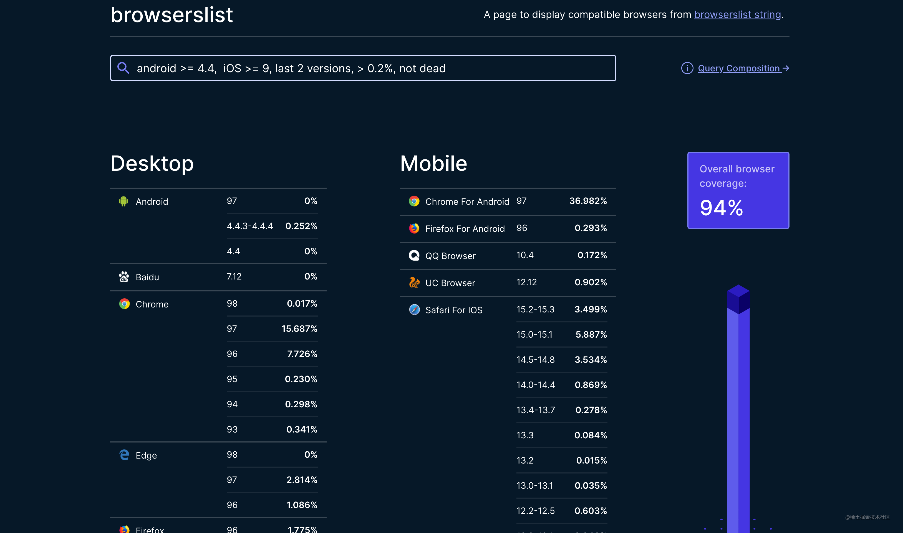
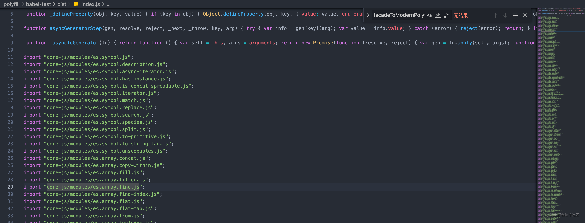
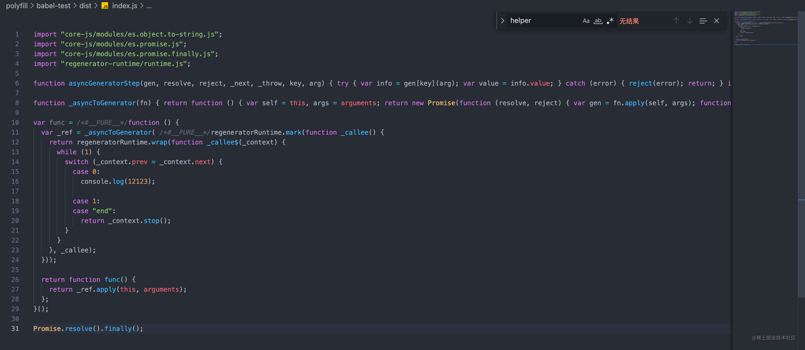
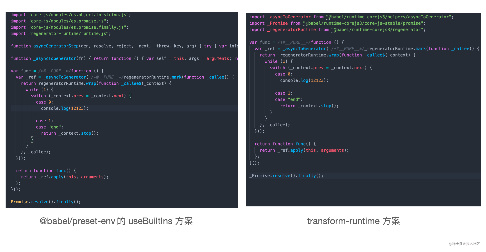
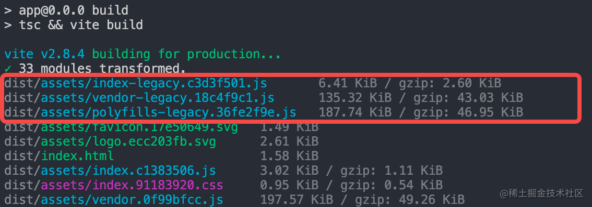
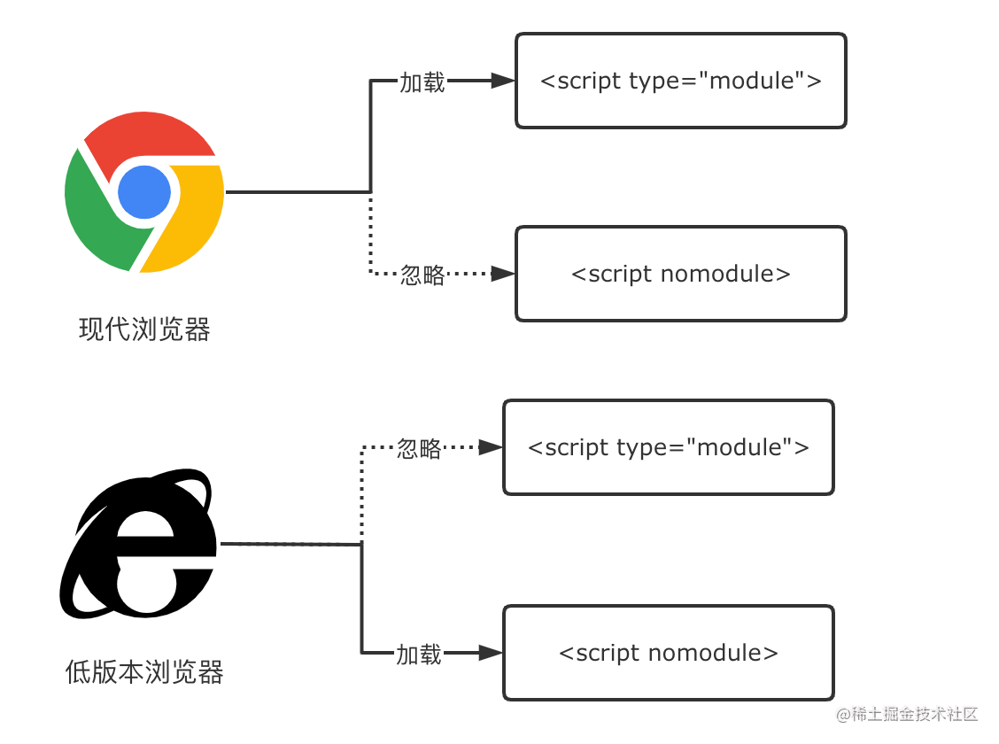
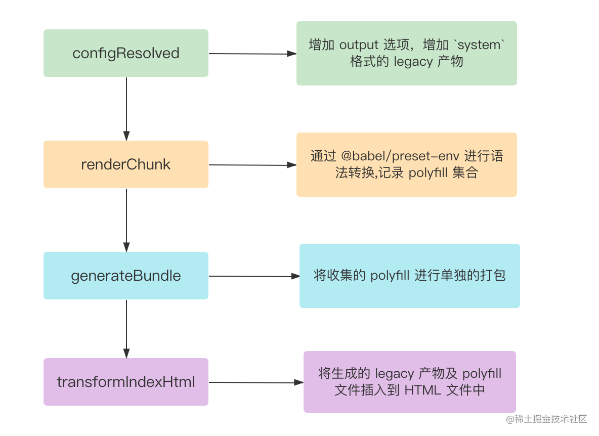
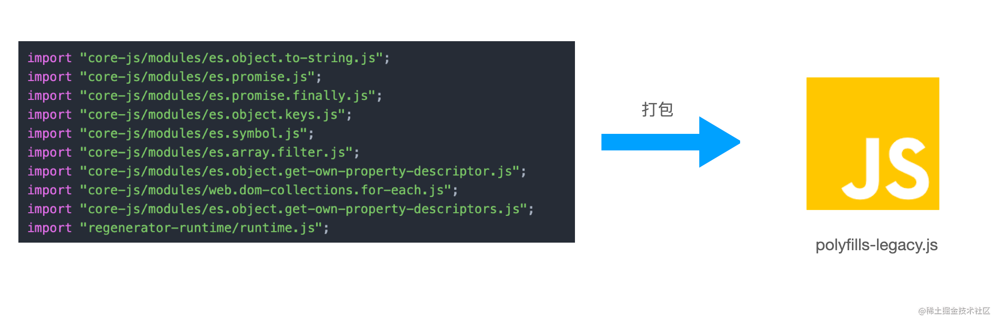

# 15-语法降级与Polyfill：联合前端编译工具链，消灭低版本浏览器兼容问题

谈到 Vite，可能很多人都觉得这是一个现代前端构建工具，应该在现代浏览器中使用，放到各种语法特性都缺失的低版本浏览器(如 `ie 11`)就不适用了。这种观念对不对呢？首先跟大家抛出结论: 

通过 Vite 构建我们完全可以兼容各种低版本浏览器，打包出既支持现代(`Modern`)浏览器又支持旧版(`Legacy`)浏览器的产物。

接下里的课程中，我就来与你分析一下为什么在 Vite 中能够彻底解决低版本浏览器的兼容性问题，以及通过什么手段解决，需要借助哪些 JS 的工具和生态。你会领略到诸多前端编译工具链底层的风光，比如`@babel/preset-env`、`core-js`、`regenerator-runtime`等等工具和基础库是如何强强联合的，当然，我也会以官方的 Vite 插件`@vitejs/plugin-legacy`为例告诉你如何将这些底层的工具链接入到 Vite 中，并实现开箱即用的解决方案。

## 1. 场景复现

首先我们来复现一下问题场景，下面两张图代表了之前我在线上环境真实遇到的报错案例:


某些低版本浏览器并没有提供 `Promise` 语法环境以及对象和数组的各种 API，甚至不支持箭头函数语法，代码直接报错，从而导致线上白屏事故的发生，尤其是需要兼容到`IE 11`、`iOS 9`以及`Android 4.4`的场景中很容易会遇到。

旧版浏览器的语法兼容问题主要分两类: **语法降级问题**和 **Polyfill 缺失问题**。前者比较好理解，比如某些浏览器不支持箭头函数，我们就需要将其转换为`function(){}`语法；而对后者来说，`Polyfill`本身可以翻译为`垫片`，也就是为浏览器提前注入一些 API 的实现代码，如`Object.entries`方法的实现，这样可以保证产物可以正常使用这些 API，防止报错。

这两类问题本质上是通过前端的编译工具链(如`Babel`)及 JS 的基础 Polyfill 库(如`corejs`)来解决的，不会跟具体的构建工具所绑定。也就是说，对于这些本质的解决方案，在其它的构建工具(如 Webpack)能使用，在 Vite 当中也完全可以使用。

构建工具考虑的仅仅是如何将这些底层基础设施接入到构建过程的问题，自己并不需要提供底层的解决方案，正所谓`术业有专攻`，把专业的事情交给专业的工具去做。接下来的部分，我就来带你熟悉一下所谓`专业的工具`到底有哪些，以及如何使用这些工具。

## 2. 底层工具链

### 2.1. 工具概览

解决上述提到的两类语法兼容问题，主要需要用到两方面的工具，分别包括:

- **编译时工具**。代表工具有`@babel/preset-env`和`@babel/plugin-transform-runtime`。
- **运行时基础库**。代表库包括`core-js`和`regenerator-runtime`。

**编译时工具**的作用是在代码编译阶段进行**语法降级**及**添加** `**polyfill**` **代码的引用语句**，如:

import "core-js/modules/es6.set.js"

由于这些工具只是编译阶段用到，运行时并不需要，我们需要将其放入`package.json`中的`devDependencies`中。

而**运行时基础库**是根据 `ESMAScript`官方语言规范提供各种`Polyfill`实现代码，主要包括`core-js`和`regenerator-runtime`两个基础库，不过在 babel 中也会有一些上层的封装，包括：

- [@babel/polyfill](https://babeljs.io/docs/en/babel-polyfill)
- [@babel/runtime](https://babeljs.io/docs/en/babel-runtime)
- [@babel/runtime-corejs2](https://babeljs.io/docs/en/babel-runtime-corejs2)
- [@babel/runtime-corejs3](https://babeljs.io/docs/en/babel-runtime-corejs3)看似各种运行时库眼花缭乱，其实都是`core-js`和`regenerator-runtime`不同版本的封装罢了(`@babel/runtime`是个特例，不包含 core-js 的 Polyfill)。这类库是项目运行时必须要使用到的，因此一定要放到`package.json`中的`dependencies`中！

### 2.2. 实际使用

了解了基本概念后，接下来我们来通过代码实操的方式来学习这些工具，代码我也已经放到了[仓库](https://github.com/sanyuan0704/juejin-book-vite/tree/main/polyfill/babel-test)中，你可以对照学习。

如果你没拉取仓库的代码，可以先按照如下的命令初始化项目:

```bash
mkdir babel-test
npm init -y
```

然后安装一些必要的依赖:

pnpm i @babel/cli @babel/core @babel/preset-env

我解释一下各个依赖的作用:

- `@babel/cli`: 为 babel 官方的脚手架工具，很适合我们练习用。
- `@babel/core`: babel 核心编译库。
- `@babel/preset-env`: babel 的预设工具集，基本为 babel 必装的库。

接着新建 `src` 目录，在目录下增加`index.js`文件:

```javascript
const func = async () => {
  console.log(12123)
}

Promise.resolve().finally();
```

你可以看到，示例代码中既包含了`高级语法`也包含现代浏览器的`API`，正好可以针对语法降级和 Polyfill 注入两个功能进行测试。

接下来新建`.babelrc.json`即 babel 的配置文件，内容如下:

```json
{
  "presets": [
    [
      "@babel/preset-env", 
      {
        // 指定兼容的浏览器版本
        "targets": {
          "ie": "11"
        },
        // 基础库 core-js 的版本，一般指定为最新的大版本
        "corejs": 3,
        // Polyfill 注入策略，后文详细介绍
        "useBuiltIns": "usage",
        // 不将 ES 模块语法转换为其他模块语法
        "modules": false
      }
    ]
  ]
}
```

其中有两个比较关键的配置: `targets`和`usage`。

我们可以通过 `targets` 参数指定要兼容的浏览器版本，你既可以填如上配置所示的一个对象:

```json
{
  "targets": {
    "ie": "11"
  }
}
```

也可以用 [Browserslist](https://github.com/browserslist/browserslist) 配置语法:

```plain
{ 
  // ie 不低于 11 版本，全球超过 0.5% 使用，且还在维护更新的浏览器
  "targets": "ie >= 11, > 0.5%, not dead"
}
```

Browserslist 是一个帮助我们设置目标浏览器的工具，不光是 Babel 用到，其他的编译工具如`postcss-preset-env`、`autoprefix`中都有所应用。对于`Browserslist`的配置内容，你既可以放到 Babel 这种特定工具当中，也可以在`package.json`中通过`browserslist`声明:

```json
// package.json
{ 
  "browserslist": "ie >= 11"
}
```

或者通过`.browserslistrc`进行声明:

```plain
// .browserslistrc
ie >= 11
```

在实际的项目中，一般我们可以将使用下面这些**最佳实践集合**来描述不同的浏览器类型，减轻配置负担:

```plain
// 现代浏览器
last 2 versions and since 2018 and > 0.5%
// 兼容低版本 PC 浏览器
IE >= 11, > 0.5%, not dead
// 兼容低版本移动端浏览器
iOS >= 9, Android >= 4.4, last 2 versions, > 0.2%, not dead
```

对于这些配置对应的具体浏览器列表，大家可以去 https://browserslist.dev 站点查看:



好，在说明了目标浏览器的配置之后，接下来我们来看另外一个重要的配置——`useBuiltIns`，它决定了添加 Polyfill 策略，默认是 `false`，即不添加任何的 Polyfill。你可以手动将`useBuiltIns`配置为`entry`或者`usage`，接下来我们看看这两个配置究竟有什么区别。

首先你可以将这个字段配置为`entry`，需要注意的是，`entry`配置规定你必须在入口文件手动添加一行这样的代码:

```javascript
// index.js 开头加上
import 'core-js';
```

接着在终端执行下面的命令进行 Babel 编译:

```bash
npx babel src --out-dir dist
```

产物输出在`dist`目录中，你可以去观察一下产物的代码:



Babel 已经根据`目标浏览器`的配置为我们添加了大量的 Polyfill 代码，`index.js`文件简单的几行代码被编译成近 300 行。实际上，Babel 所做的事情就是将你的`import "core-js"`代码替换成了产物中的这些具体模块的导入代码。

但这个配置有一个问题，即无法做到按需导入，上面的产物代码其实有大部分的 Polyfill 的代码我们并没有用到。接下来我们试试`useBuiltIns: usage`这个按需导入的配置，改动配置后执行编译命令:

```bash
npx babel src --out-dir dist
```

同样可以看到产物输出在了`dist/index.js`中，内容如下所示:



Polyfill 代码主要来自 `corejs` 和 `regenerator-runtime`，因此如果要运行起来，必须要装这两个库。

可以发现 Polyfill 的代码精简了许多，真正地实现了按需 Polyfill 导入。因此，在实际的使用当中，还是推荐大家尽量使用`useBuiltIns: "usage"`，进行按需的 Polyfill 注入。

我们来梳理一下，上面我们利用`@babel/preset-env`进行了目标浏览器语法的降级和`Polyfill`注入，同时用到了`core-js`和`regenerator-runtime`两个核心的运行时库。但`@babel/preset-env` 的方案也存在一定局限性:

1. 如果使用新特性，往往是通过基础库(如 core-js)往全局环境添加 Polyfill，如果是开发应用没有任何问题，如果是开发第三方工具库，则很可能会对**全局空间造成污染**。
2. 很多工具函数的实现代码(如上面示例中的`_defineProperty`方法)，会在许多文件中重现出现，造成**文件体积冗余**。

### 2.3. 更优的 Polyfill 注入方案: transform-runtime

接下来要介绍的`transform-runtime`方案，就是为了解决`@babel/preset-env`的种种局限性。

需要提前说明的是，`transform-runtime`方案可以作为`@babel/preset-env`中`useBuiltIns`配置的替代品，也就是说，一旦使用`transform-runtime`方案，你应该把`useBuiltIns`属性设为 `false`。

接下来我们来尝试一下这个方案，首先安装必要的依赖:

```bash
pnpm i @babel/plugin-transform-runtime -D
pnpm i @babel/runtime-corejs3 -S
```

我解释一下这两个依赖的作用: 前者是编译时工具，用来转换语法和添加 Polyfill，后者是运行时基础库，封装了`core-js`、`regenerator-runtime`和各种语法转换用到的`工具函数`。

core-js 有三种产物，分别是`core-js`、`core-js-pure`和`core-js-bundle`。第一种是全局 Polyfill 的做法，@babel/preset-env 就是用的这种产物；第二种不会把 Polyfill 注入到全局环境，可以按需引入；第三种是打包好的版本，包含所有的 Polyfill，不太常用。`@babel/runtime-corejs3` 使用的是第二种产物。

接着我们对`.babelrc.json`作如下的配置:

```json
{
  "plugins": [
    // 添加 transform-runtime 插件
    [
      "@babel/plugin-transform-runtime", 
      {
        "corejs": 3
      }
    ]
  ],
  "presets": [
    [
      "@babel/preset-env", 
      {
        "targets": {
          "ie": "11"
        },
        "corejs": 3,
        // 关闭 @babel/preset-env 默认的 Polyfill 注入
        "useBuiltIns": false,
        "modules": false
      }
    ]
  ]
}
```

执行终端命令:

```javascript
npx babel src --out-dir dist
```

我们可以对比一下 `@babel/preset-env`下的产物结果:



经过对比我们不难发现，`transform-runtime` 一方面能够让我们在代码中使用`非全局版本`的 Polyfill，这样就避免全局空间的污染，这也得益于 `core-js` 的 pure 版本产物特性；另一方面对于`asyncToGeneator`这类的工具函数，它也将其转换成了一段引入语句，不再将完整的实现放到文件中，节省了编译后文件的体积。

另外，`transform-runtime`方案引用的基础库也发生了变化，不再是直接引入`core-js`和`regenerator-runtime`，而是引入`@babel/runtime-corejs3`。

好，介绍完了 Babel 语法降级与 Polyfill 注入的底层方案，接下来我们来看看如何在 Vite 中利用这些方案来解决低版本浏览器的兼容性问题。

## 3. Vite 语法降级与 Polyfill 注入

Vite 官方已经为我们封装好了一个开箱即用的方案: `@vitejs/plugin-legacy`，我们可以基于它来解决项目语法的浏览器兼容问题。这个插件内部同样使用 `@babel/preset-env` 以及 `core-js`等一系列基础库来进行语法降级和 Polyfill 注入，因此我觉得对于上文所介绍的底层工具链的掌握是必要的，否则无法理解插件内部所做的事情，真正遇到问题时往往会不知所措。

### 3.1. 插件使用

首先让我们来安装一下官方的插件:

```javascript
pnpm i @vitejs/plugin-legacy -D
```

随后在项目中使用它:

```plain
// vite.config.ts
import legacy from '@vitejs/plugin-legacy';
import { defineConfig } from 'vite'

export default defineConfig({
  plugins: [
    // 省略其它插件
    legacy({
      // 设置目标浏览器，browserslist 配置语法
      targets: ['ie >= 11'],
    })
  ]
})
```

我们同样可以通过`targets`指定目标浏览器，这个参数在插件内部会透传给`@babel/preset-env`。

在引入插件后，我们可以尝试执行`npm run build`对项目进行打包，可以看到如下的产物信息:



相比一般的打包过程，多出了`index-legacy.js`、`vendor-legacy.js`以及`polyfills-legacy.js`三份产物文件。让我们继续观察一下`index.html`的产物内容:

```html
<!DOCTYPE html>
<html lang="en">
  <head>
    <meta charset="UTF-8" />
    <link rel="icon" type="image/svg+xml" href="/assets/favicon.17e50649.svg" />
    <meta name="viewport" content="width=device-width, initial-scale=1.0" />
    <title>Vite App</title>
    <!-- 1. Modern 模式产物 -->
    <script type="module" crossorigin src="/assets/index.c1383506.js"></script>
    <link rel="modulepreload" href="/assets/vendor.0f99bfcc.js">
    <link rel="stylesheet" href="/assets/index.91183920.css">
  </head>
  <body>
    <div id="root"></div>
    <!-- 2. Legacy 模式产物 -->
    <script nomodule>兼容 iOS nomodule 特性的 polyfill，省略具体代码</script>
    <script nomodule id="vite-legacy-polyfill" src="/assets/polyfills-legacy.36fe2f9e.js"></script>
    <script nomodule id="vite-legacy-entry" data-src="/assets/index-legacy.c3d3f501.js">System.import(document.getElementById('vite-legacy-entry').getAttribute('data-src'))</script>
  </body>
</html>
```

通过官方的`legacy`插件， Vite 会分别打包出`Modern`模式和`Legacy`模式的产物，然后将两种产物插入同一个 HTML 里面，`Modern`产物被放到 `type="module"`的 script 标签中，而`Legacy`产物则被放到带有 [nomodule](https://developer.mozilla.org/en-US/docs/Web/HTML/Element/script#attr-nomodule) 的 script 标签中。浏览器的加载策略如下图所示:



这样产物便就能够同时放到现代浏览器和不支持`type="module"`的低版本浏览器当中执行。当然，在具体的代码语法层面，插件还需要考虑语法降级和 Polyfill 按需注入的问题，接下来我们就来分析一下 Vite 的官方`legacy`插件是如何解决这些问题的。

### 3.2. 插件执行原理

官方的`legacy`插件是一个相对复杂度比较高的插件，直接看源码可能会很难理解，这里我梳理了画了一张简化后的流程图，接下来我们就根据这张流程图来一一拆解这个插件在各个钩子阶段到底做了些什么。



首先是在`configResolved`钩子中调整了`output`属性，这么做的目的是让 Vite 底层使用的打包引擎 Rollup 能另外打包出一份`Legacy 模式`的产物，实现代码如下:

```javascript
const createLegacyOutput = (options = {}) => {
  return {
    ...options,
    // system 格式产物
    format: 'system',
    // 转换效果: index.[hash].js -> index-legacy.[hash].js
    entryFileNames: getLegacyOutputFileName(options.entryFileNames),
    chunkFileNames: getLegacyOutputFileName(options.chunkFileNames)
  }
}

const { rollupOptions } = config.build
const { output } = rollupOptions
if (Array.isArray(output)) {
  rollupOptions.output = [...output.map(createLegacyOutput), ...output]
} else {
  rollupOptions.output = [createLegacyOutput(output), output || {}]
}
```

接着，在`renderChunk`阶段，插件会对 Legacy 模式产物进行语法转译和 Polyfill 收集，值得注意的是，这里并不会真正注入`Polyfill`，而仅仅只是收集`Polyfill`，:

```javascript
{
  renderChunk(raw, chunk, opts) {
    // 1. 使用 babel + @babel/preset-env 进行语法转换与 Polyfill 注入
    // 2. 由于此时已经打包后的 Chunk 已经生成
    //   这里需要去掉 babel 注入的 import 语句，并记录所需的 Polyfill
    // 3. 最后的 Polyfill 代码将会在 generateBundle 阶段生成
  }
}
```

由于场景是应用打包，这里直接使用 @babel/preset-env 的`useBuiltIns: 'usage'`来进行全局 Polyfill 的收集是比较标准的做法。

回到 Vite 构建的主流程中，接下来会进入`generateChunk`钩子阶段，现在 Vite 会对之前收集到的`Polyfill`进行统一的打包，实现也比较精妙，主要逻辑集中在`buildPolyfillChunk`函数中:

```javascript
// 打包 Polyfill 代码
async function buildPolyfillChunk(
  name,
  imports
  bundle,
  facadeToChunkMap,
  buildOptions,
  externalSystemJS
) {
  let { minify, assetsDir } = buildOptions
  minify = minify ? 'terser' : false
  // 调用 Vite 的 build API 进行打包
  const res = await build({
    // 根路径设置为插件所在目录
    // 由于插件的依赖包含`core-js`、`regenerator-runtime`这些运行时基础库
    // 因此这里 Vite 可以正常解析到基础 Polyfill 库的路径
    root: __dirname,
    write: false,
    // 这里的插件实现了一个虚拟模块
    // Vite 对于 polyfillId 会返回所有 Polyfill 的引入语句
    plugins: [polyfillsPlugin(imports, externalSystemJS)],
    build: {
      rollupOptions: {
        // 访问 polyfillId
        input: {
          // name 暂可视作`polyfills-legacy`
          // pofyfillId 为一个虚拟模块，经过插件处理后会拿到所有 Polyfill 的引入语句
          [name]: polyfillId
        },
      }
    }
  });
  // 拿到 polyfill 产物 chunk
  const _polyfillChunk = Array.isArray(res) ? res[0] : res
  if (!('output' in _polyfillChunk)) return
  const polyfillChunk = _polyfillChunk.output[0]
  // 后续做两件事情:
  // 1. 记录 polyfill chunk 的文件名，方便后续插入到 Modern 模式产物的 HTML 中；
  // 2. 在 bundle 对象上手动添加 polyfill 的 chunk，保证产物写到磁盘中
}
```

因此，你可以理解为这个函数的作用即通过 `vite build` 对`renderChunk`中收集到 polyfill 代码进行打包，生成一个单独的 chunk:



需要注意的是，polyfill chunk 中除了包含一些 core-js 和 regenerator-runtime 的相关代码，也包含了 `SystemJS` 的实现代码，你可以将其理解为 ESM 的加载器，实现了在旧版浏览器下的模块加载能力。

现在我们已经能够拿到 Legacy 模式的产物文件名及 Polyfill Chunk 的文件名，那么就可以通过`transformIndexHtml`钩子来将这些产物插入到 HTML 的结构中:

```plain
{
  transformIndexHtml(html) {
    // 1. 插入 Polyfill chunk 对应的 <script nomodule> 标签
    // 2. 插入 Legacy 产物入口文件对应的 <script nomodule> 标签
  }
}
```

OK，Vite 官方的 legacy 插件的主要原理就介绍到这里，为了方便大家理解，讲解的过程中忽略了一些与主流程关联不大的细节，最后给大家补充一下，感兴趣的同学可以继续深入学习:

- 当插件参数中开启了`modernPolyfills`选项时，Vite 也会自动对 Modern 模式的产物进行 Polyfill 收集，并单独打包成`polyfills-modern.js`的 chunk，原理和 Legacy 模式下处理 Polyfill 一样。
- Sarari 10.1 版本不支持 `nomodule`，为此需要单独引入一些补丁代码，[点击查看](https://gist.github.com/samthor/64b114e4a4f539915a95b91ffd340acc)。
- 部分低版本 Edge 浏览器虽然支持 type="module"，但不支持动态 import，为此也需要插入一些[补丁代码](https://github.com/vitejs/vite/pull/3885)，针对这种情况下降级使用 Legacy 模式的产物。

## 4. 小结

恭喜你，学习完了本节的内容！本节主要讲解了 Vite 中语法降级与 Polyfill 相关的内容，涉及的概念比较多，篇幅也比较长，你需要重点掌握以下内容:

1. `@babel/preset-env` 的使用。
2. `useBuiltIns` 与 `transformRuntime` 两种 Polyfill 方案的区别。
3. Vite 降级插件`@vitejs/plugin-legacy` 的使用及原理。

首先我给你复现了线上的低版本浏览器语法报错情景，主要分为 **语法报错**和 **Polyfill 缺失** 的问题，由此引出了底层的解决方案——使用 `Babel 编译工具链` 和 JS 运行时基础库来完成。接着我跟你具体介绍了 `@babel/preset-env`的使用，通过实际的代码案例让你体验了它的语法降级和自动 Polyfill 注入的能力，接着，我又给你介绍了一个更优的 Polyfill 方案——`transform-runtime`方案，并与`@babel/preset-env`的`useBuiltIns`方案进行了对比，分析了`transform-runtime`方案的两个优化点: **不影响全局空间**和**优化文件体积**。

在介绍了底层的解决方案之后，我们开始学习在 Vite 中的解决方案——`@vitejs/plugin-legacy`，分析了它如何让产物能够同时兼容现代浏览器和不支持 `type="module"`的低版本浏览器，接着深入地讲解了这个插件的实现原理，你可以发现底层也是通过`@babel/preset-env`来完成兼容方案的。

以上就是本节的全部内容，希望对你能有所启发，也欢迎将你的学习心得和困惑打在评论区，我们下一小节再见👋🏻

