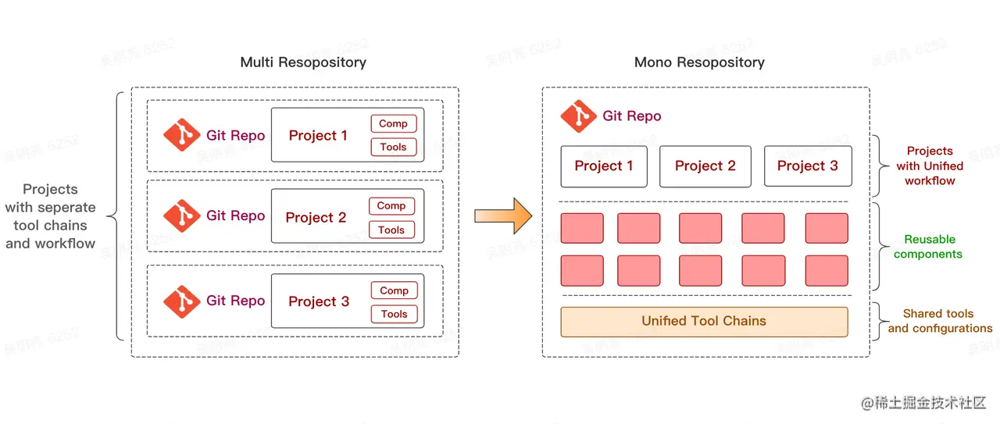
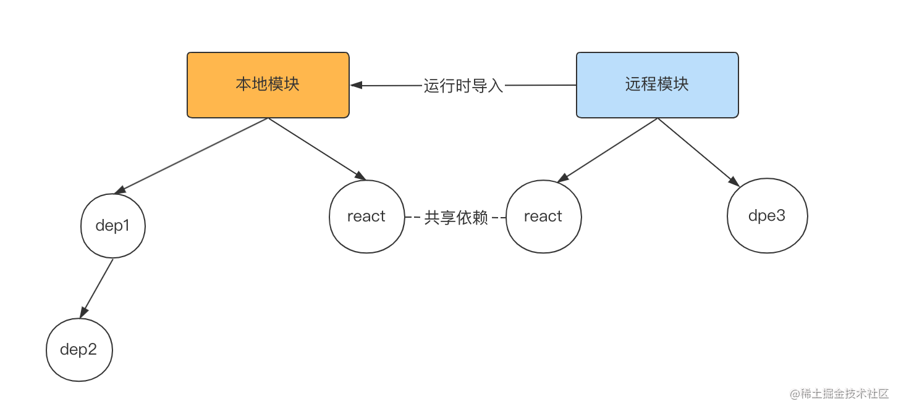
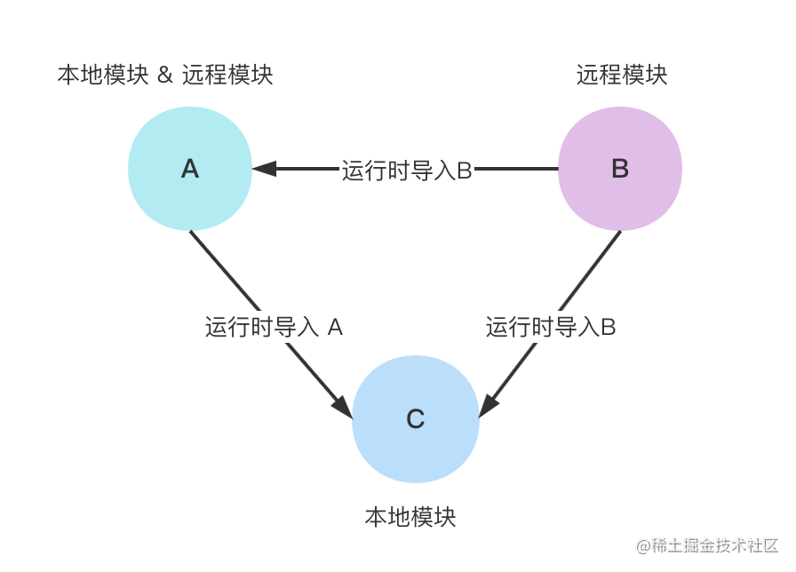
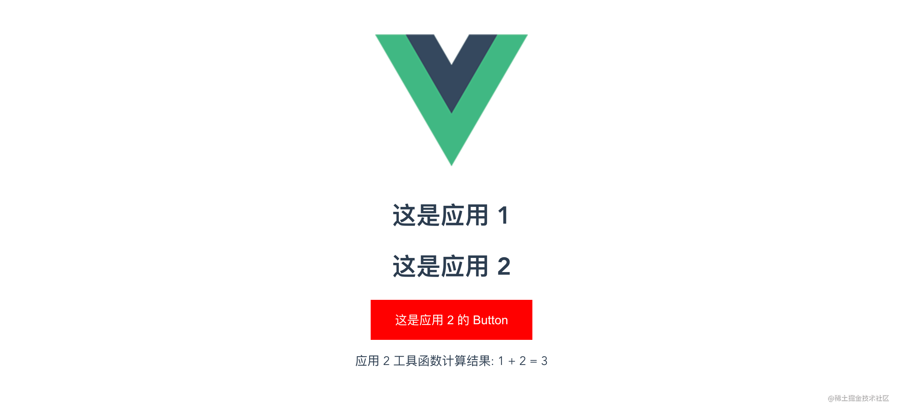
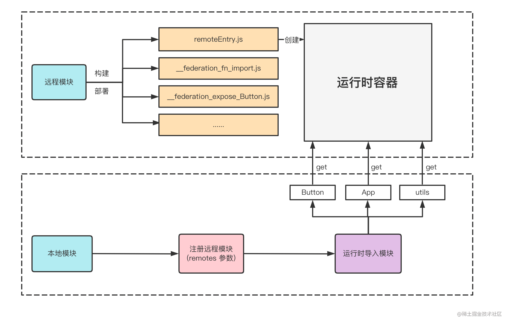
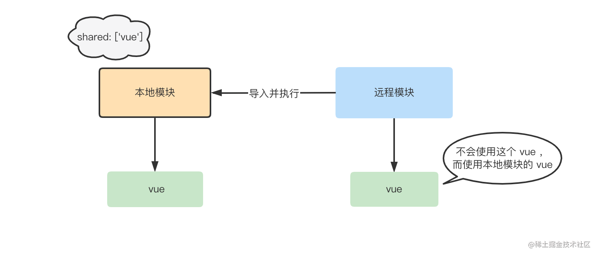

# 17-模块联邦: 如何实现优雅的跨应用代码共享？

在 2020 年上半年，Webpack 提出了一项非常激动人心的特性——`Module Federation`(译为`模块联邦`)，这个特性一经推出就获得了业界的广泛关注，甚至被称为前端构建领域的`Game Changer`。实际上，这项技术确实很好地解决了多应用模块复用的问题，相比之前的各种解决方案，它的解决方式更加优雅和灵活。但从另一个角度来说，Module Federation 代表的是一种通用的解决思路，并不局限于某一个特定的构建工具，因此，在 Vite 中我们同样可以实现这个特性，并且社区已经有了比较成熟的解决方案。

在接下来的文章中，首先我将和你一起深入探讨 `Module Federation`(简称 `MF`) 的核心概念，分析它到底解决了什么问题、对于这些问题原来存在哪些解决方案、为什么 `MF`的方案更优。然后我会用一个具体的项目示例带你进行代码实操，让你学会在 Vite 正确地使用 MF 特性。当然，在最后我也会给大家剖析 Module Federation 内部的实现原理，让你不仅仅停留在会用的地步，而且也能了解其深层的运作机制和实现手段。

## 1. 模块共享之痛

对于一个互联网产品来说，一般会有不同的细分应用，比如`腾讯文档`可以分为`word`、`excel`、`ppt`等等品类，`抖音 PC 站点`可以分为`短视频站点`、`直播站点`、`搜索站点`等子站点，而每个子站又彼此独立，可能由不同的开发团队进行单独的开发和维护，看似没有什么问题，但实际上会经常遇到一些模块共享的问题，也就是说不同应用中总会有一些共享的代码，比如公共组件、公共工具函数、公共第三方依赖等等。对于这些共享的代码，除了通过简单的复制粘贴，还有没有更好的复用手段？

### 1.1. 发布 npm 包

发布 npm 包是一种常见的复用模块的做法，我们可以将一些公用的代码封装为一个 npm 包，具体的发布更新流程是这样的:

1. 公共库 lib1 改动，发布到 npm；

2. 所有的应用安装新的依赖，并进行联调。

   

封装 npm 包可以解决模块复用的问题，但它本身又引入了新的问题:

1. **开发效率问题**。每次改动都需要发版，并所有相关的应用安装新依赖，流程比较复杂。
2. **项目构建问题**。引入了公共库之后，公共库的代码都需要打包到项目最后的产物后，导致产物体积偏大，构建速度相对较慢。

因此，这种方案并不能作为最终方案，只是暂时用来解决问题的无奈之举。

### 1.2. Git Submodule

通过 `git submodule` 的方式，我们可以将代码封装成一个公共的 Git 仓库，然后复用到不同的应用中，但也需要经历如下的步骤：

1. 公共库 lib1 改动，提交到 Git 远程仓库； 
2. 所有的应用通过`git submodule`命令更新子仓库代码，并进行联调。

你可以看到，整体的流程其实跟发 npm 包相差无几，仍然存在 npm 包方案所存在的各种问题。

### 1.3. 依赖外部化(external)+ CDN 引入

在上一节中我们提到了`external`的概念，即对于某些第三方依赖我们并不需要让其参与构建，而是使用某一份公用的代码。按照这个思路，我们可以在构建引擎中对某些依赖声明`external`，然后在 HTML 中加入依赖的 CDN 地址:

```html
<!DOCTYPE html>
<html lang="en">
  <head>
    <meta charset="UTF-8" />
    <link rel="icon" type="image/svg+xml" href="/src/favicon.svg" />
    <meta name="viewport" content="width=device-width, initial-scale=1.0" />
    <title>Vite App</title>
  </head>
  <body>
    <div id="root"></div>
    <!-- 从 CDN 上引入第三方依赖的代码 -->
    <script src="https://cdn.jsdelivr.net/npm/react@17.0.2/index.min.js"><script>
  <script src="https://cdn.jsdelivr.net/npm/react-dom@17.0.2/index.min.js"><script>
  </body>
  </html>
```

如上面的例子所示，我们可以对`react`和`react-dom`使用 CDN 的方式引入，一般使用`UMD`格式产物，这样不同的项目间就可以通过`window.React`来使用同一份依赖的代码了，从而达到模块复用的效果。不过在实际的使用场景，这种方案的局限性也很突出:

1. **兼容性问题**。并不是所有的依赖都有 UMD 格式的产物，因此这种方案不能覆盖所有的第三方 npm 包。
2. **依赖顺序问题**。我们通常需要考虑间接依赖的问题，如对于 antd 组件库，它本身也依赖了 react 和 moment，那么`react`和`moment` 也需要 `external`，并且在 HTML 中引用这些包，同时也要**严格保证**引用的顺序，比如说`moment`如果放在了`antd`后面，代码可能无法运行。而第三方包背后的间接依赖数量一般很庞大，如果逐个处理，对于开发者来说简直就是噩梦。
3. **产物体积问题**。由于依赖包被声明`external`之后，应用在引用其 CDN 地址时，会全量引用依赖的代码，这种情况下就没有办法通过 Tree Shaking 来去除无用代码了，会导致应用的性能有所下降。

### 1.4. Monorepo

作为一种新的项目管理方式，Monorepo 也可以很好地解决模块复用的问题。在 Monorepo 架构下，多个项目可以放在同一个 Git 仓库中，各个互相依赖的子项目通过软链的方式进行调试，代码复用显得非常方便，如果有依赖的代码变动，那么用到这个依赖的项目当中会立马感知到。



不得不承认，对于应用间模块复用的问题，Monorepo 是一种非常优秀的解决方案，但与此同时，它也给团队带来了一些挑战:

1. **所有的应用代码必须放到同一个仓库**。如果是旧有项目，并且每个应用使用一个 Git 仓库的情况，那么使用 Monorepo 之后项目架构调整会比较大，也就是说改造成本会相对比较高。
2. Monorepo 本身也存在一些天然的局限性，如项目数量多起来之后依赖安装时间会很久、项目整体构建时间会变长等等，我们也需要去解决这些局限性所带来的的开发效率问题。而这项工作一般需要投入专业的人去解决，如果没有足够的人员投入或者基建的保证，Monorepo 可能并不是一个很好的选择。
3. **项目构建问题**。跟 `发 npm 包`的方案一样，所有的公共代码都需要进入项目的构建流程中，产物体积还是会偏大。

## 2. MF 核心概念

以上说了那么多业界现有的方案，并分析各自的优缺点，那么下面我们就来正式介绍`Module Federation`，即模块联邦解决方案，看看它到底是如何解决模块复用问题的。

模块联邦中主要有两种模块: `本地模块`和`远程模块`。

本地模块即为普通模块，是当前构建流程中的一部分，而远程模块不属于当前构建流程，在本地模块的运行时进行导入，同时本地模块和远程模块可以共享某些依赖的代码，如下图所示:



值得强调的是，在模块联邦中，每个模块既可以是`本地模块`，导入其它的`远程模块`，又可以作为远程模块，被其他的模块导入。如下面这个例子所示:



如图，其中 A 模块既可以作为本地模块导入 B，又可以作为远程模块被 C 导入。

以上就是模块联邦的主要设计原理，现在我们来好好分析一下这种设计究竟有哪些优势:

1. **实现任意粒度的模块共享**。这里所指的模块粒度可大可小，包括第三方 npm 依赖、业务组件、工具函数，甚至可以是整个前端应用！而整个前端应用能够共享产物，代表着各个应用单独开发、测试、部署，这也是一种`微前端`的实现。
2. **优化构建产物体积**。远程模块可以从本地模块运行时被拉取，而不用参与本地模块的构建，可以加速构建过程，同时也能减小构建产物。
3. **运行时按需加载**。远程模块导入的粒度可以很小，如果你只想使用 app1 模块的`add`函数，只需要在 app1 的构建配置中导出这个函数，然后在本地模块中按照诸如`import('app1/add')`的方式导入即可，这样就很好地实现了模块按需加载。
4. **第三方依赖共享**。通过模块联邦中的共享依赖机制，我们可以很方便地实现在模块间公用依赖代码，从而避免以往的`external + CDN 引入`方案的各种问题。

从以上的分析你可以看到，模块联邦近乎完美地解决了以往模块共享的问题，甚至能够实现应用级别的共享，进而达到`微前端`的效果。下面，我们就来以具体的例子来学习在 Vite 中如何使用模块联邦的能力。

## 3. MF 应用实战

社区中已经提供了一个比较成熟的 Vite 模块联邦方案: `vite-plugin-federation`，这个方案基于 Vite(或者 Rollup) 实现了完整的模块联邦能力。接下来，我们基于它来实现模块联邦应用。

首先初始化两个 Vue 的脚手架项目`host`和`remote`，然后分别安装`vite-plugin-federation`插件:

```typescript
pnpm install @originjs/vite-plugin-federation -D
```

在配置文件中分别加入如下的配置:

```typescript
// 远程模块配置
// remote/vite.config.ts
import { defineConfig } from "vite";
import vue from "@vitejs/plugin-vue";
import federation from "@originjs/vite-plugin-federation";

// https://vitejs.dev/config/
export default defineConfig({
  plugins: [
    vue(),
    // 模块联邦配置
    federation({
      name: "remote_app",
      filename: "remoteEntry.js",
      // 导出模块声明
      exposes: {
        "./Button": "./src/components/Button.js",
        "./App": "./src/App.vue",
        "./utils": "./src/utils.ts",
      },
      // 共享依赖声明
      shared: ["vue"],
    }),
  ],
  // 打包配置
  build: {
    target: "esnext",
  },
});

// 本地模块配置
// host/vite.config.ts
import { defineConfig } from "vite";
import vue from "@vitejs/plugin-vue";
import federation from "@originjs/vite-plugin-federation";

export default defineConfig({
  plugins: [
    vue(),
    federation({
      // 远程模块声明
      remotes: {
        remote_app: "http://localhost:3001/assets/remoteEntry.js",
      },
      // 共享依赖声明
      shared: ["vue"],
    }),
  ],
  build: {
    target: "esnext",
  },
});
```

在如上的配置中，我们完成了远程模块的模块导出及远程模块在本地模块的注册，对于远程模块的具体实现，你可以参考小册的 Github 仓库，这里就不一一赘述了。接下来我们把关注点放在如何使用远程模块上面。

首先我们需要对远程模块进行打包，在 remote 路径下依赖执行:

```javascript
// 打包产物
pnpm run build
// 模拟部署效果，一般会在生产环境将产物上传到 CDN 
npx vite preview --port=3001 --strictPort
```

然后我们在 `host`项目中使用远程模块:

```vue
<script setup lang="ts">
  import HelloWorld from "./components/HelloWorld.vue";
  import { defineAsyncComponent } from "vue";
  // 导入远程模块
  // 1. 组件
  import RemoteApp from "remote_app/App";
  // 2. 工具函数
  import { add } from "remote_app/utils";
  // 3. 异步组件
  const AysncRemoteButton = defineAsyncComponent(
    () => import("remote_app/Button")
  );
  const data: number = add(1, 2);
</script>

<template>
  <div>
    
    <HelloWorld />
    <RemoteApp />
    <AysncRemoteButton />
    <p>应用 2 工具函数计算结果: 1 + 2 = {{ data }}</p>
  </div>
</template>

<style>
  #app {
    font-family: Avenir, Helvetica, Arial, sans-serif;
    -webkit-font-smoothing: antialiased;
    -moz-osx-font-smoothing: grayscale;
    text-align: center;
    color: #2c3e50;
    margin-top: 60px;
  }
</style>
```

启动项目后你可以看到如下的结果:



应用 2 的组件和工具函数逻辑已经在应用 1 中生效，也就是说，我们完成了远程模块在本地模块的运行时引入。

让我们来梳理一下整体的使用流程:

1. 远程模块通过`exposes` 注册导出的模块，本地模块通过 `remotes` 注册远程模块地址。
2. 远程模块进行构建，并部署到云端。
3. 本地通过`import '远程模块名称/xxx'`的方式来引入远程模块，实现运行时加载。

当然，还有几个要点需要给大家补充一下:

1. 在模块联邦中的配置中，`exposes` 和`remotes`参数其实并不冲突，也就是说一个模块既可以作为本地模块，又可以作为远程模块。
2. 由于 Vite 的插件机制与 Rollup 兼容，`vite-plugin-federation`方案在 Rollup 中也是完全可以使用的。

## 4. MF 实现原理

从以上示例中大家可以看到，Module Federation 使用比较简单，对已有项目来说改造成本并不大。那么，这么强大而易用的特性是如何在 Vite 中得以实现的呢？接下来，我们来深入探究一下 MF 背后的实现原理，分析`vite-plugin-federation`这个插件背后究竟做了些什么。

总体而言，实现模块联邦有三大主要的要素:

1. `Host`模块: 即本地模块，用来消费远程模块。
2. `Remote`模块: 即远程模块，用来生产一些模块，并暴露`运行时容器`供本地模块消费。
3. `Shared`依赖: 即共享依赖，用来在本地模块和远程模块中实现第三方依赖的共享。

首先，我们来看看本地模块是如何消费远程模块的。之前，我们在本地模块中写过这样的引入语句:

```javascript
import RemoteApp from "remote_app/App";
```

我们来看看 Vite 将这段代码编译成了什么样子:

```javascript
// 为了方便阅读，以下部分方法的函数名进行了简化
// 远程模块表
const remotesMap = {
  'remote_app':{url:'http://localhost:3001/assets/remoteEntry.js',format:'esm',from:'vite'},
  'shared':{url:'vue',format:'esm',from:'vite'}
};

async function ensure() {
  const remote = remoteMap[remoteId];
  // 做一些初始化逻辑，暂时忽略
  // 返回的是运行时容器
}

async function getRemote(remoteName, componentName) {
  return ensure(remoteName)
    // 从运行时容器里面获取远程模块
    .then(remote => remote.get(componentName))
    .then(factory => factory());
}

// import 语句被编译成了这样
// tip: es2020 产物语法已经支持顶层 await
const __remote_appApp = await getRemote("remote_app" , "./App");
```

除了 import 语句被编译之外，在代码中还添加了`remoteMap`和一些工具函数，它们的目的很简单，就是通过访问远端的**运行时容器**来拉取对应名称的模块。

而运行时容器其实就是指远程模块打包产物`remoteEntry.js`的导出对象，我们来看看它的逻辑是怎样的:

```javascript
// remoteEntry.js
const moduleMap = {
  "./Button": () => {
    return import('./__federation_expose_Button.js').then(module => () => module)
  },
  "./App": () => {
    dynamicLoadingCss('./__federation_expose_App.css');
    return import('./__federation_expose_App.js').then(module => () => module);
  },
  './utils': () => {
    return import('./__federation_expose_Utils.js').then(module => () => module);
  }
};

// 加载 css
const dynamicLoadingCss = (cssFilePath) => {
  const metaUrl = import.meta.url;
  if (typeof metaUrl == 'undefined') {
    console.warn('The remote style takes effect only when the build.target option in the vite.config.ts file is higher than that of "es2020".');
    return
  }
  const curUrl = metaUrl.substring(0, metaUrl.lastIndexOf('remoteEntry.js'));
  const element = document.head.appendChild(document.createElement('link'));
  element.href = curUrl + cssFilePath;
  element.rel = 'stylesheet';
};

// 关键方法，暴露模块
const get =(module) => {
  return moduleMap[module]();
};

const init = () => {
  // 初始化逻辑，用于共享模块，暂时省略
}

export { dynamicLoadingCss, get, init }
```

从运行时容器的代码中我们可以得出一些关键的信息:

1. `moduleMap`用来记录导出模块的信息，所有在`exposes`参数中声明的模块都会打包成单独的文件，然后通过 `dynamic import` 进行导入。
2. 容器导出了十分关键的`get`方法，让本地模块能够通过调用这个方法来访问到该远程模块。

至此，我们就梳理清楚了远程模块的`运行时容器`与本地模块的交互流程，如下图所示



接下来，我们继续分析共享依赖的实现。拿之前的示例项目来说，本地模块设置了`shared: ['vue']`参数之后，当它执行远程模块代码的时候，一旦遇到了引入`vue`的情况，会优先使用本地的 `vue`，而不是远端模块中的`vue`。



让我们把焦点放到容器初始化的逻辑中，回到本地模块编译后的`ensure`函数逻辑:

```javascript
// host

// 下面是共享依赖表。每个共享依赖都会单独打包
const shareScope = {
  'vue':{'3.2.31':{get:()=>get('./__federation_shared_vue.js'), loaded:1}}
};
async function ensure(remoteId) {
  const remote = remotesMap[remoteId];
  if (remote.inited) {
    return new Promise(resolve => {
      if (!remote.inited) {
        remote.lib = window[remoteId];
        remote.lib.init(shareScope);
        remote.inited = true;
      }
      resolve(remote.lib);
    });
  }
}
```

可以发现，`ensure`函数的主要逻辑是将共享依赖信息传递给远程模块的运行时容器，并进行容器的初始化。接下来我们进入容器初始化的逻辑`init`中:

```javascript
const init =(shareScope) => {
  globalThis.__federation_shared__= globalThis.__federation_shared__|| {};
  // 下面的逻辑大家不用深究，作用很简单，就是将本地模块的`共享模块表`绑定到远程模块的全局 window 对象上
  Object.entries(shareScope).forEach(([key, value]) => {
    const versionKey = Object.keys(value)[0];
    const versionValue = Object.values(value)[0];
    const scope = versionValue.scope || 'default';
    globalThis.__federation_shared__[scope] = globalThis.__federation_shared__[scope] || {};
    const shared= globalThis.__federation_shared__[scope];
    (shared[key] = shared[key]||{})[versionKey] = versionValue;
  });
};
```

当本地模块的`共享依赖表`能够在远程模块访问时，远程模块内也就能够使用本地模块的依赖(如 `vue`)了。现在我们来看看远程模块中对于`import { h } from 'vue'`这种引入代码被转换成了什么样子:

```javascript
// __federation_expose_Button.js
import {importShared} from './__federation_fn_import.js'
const { h } = await importShared('vue')
```

不难看到，第三方依赖模块的处理逻辑都集中到了 `importShared` 函数，让我们来一探究竟:

```javascript
// __federation_fn_import.js
const moduleMap= {
  'vue': {
    get:()=>()=>__federation_import('./__federation_shared_vue.js'),
    import:true
  }
};
// 第三方模块缓存
const moduleCache = Object.create(null);
async function importShared(name,shareScope = 'default') {
  return moduleCache[name] ? 
    new Promise((r) => r(moduleCache[name])) : 
    getProviderSharedModule(name, shareScope);
}

async function getProviderSharedModule(name, shareScope) {
  // 从 window 对象中寻找第三方包的包名，如果发现有挂载，则获取本地模块的依赖
  if (xxx) {
    return await getHostDep();
  } else {
    return getConsumerSharedModule(name); 
  }
}

async function getConsumerSharedModule(name , shareScope) {
  if (moduleMap[name]?.import) {
    const module = (await moduleMap[name].get())();
    moduleCache[name] = module;
    return module;
  } else {
    console.error(`consumer config import=false,so cant use callback shared module`);
  }
}
```

由于远程模块运行时容器初始化时已经挂载了共享依赖的信息，远程模块内部可以很方便的感知到当前的依赖是不是共享依赖，如果是共享依赖则使用本地模块的依赖代码，否则使用远程模块自身的依赖产物代码。最后我画了一张流程图，你可以参考学习:


## 5. 小结

本小节的内容到这里就接近尾声了，在本小节中，你需要重点掌握**模块复用的历史解决方案**、**模块联邦方案的优势**、**vite-plugin-federation 插件的使用及原理**。

首先，我给你介绍了模块复用的问题有哪些历史解决方案，主要包括`发布 npm 包`、`Git Submodule`、`依赖外部化 + CDN 导入`和 `Monorepo 架构`，也分析了各自的优势与局限性，然后引出 Module Federation(MF) 的概念，并分析了它为什么能近乎完美地解决模块共享问题，主要原因包括`实现了任意粒度的模块共享`、`减少构建产物体积`、`运行时按需加载`以及`共享第三方依赖`这四个方面。

接下来，我用一个具体的项目示例来告诉你如何在 Vite 中使用模块联邦的特性，即通过`vite-plugin-federation`这个插件来完成 MF 的搭建。最后，我也给你详细介绍了 MF 底层的实现原理，从`本地模块`、`远程模块`、`共享依赖`三个视角来给你剖析 MF 的实现机制和核心编译逻辑。

在此我想给你抛出一个问题，有人说模块联邦的架构是开历史的倒车，远程模块依然需要部署到云端(CDN)，跟很久之前 HTML 中直接使用 `CDN 地址` 引入依赖的方式如出一辙。请问这个观点有问题吗？问题出在什么地方？欢迎在评论区留下你的看法，也希望本文的内容能对你有所启发，我们下一节再见。

