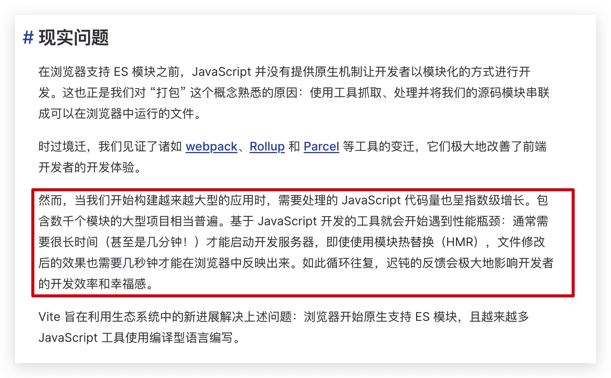
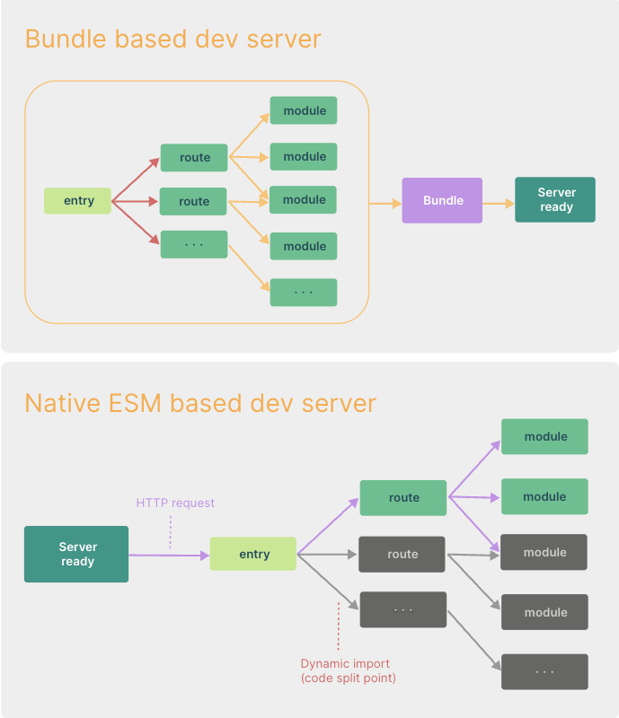

[浅析Vite](https://segmentfault.com/a/1190000044149848)


## 起因

我们的项目越大：是不是意味着构建工具（webpack）要处理的 js 代码就越多，[ 这个跟 webpack 的一个构建过程（工作流程）有关系 ]

## 造成的结果:

- 构建工具需要很长时间才能启动开发服务器（启动开发服务器，就是 把项目）
- 修改文件后，需要等待几秒钟才会热更新完毕，在浏览器中反应出来

## webpack 是否可以更改前两个结果呢？

- 如果 webpack 进行更改，就会触发它的大动脉，类似于重构。

## webpack 支持多种模块化标准

```js
// 这一段代码最终会到浏览器中运行
const lodash = require("lodash") // commonjs
import Vue from "vue" // es6 module

// webpack 允许我们如上做
```

webpack 的编译原理，AST 抽象语法分析工具，分析出你写的 js 文件有哪些导入和导出操作，构建工具是运行在服务端的（yarn start 时候启动一个服务器，读取文件内容并分析）

webpack 会进行转换操作

```js
// webpack 的一个转换结果
var lodash = webpack_require("webpack")
var Vue = webpack_require("vue")
```

```js
(function(modules){
	function webpack_require() {
		
	}

	// 入口是 index.js, 通过webpack的配置文件中得到的
		
	modules[entry](webpack_require)

})({
	"index.js": (webpack_require) => {
		var lodash = webpack_require("webpack")
		var Vue = webpack_require("vue")
	}
})
```

因为 **webpack 支持多种模块化，它一开始必须要统一模块化代码，所以意味着他需要将所有的依赖全部读一遍**

## VIte 会不会把 webpack 干掉？

Vite 是基于 ES6 Module 的，侧重点不一样，

webpack 更多的关注兼容性，

vite 关注浏览器端的开发体验

