## 1. 在上一节中 vite 是怎么加载 lodash 呢？

```js
import _ from "lodash" // lodash 可能也import 了其他东西
```

在处理的过程中如果说看到了有非绝对路径或者相对路径的引用，它则会尝试开启路径补全功能，会把路径补全为如下

```js
// 类似于如下
import _ from "/node_modules/.vite/lodash" // lodash 可能也import 了其他东西

// 看index.html中的访问实际可以发现如下编译结果
import __vite__cjsImport0_lodash from "/node_modules/.vite/deps/lodash.js?v=6adba9e6";
```

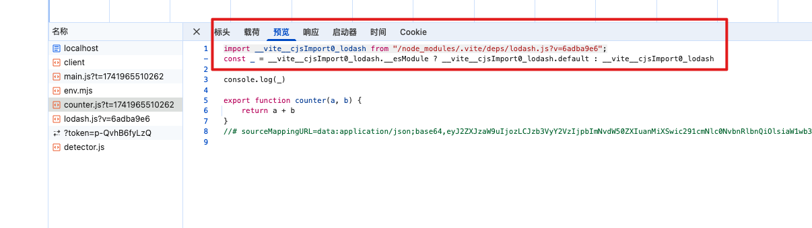

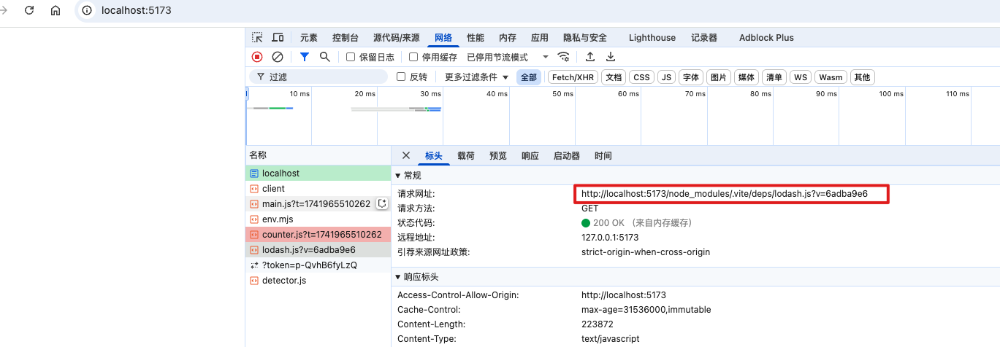

找寻依赖的过程是自当前目录依次向上查找的过程，直到搜寻到根目录或者搜寻到对应依赖为止

这时候假设项目根目录下 node_modules 没有需要的依赖比如 lodash，但是我们系统盘里 /usr/node_modules 下有 lodash 这个文件夹，那这个时候如果补全为绝对路径/usr/node_modules/lodash 那肯定不对了，如果变为相对路径呢 ../../

## 2. 这里我们引入两个概念：开发和生产

### 2.1. 开发中

npm run dev 开发

每次依赖与构建所重新构建的相对路径就是正确的（包括 1 中的路径转变）

### 2.2. 生产环境呢？

vite 会全程交给 rollup 的库去完成生产环境的打包，它就和 webpack 一样兼容了特别多的场景和环境：不仅仅支持 es Module 也支持 commonjs 等等，但是 vite 并没有这样做， 因为一个它考虑缓存的问题，还有就是**实际上 vite 在考虑另一个问题时候就顺便把这个问题给解决了**（转变为相对路径还是绝对路径）

比如，如果我们使用的库使用的标准是 commonjs 规范的导出（module.exports = ），比如 axios 那么 vite 就不认识了，而这些库是由第三方作者来实施的，我们并不能控制，

遇到这种情况，vite 会怎么办呢？它想到了一个办法：**依赖预构建**

## 3. 依赖预构建

首先 vite 会找到对应的依赖，然后使用 EsBuild（对 js 语法进行处理的一个库），将其他规范的代码转换为 es Module 规范，然后放置到到当前目录下 node_modules/.vite/deps，同时对 esModule 规范的各个模块进行统一集成，**即官网说的：****Vite 将有许多内部模块的 ESM 依赖关系转换为单个模块，以提高后续页面加载性能。**

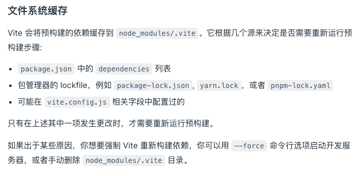

### 3.1. 这里它解决了三个问题（官网说是两个）

1. **不同的第三方会有不同的导出格式，这个是 vite 无法约束的问题**
2. **对路径的处理上可以直接使用 ./vite/deps, 方便路径重写**（因为转换后放置到了 .vite 文件夹下）
3. **叫做网络多包传输的性能问题（**也是原生 es Modules 规范不敢支持 node_modules 的原因），**有了依赖预构建以后无论他有多少的额外的 export 和 import，vite 都会尽可能的将他们集成到最后只生成一个或者几个模块，这样就减少了网络请求**

4. 假如 lodash 依赖了其他模块，并且这些模块都使用了 exports 导出（即外部使用 import 导入）
5. 引入 lodash 时候，就会去请求其他的模块，造成网路请求堵塞

### 3.2. 官网的两个目的

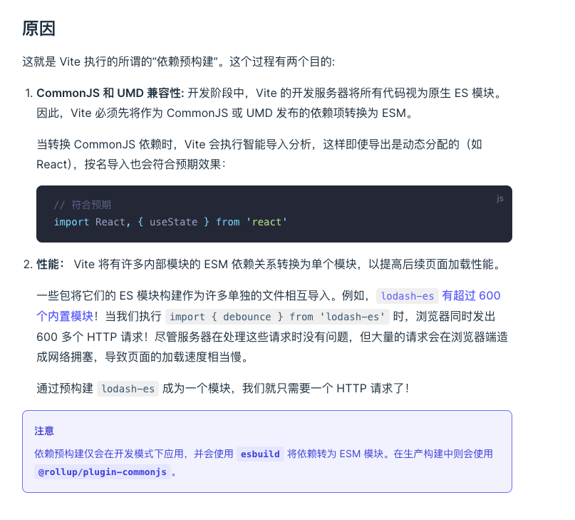

### 3.3. 效果演示：默认会对 es module 进行预构建

假如 lodash 依赖了其他模块，并且这些模块都使用了 exports 导出（即外部使用 import 导入）

1. 这里我们在项目中安装 lodash-es 来做规范使用

```bash
npm install lodash-es --save
```

2. 修改 couter.js 引入 lodash-es

```js
// import _ from 'lodash'
import _ from 'lodash-es'

console.log(_)
```

3. 运行终端命令 npm run dev, 可以看到如下效果

4. 在控制台中可以看到只有 lodash-es 的请求
5. 第一行的路径依赖，找到这个文件内容如下

6. 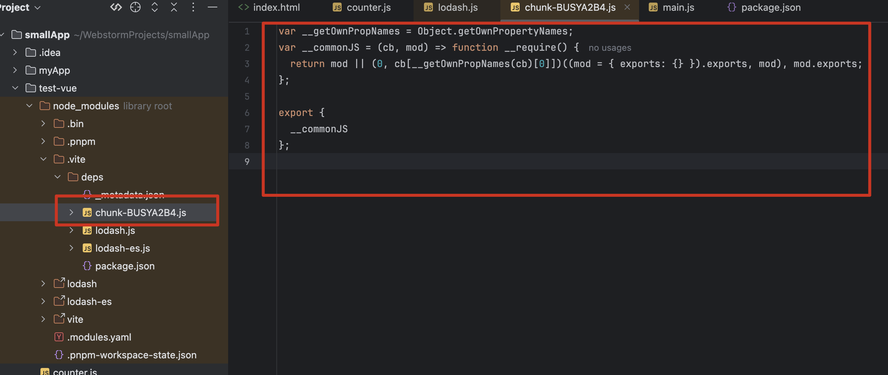

7. 内容中的代码可以看到：代码已经做了转换处理，以及最后用 es module 规范导出

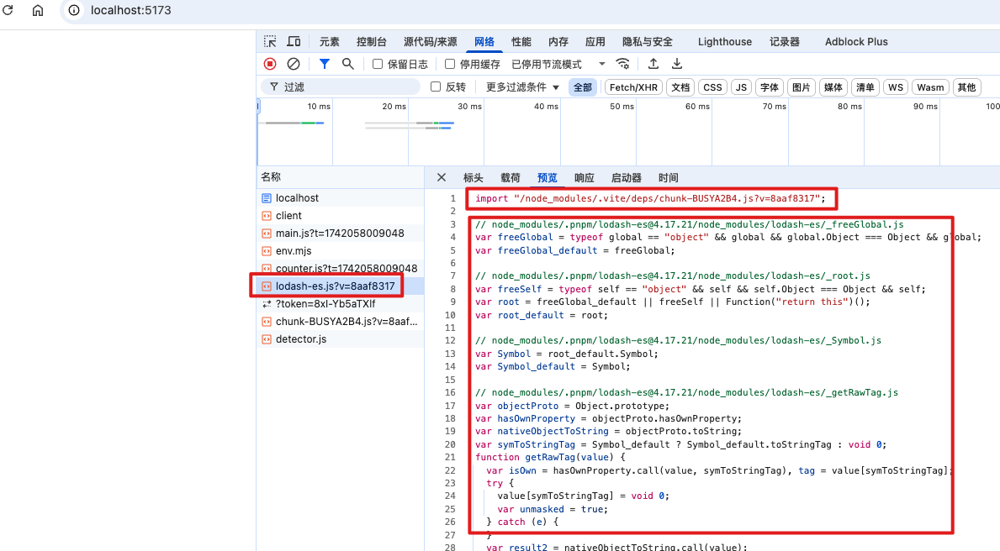

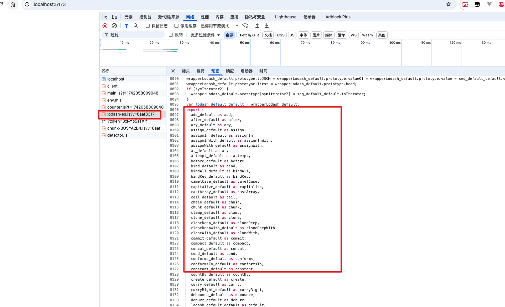

4. 但是实际上我们通过点击 couter.js 中的 lodash-es ，可以看到他的源码内容如下

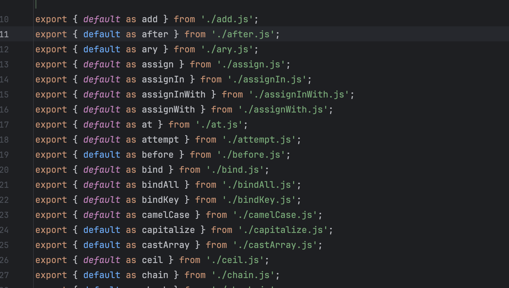

5. 我们可以到源码中的内容和最终在浏览器中经过构建后的结果不一致，构建后的都把所有的依赖都集成到一个文件中了（这就是对 es modules 规范的各个模块进行了一个统一集成）

### 3.4. 效果演示：如果不对 lodash-es 使用预构建

1. 我们在上述代码基础上，修改 vite.config.js 文件，添加如下内容

```js
export default {
  optimizeDeps: {
    exclude: ['lodash-es'] // 当遇到 lodash-es 时，不进行依赖预构建
  }
}
```

2. 重新运行终端命令, 再次查看控制台中的源码系列

3. `counter.js` 中引入 `lodash-es`

4. 查看 `lodash.js`: 引入 `lodash-es` 使用的是下面的 lodash.js 文件

5. 文件内容如下

6. 源码内容没有发生变化，有大量的 export

7. 然后每一个 export 都会产生一个请求，是不是很夸张，一下子网络请求就被堵塞了；如果有更多依赖，那就会更多请求

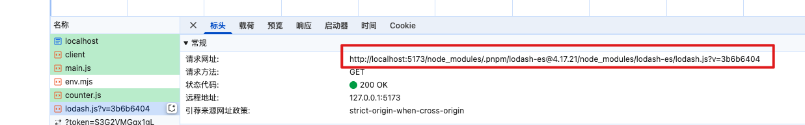

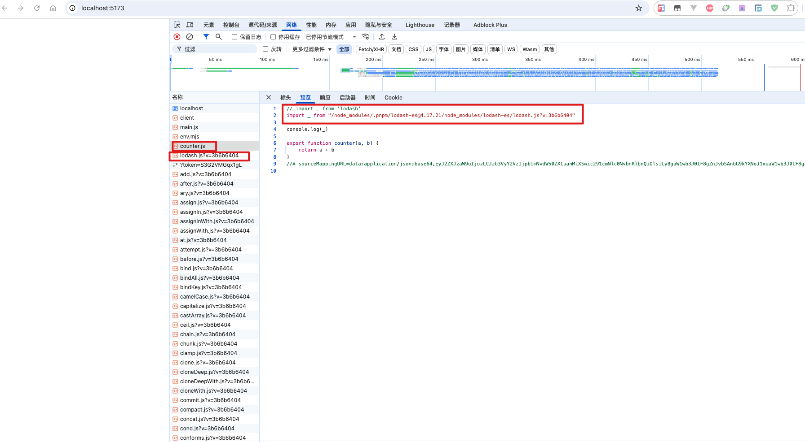

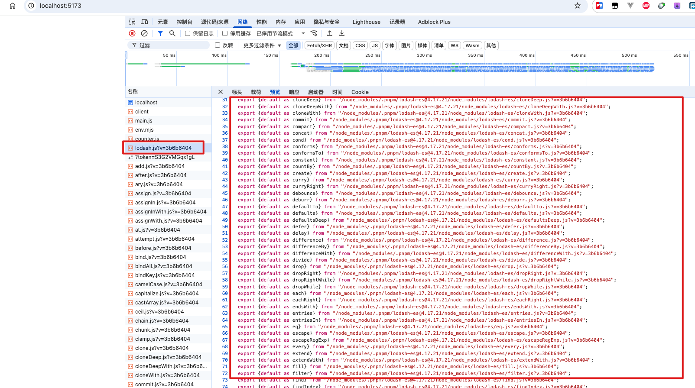

3. 所以我们需要不排除 `lodash-es` 让他进行预构建