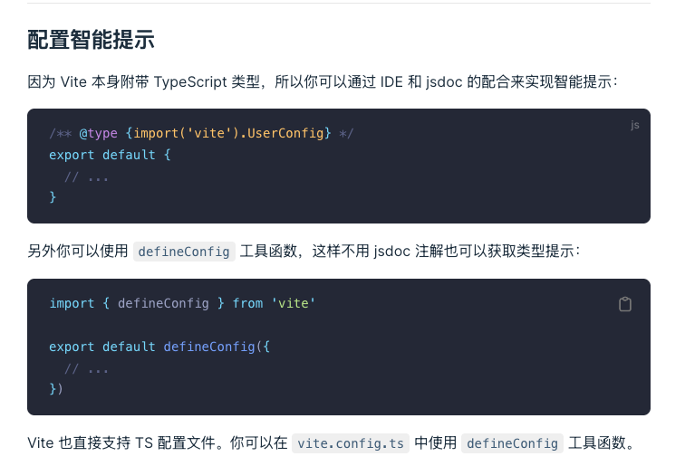
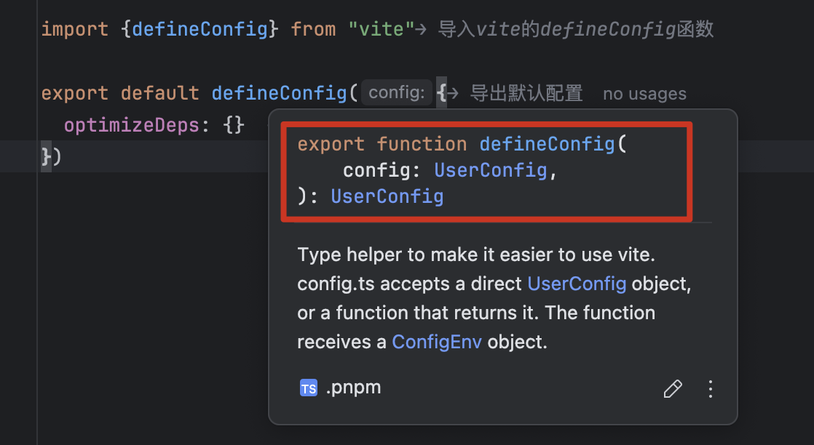
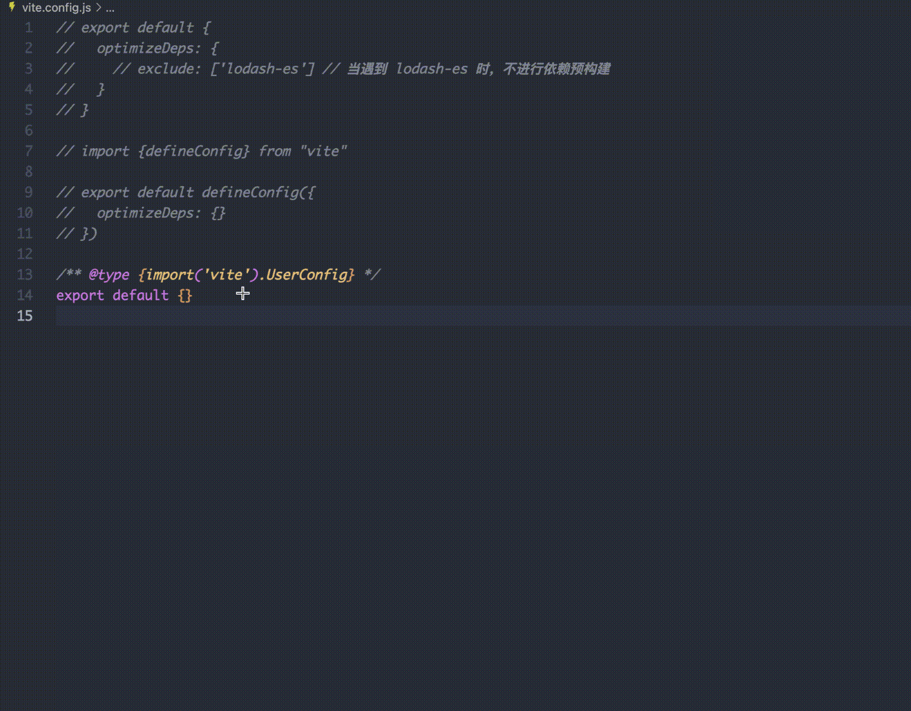
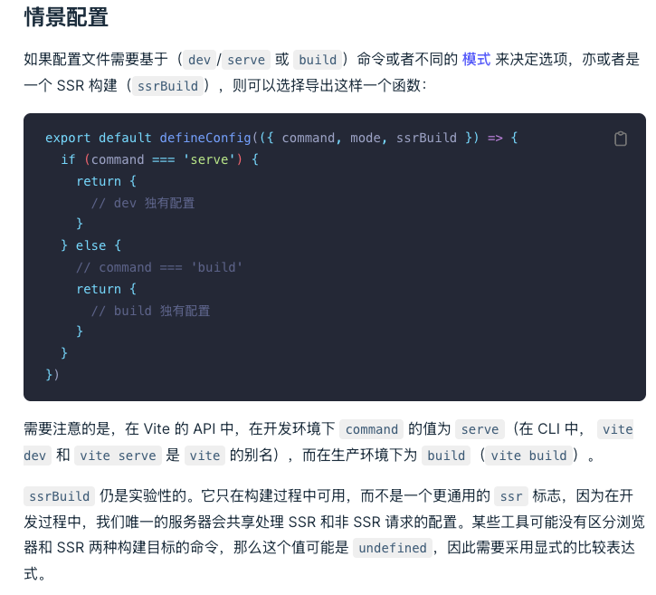

配置文件语法提示以及开发环境和生产环境

[https://vitejs.cn/vite3-cn/config/#config-intellisense](https://vitejs.cn/vite3-cn/config/#config-intellisense)

官网的文档



## 1. vite 配置文件的语法提示

1. 如果你用的是 webstorm，那你就可以得到很好的语法补全
2. 如果你用的是 vscode 或者其他编辑器，则需要做一些处理

### 1.1. 第一种处理方式：使用 defineConfig

修改 vite.config.js ，通过引入 defineConfig 就可以在书写内部属性时获得一个提示支持

```
import {defineConfig} from "vite"

export default defineConfig({
  optimizeDeps: {}
})
```

这里我们可以简单了解为什么这样写就有一个提示呢？因为这里使用了 ts 语法



### 1.2. 第二种写法: 使用 JSDoc

比如如下函数注释

```js
/**
 *
 * @param {number} a
 * @param {number} b
 * @returns {number}
 */
function add(a, b) {
  return a + b
}
```

如上这样写的话，我们写函数时就会有如下

- **书写 add 函数时候有参数类型提示和结果类型提示**
- **书写结果时候编辑器可以根据结果类型给出相应方法、属性提示**


所以可以通过给 vite.config.js 的导出结果书写注释，来获得编辑器的语法提示

```js
/** @type {import('vite').UserConfig} */
export default {
}
```

录屏提示如下



## 2. 关于环境的处理

[https://vitejs.cn/vite3-cn/config/#conditional-config](https://vitejs.cn/vite3-cn/config/#conditional-config)

过去我们使用 webpack 的时候，我们要区分配置文件的一个环境，

- webpack.dev.config
- webpack.base.config
- webpack.prod.config
- 使用 webpack merge 进项合并处理

### 2.1. vite 官方则提供了情景配置



1. 新建 config 文件夹
2. 新建 vite.dev.config.js 内容如下

```js
import {defineConfig} from 'vite'

export default defineConfig({})
```

3. 新建 vite.prod.config.js 内容如下

```js
import {defineConfig} from 'vite'

export default defineConfig({})
```

4. 新建 vite.base.config.js 内容如下

```js
import {defineConfig} from 'vite'

export default defineConfig({})
```

5. 修改 vite.config.js 文件，内容如下

```js
import viteDevConfig from "./config/vite.dev.config";
import viteProdConfig from "./config/vite.prod.config";
import viteBaseConfig from "./config/vite.base.config";

// 策略模式
const endSResolver = {
  "serve": () => ({...viteBaseConfig, ...viteDevConfig}),
  "build": () => ({...viteBaseConfig, ...viteProdConfig})
}

export default defineConfig(({command, mode, ssrBuild}) => {
	// 注意：这里的 command 是server 还是 build
	// 要看你执行的命令
	// 执行 vite 就是 server 开发环境
	// 执行 vite build 就是 build 生产环境

	
  // if (command === 'serve') {
  //
  //   return {
  //     // dev 配置
  //   }
  // } else {
  //   // command === "build"
  //   return {
  //     // build 配置
  //
  //   }
  // }
  return endSResolver[command]()
})
```