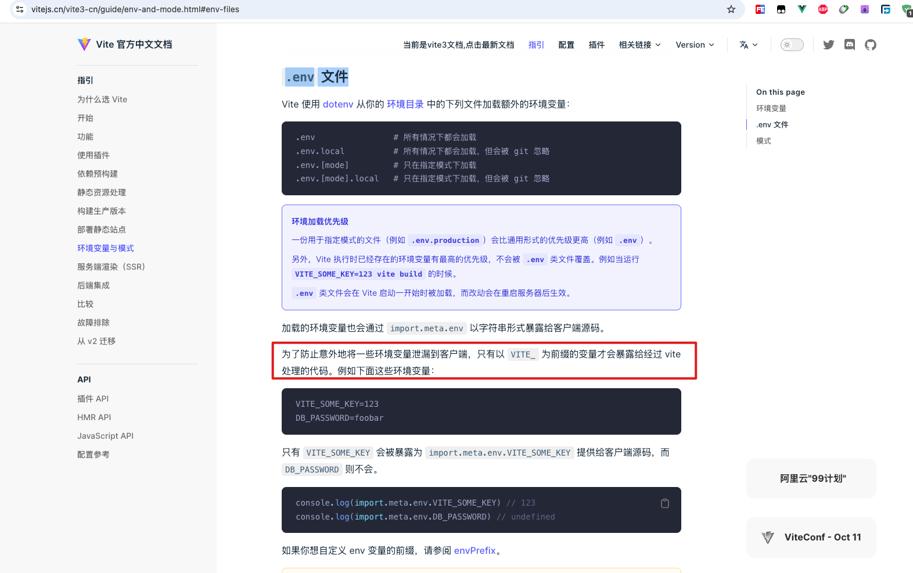
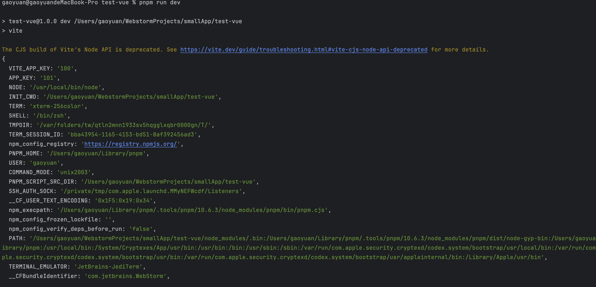
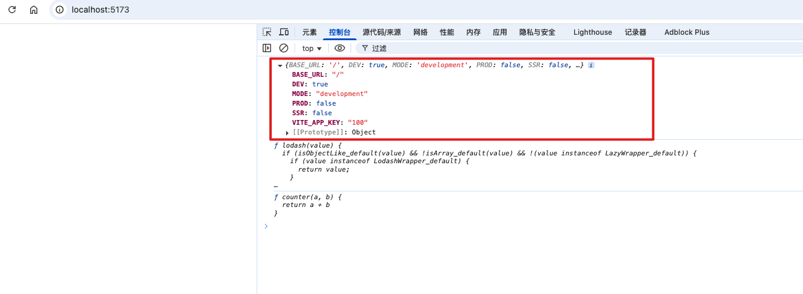
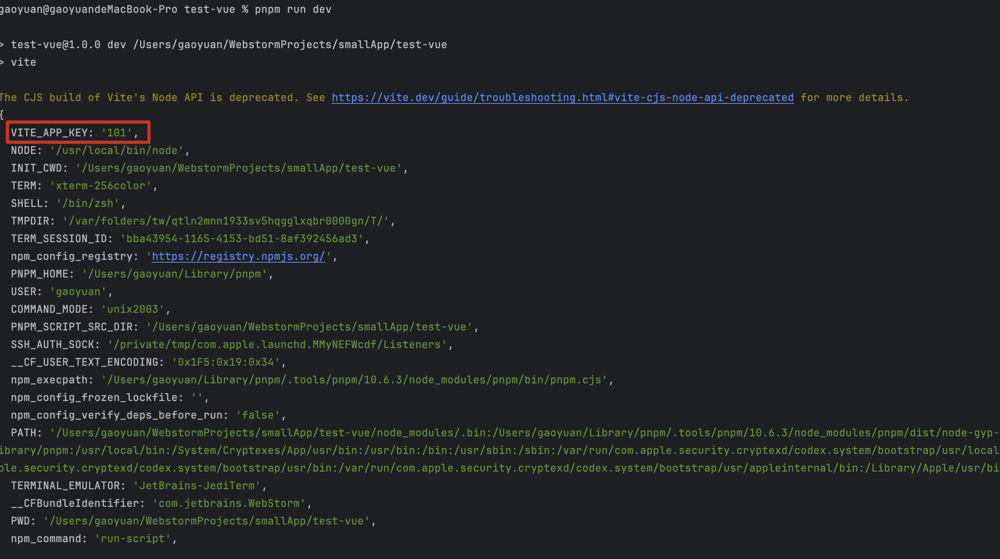
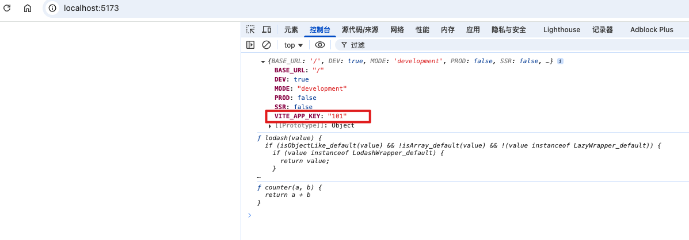

环境变量: 会根据当前的代码环境产生值的变化的变量就是环境变量

## 1. 代码环境：

1. 开发环境
2. 生产环境
3. 测试环境
4. 恢复环境
5. 预发布环境

举个例子：百度地图 SDK，小程序的 SDK

比如其中的 APP_KEY: 测试环境、开发环境是不一样的

还有一个和后端开发联调接口时，开发环境、生产环境接口域名地址肯定是不一样的

## 2. 使用 env 文件

新建 env.development、env.production 文件

## 3. 在 vite 中的环境变量处理

内置并使用了 dotenv 第三方库

[https://dotenv.nodejs.cn/](https://dotenv.nodejs.cn/)

[https://vitejs.cn/vite3-cn/guide/env-and-mode.html#env-files](https://vitejs.cn/vite3-cn/guide/env-and-mode.html#env-files)

### 3.1. vite 中使用 loadEnv

它会在执行 npm run dev 时候去读取 .env 文件, 将环境变量从 `.env` 文件加载到 [process.env](https://nodejs.cn/docs/latest/api/process.html#process_process_env) 中（订但是 vite 考虑到和其他配置的一些冲突问题，它不会直接注入到 process 对象下）

主要会涉及到 vite.config.js 的一些配置

- root
- envDir: 用来配置当前环境变量的文件地址

这里就会产生一个问题：如果在 vite.config.js 文件中，通过 defineConfig 导出不同环境对应不同配置的时候 ，我们在导出之间拿到的环境变量已经是从默认 env 文件中拿到的环境变量，那怎么才能让 envDir 这个配置生效呢？？？

vite 给我们提供了一个补救措施：我们可以调用 vite 的 loadEnv 方法手动

- process.cwd(): 返回当前 node 进程的工作目录

.env: 所有环境都需要用到的环境变量值

.env.development 开发环境需要用到的环境变量（默认情况下 vite 将我们的开发环境取名为 development）

.env.production 生产环境需要用到的环境变量（默认情况下，vite 会将我们的生产环境命名为 production）

[https://developer.aliyun.com/article/949754](https://developer.aliyun.com/article/949754)

#### 3.1.1. 当我们调用 lodaEnv 的时候，它会做如下几种事情

1. 直接找打 .env 文件不解释，并解析其中的环境变量，并放进一个对象里
2. 会将传进来的 mode 这个变量的值进行拼接：`.env.` + `mode`, 并根据我们提供的目录去寻找对应的配置文件进行解析，并放进一个对象，直接覆盖之前的 .env 中的同名属性
3. 我们可以理解为

```
// 下面一段伪代码
const baseEnvConfig = 读取.env的配置
const modeEnvConfig = 读取.env. + mode 的配置
const mergedEnvConfig = { ...baseEnvConfig, ...modeEnvConfig }
```

如果是客户端，vite 会将对应的环境变量注入到 import.meta.env 里面去

4. vite 做了一个拦截，它为了防止我们将隐私性的变量直接送进 import.meta.env 中，所以做了一层拦截处理，如果你的环境变量不是以 VITE_ 开头的，它就不会帮你注入到客户端中去
5. 如果我们想要更改这个前缀，可以去使用 envPrefix 配置

### 3.2. 补充一个小知识：为什么 vite.config.js 文件可以书写成 EsModule 的形式

而 webpack.config.js 文件时用 commonjs 规范的

这是因为 vite 在读取这个 vite.config.js 文件的时候回率先用 node 去解析文件语法，如果发现你是 EsModules 规范会直接将你的 esModules 规范进行替换成 commonjs 规范

### 3.3. vite 项目中使用 env 文件

注意：vite 项目中的环境变量需要以 `VITE_` 开头



1. 新建.env 文件

```
VITE_APP_KEY=100
```

2. 新建 .env.development 文件

```
APP_KEY=101
```

3. 新建 .env.production 文件

```
APP_KEY=102
```

4. 修改配置文件 vite.config.js 内容如下

```

export default defineConfig(({command, mode}) => {

  // process.cwd() 获取当前工作进程目录，即 npm run dev 时候的目录
  // 第一个参数mode 是当前的模式，默认开发环境是development 生产环境是 production，可以通过 --mode 指定
  // 第二个参数不是必须要使用 process.cwd()，可以传入其他路径
  // 第三个参数是环境变量文件，默认是 .env，可以传入其他文件
  const env = loadEnv(mode, process.cwd(), "");
  console.log(env, "env")

  return endSResolver[command]();
})
```

5. 修改 counter.js 文件,打印代码中可以拿到的环境变量（通过 import.meta.env）

```
console.log(import.meta.env)
console.log(_)
```

6. 执行终端命令 npm run dev ,分别查看终端结果和浏览器结果





7. 修改 .env.development 文件如下

```
VITE_APP_KEY=101
```

8. 再次执行终端命令，截图如下





## 4. 疑问点：loadEnv 的使用场景

解答来自豆包 AI

### 4.1. 作用

1. **加载环境变量**：`loadEnv` 函数能够从指定目录下的环境变量文件（`.env` 文件）中读取环境变量，并将其以对象的形式返回。例如，你可能有一个 `.env.development` 文件用于开发环境的配置，`.env.production` 文件用于生产环境的配置。`loadEnv` 可以根据当前运行环境加载对应的文件。
2. **环境区分**：它允许你根据不同的运行环境加载不同的环境变量集。比如，在开发环境中，你可能希望使用本地的 API 地址，而在生产环境中使用正式的 API 地址。通过 `loadEnv`，你可以轻松实现这种环境特定的配置。

### 4.2. 使用场景

#### 4.2.1. API 地址配置：

- 在开发环境中，你可能希望使用本地开发服务器的 API 地址，而在生产环境中使用线上正式的 API 地址。例如：

- 在 `.env.development` 文件中设置 `VITE_API_URL=http://localhost:3000/api`。
- 在 `.env.production` 文件中设置 `VITE_API_URL=https://your - production - domain.com/api`。
- 在 Vite 配置文件（`vite.config.js`）中，可以这样使用 `loadEnv`：

```
import { defineConfig } from 'vite';
import { loadEnv } from 'vite';

export default ({ mode }) => {
    const env = loadEnv(mode, process.cwd());
    return defineConfig({
        //...其他配置
        server: {
            proxy: {
                '/api': {
                    target: env.VITE_API_URL,
                    changeOrigin: true
                }
            }
        }
    });
};
```

#### 4.2.2. 第三方服务配置：

- 如果你使用了第三方服务，如 Analytics（分析工具）、支付网关等，不同环境可能需要不同的密钥或配置。例如，对于 Google Analytics，开发环境可能使用测试密钥，生产环境使用正式密钥。
- 在 `.env.development` 文件中设置 `VITE_GA_KEY=test-key`。
- 在 `.env.production` 文件中设置 `VITE_GA_KEY=production-key`。
- 在你的项目代码中，可以根据加载的环境变量来初始化第三方服务：

```
import { loadEnv } from 'vite';

const env = loadEnv(mode, process.cwd());
const gaKey = env.VITE_GA_KEY;
// 使用gaKey初始化Google Analytics
```

这是涉及到项目代码中，我觉得可以也可以 vite 提供的 import.meta.env 通过在 .env.development=developemnt .env.production=production 来进行再项目中获取到然后作区分

或者直接使用 import.meta.env.VITE_GA_KEY 来获取不同环境变量配置的值

#### 4.2.3. 功能开关控制：

- 有时候，你可能希望在开发环境中启用一些调试功能，而在生产环境中关闭它们。例如，显示额外的日志信息或启用热重载相关的调试工具。
- 在 `.env.development` 文件中设置 `VITE_SHOW_DEBUG_LOGS=true`。
- 在 `.env.production` 文件中不设置或设置 `VITE_SHOW_DEBUG_LOGS=false`。
- 在项目代码中：(同样的是在项目中，我觉得也可以使用 import.meta.env 来获取到)

```
import { loadEnv } from 'vite';

const env = loadEnv(mode, process.cwd());
if (env.VITE_SHOW_DEBUG_LOGS === 'true') {
    console.log('This is a debug log');
}
```

总之，`loadEnv` 函数为 Vite 项目提供了一种灵活的方式来管理不同环境的配置，使得项目在开发、测试和生产等各个阶段能够方便地切换配置。