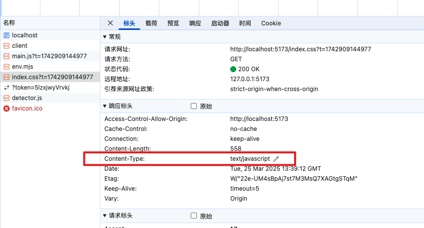
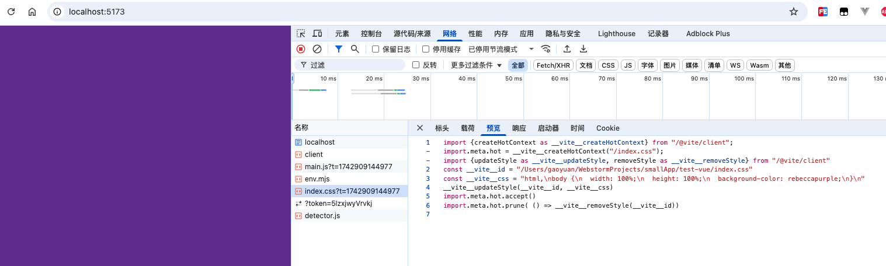
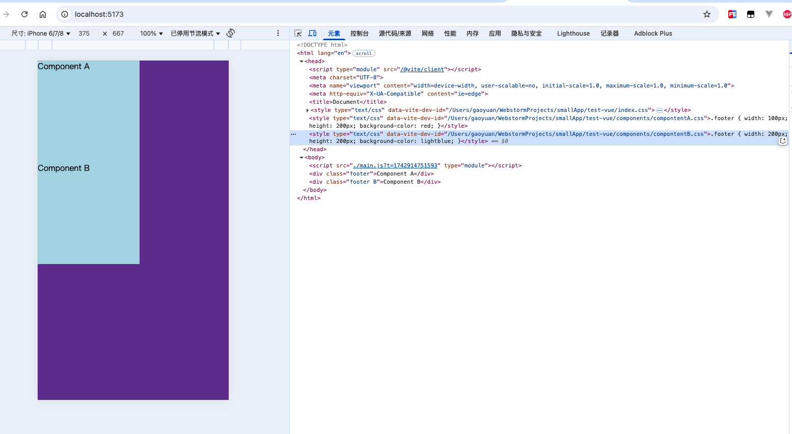
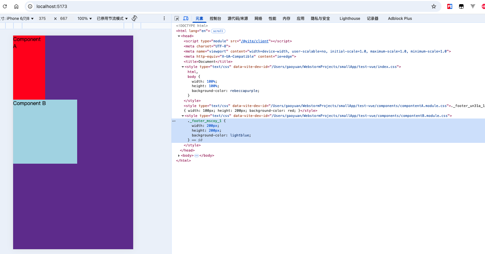
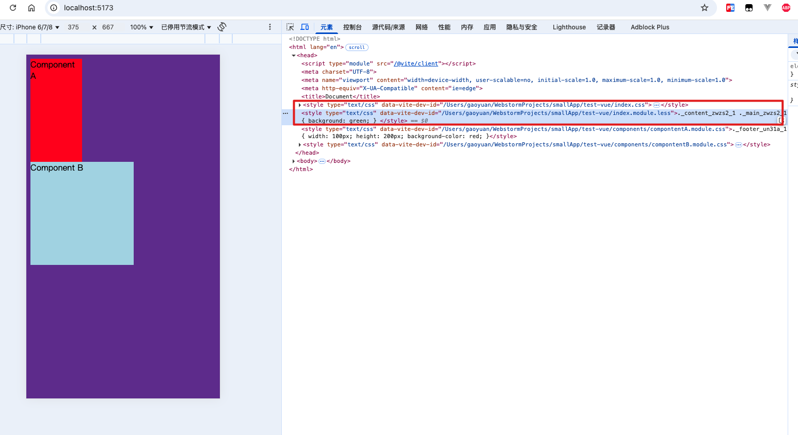

vite 天生就支持对 CSS 文件的直接处理

## 1. 支持 css

1. vite 在读取 main.js 中引用到了 Index.css
2. 直接使用 fs 模块，读取 index.css 中的文件内容
3. 直接创建一个 style 标签，将 index.css 文件中的内容直接 copy 到 style 标签里面
4. 将 style 标签插入到 index.html 的 head 中
5. 将 css 文件中的内容直接替换为 js 脚本（方便热更新或者 css 模块化），同时设置 content-type 为 js，从而让浏览器以 js 脚本的形式来执行 css 后缀的文件

### 1.1. 在 couter.js 中引入 index.css

```
import "./index.css"
```

### 1.2. index.css 内容如下

```css
html, body {
  width: 100%;
  height: 100%;
  background-color: rebeccapurple;
}
```

### 1.3. 浏览器中的结果如下


网络请求中的 css 文件内容已经替换成了 js 脚本





## 2. 场景：协同开发

- 一个组件最外层的元素一般取名：wrapper
- 一个组件最底层的元素类名我们一般取名为：.footer

但是你取了 footer 这个名字，别人因为没有看过你这个组件的源代码，也可能取 footer 这个类名，就会存在后面覆盖前者的情况

这就是我们在协同开发时候很容易出现的问题

### 2.1. 新建 components/compontentA.js 和 components/componentA.css

```js
import "./compontentA.css"

const div = document.createElement("div")
div.className = "footer"
div.innerHTML = "Component A"

document.body.appendChild(div)
```

```css
.footer {
  width: 100px;
  height: 200px;
  background-color: red;
}
```

### 2.2. 新建components/compontentB.js 和 components/componentB.css

```js
import "./compontentB.css"

const div = document.createElement("div")
div.className = "footer B"
div.innerHTML = "Component B"

document.body.appendChild(div)
```

```
.footer {
  width: 200px;
  height: 200px;
  background-color: lightblue;
}
```

### 2.3. 修改 main.js 文件内容如下

```js

import "./components/componentA.js"
import "./components/componentB.js"
```

### 2.4. 运行效果如下

可以发现同类名 footer 样式被后续同名覆盖了



## 3. CSS module

就是解决是上述同名会覆盖的问题的

### 3.1. 修改 compontentA.js 和 componentA.module.css

component.css 改名字为 componentA.module.css

```js
import style from "./compontentA.module.css"

const div = document.createElement("div")
div.className = style.footer
div.innerHTML = "Component A"

document.body.appendChild(div)
```

### 3.2. 修改 compontentB.js 和 componentB.module.css

```js
import style from "./compontentB.module.css"

const div = document.createElement("div")
div.className = style.footer
div.innerHTML = "Component B"

document.body.appendChild(div)
```

```css
.footer {
  width: 200px;
  height: 200px;
  background-color: lightblue;
}
```

### 3.3. 运行后结果如下



### 3.4. CSS module 的实现原理

这里大概说一下

全部都是基于 Node 的

1. module.css（module.css 是一种约定，表示需要开启 css 模块化）
2. 它会将所有的类名进行一定规则的替换（比如将 footer 替换为 _footer_mscoy_1）
3. 同时创建一个映射对象 `{ footer: '_footer_mscoy_1' }`
4. 将替换后的内容塞进 style 标签中中的 head 标签中（能够读取到 index.html 中的内容）
5. 将 componentA.module.css 内容全部抹除，替换成 JS 脚本
6. 将创建的映射对象在脚本中进行默认导出

## 4. less：预处理器

类似的还有其他的

less 给我们提供了一些方便且非常实用的方法

比如下面的支持嵌套

```css
.a {
  .b {
    font-size:  16px
  }
}
```

### 4.1. 新建 index.module.less

```css
.content {
  .main {
    background: green;
  }
}
```

### 4.2. 修改 main.js，引入 index.module.less

```js
import style from "./index.module.less"
```

### 4.3. 运行后，终端会报错

```txt
Pre-transform error: Preprocessor dependency "less" not found. Did you install it? Try `npm install -D less`.
```

执行命令安装 less 即可

### 4.4. 重新运行浏览器，可以看到如下

