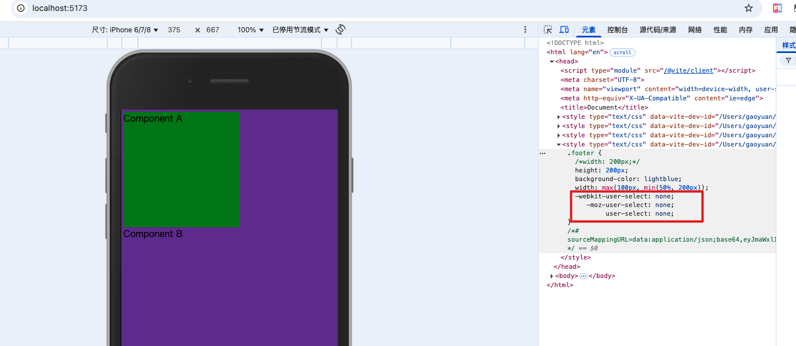

## 1. 修改 `vite.config.js` 中的 `postcss` 属性配置

直接在 `css` 的 `postcss` 属性中进行配置 ，该属性直接配置的就是 `postcss` 的配置

当然，如果这里没有配置，那你创建一个 `postcss.config.js` 文件内容也是可以的，也会读取配置内容

优先级是 `css` 中的 `postcss` 优先级别更高一些

```
import {defineConfig} from 'vite'
const postcssPresetEnv = require('postcss-preset-env')

export default defineConfig({
  css: {
    modules: {},
    preprocessorOptions: {},
    devSourcemap: true,
    // 这里进行 postcss 配置
    // vite的诞生一定会让postcss再火一把，所以最好对postcss有个了解
    postcss: {
      plugins: [postcssPresetEnv()]
    }
  }
})
```

安装 `postcss-preset-env`

- `postcss-preset-env`: 支持 css 变量和一些未来 css 语法，自动补全（`autoprefixer`）

```
npm install postcss-preset-env -D
```

我们修改 `componentB.module.css`内容，使用一个新语法，看看它能不能给我们做一个转换

```
.footer {
  /*width: 200px;*/
  height: 200px;
  background-color: lightblue;
  // clamp是一个新语法
  width: clamp(100px, 50%, 200px);
}
```

`**clamp()**` 函数的作用是把一个值限制在一个上限和下限之间，当这个值超过最小值和最大值的范围时，在最小值和最大值之间选择一个值使用。它接收三个参数：最小值、首选值、最大值。

[https://developer.mozilla.org/zh-CN/docs/Web/CSS/clamp](https://developer.mozilla.org/zh-CN/docs/Web/CSS/clamp)

我们在终端运行起来，查看浏览器中的样式，已经做了转换

_**因为 preset-env 会帮助我们做语法降级，vite 内部默认会有一个主浏览器的支持表**_


我们在上述 `css` 文件中，再加一行代码

```
.footer {
  /*width: 200px;*/
  height: 200px;
  background-color: lightblue;
  width: clamp(100px, 50%, 200px);
  // 这里我们看看会不会给我们加一些兼容性前缀
  user-select: none;
}
```

运行终端，结果如下，可以看到已经帮我们做了处理

