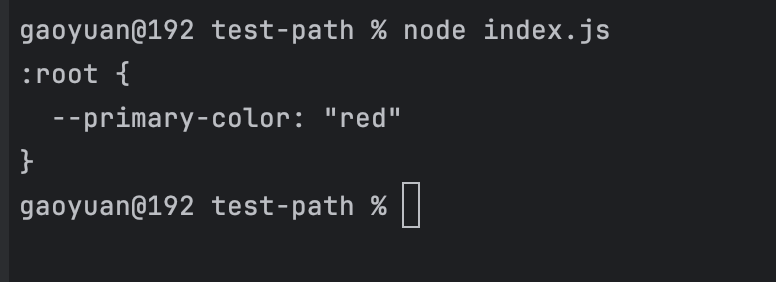
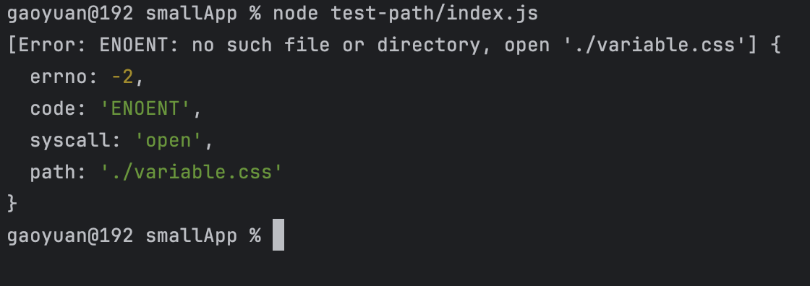
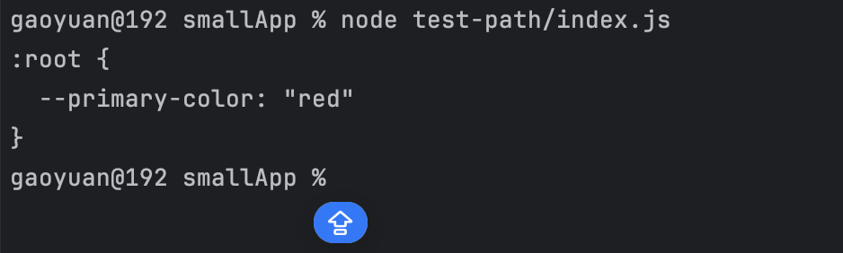

- node 端去读取文件或者操作文件的时候，如果发现你用的是相对路径，则会去使用 process.cwd()来进行相应的拼接
- process.cwd(): 获取当前的 node 执行目录
- path 本质上就是一个字符串处理模块，它里面有非常多的路径字符串处理方法

比如在 test-path 文件夹下新建一个文件 index.js, 以及 variable.css

```
// index.js内容如下
const fs = require("fs");
fs.readFile("./variable.css", "utf-8", (err, data) => {
  if (err) {
    console.log(err)
    return
  }
  console.log(data.toString());
});


// variable.css 内容如下
:root{
  --primary-color: "red"
}
```

我们终端中执行如下命令

```
cd test-path
node index.js
```

可以看到结果如下



我们在终端中再执行以下命令

```
cd ../
node test-path/index.js
```

可以看到结果报错了：Error: ENOENT: no such file or directory, open './variable.css'



这是为什么呢，因为：**node 端去读取文件或者操作文件的时候，如果发现你用的是相对路径，则会去使用 process.cwd()来进行相应的拼接**

## __dirname

如果使用的 commonjs 规范，会注入变量 __dirname

那么如果说修改 index.js 如下，是不是就可以了

```
const fs = require("fs");
// const path = require("path")

fs.readFile(__dirname + "/variable.css", "utf-8", (err, data) => {
  if (err) {
    console.log(err)
    return
  }
  console.log(data.toString());
});
```

我们在终端中再次执行，发现可以了

```
node test-path/index.js
```



但是这里有个系统兼容性的问题，在 windows 中我们拼接路径需要用 `\`反斜杠，那么我们进行拼接路径时候就需要做一个系统兼容性的判断处理了，比较麻烦，所以还是使用 path 更好

## path

path 本质上就是一个字符串处理模块，它里面有非常多的路径字符串处理方法

修改文件 index.js 内容如下

```
const fs = require("fs");
const path = require("path")

fs.readFile(path.resolve(__dirname + "./variable.css"), "utf-8", (err, data) => {
  if (err) {
    console.log(err);
    return;
  }
  console.log(data.toString());
});
```

## __dirname 的一个原理

node 读取文件内容，并复制一下，放在立即执行函数中

比如我们写一个文件 a.js 内容如下

```
console.log("arguments", arguments)
```

终端中执行 node a.js 得到如下结果

```
arguments [Arguments] {
  '0': {},
  '1': [Function: require] {
    resolve: [Function: resolve] { paths: [Function: paths] },
    main: {
      id: '.',
      path: '/Users/gaoyuan/WebstormProjects/smallApp/test-path',
      exports: {},
      filename: '/Users/gaoyuan/WebstormProjects/smallApp/test-path/a.js',
      loaded: false,
      children: [],
      paths: [Array],
      [Symbol(kIsMainSymbol)]: true,
      [Symbol(kIsCachedByESMLoader)]: false,
      [Symbol(kIsExecuting)]: true
    },
    extensions: [Object: null prototype] {
      '.js': [Function (anonymous)],
      '.json': [Function (anonymous)],
      '.node': [Function (anonymous)]
    },
    cache: [Object: null prototype] {
      '/Users/gaoyuan/WebstormProjects/smallApp/test-path/a.js': [Object]
    }
  },
  '2': {
    id: '.',
    path: '/Users/gaoyuan/WebstormProjects/smallApp/test-path',
    exports: {},
    filename: '/Users/gaoyuan/WebstormProjects/smallApp/test-path/a.js',
    loaded: false,
    children: [],
    paths: [
      '/Users/gaoyuan/WebstormProjects/smallApp/test-path/node_modules',
      '/Users/gaoyuan/WebstormProjects/smallApp/node_modules',
      '/Users/gaoyuan/WebstormProjects/node_modules',
      '/Users/gaoyuan/node_modules',
      '/Users/node_modules',
      '/node_modules'
    ],
    [Symbol(kIsMainSymbol)]: true,
    [Symbol(kIsCachedByESMLoader)]: false,
    [Symbol(kIsExecuting)]: true
  },
  '3': '/Users/gaoyuan/WebstormProjects/smallApp/test-path/a.js',
  '4': '/Users/gaoyuan/WebstormProjects/smallApp/test-path'
}
```

其实立即执行函数可以是如下结构的

```
(function(exports, require, module, __filename, __dirname){
  // 文件内容
})()
```