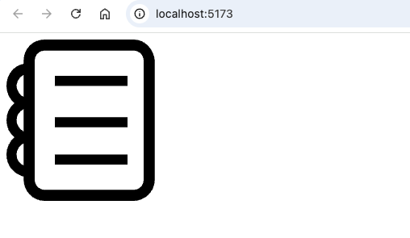
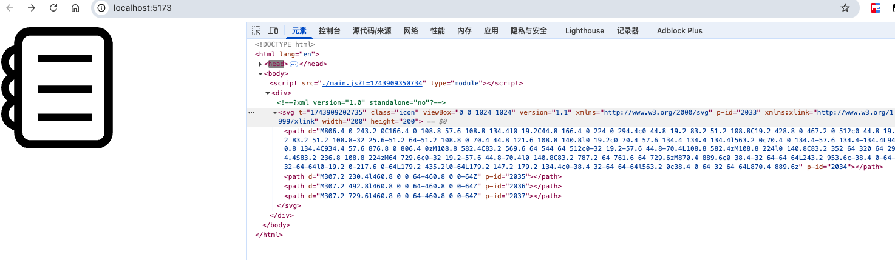
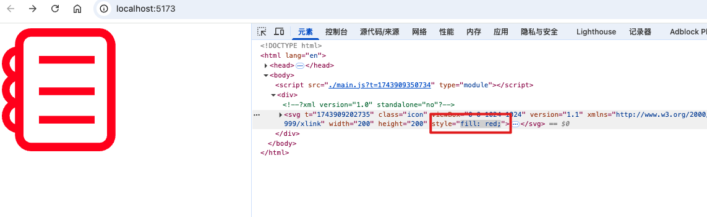

上节课中说 vite 对 svg 有特殊处理，这句话是错误的

vite 对 svg 依旧是开箱即用的

svg：scaable vector grahics 可伸缩矢量图形

- svg 是不会失真的
- 尺寸小

缺点

- 无法很好的去展示层次丰富的图片信息

我们在前端领域更多的使用 svg 来做图标

## 1. 引入 svg 的两种方式

找一个 note.svg 放在 src/assets 文件夹下


### 1.1. 直接引入使用

```
import noteSvg from "@assets/note.svg"

const svgEl = document.createElement('img')
svgEl.src = noteSvg
document.body.appendChild(svgEl)
```

终端运行后，页面结构如下



### 1.2. 使用 raw 后缀引入

这里我使用后缀 raw 引入，然后创建 div 的 innerHTML 为此元素，

并且使用 js 获得该元素，当鼠标移入时候，颜色改为 red

```
import noteSvg from "@assets/note.svg?raw"

const divEl = document.createElement('div')
divEl.innerHTML = noteSvg
document.body.appendChild(divEl)

const svgEl = document.getElementsByTagName("svg")[0]
svgEl.onmouseenter = () => {
  // 这里并不是改变它的 background
  svgEl.style.fill = "red"
}
```

这是鼠标未移入时候的样子



这是鼠标移入的时候的样子

