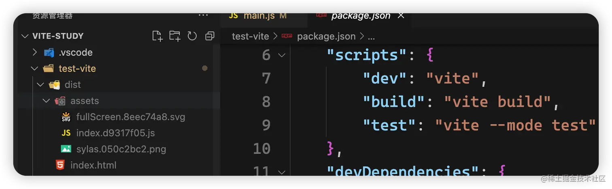
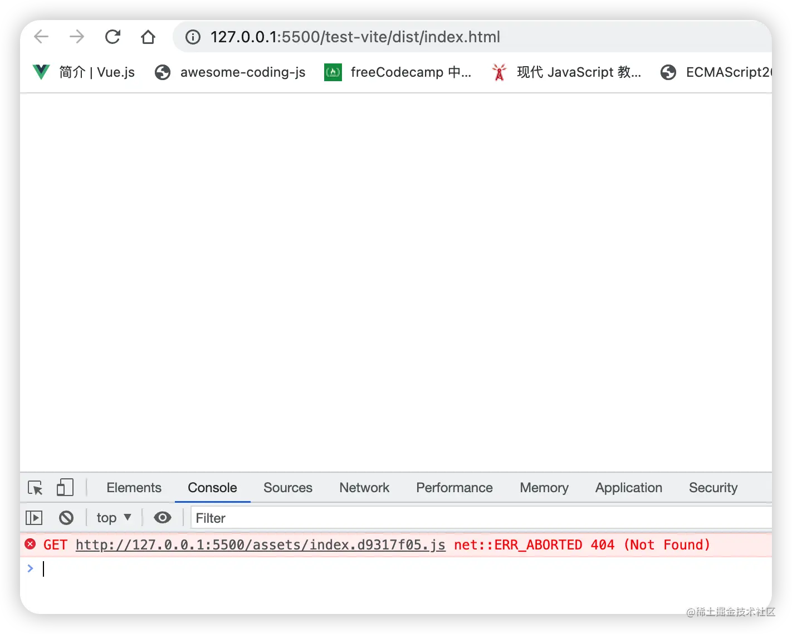
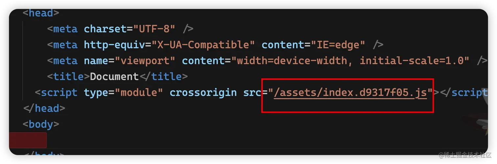
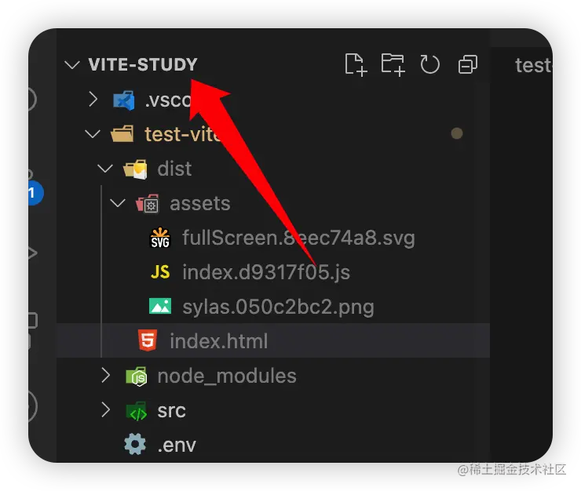
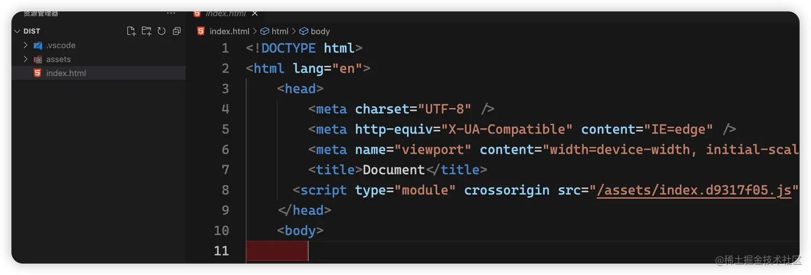
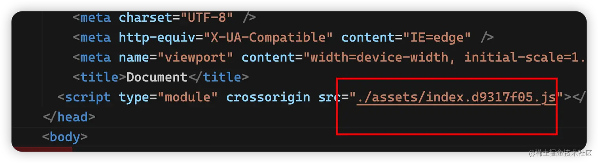
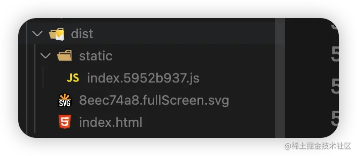
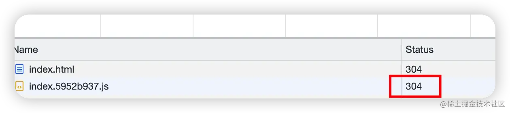
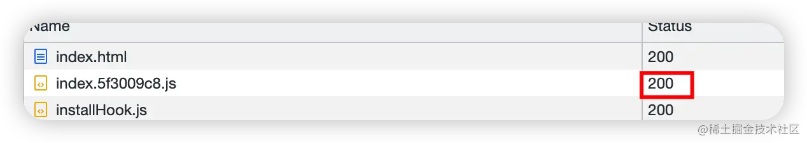
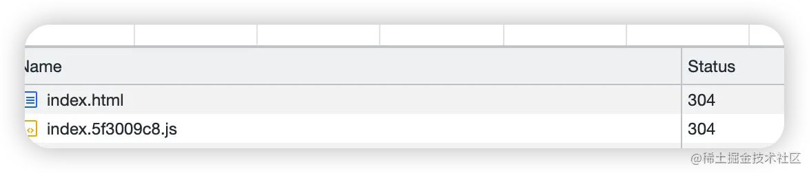

## 1. 打包路径

在控制台执行 yarn build。



打包完后如下，我们可以使用 live server 打开



可以发现已经报错了，这是为什么呢，我们可以打开打包后的 index.html 文件看看



可以看到这里是绝对路径，又因为此时的文件根目录是vite-study，所以此时相当于是在这个目录下去寻找 assets/index.d9317f05.js，肯定会404。



我们可以单独打开 dist 目录作为根目录。这样就可以找寻到了，就解决了。当然一般放在服务器上面是没有这个问题的，因为在服务器中，nginx 会去配置每一个项目的根目录，所以到时候找到的就肯定都是根目录了。



也可以把打包出来后的路径改成相对路径，也可以解决这个问题。

```
import { defineConfig } from 'vite'

export default defineConfig({
  base: './'
})
```



这样打包出来的就是相对路径了。

一些其余配置，也可以在官网查看[构建选项](https://link.juejin.cn?target=https%3A%2F%2Fcn.vitejs.dev%2Fconfig%2Fbuild-options.html%23build-assetsinlinelimit)

```
import { defineConfig } from 'vite'
export default defineConfig({
  base: './',
  build: {
    rollupOptions: { // 配置rollup的一些构建策略
      output: { // 控制输出
        // 在rollup里面, hash代表将你的文件名和文件内容进行组合计算得来的结果
        assetFileNames: "[hash].[name].[ext]"
      }
    },
    assetsInlineLimit: 4096 * 1000, // 默认为 4kb，4kb以下的会被打包成base64
    outDir: "dist", // 默认为 dist
    assetsDir: "static" // 默认为 assets
  },
})
```



## 2. hash 算法

这样被打包后的文件就是这样了，为什么打包后的资源都会有一个 hash 呢？

因为浏览器会有一个缓存机制，**这个hash 是通过文件名和文件内容动态算出来的，**只要改变一点就会生成不一样的 hash 值，如果 hash 没变，浏览器就会直接通过缓存读取。

利用好 hash 算法，可以让我们更好的去控制浏览器的缓存机制

我们可以把上面的 assetsInlineLimit: 4096 * 1000 改成 assetsInlineLimit: 4096，在修改之前是如下，



修改完后重新打包，可以发现文件 hash 变了，然后打包出来的不再是走的缓存了。



此时刷新页面试试，发现又是读取的缓存了。

