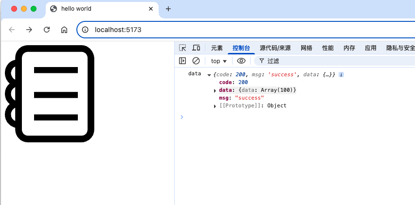

[https://github.com/vbenjs/vite-plugin-mock](https://github.com/vbenjs/vite-plugin-mock)

mock数据: 模拟数据

前后端一般是并行开发 用户列表 ( 接口文档 )

mock数据 去做你前端的工作

1. 简单方式: 直接去写死一两个数据 方便调试

- 缺陷：

- **没法做海量数据测试**
- **没法获得一些标准数据**
- **没法去感知http的异常**

axios: http请求库

1. mockjs: 模拟海量数据的， vite-plugin-mock 的依赖项就是mockjs

## 1. vite-plugin-mock 的基本使用

### 1.1. 安装

```
pnpm install vite-plugin-mock --save-dev
```

### 1.2. 修改 vite.base.config.js 文件

```
import {viteMockServe} from "vite-plugin-mock"

export default defineConfig({
  plugins: [
    viteMockServe({
      // default
      mockPath: 'mock',
      enable: true,
    }),
  ]
})
```

### 1.3. 根目录下新建文件 mock/index.js

```
const mockJS = require('mockjs')

const userList = mockJS.mock({
  'data|100': [
    //代表生成100
    {
      name: '@cname', // 表示生成不同的中文名
      ename: mockJS.Random.name(), // 生成不同的英文名
      'id|+1': 1, //
      time: '@time',
      date: '@date'
    }
  ]
})

module.exports = [{
  method: 'post',
  url: '/api/users',
  response: ({body}) => {
    // body 请求体
    return {
      code: 200,
      msg: 'success',
      data: userList
    }
  }
}]
```

### 1.4. 修改 main.js，增加请求

```
fetch('/api/users', {
  method: 'post'
})
  .then((response) => response.json())
  .then(data => {
    console.log('data', data)
  })
  .catch(error => {
    console.log('error', error)
  })
```

### 1.5. 运行终端打开浏览器可以看到如下结果




### 1.6. 支持配置属性

```
{
    mockPath?: string;
    ignore?: RegExp | ((fileName: string) => boolean);
    watchFiles?: boolean;
    enable?: boolean;
    ignoreFiles?: string[];
    configPath?: string;
}
```