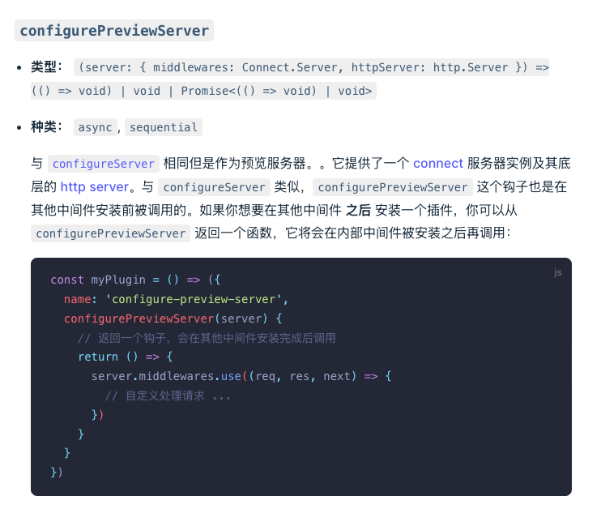
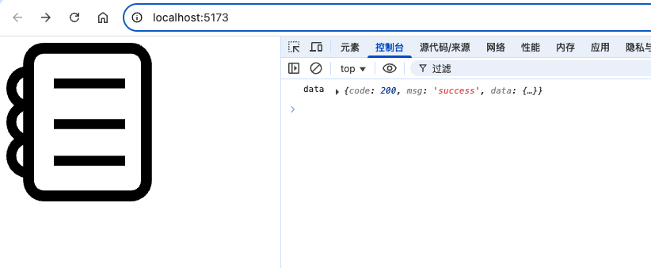

查看官网，有一个钩子



## 1. 新建 plugins/VitePluginMock.js 文件

```
const fs = require('fs')
const path = require('path')
module.exports = function () {
  // 做的最主要的就是拦截 http 请求
  // 当我们使用fetch 或者 axios去请求时候会经过这个中间件
  return {
    name: 'vite-plugin-mock',
    configureServer(server) {
      // 返回一个钩子，会在其他中间件安装完成后调用
      return () => {
        const mockStat = fs.statSync("mock")
        const isDirectory = mockStat.isDirectory()
        let mockResult = []
        if (isDirectory) {
          // process.cwd() 获取当前工作目录
          mockResult = require(path.resolve(process.cwd(), "mock/index.js"))
        }
        server.middlewares.use((req, res, next) => {
          // 看我们的请求地址在 mockResult 中是否存在
          const matchItem = mockResult.find(item => item.url === req.url && item.method === req.method)
          if (matchItem) {
            // 如果存在，则返回 mock 数据
            const responseData = matchItem.response(req)
            // 强制设置一下它的请求头的格式为json
            res.setHeader('Content-Type', 'application/json')
            res.end(JSON.stringify(responseData))// 设置请求头是异步的
          } else {
            next()
          }
        })
      }
    }
  }
}
```

## 2. 修改 vite.base.config.js 文件，引入插件

```
import {defineConfig} from 'vite'
import VitePluginMock from "../plugins/VitePluginMock";

const postcssPresetEnv = require('postcss-preset-env')
export default defineConfig({
  plugins: [
    VitePluginMock()
  ]
})
```

## 3. 重新运行终端，查看浏览器中的效果

一切正常

