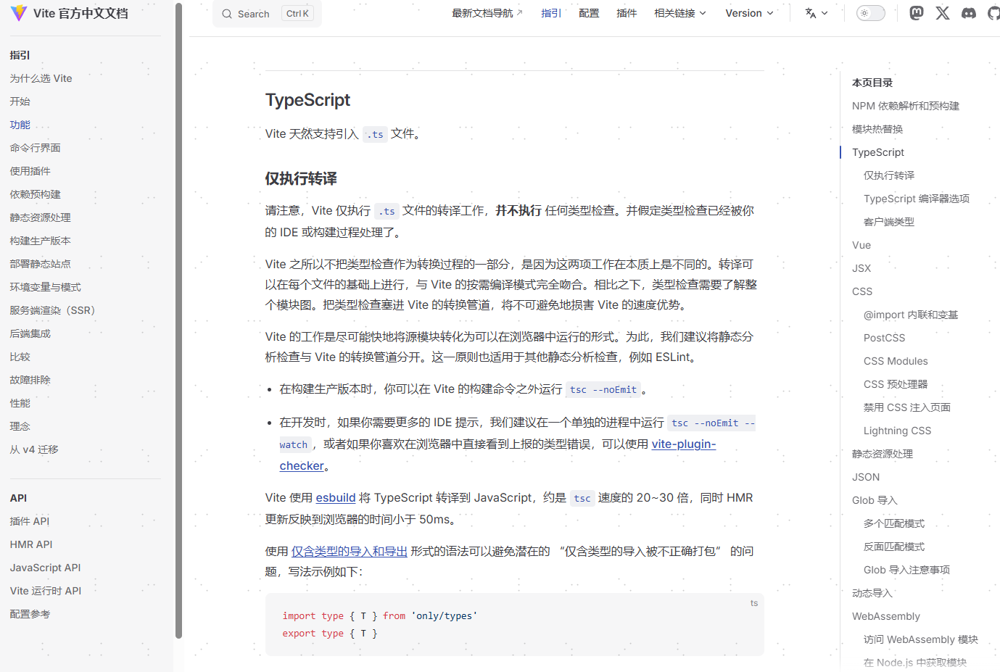
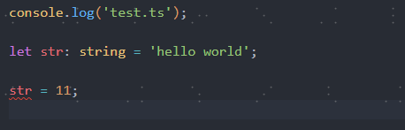
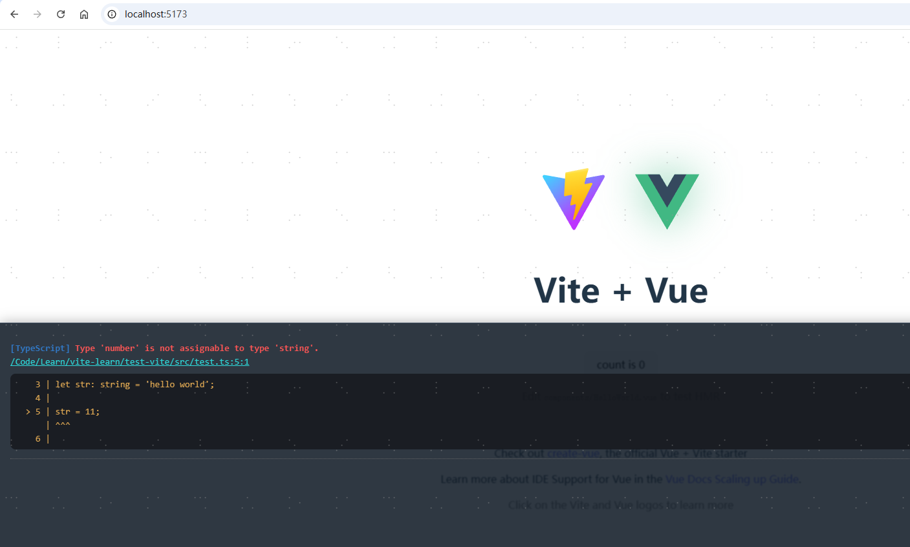
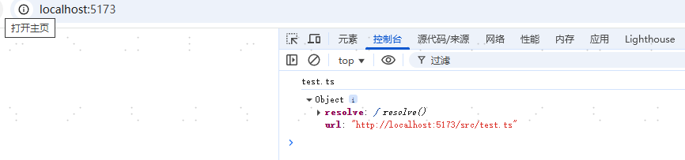
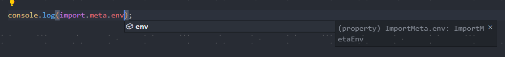

ts 就是一个类型检查工具，可以帮我们检查可能存在的一些隐形问题，同时也可以给我们一些语法提示

## 1. Vite 天然支持引入 `.ts` 文件

**不过仅支持转译工作，不执行任何类型检查**



## 2. 那么在企业级应用中怎么进行 TS 配置以及 TS 约束

新建 src/test.ts

```javascript
console.log('test.ts');

let str: string = 'hello world';

str = 11;
```

main.js 中引入 test.ts

```javascript
import './test';
```

运行后可以看到波浪线，报错信息，但是浏览器中可以正常运行，但是实际应用中这样去改变类型，很可能会造成一系列问题，**那么在企业级应用中如何检测到错误后显示在控制台呢？？？**




### 2.1. vite-plugin-checker

这里用到一个插件 vite-plugin-checker

```bash
npm install vite-plugin-checker typescript --save-dev
// 使用  vite-plugin-checker 检查 ts时候需要安装 typescript 库
```

另外还需要在根目录下创建一个 tsconfig.json 文件 (这里我们先不写任何配置)

```json
{
  
}
```

修改 vite.cong.js 引入插件

```javascript
import { defineConfig } from 'vite';
import vitePluginChecker from 'vite-plugin-checker';

export default defineConfig({
  plugins: [
    vitePluginChecker({
      typescript: true,
    }),
  ],
});
```

重新运行终端命令，可以看到终端中和浏览器中都有报错提示，并且不解决不能继续开发


  



### 2.2. TS 配置

上面用到了 tsconfig.json 文件进行配置 ts

tsconfig.json 配置

```
{
  "compilerOptions": {
    "skipLibCheck": true // 是否跳过 node_modules中的文件的编译
  }
}
```

### 2.3. TS 约束

目前开发时候可以进行报错提示，但是打包时候仍然可以正常打包，

那么怎么可以约束：在 ts 检查未通过时候，不能进行打包（目前新版 vite 已经支持了）

可以修改打包命令 `package.json`

```
{
  "scrirpt" : {
    "build: "tsc --noEmit && vite build"
  }
}
```

我们创建一个环境变量文件 `.env` 文件

```
VITE_PROXY_TARGET=http://www.baidu.com
```

那么我们在代码中如何使用呢？修改 test.ts 中

```
console.log(import.meta);
```

可以看到如下错误


对于 ts --module 默认的不支持，我们需要修改 tsconfig.json 文件

```
{
  "compilerOptions": {
    "skipLibCheck": true,
    "module": "ESNext"
  }
}
```

然后重新运行终端，就可以在浏览器中正常打开显示了（结果如下）



但是使用 `import.meta.env` 还是会报错


这里就用到一个三斜线指令

在 src 目录下创建`vite-env.d.ts`文件 内容如下，这样就可以看到文件正常运行了

```
/// <reference types="vite/client" />
```

也可以给出一些属性提示


但是没有我们配置的 env 文件中的变量，该怎么办呢？？

继续修改 vite-end.d.ts 文件

通过如下可以看到一个类型 ImportMetaEnv



针对这个类型 ImportMetaEnv 可以进行增加变量的一个声明（只读的，类型为字符串）

```
/// <reference types="vite/client" />

interface ImportMetaEnv {
  readonly VITE_PROXY_TARGETL: string;
}
```

这样就可以进行一个自定义环境变量的属性提示了

