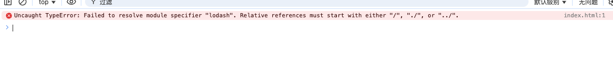
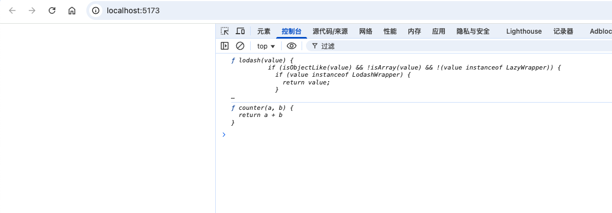

开箱即用：out of box: 你不要做任何额外的配置就可以使用 vite 来帮你处理构建工作

## 1. 新建文件夹 test-vite

1. 新建 index.html

```html
<!doctype html>
<html lang="en">
<head>
  <meta charset="UTF-8">
  <meta name="viewport"
        content="width=device-width, user-scalable=no, initial-scale=1.0, maximum-scale=1.0, minimum-scale=1.0">
  <meta http-equiv="X-UA-Compatible" content="ie=edge">
  <title>Document</title>
</head>
<body>

</body>
<script src="./main.js" type="module"></script>
</html>
```

## 2. 新建 counter.js

```js
export function counter(a, b) {
	return a + b
}
```

## 3. 新建 main.js

```js
import {counter} from "./counter.js"

console.log(counter)
```

## 4. 运行终端命令

```bash
pnpm init
pnpm add lodash --save-dev
```

## 5. 修改 counter.js

```js
// 增加如下代码
import _ from "lodash"
console.log(_)
```

## 6. 这时候如果重新刷新运行 index.html 就会发现浏览器报了一个错误



内容如下

```js
Uncaught TypeError: Failed to resolve module specifier "lodash". Relative references must start with either "/", "./", or "../".
```

因为在默认情况下，我们的 es module 去导入资源的时候，要么是绝对路径，要么是相对路径（否则浏览器不认识）

## 7. 这就有一个问题产生了？？？

既然我们现在的最佳实践就是 node_modules, 那么为什么 ES 官方在我们导入非绝对路径和非相对路径的资源的时候，不默认帮我们搜寻 node_modules 呢？？？？

假如浏览器做了这件事呢？？

浏览器加载 main.js 时候，发现有依赖 counter.js 那就会去加载 counter.js，然后发现 counter.js 中有引入 lodash，如果支持了这件事，那么发现 lodash 中也有引用其他的资源，那么就会继续进行加载，同时如果相应的有导入其他的资源，就会持续的加载，这样就比较消耗网络资源

- 为什么 commonjs 就可以呢？

因为 commonjs 是运行在服务端的，服务端本身查找 node_modules 不是通过网络请求去查找的，而是直接读取本地文件的

## 8. 开始安装 vite

```bash
pnpm add vite -D
```

vite: 就是用来做代码处理的

## 9. 修改 package.json 文件，增加脚本

```json
{
	"scripts": {
    "dev": "vite"
  }
}
```

## 10. 运行脚本 `pnpm run dev`

运行之后，可以在控制台中看到如下结果

