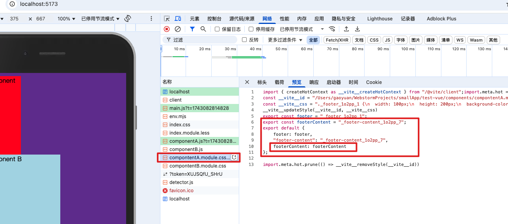
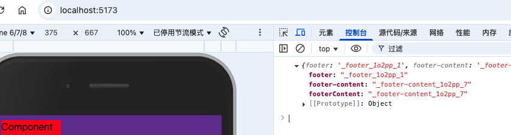
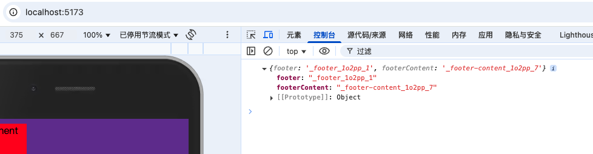
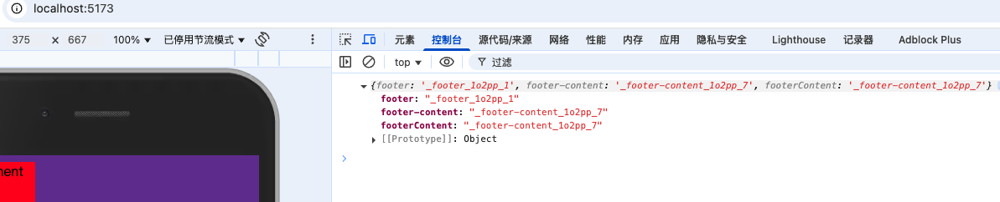
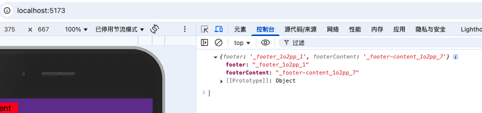
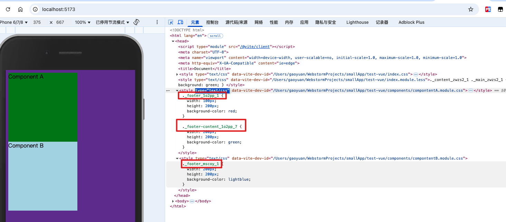
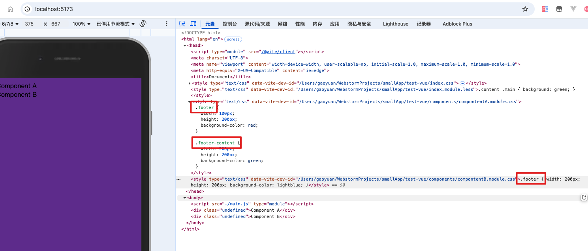
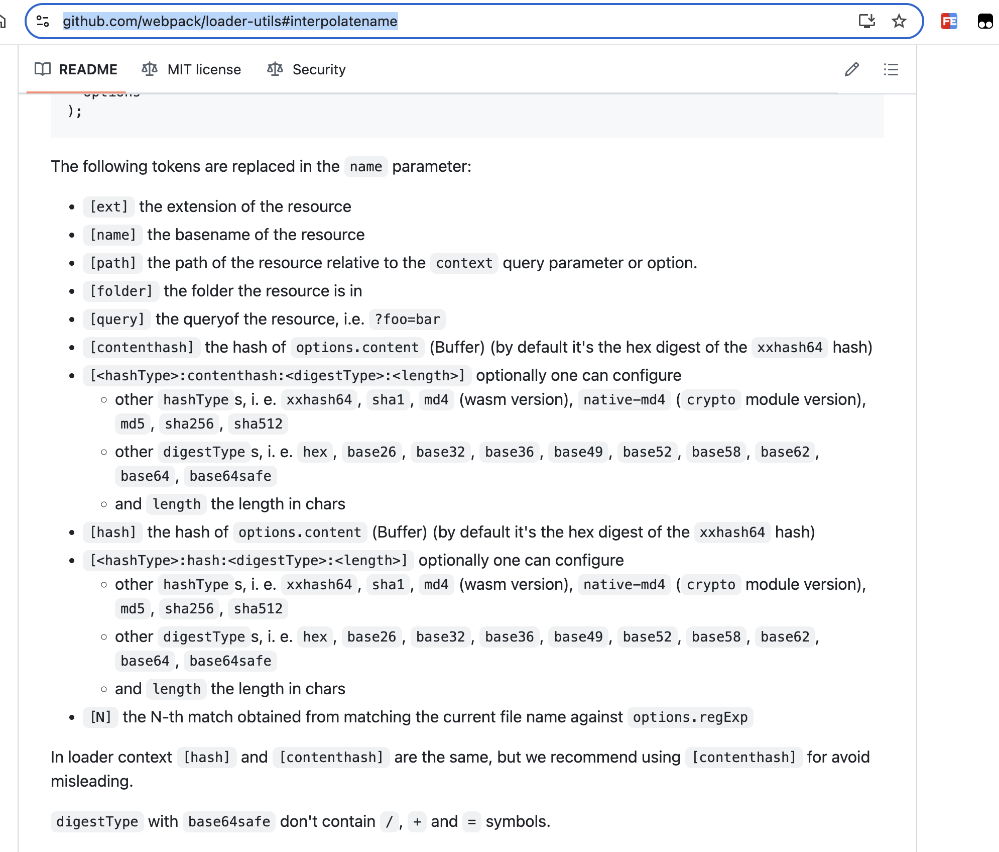
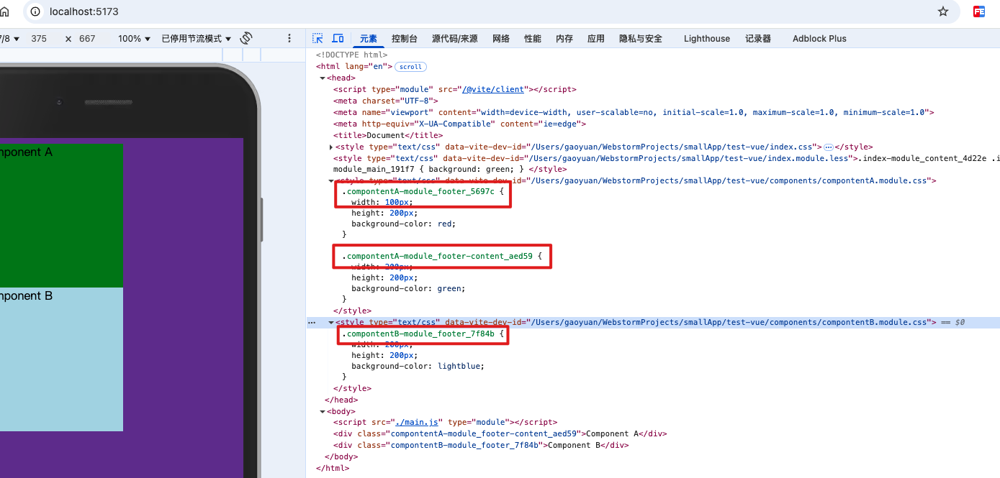
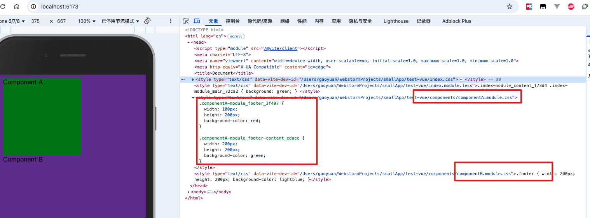

[https://vitejs.cn/vite3-cn/config/shared-options.html#css-modules](https://vitejs.cn/vite3-cn/config/shared-options.html#css-modules)

官网配置如下

```typescript
interface CSSModulesOptions {
  getJSON?: (
    cssFileName: string,
    json: Record<string, string>,
    outputFileName: string,
  ) => void
  scopeBehaviour?: 'global' | 'local'
  globalModulePaths?: RegExp[]
  exportGlobals?: boolean
  generateScopedName?:
    | string
    | ((name: string, filename: string, css: string) => string)
  hashPrefix?: string
  /**
   * default: undefined
   */
  localsConvention?:
    | 'camelCase'
    | 'camelCaseOnly'
    | 'dashes'
    | 'dashesOnly'
    | ((
        originalClassName: string,
        generatedClassName: string,
        inputFile: string,
      ) => string)
}
```

## 1. 可配置字段说明

在 vite.config.js 中我们通过 css 属性去控制整个 vite 对于 css 的处理行为

- `localConvention`: 修改生成的配置对象的key的展示形式(驼峰还是中划线形式)
- `scopeBehaviour`: 配置当前的模块化行为是模块化还是全局化 (有hash就是开启了模块化的一个标志, 因为他可以保证产生不同的hash值来控制我们的样式类名不被覆盖)
- `generateScopedName`: '[name]_[local]_[hash:5]', 也还支持函数，如下

 ```
 generateScopedName: (name, filename, css) => {
  // name -> 代表的是你此刻css文件中的类名
  // filename -> 是你当前css文件的绝对路径
  // css -> 给的就是你当前样式
  console.log('name', name, 'filename', filename, 'css', css) 
  // 这一行会输出在哪？？？ 输出在node
  // 配置成函数以后, 返回值就决定了他最终显示的类型
  return `${name}_${Math.random().toString(36).substr(3, 8)}`
},
 ```

- `hashPrefix`: "hello",

- 生成hash会根据类名 + 一些其他的字符串(文件名 + 他内部随机生成一个字符串)去进行生成, 如果想要生成hash更加的独特一点, 可以配置 hashPrefix , 配置的这个字符串会参与到最终的hash生成, （hash: 只要字符串有一个字不一样, 那么生成的hash就完全不一样, 但是只要字符串完全一样, 生成的hash就会一样）

- `globalModulePaths`: ["./componentB.module.css"],

- 代表不想参与到css模块化的路径

## 2. localConvention：

修改 `compontentA.module.css`内容如下

```
.footer {
  width: 100px;
  height: 200px;
  background-color: red;
}
// 我们新建类名时候，一般都会使用下划线，很少使用驼峰 footerContent
.footer-content {
  width: 200px;
  height: 200px;
  background-color: green;
}
```

### 2.1. camelCase：**驼峰命名法**

设置为这个值后，我们查看控制台中的请求内容，

发现这里导出的时候多了一个 footerContent



我们修改 `componentA.js`内容如下

```
import style from "./compontentA.module.css"

// 增加如下代码
console.log(style)
```

运行后，可以看到如下结果



### 2.2. camelCaseOnly（默认值）

改为这个后，可以看到控制台中的打印结果如下

只保留了驼峰命名式的类名



这样，我们修改 `componentA.js`内容如下

```
import style from "./compontentA.module.css"

console.log(style)

const div = document.createElement("div")
// 修改 className 为驼峰命名类名
div.className = style.footerContent
div.innerHTML = "Component A"

document.body.appendChild(div)
```

### 2.3. dashes：**短横线命名法**

同样的，修改为此值后，控制台打印结果如下



### 2.4. dashesOnly

同样的，修改为此值后，控制台打印结果如下



### 2.5. 函数自定义

  

## 3. scopeBehaviour

### 3.1. local

默认是 local，代表局部，代表会产生 hash 值，产生作用域问题



### 3.2. global

修改为 global 后，我们查看元素中的类名，发现 hash 值不见了，类名会被覆盖



## 4. generateScopedName

[https://github.com/webpack/loader-utils#interpolatename](https://github.com/webpack/loader-utils#interpolatename)



未设置时可以看到目前生成的类名，为一个类 + 一串 hash 值，我们也可以通过自定义来实现

比如说设置为

```
generateScopedName:  '[name]_[local]_[hash:5]',
```

生成的结果如下



当然，还是可以支持函数的

```
generateScopedName: (name, filename, css) => {
  // name -> 代表的是你此刻css文件中的类名
  // filename -> 是你当前css文件的绝对路径
  // css -> 给的就是你当前样式
  console.log('name', name, 'filename', filename, 'css', css) 
  // 这一行会输出在哪？？？ 输出在node
  // 配置成函数以后, 返回值就决定了他最终显示的类型
  return `${name}_${Math.random().toString(36).substr(3, 8)}`
},
```

## 5. `hashPrefix`

配置为如下的，一个效果是什么样的

```
hashPrefix: "hello",
```

## 6. globalModulePaths: 代表不想参与到css模块化的路径

```
 globalModulePaths: ["../components/componentB.module.css"],
```

再次查看控制台中的 css 内容



模块 b.module.css 并没有参与模块化处理，而其余的参与了