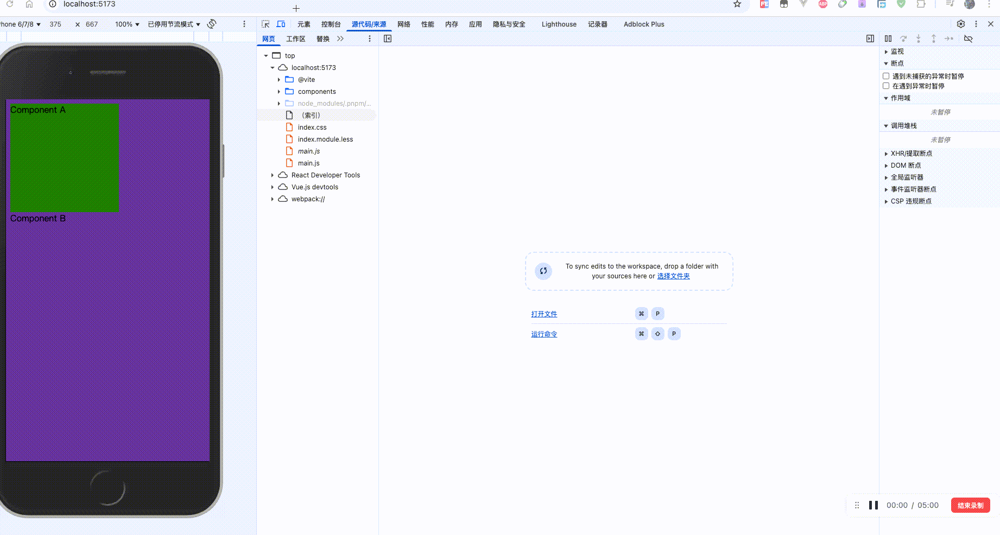
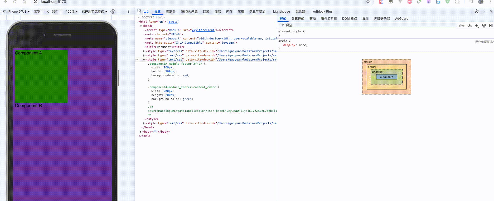

## 1. preprocessorOptions

主要用来配置 CSS 预处理的一些全局参数

```
import {defineConfig} from 'vite'

export default defineConfig({
  css: {
    modules: {},
    preprocessorOptions: {
      // key 代表预处理的名
      // 预处理器配置
      // key  + config
      less: {
        // 整个的配置都会最终给到less的指向参数（全局参数）中去
      },
      scss: {
        
      }
    }
  }
})
```

假设没有使用构建工具，但是又想使用 less 文件的话

```
npm install less 
```

你安装了 less，就可以使用 less 来编译 less 文件了

```
npx less xxx.less
```

less 也支持一些命令行参数 ，具体如下地址

[https://less.bootcss.com/usage/#lessjs-options](https://less.bootcss.com/usage/#lessjs-options)

## 2. sourceMap

文件之间的索引，假设我们的代码被压缩或者被编译了，这个时候假设程序报错，就不会出现正确的错误位置信息

如果设置了 sourcemap，他就会有一个索引文件

```
import {defineConfig} from 'vite'

export default defineConfig({
  css: {
    devSourcemap: false
  }
})
```

### 2.1. devSourcemap: false

我们可以看到如下，点击元素属性时候，并找不到开发文件，只会调到已经编译后的文件中



### 2.2. devSourcemap: true

我们可以看到如下，点击元素属性时候, 会跳到编译前的开发文件中去



### 2.3. 为什么 sourcemap 可以实现跳转源文件

可以看到开启 sorucemap 后 ，在 js 文件末尾添加了一行 sourceMap 的一个 json 文件

