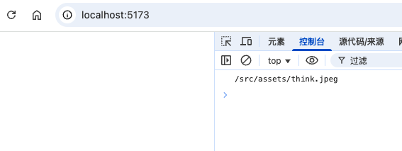
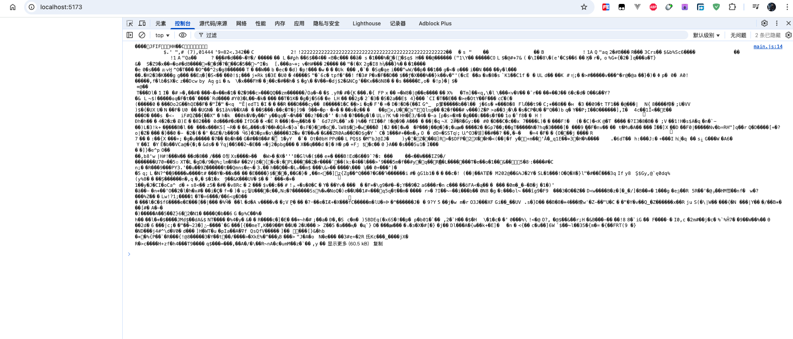
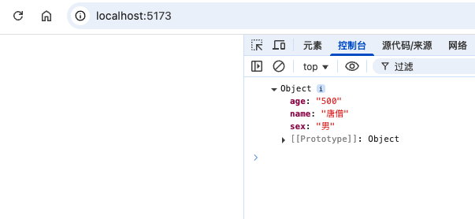
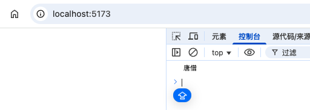

## 1. 什么是静态资源

- 在前端也就是客户端，一般认为静态资源是指图片、视频、音频等
- 在服务端，除了动态 API 外，百分之九十九的资源都可以任务是静态资源

vite 对静态资源基本上是开箱即用的，除了一些特殊情况（比如 svg）

## 2. 加载图片

### 2.1. 普通加载

找一个图片（这里比如 think.png），放在 test-vue/src/assets 文件夹下

修改 main.js 中的内容，引入这张图片，然后添加到页面中

```

import thinkPng from "./src/assets/think.jpeg"

const img = document.createElement("img")
img.src = thinkPng
document.body.appendChild(img)
```

运行后结果如下


### 2.2. 添加后缀 url

```

import thinkPng from "./src/assets/think.jpeg?url"
console.log(thinkPng)
```

运行终端后，结果如下



可以看到打印的时路径，默认值就是 url

### 2.3. 添加后缀 raw

```
import thinkPng from "./src/assets/think.jpeg?raw"

console.log(thinkPng)
```

运行终端，打印结果如下



这是一个 buffer

## 3. 加载 json 文件

在 assets 文件夹下，新建 index.json 文件，内容如下

```
{
  "name": "唐僧",
  "age": "500",
  "sex": "男"
}
```

修改 main.js 如下

```
import indexJson from "./src/assets/index.json"

console.log(indexJson)
```

运行终端后，结果如下



其实这里如果你用的不是 vite，在其他的一些构建工具里面，json 文件的导入会作为一个 json 字符串导出（打印结果其实就是 JSON.stringify(上述的结果)）

其实对于 vite，这里导入 json 还支持按需加载

```
import {name} from "./src/assets/index.json"

console.log(name)
```

打印结果如下



这样的好处就是支持 tree shaking 进行优化

优化一定就是可以使用 tree shaking 来进行缩小项目大小

## 4. 配置别名

修改 vite.base.config.js 添加如下代码

```
export default defineConfig({
  resolve: {
    alias: {
      "@": "./src",
      "@assets": "./src/assets"
    }
  },
}
```

这样如果我们的文件路径太深，或者日常开发组件中引入 src 目录下的静态资源资源时就可以使用别名

```
import thinkPng from "@assets/think.jpeg"

// console.log(thinkPng)

const img = document.createElement("img")
img.src = thinkPng
document.body.appendChild(img)
```

重新运行终端后，发现页面还是可以正常显示的

