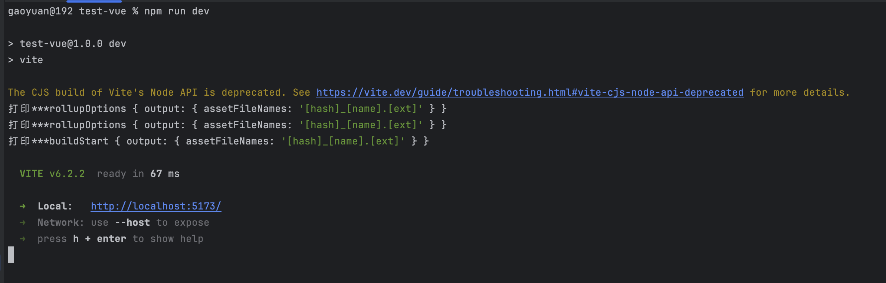

## 1. vite 常用钩子

```javascript
import { defineConfig } from 'vite'

export default defineConfig({
  build: {
    rollupOptions: {
      output: {
        assetFileNames: '[hash]_[name].[ext]'
      }
    }
  },
  plugins: [
    // vite 特殊的钩子
    {
      config(options) {
        // console.log('打印***config', options)
        return {
          mode: 'production'
        }
      },
      configureServer(server) {
        server.middlewares.use((req, res, next) => {
          next()
        })
      },
      transformIndexHtml: {
        enforce: 'pre',
        transform: html => {}
      },
      buildStart(fullRollupOptions) {
        console.log('打印***buildStart', fullRollupOptions)
      },
      // 整个流程解析完成后再执行的钩子,最后的配置文件
      configResolved(options) {
        // console.log('打印***options', options)
      },
      // 使用npx vite preivew 进行生产包预览
      configurePreviewServer(server) {
        // console.log('打印***server', server)
      },
      // 通用的钩子
      options(rollupOptions) {
        console.log('打印***rollupOptions', rollupOptions)
      }
    }
  ]
})
```

## 2. 运行后的执行顺序

npm run dev 执行后顺序



## 3. vite的热更新

读取配置文件———> 直接调用 `plugin` ———> 与 `default.config` 进行合并 ———> 生成最终的配置 ————> 不同生命周期调用. ————> 如果请求 `html` ————> `transfermerHtmlPlugin` 进行转换 ————> 添加一个 `cache.html`