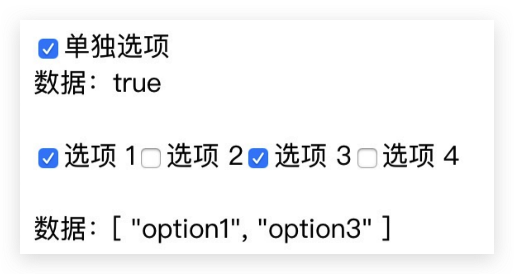

# 实战 2：组合多选框组件——CheckboxGroup & Checkbox

在第 5 节，我们完成了具有数据校验功能的组件 Form，本小节继续开发一个新的组件——组合多选框 Checkbox。它作为基础组件，也能集成在 Form 内并应用其验证规则。

## Checkbox 组件概览

多选框组件也是由两个组件组成：CheckboxGroup 和 Checkbox。单独使用时，只需要一个 Checkbox，组合使用时，两者都要用到。效果如下图所示：




单独使用，常见的场景有注册时勾选以同意注册条款，它只有一个独立的 Checkbox 组件，并且绑定一个布尔值，示例如下：

```html
<template>
  <i-checkbox v-model="single">单独选项</i-checkbox>
</template>
<script>
  export default {
    data () {
      return {
        single: false
      }
    }
  }
</script>
```

而组合使用的场景就很多了，填写表单时会经常用到，它的结构如下：

```html
<template>
  <i-checkbox-group v-model="multiple">
    <i-checkbox label="option1">选项 1</i-checkbox>
    <i-checkbox label="option2">选项 2</i-checkbox>
    <i-checkbox label="option3">选项 3</i-checkbox>
    <i-checkbox label="option4">选项 4</i-checkbox>
  </i-checkbox-group>
</template>
<script>
  export default {
    data () {
      return {
        multiple: ['option1', 'option3']
      }
    }
  }
</script>
```

`v-model` 用在了 CheckboxGroup 上，绑定的值为一个数组，数组的值就是内部 Checkbox 绑定的 label。

用法看起来比 Form 要简单多，不过也有两个个技术难点：

- Checkbox 要同时支持单独使用和组合使用的场景；
- CheckboxGroup 和 Checkbox 内可能嵌套其它的布局组件。

对于第一点，要在 Checkbox 初始化时判断是否父级有 CheckboxGroup，如果有就是组合使用的，否则就是单独使用。而第二点，正好可以用上一节的通信方法，很容易就能解决。

两个组件并行开发，会容易理不清逻辑，不妨我们先开发独立的 Checkbox 组件。

## 单独使用的 Checkbox 

设计一个组件时，还是要从它的 3 个 API 入手：prop、event、slot。

因为要在 Checkbox 组件上直接使用 `v-model` 来双向绑定数据，那必不可少的一个 prop 就是 `value`，还有 event `input`，因为 v-model 本质上是一个语法糖（如果你还不清楚这种用法，可以阅读最后的扩展阅读 1）。

理论上，我们只需要给 `value` 设置为布尔值即可，也就是 true / false，不过为了扩展性，我们再定义两个 props：`trueValue` 和 `falseValue`，它们允许用户指定 `value` 用什么值来判断是否选中。因为实际开发中，数据库中并不直接保存 true / false，而是 1 / 0 或其它字符串，如果强制使用 Boolean，使用者就要再额外转换一次，这样的 API 设计不太友好。

除此之外，还需要一个 `disabled` 属性来表示是否禁用。

自定义事件 events 上文已经说了一个 `input`，用于实现 v-model 语法糖；另一个就是 `on-change`，当选中 / 取消选中时触发，用于通知父级状态发生了变化。

slot 使用默认的就好，显示辅助文本。

理清楚了 API，先来写一个基础的 `v-model` 功能，这在大部分组件中都类似。

在 `src/components` 下新建目录 `checkbox`，并新建两个文件 `checkbox.vue` 和 `checkbox-group.vue`。我们先来看 Checkbox：

```html
<!-- checkbox.vue -->
<template>
  <label>
    <span>
      <input
             type="checkbox"
             :disabled="disabled"
             :checked="currentValue"
             @change="change">
    </span>
    <slot></slot>
  </label>
</template>
<script>
  export default {
    name: 'iCheckbox',
    props: {
      disabled: {
        type: Boolean,
        default: false
      },
      value: {
        type: [String, Number, Boolean],
        default: false
      },
      trueValue: {
        type: [String, Number, Boolean],
        default: true
      },
      falseValue: {
        type: [String, Number, Boolean],
        default: false
      }
    },
    data () {
      return {
        currentValue: this.value
      };
    },
    methods: {
      change (event) {
        if (this.disabled) {
          return false;
        }

        const checked = event.target.checked;
        this.currentValue = checked;

        const value = checked ? this.trueValue : this.falseValue;
        this.$emit('input', value);
        this.$emit('on-change', value);
      }
    }
  }
</script>
```

因为 `value` 被定义为 prop，它只能由父级修改，本身是不能修改的，在 `<input>` 触发 change 事件，也就是点击选择时，不能由 Checkbox 来修改这个 value，所以我们在 data 里定义了一个 `currentValue`，并把它绑定在 `<input :checked="currentValue">`，这样就可以在 Checkbox 内修改 `currentValue`。这是自定义组件使用 `v-model` 的“惯用伎俩”。

代码看起来都很简单，但有三个细节需要额外说明：

1. 选中的控件，直接使用了 `<input type="checkbox">`，而没有用 div + css 来自己实现选择的逻辑和样式，这样的好处是，使用 input 元素，你的自定义组件仍然为 html 内置的基础组件，可以使用浏览器默认的行为和快捷键，也就是说，浏览器知道这是一个选择框，而换成 div + css，浏览器可不知道这是个什么鬼。如果你觉得原生的 input 丑，没关系，是可以用 css 美化的，不过这不是本小册的重点，在此就不介绍了。
2. `<input>`、`<slot>` 都是包裹在一个 `<label>` 元素内的，这样做的好处是，当点击 `<slot>` 里的文字时，`<input>` 选框也会被触发，否则只有点击那个小框才会触发，那样不太容易选中，影响用户体验。
3. `currentValue` 仍然是布尔值（true / false），因为它是组件 Checkbox 自己使用的，对于使用者无需关心，而 value 可以是 String、Number 或 Boolean，这取决于 `trueValue` 和 `falseValue` 的定义。

现在实现的 `v-model`，只是由内而外的，也就是说，通过点击 `<input> `选择，会通知到使用者，而使用者手动修改了 prop `value` ，Checkbox 是没有做响应的，那继续补充代码：

```html
<!-- checkbox.vue，部分代码省略 -->
<script>
  export default {
    watch: {
      value (val) {
        if (val === this.trueValue || val === this.falseValue) {
          this.updateModel();
        } else {
          throw 'Value should be trueValue or falseValue.';
        }
      }
    },
    methods: {
      updateModel () {
        this.currentValue = this.value === this.trueValue;
      }
    }
  }
</script>
```

我们对 prop `value` 使用 watch 进行了监听，当父级修改它时，会调用 `updateModel` 方法，同步修改内部的 `currentValue` 。不过，不是所有的值父级都能修改的，所以用 if 条件判断了父级修改的值是否符合 trueValue / falseValue 所设置的，否则会抛错。

Checkbox 也是一个基础的表单类组件，它完全可以集成到 Form 里，所以，我们使用 Emitter 在 change 事件触发时，向 Form 派发一个事件，这样你就可以用第 5 节的 Form 组件来做数据校验了：

```html
<!-- checkbox.vue，部分代码省略 -->
<script>
  import Emitter from '../../mixins/emitter.js';

  export default {
    mixins: [ Emitter ],
    methods: {
      change (event) {
        // ... 
        this.$emit('input', value);
        this.$emit('on-change', value);
        this.dispatch('iFormItem', 'on-form-change', value);
      }
    },
  }
</script>
```

至此，Checkbox 已经可以单独使用了，并支持 Form 的数据校验。下面来看组合使用。

### 组合使用的 CheckboxGroup

> 友情提示：请先阅读 Vue.js 文档的 [https://cn.vuejs.org/v2/guide/forms.html#复选框](https://cn.vuejs.org/v2/guide/forms.html#复选框) 内容。

CheckboxGroup 的 API 很简单：

- props：`value`，与 Checkbox 的类似，用于 v-model 双向绑定数据，格式为数组；
- events：`on-change`，同 Checkbox；
- slots：默认，用于放置 Checkbox。

如果写了 CheckboxGroup，那就代表你要组合使用多选框，而非单独使用，两种模式，只能用其一，而判断的依据，就是是否用了 CheckboxGroup 组件。所以在 Checkbox 组件内，我们用上一节的 `findComponentUpward` 方法判断父组件是否有 `CheckboxGroup`：

```html
<!-- checkbox.vue，部分代码省略 -->
<template>
  <label>
    <span>
      <input
             v-if="group"
             type="checkbox"
             :disabled="disabled"
             :value="label"
             v-model="model"
             @change="change">
      <input
             v-else
             type="checkbox"
             :disabled="disabled"
             :checked="currentValue"
             @change="change">
    </span>
    <slot></slot>
  </label>
</template>
<script>
  import { findComponentUpward } from '../../utils/assist.js';

  export default {
    name: 'iCheckbox',
    props: {
      label: {
        type: [String, Number, Boolean]
      }
    },
    data () {
      return {
        model: [],
        group: false,
        parent: null
      };
    },
    mounted () {
      this.parent = findComponentUpward(this, 'iCheckboxGroup');

      if (this.parent) {
        this.group = true;
      }

      if (this.group) {
        this.parent.updateModel(true);
      } else {
        this.updateModel();
      }
    },
  }
</script>
```

在 mounted 时，通过 findComponentUpward 方法，来判断父级是否有 CheckboxGroup 组件，如果有，就将 `group` 置为 true，并触发 CheckboxGroup 的 `updateModel` 方法，下文会介绍它的作用。

在 template 里，我们又写了一个 `<input>` 来区分是否是 group 模式。Checkbox 的 data 里新增加的 `model` 数据，其实就是父级 CheckboxGroup 的 `value`，会在下文的 `updateModel` 方法里给 Checkbox 赋值。

Checkbox 新增的 prop： `label` 只会在组合使用时有效，结合 `model` 来使用，用法已在 Vue.js 文档中介绍了 [https://cn.vuejs.org/v2/guide/forms.html#复选框](https://cn.vuejs.org/v2/guide/forms.html#复选框)。

在组合模式下，Checkbox 选中，就不用对 Form 派发事件了，应该在 CheckboxGroup 中派发，所以对 Checkbox 做最后的修改：

```html
<!-- checkbox.vue，部分代码省略 -->
<script>
  export default {
    methods: {
      change (event) {
        if (this.disabled) {
          return false;
        }

        const checked = event.target.checked;
        this.currentValue = checked;

        const value = checked ? this.trueValue : this.falseValue;
        this.$emit('input', value);

        if (this.group) {
          this.parent.change(this.model);
        } else {
          this.$emit('on-change', value);
          this.dispatch('iFormItem', 'on-form-change', value);
        }
      },
      updateModel () {
        this.currentValue = this.value === this.trueValue;
      },
    },
  }
</script>
```

剩余的工作，就是完成 checkbox-gourp.vue 文件：

```html
<!-- checkbox-group.vue -->
<template>
  <div>
    <slot></slot>
  </div>
</template>
<script>
  import { findComponentsDownward } from '../../utils/assist.js';
  import Emitter from '../../mixins/emitter.js';

  export default {
    name: 'iCheckboxGroup',
    mixins: [ Emitter ],
    props: {
      value: {
        type: Array,
        default () {
          return [];
        }
      }
    },
    data () {
      return {
        currentValue: this.value,
        childrens: []
      };
    },
    methods: {
      updateModel (update) {
        this.childrens = findComponentsDownward(this, 'iCheckbox');
        if (this.childrens) {
          const { value } = this;
          this.childrens.forEach(child => {
            child.model = value;

            if (update) {
              child.currentValue = value.indexOf(child.label) >= 0;
              child.group = true;
            }
          });
        }
      },
      change (data) {
        this.currentValue = data;
        this.$emit('input', data);
        this.$emit('on-change', data);
        this.dispatch('iFormItem', 'on-form-change', data);
      }
    },
    mounted () {
      this.updateModel(true);
    },
    watch: {
      value () {
        this.updateModel(true);
      }
    }
  };
</script>

```

代码很容易理解，需要介绍的就是 `updateModel` 方法。可以看到，一共有 3 个地方调用了 `updateModel`，其中两个是 CheckboxGroup 的 mounted 初始化和 watch 监听的 value 变化时调用；另一个是在 Checkbox 里的 mounted 初始化时调用。这个方法的作用就是在 CheckboxGroup 里通过 `findComponentsDownward` 方法找到所有的 Checkbox，然后把 CheckboxGroup 的 `value`，赋值给 Checkbox 的 `model`，并根据 Checkbox 的 `label`，设置一次当前 Checkbox 的选中状态。这样无论是由内而外选择，或由外向内修改数据，都是双向绑定的，而且支持动态增加 Checkbox 的数量。

以上就是组合多选组件——CheckboxGroup & Checkbox 的全部内容，不知道你是否 get 到了呢！

留两个小作业：

1. 将 CheckboxGroup 和 Checkbox 组件集成在 Form 里完成一个数据校验的示例；
2. 参考本节的代码，实现一个单选组件 Radio 和 RadioGroup。

## 结语

你看到的简单组件，其实都不简单。

## 扩展阅读

- [v-model 指令在组件中怎么玩](https://juejin.im/post/598bf7a3f265da3e252a1d6a)

注：本节部分代码参考 [iView](https://github.com/iview/iview/tree/2.0/src/components/checkbox)。