# 21-display：contents 改变 Flexbox 和 Grid 布局模式

在 CSS 中，`display` 属性是一个非常重要的基础属性，也正因为它重要， W3C 以一个独立的模块在维护它。不过，对于很多 Web 开发者来说，只知道 `display` 可以设置类似 `block` 、`inline` 、`inline-block` 、`flex` 、`inline-flex` 、`grid` 和 `inline-grid` 等值，却不知道它也可以取 `contents` 值。

更为重要的一点是，在制定 `subgrid` （子网格）相关的规范时，社区中不少开发者建议使用 `display: contents` 来替代 `subgrid` ，也有不少关于 `display: content` 和 `subgrid` 的争论。那么，`display: contents` 是什么？它又将对 CSS Flexbox 和 Grid 布局带来哪些变化呢？你可以在接下来的内容中找到答案。

## display 给文档流带来的变化

CSS 的 `display` 属性是 W3C CSS 规范中的一个独立模块，[在该模块的 Level 3 版本中](https://www.w3.org/TR/css-display-3/#box-generation)，它新增了一些属性值，其中就有 `contents` 值。在具体解释 `display: contents` 是什么之前，我们有必要花点时间了解一下 `display` 属性会给文档流带来什么样的变化。

从 CSS 盒模型中可以知道，文档树中的每个元素都是一个矩形框（盒子）。广义上讲，这个“矩形框”由两部分组成。首先，我们有实际的盒子，由 `border`、`padding` 和 `margin` 区域组成；其次，我们有盒子的内容，即内容区域：


默认情况之下，浏览器解析任何一个文档时，将会按下图方式来渲染文档流：

- **垂直流** ，也称为块流，一般就是块元素默认流向，在不改变书写模式下，它一般由上往下垂直排列；
- **水平流** ，也称为内联流，一般就是文档所用语言的书写方式或阅读方式的流向。

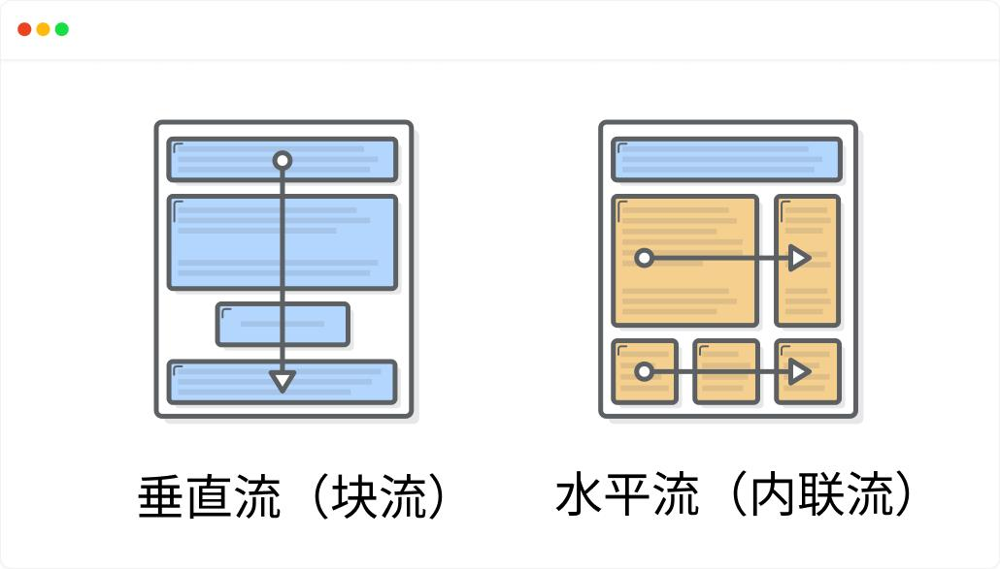

我们可以通过 CSS 的 `display` 属性将任何一个文档流做出改变，如下图所示：

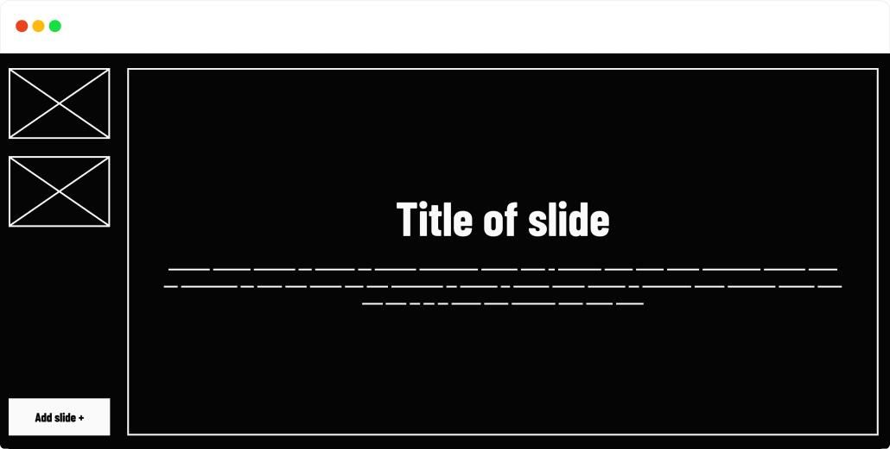

稍微对 CSS 有认识的 Web 开发者都知道，使用 CSS 的 `display` 属性可以改变元素盒子及其后代元素以不同的上下文格式（即，产生不同的视觉格式化模型）在浏览器中渲染。每个格式化上下文都拥有不同的渲染规则，而这些规则是用来决定其子元素如何定位，以及和其他元素的关系。通俗点讲，它就有点像把水倒进不同的器皿中，会有不同的形态：


具体点说，当 `display` 取值为：

- `inline` 时，会创建一个 IFC （Inline Formatting Context）；
- `block` 时，会创建一个 BFC （Block Formatting Context）；
- `grid` 或 `inline-grid` 时，会创建一个 GFC （Grid Formatting Context）；
- `flex` 或 `inline-flex` 时，会创建一个 FFC （Flexbox Formatting Context）。

注意，这里所列的是几个常见的值，`display` 还可以取值为 `list-item` 、`inline-block` 、`flow-root` 、`table` 、`table-row` 、`table-cell` 、`none` 和 `contents` 等。

不同的是，`display` 属性有两个值，**是用来控制标记中定义的元素是否产生一个盒子** ：

- **`none`** ：将导致盒子或其内容在页面上不被绘制，比如，CSS 中常用它来隐藏一个元素；
- **`contents`** ：将导致盒子的内容（`content-box`）被正常绘制，但周围的盒子（`border-box` 、`padding-box` 和 `margin-box`）被完全忽略。

有了这个基础之后，就可以先来回答 `display: contents` 是什么？

## display: contents 是什么？

[W3C 规范是这样描述 display: contents 的](https://www.w3.org/TR/css-display-3/#box-generation)：

> **显式设置** **`display`** **属性值为** **`contents`** **的元素自身不会产生任何盒子，但它的子元素和伪元素仍会产生盒子，文本运行也正常。对于盒子的生成和布局，该元素必须被视为在元素树中被其内容所取代，包括其源文件的子元素和伪元素，比如** **`::before`** **和** **`::after`** **伪元素，它们在该元素的子元素之前或之后****正常生成** 。

简单地说，**`display`** **为** **`contents` 时**，**允许你以某种方式从盒子树（Box Tree）中移除一个元素，但仍保留其内容** 。

注意，由于只有盒子树受到影响，任何基于文档树的语义，如选择器匹配、事件处理和属性继承，都不会受到影响。但它也会阻止可访问性工具（比如屏幕阅读器）访问该元素的语义。

## display: contents 会给 Flexbox 和 Grid 布局带来什么变化？

我们先抛开 `display: contents` 会给 Flexbox 和 Grid 布局带来什么变化不说，先来看看一个元素显式设置 `display:contents` 会发生什么变化？理解使用 `diplay: contents` 时会发生什么，最简单方法是 **想象元素的开始和结束标签被从标记中省略** 。严格地说，对于盒子的生成和布局，该元素必须被视为在元素树中被其内容所取代。

我们通过下面的示例来阐述可能更易于大家理解。假设我们有一个类似下面这样的 HTML 结构：

```HTML
<section> 
    我是 section 元素的文本节点（文本内容） 
    <p>我是一个 p 元素，同时是 section 元素的子元素</p> 
</section>
```

分别给 `section` 和 `p` 元素添加一点 CSS 规则：

```CSS
section { 
    border: 6px solid #f44336; 
    padding: 2rem; 
    background-image: linear-gradient(to right, #09f, #90f); 
    text-shadow: 1px 1px 0 rgb(0 0 0 / .85); 
    filter: drop-shadow(8px 8px 1px rgb(0 0 0 / .85)); 
    margin: 2rem;
    width: 50vw;
} 

p { 
    background-color:#607d8b; 
    padding: 2rem 1rem; 
    font-size: 80%; 
    color: #cddc39; 
} 
```

你将看到下图这样的效果：


`section` 元素的各种盒子样式都存在：

- `padding-box` ，元素有 `2rem` 内距（`padding`）；
- `border-box` ，元素有 `6px` 实线边框 （`border`）；
- `margin-box` ，元素有 `2rem` 外距（`margin`）。

除此之外，还设置了其他一些样式，比如 `width` （宽度）、`filter` （滤镜）、`text-shadow` （文本阴影）、`background-image` （背景图片）等。

> 注意，`section` 元素盒子宽度尺寸 `width` 与元素的 `box-sizing` 取值有关，这里显式设置了 `box-sizing` 的值为 `border-box` ，包含了 `border-width` 和 `padding` 大小。

尝试着在 `section` 元素上设置 `display` 属性的值为 `contents` ：

```CSS
section {
    display: contents;
}
```

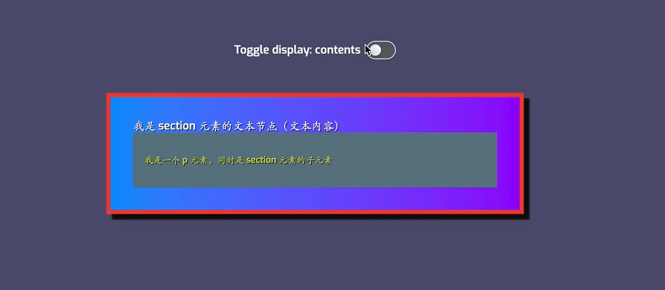

你会发现， `section` 元素的 `display` 属性值为 `contents` 时，该元素自身的样式规则就像是被丢失或禁用了：

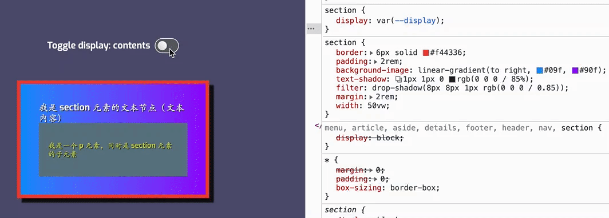

> Demo 地址：<https://codepen.io/airen/full/vYrzMvQ>

其实，设置了 `display` 为 `contents` 的 `section` 元素，其渲染就有点像是其父元素伪元素生成了内容，并且这个伪元素没有设置任何样式规则：

```HTML
<section class="contents">
    我是 section 元素的文本节点（文本内容）
    <p>我是一个 p 元素，同时是 section 元素的子元素</p>
</section>
  
<section class="pseudo-elements">
    <p>我是一个 p 元素，同时是 section 元素的子元素</p>
</section>
```

```CSS
.contents {
    border: 6px solid #f44336; 
    padding: 2rem; 
    background-image: linear-gradient(to right, #09f, #90f); 
    text-shadow: 1px 1px 0 rgb(0 0 0 / .85); 
    filter: drop-shadow(8px 8px 1px rgb(0 0 0 / .85)); 
    margin: 2rem;
    width: 50vw;
    
    display: var(--display, initial);
} 

.pseudo-elements::before {
    content:"我是 section 元素的文本节点（文本内容）";
}

p { 
    background-color:#607d8b; 
    padding: 2rem 1rem; 
    font-size: 80%; 
    color: #cddc39; 
}
```


> Demo 地址： <https://codepen.io/airen/full/OJEoYXP>

事实上，设置了 `display` 值为 `contents` 元素，就好比该元素的开始标签和结束标签都丢失了：

```HTML
我是 section 元素的文本节点（文本内容）
<p>我是一个 p 元素，同时是 section 元素的子元素</p>
```

用一句话来描述的话，元素设置 `display: contents` 行为就是：

> **自身样式规则都被丢失，只剩下文本内容和其后代元素，包括它的伪元素。好比元素的开始和闭合标签被删除。但不会影响后代元素的样式规则** ！

也就是说，**`display:contents`** **只影响该元素在页面上绘制的视觉效果，但不影响文档中的标记，包括标签元素的属性** 。比如下面这样的一个示例：

```HTML
<!-- HTML --> 
<div class="control">
    <label id="label" style="display: contents;">我是大漠</label> 
    <button aria-labelledby="label"><button> 
</div>
```

`<button>` 上的 `aria-labelledby` 和 `label` 还是具有相应的绑定关系。当屏幕阅读器在`<button>` 获得焦点时，就会朗读出 `id="label"` 元素的内容，即 “我是大漠”。

而且，**带有** **`display: contents`** **的元素的 JavaScipt 事件不会受影响** ，比如：

```HTML
<!-- HTML --> 
<button id="contents" style="display: contents">我是一个按钮</button> 

<!-- JavaScript -->
<script> 
    const contentsEle = document.getElementById("contents"); 
    contentsEle.addEventListener("click", (etv) => { 
        alert(etv.target.textContent); 
    }); 
</script> 
```

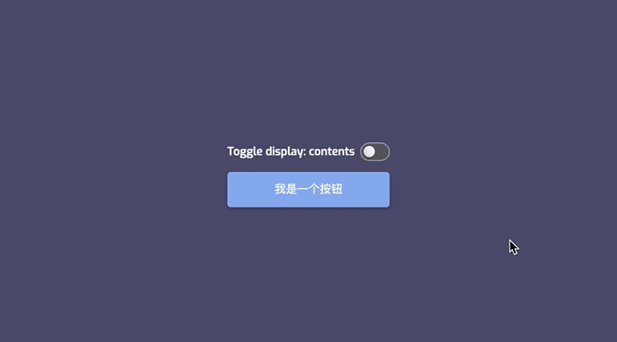

> Demo 地址：<https://codepen.io/airen/full/vYrzwRB>

除此之外，**带有** **`display: contents`** **的元素的伪元素（比如** **`::before`** **和** **`::after`**）会被认为是其子元素的一部分，同样能正常显示 ：

```CSS
.contents {
    border: 6px solid #f44336; 
    padding: 2rem; 
    background-image: linear-gradient(to right, #09f, #90f); 
    text-shadow: 1px 1px 0 rgb(0 0 0 / .85); 
    filter: drop-shadow(8px 8px 1px rgb(0 0 0 / .85)); 
    margin: 2rem;
    width: 50vw;
    
    display: var(--display, initial);
}

.contents::before,
.contents::after {
    display: inline-flex;
    justify-content: center;
    align-items: center;
    background-color:#607d8b; 
    color: #cddc39; 
    border: 1px solid currentColor;
    border-radius: 4px;
    margin-inline: 10px;
    padding: .2em .5em;
}

.contents::before {
    content: "Start";
}

.contents::after {
    content: "End";
}
```

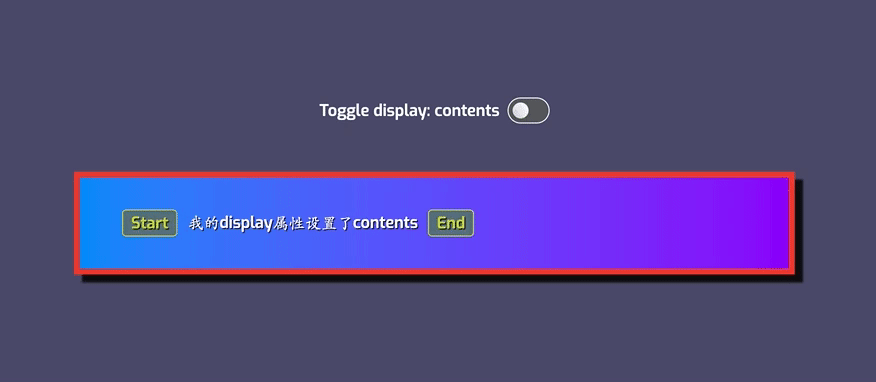

> Demo 地址：<https://codepen.io/airen/full/mdKGYGe>

上面我们看到的都是一些普通元素设置 `display` 为 `contents` 的表现。可 HTML 中有一些标签元素具有一些特殊的行为，比如 `` 、`<input>` 等。换句话说，**在表单元素（部分表单控件）、图片和可替换元素上设置** **`display`** **属性值为** **`contents`** **时，浏览器对其渲染与其他普通元素不一样** 。我们来看 `` 元素上设置 `display` 为 `contents` 的表现结果：

```HTML

```

```CSS
.contents {
    border: 6px solid #f44336;
    background-image: linear-gradient(to right, #09f, #90f);
    filter: drop-shadow(8px 8px 1px rgb(0 0 0 / 0.85));
    width: 50vw;
    object-fit: cover;
    object-position: center;
    aspect-ratio: 16 / 9;

    display: var(--display, initial);
}
```

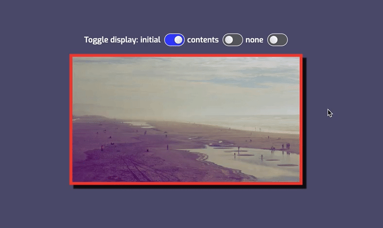

> Demo 地址：<https://codepen.io/airen/full/NWzLVog>

正如你所看到的，图片元素 `img` 的 `display` 取值为 `contents` 时，渲染结果等同于 `display` 为 `none` 的结果。这是因为，`` 元素是一个**可替换元素** ，而 `display:content` 的作用就是会移动盒子，对于可替换元素移除盒子其实是没有意义的，因为它并不完全清楚“盒子”是什么。整个盒子和元素的内容根本不在页面上。

> **可替换元素是指一些元素，比如** **``** **，其外观和盒子是由外部资源控制的** 。

同样的现象也会发生在一些表单控件上。这是因为，部分表单元素并不是由一个单一的“盒子”组成的，但对于浏览器引擎来说，表单元素是由几个较小的元素组成的。与可替换元素相似，删除盒子也没有意义，因为它们并没有一个盒子。因此，像 `<select>` 、`<input>` 和 `<textarea>` 等表单控件元素，设置 `display` 的 `contents` 和 `none` 效果一样。

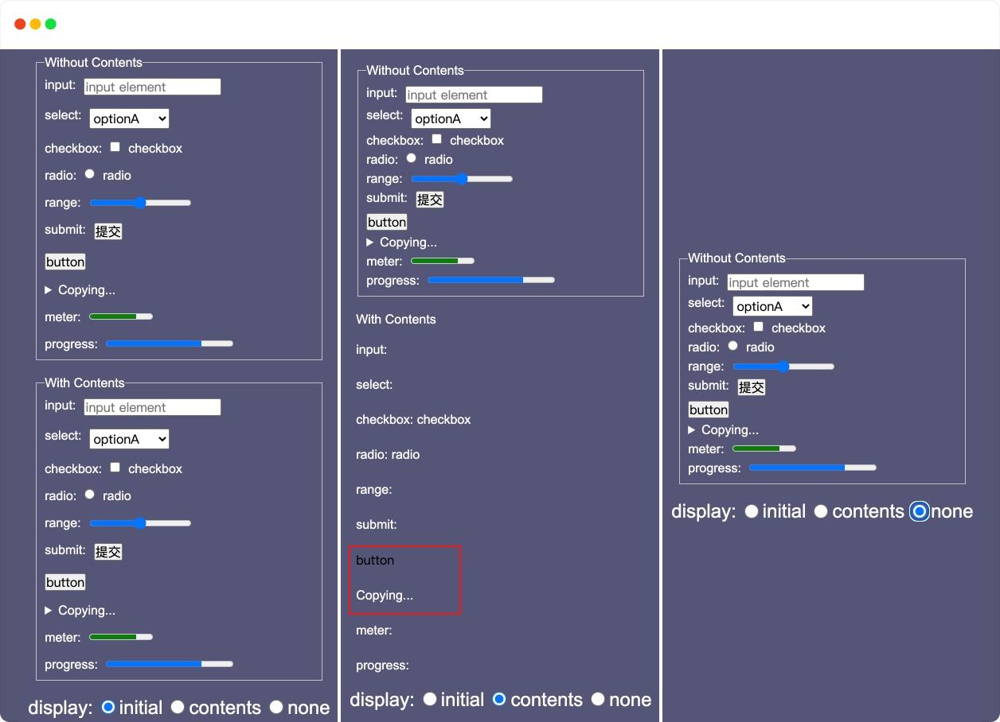

> Demo 地址： <https://codepen.io/airen/full/VwdGovM>

正如示例所示，`<button>` 、`<summary>` 和 `<fieldset>` 只移除视觉效果，内容还留着；而其他表单元素表现和 `display:none` 一样。

简单总结一下，HTML 的元素设置 `display` 为 `contents` 会有何不同表现。

- 链接 `<a>` 元素有点类似于 `<button>` 元素，元素周围的盒子被视觉化地移除，留下链接的内容。由于属性通常不受这个 CSS 规则的影响，链接仍然可以正常工作，并且可以像正常一样用来导航。
- HTML中的 `<br>`、`<wbr>`、`<meter>`、`<progress>`、`<canvas>`、`<embed>`、`<object>`、`<audio>`、`<iframe>`、``、`<video>`、`<frame>`、`<frameset>`、`<input>`、`<textarea>` 和 `<select>` 等元素设置为 `display: contents` 时和 `display: none` 相同。
- HTML 中的 `<legend>` 不是一个已渲染的图例，因此，是否设置 `display: contents`，它的表现都是正常的。
- `<button>`、`<details>` 和 `<fieldset>` 这些元素没有任何特殊的行为，设置 `display` 为`contents` 时，只是移除它们的主框（视觉框），而它的内容则正常表现。
- `<svg>` 元素，`display: contents` 会被计算为 `display: none；`。
- `<use>` 元素使用 `display:contents` 时，会将该元素从格式化树中剥离，并将共内容提升到显示位置。
- 任何其他 SVG 元素，`display: contents` 都会计算成 `display: none`。
- 其他 HTML 元素的 `display: contents` 表现都很正常。

花了不少篇幅向大家介绍`display: contents` 会给 HTML 元素带来什么样的变化。那么我们回过头来想想，不管是 CSS Flexbox 还是 CSS Grid 布局，只要在某个元素上显式设置了 `display` 的值为：

- `flex` 或 `inline-flex` ，该元素就是一个 Flex 容器，它的直接子元素、伪元素、文本内容都被称为 Flex 项目；
- `grid` 或 `inline-grid` ，该元素就是一个网格容器，它的直接子元素、伪元素、文本内容都被称为网格项目。

它们都有一个共同之处，**后代元素不是 Flex 项目（或网格项目）**。比如下面这个示例：

```HTML
<header>
    <h1>Logo</h1>
    <ul class="nav">
        <li><a href="">Home</a></li>
        <li><a href="">Service</a></li>
        <li><a href="">About</a></li>
        <li><a href="">Blog</a></li>
        <li><a href="">Contact us</a></li>
    </ul>
</header>
```

```CSS
header {
    display: flex; /* inline-flex*/
}

/* 或者 */
header {
    display: grid; /* inline-grid */
}
```

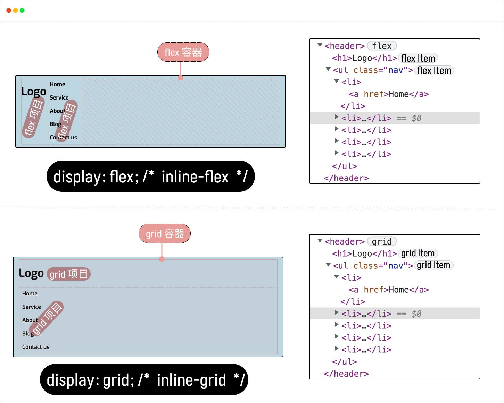

你也看到了，当 `header` 元素的 `display` 值为：

- `flex` 或 `inline-flex` ，`header` 元素就是一个 Flex 容器，它的直接子元素 `h1` 和 `ul` 就成了 Flex 项目；
- `grid` 或 `inline-grid` ，`header` 元素就是一个网格容器，它的直接子元素 `h1` 和 `ul` 就成了网格项目。

但如果你希望 `header` 的后代元素，比如 `li` 元素也变成 Flex 项目或网格项目，以往我们的做法就是在 `li` 的父元素 `ul` 上设置 `display` 的值为 `flex` 或 `grid` ，或者直接继承它父元素的 `display` 值（`inherit`）：

```CSS
header {
    display: flex; /* inline-flex*/
}

/* 或者 */
header {
    display: grid; /* inline-grid */
}

ul {
    display: inherit;
}
```


虽然这样操作，`li` 变成了 Flex 项目或网格项目，但它们与 Flex 容器或网格容器 `header` 没有一点关系，它始终只是 Flex 容器或网格容器 `ul` 的 Flex 项目或网格项目。同时，`ul` 既是 `header` 的 Flex 项目或网格项目，也是 `li` 的 Flex 容器或网格容器。如此一来就产生了嵌套的 Flexbox 或网格。也可以说，Flex 项目或网格项目 `li` 始终无法上升到 Flex 容器或网格容器 `header` 的项目。


庆幸的是，如果我们显式把 `ul` 的 `display` 属性值设置为 `contents` ，那么 `li` 就能上升直接变成 Flex 容器或网格容器 `header` 的 Flex 项目或网格项目。

```CSS
header {
    display: flex; /* inline-flex */
}

/* 或者 */
header {
    display: grid; /* inline-grid */
}

ul {
    display: contents;
}
```

前面提到过了，当元素（一般是指 HTML 中的普通元素，除可替换元素和表单控件之外的元素）的 `display` 设置为 `contents` 时，就相当于该元素的开始和闭合标签被丢弃。`li` 就相当于变成了 `header` 的子元素了（这只是一种理解方式，并不是真实的变成了`header` 的子元素），它就顺理成章的变成了 `header` 的项目（Flex 项目或网格项目）：


> Demo 地址： <https://codepen.io/airen/full/PoadMaL>

我想，这个示例已经能很好地说明，`display: contents` 会给 Flexbox 和 Grid 布局带来什么变化。如果用一句话来概述的话，那就是：

> **`display: contents`** **将 Flexbox 与 Flexbox （或 Grid 与 Grid）的嵌套关系拍平了！**

## display: contents 有什么作用？

你可能会问，`display: contents` 有什么用呢？@Rachel Andrew 曾对 `display: contents` 作用有过这样的一段描述：

> This value becomes useful if you want to add some element because it makes sense in terms of document semantics, but doesn’t in terms of display. Perhaps you have some content that makes sense marked up as an article, that article is then a flex item in your layout BUT the elements you really would like to be flex items are nested inside that article. Rather than flattening your markup and remove the article element to enable these inner elements to be part of the flex layout, you could remove the boxes generated by article using display: contents. You then get the best of both worlds, semantic markup plus the visual display your design requires. That sounds good to me. —— [@Rachel Andrew](https://rachelandrew.co.uk/archives/2016/01/29/vanishing-boxes-with-display-contents/)

大致意思是说：“如果你想添加一些元素，这个值就很有用，因为**它在文档语义方面有意义，但在视觉呈现上没有意义** 。也许你在构建一个 Web 页面时，需要添加一些语义的标签元素，然后该标签在你的布局中是一个 Flex 项目，但你真正想要的 Flex 项目是该元素的后代元素。与其扁平化标记而去删除一些有意义的标签，使其内部元素成为 Flexbox 布局的一部分，那还不如使用 `display: contents` 来删除该元素生成盒子框。这样，你就可以同时获得两个优点，即 **语义标记和设计所需的视觉呈现** ”。

如果这段话不易于理解（或者我翻译不够正确）的话，我想用下面这个示例来解释。假设我们要构建像下图这样的一个页头：


就我个人习惯而言，为了让 Web 页面（比如该导航）更具可访问性，我会使用像下面这样的 HTML 结构：

```HTML
<!-- Template 01: 我喜欢的一种模板结构 -->
<header>
    <a href="" class="logo">
        <svg><!-- logo 图标 --></svg>
        <span>Codepen</span>
    </a>
    <ul class="nav">
        <li><a href="">home</a></li>
        <li><a href="">service</a></li>
        <li><a href="">about</a></li>
        <li><a href="">blog</a></li>
        <li><a href="">contact us</a></li>
    </ul>
</header>
```

不过，在实际开发的时候，我发现不少 Web 开发者为了使用 CSS Flexbox 或 CSS Grid 布局更容易，在编写 HTML 模板时会删除一些标签元素，比如把菜单栏中的 `ul` 和 `li` 直接删除了，来达到结构的扁平化：

```HTML
<!-- Template 02: 我不喜欢的一种模板结构  -->
<header>
    <svg><!-- logo 图标 --></svg>
    <span>Codepen</span>
    <a href="">home</a>
    <a href="">service</a>
    <a href="">about</a>
    <a href="">blog</a>
    <a href="">contact us</a>
</header>
```

这样的结构是足够扁平了，也符合结构尽量简洁，能不嵌套就不嵌套的一种说法。但它最大的不足之处是，失去了语义，让你构建的 Web 页面可访问性较差。就算不考虑像屏幕阅读器访问你的 Web 页面，就只是在没有样式（样式失效）的情况下，这两种结构给用户带来的体验就有着很大的差别，前者用户易于访问，后者用户阅读起来还是很痛苦的：


与其牺牲有语义化的标签来简化实现符合视觉呈现的过程，比如减少 Flexbox 的嵌套，还不如使用 `display: contents` 。换句话说，在基于第一种我喜欢的模板结构上，使用 `display: contents` 也减少 Flexbox 嵌套的使用，类似达到第二种不好的模板结构的效果。

实际对比一下，你会有更深的体会。基于模板结构一，使用 CSS Flexbox 来实现上图的布局效果，你可能需要这样来编写 CSS 代码：

```CSS
.flex {
    display: flex;
    align-items: center;
    gap: 1rem;
}

.flex .logo {
    display: inherit; /* 继承其父元素的 display 值，相当于 flex */
    align-items: center;
    gap: 5px;
}

.flex ul {
    display: inherit; /* 继承其父元素的 display 值，相当于 flex */
    align-items: center;
}
```

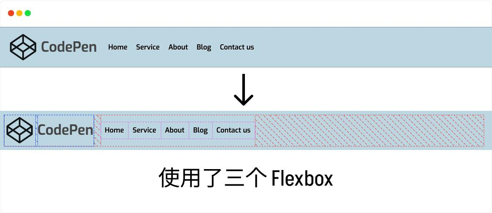

在 `.logo` 和 `ul` 上设置 `display: contents` 就可以将相关的子元素上升为 `header` 的 Flex 项目，实现相同的视觉效果：

```CSS
.contents {
    display: flex;
    align-items: center;
    gap: 5px;
}

.contents .logo,
.contents ul {
    display: contents;
}

.logo span {
    margin-right: calc(1rem - 5px);
}
```

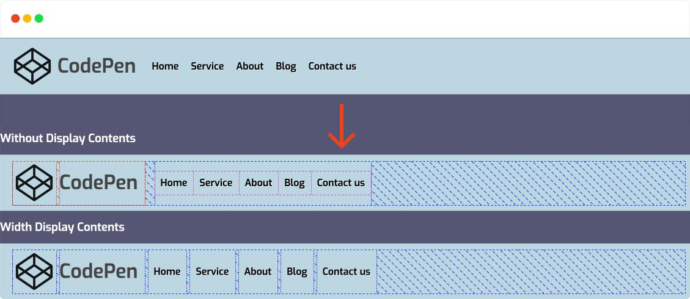

> Demo 地址：<https://codepen.io/airen/full/wvXYvOx>

上面这个示例向大家展示的是 `display: contents` 在 CSS Flexbox 布局中的作用。接着我们再来看看 `display: contents` 在 CSS Grid 布局中的作用。

先来看一个表单方面的案例：

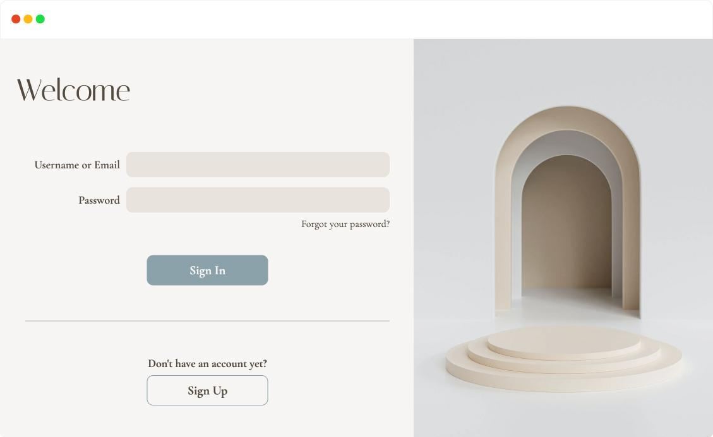

CSS 网格布局中的 `subgrid` （子网格）非常适用于表单中 `<label>` 、`<input>` 和 “验证信息” 几个部分的布局。

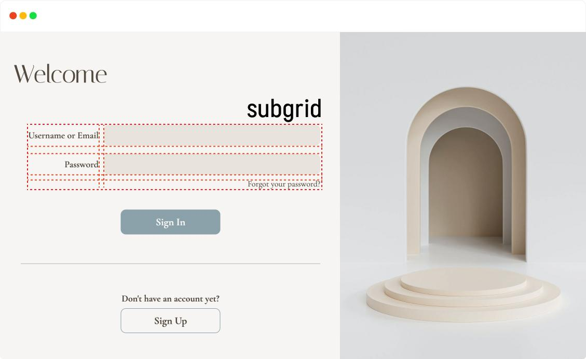

对于类似这样的布局，也很适用于 `display: contents` ，毕竟 `subgrid` 的支持度还是有一定的不足。也可以这么说吧，你可以把 `display: contents` 当作是 `subgrid` 的降级处理。当然，要不是为了向大家阐述 `display: contents` 作用，个人是不建议使用它来替代 `subgrid` 的。

简单地说：**`display:contents`** **可以用来模拟网格布局中的** **`subgrid`** **，但不会用来替代** **`subgrid`** 。这也是为什么社区中有另一种的争论，为什么是 `subgrid` ，而不是 `display:contents` 。

就拿上图为例吧，先来看 CSS 网格布局中的 `subgrid` 是如何实现的。整个页面的 HTML 结构可能会像是下面这样：

```HTML
<div class="form--container">
    <h1>Welcome</h1>
    <form class="sign-in">
        <div class="control">
            <label for="user">Username or Email</label>
            <input type="text" name="user" id="user" />
        </div>
        <div class="control">
            <label for="password">Password</label>
            <input type="text" name="password" id="password" />
            <p class="help--info">Forgot your password?</p>
        </div>
        <div class="control">
            <button class="button button--primary">Sign In</button>
        </div>
    </form>
    <div class="sign-up">
        <p>Don't have an account yet?</p>
        <button class="button button--outline">Sing Up</button>
    </div>
    <figure>
        
    </figure>
</div>
```

```CSS
.form--container {
    display: grid;
    grid-template-columns: 1.5rem max-content minmax(0, 1fr) minmax(0, 1.5fr);
    grid-auto-flow: dense;
    grid-template-areas:
        "... title     title     thumbnail"
        "... sign-in   sign-in   thumbnail"
        "... division  division  thumbnail"
        "... sign-up   sign-up   thumbnail";
    column-gap: 1.5rem;
}

.form--container h1 {
    grid-area: title;
}

.sign-in {
    grid-area: sign-in;
}

.sign-up {
    grid-area: sign-up;
    display: inherit;
    row-gap: 10px;
    grid-template-columns: subgrid;
    place-items: center;
    align-content: center;
}

figure {
    grid-area: thumbnail;
}

.form--container::after {
    grid-area: division;
}

.sign-in {
    display: inherit;
    grid-template-columns: subgrid;
    row-gap: 3rem;
    align-content: center;
}

.sign-in .control {
    grid-column: span 2;
    display: inherit;
    grid-template-columns: subgrid;
}

.sign-in p {
    grid-column: 2;
    justify-self: end;
    margin-top: 8px;
}

.sign-in label {
    place-self: center end;
}

.sign-in button {
    place-self: center;
    grid-column: span 2;
}

.sign-up * {
    grid-column: 1 / -1;
}
```

你在 Firefox 浏览器将看到的效果如下：


> Demo 地址： <https://codepen.io/airen/full/oNyaLjN>

简单地分析一下，在最外面的容器 `.form--container` 上使用 `grid-template-columns` 定义了一个四列的网格，同时指定了每列的列宽；使用 `grid-template-areas` 显式地命名了网格区域名称，用于方便放置元素：

```CSS
.form--container {
    display: grid;
    grid-template-columns: 1.5rem max-content minmax(0, 1fr) minmax(0, 1.5fr);
    grid-auto-flow: dense;
    grid-template-areas:
        "... title     title     thumbnail"
        "... sign-in   sign-in   thumbnail"
        "... division  division  thumbnail"
        "... sign-up   sign-up   thumbnail";
    column-gap: 1.5rem;
}

.form--container h1 {
    grid-area: title;
}

.sign-in {
    grid-area: sign-in;
}

.sign-up {
    grid-area: sign-up;
}

figure {
    grid-area: thumbnail;
}

.form--container::after {
    grid-area: division;
}
```

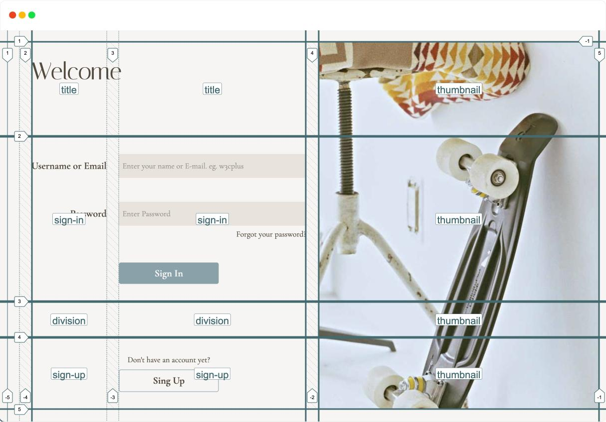

你可以看到，其中页面标题 `h1` 、登录表单 `.sign-in` 、分割线、注册信息都跨越了两列。这样做的原因之一是，登录表单中 `label` 和 `input` 是水平排列。

通过前面的课程（《[16 | 网格布局中的子网格和嵌套网格](https://juejin.cn/book/7161370789680250917/section/7160657953932967967) 》和《[17 | 使用子网格构建 Web 布局](https://juejin.cn/book/7161370789680250917/section/7161624149717155870) 》）学习，我们知道，可以将登录表单 `.sign-in` 和注册信息 `sign-up` 定义为网格，并且将 `grid-template-columns` 设置为 `subgrid` ，这样一来它们就是子网格，可以继承父网格的相关特性，比如网格列轨道尺寸、网格线、网格轨道之间间距等。

```CSS
.sign-in {
    grid-area: sign-in;
    
    display: inherit;
    grid-template-columns: subgrid;
    
    row-gap: 3rem;
    align-content: center;
}

.sign-up {
    grid-area: sign-up;
    
    display: inherit;
    grid-template-columns: subgrid;
    
    row-gap: 10px;
    place-items: center;
    align-content: center;
}
```


但这还没有结束，示例中的 `label` 和 `input` 外面还有一层容器 `div.control` ，要让它们水平排列，还要按类似的方法，将 `div.control` 也定义成一个网格，继承它父网格 `.sign-in` 的列轨道：

```CSS
.sign-in .control {
    grid-column: span 2;
    display: inherit;
    grid-template-columns: subgrid;
}
```

这是在不牺牲标签语义化的前提下，使用 CSS 网格的子网格 `subgrid` 功能构建登录页面的整个过程。

就这个登录表单的案例，如果不想使用 `subgrid` 来实现，又不牺牲语义化标签，那么可以尝试着使用 `display: contents` 来实现。前面介绍过，`display:contents` 可以让网格项目上升到需要的地方。即：

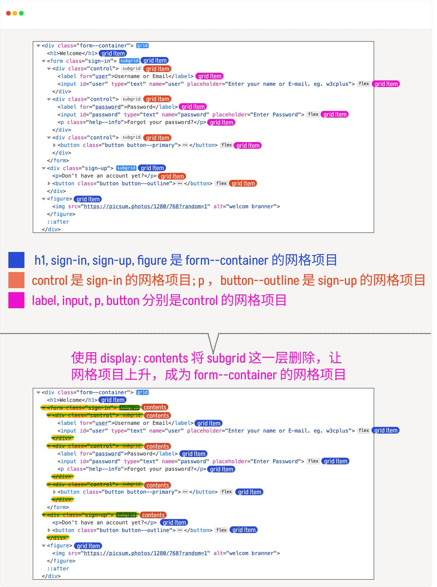

当 `.sign-in` 、`sign-up` 和 `.control` 的 `display` 设置为 `contents` 时，HTML 结构就相当于变成，实际上 HTML 结构不会有任何的改变：

```HTML
<div class="form--container">
    <h1>Welcome</h1>
    <label for="user">Username or Email</label>
    <input type="text" name="user" id="user" />
    <label for="password">Password</label>
    <input type="text" name="password" id="password" />
    <p class="help--info">Forgot your password?</p>
    <button class="button button--primary">Sign In</button>
    <p>Don't have an account yet?</p>
    <button class="button button--outline">Sing Up</button>
    <figure>
        
    </figure>
</div>
```

有了这个基础之后，可以使用 `grid-template-columns` 和 `grid-template-areas` 重新定义网格 `.form--container` ：

```CSS
.form--container {
    display: grid;
    grid-template-columns: 1.5rem max-content minmax(0, 1fr) minmax(0, 1.5fr);
    grid-auto-flow: dense;
    grid-template-areas:
        "... title       title          thumbnail"
        "... user        user-input     thumbnail"
        "... password    password-input thumbnail"
        "... ...         help-info      thumbnail"
        "... primary     primary        thumbnail"
        "... division    division       thumbnail"
        "... signup-des  signup-des     thumbnail"
        "... outline     outline        thumbnail";
    gap: 3rem 1.5rem;
}
```

使用 `grid-area` 把相应元素放置到已命名的网格区域中，并且调整它们各自的对齐方式，就实现了我们所期望的效果：

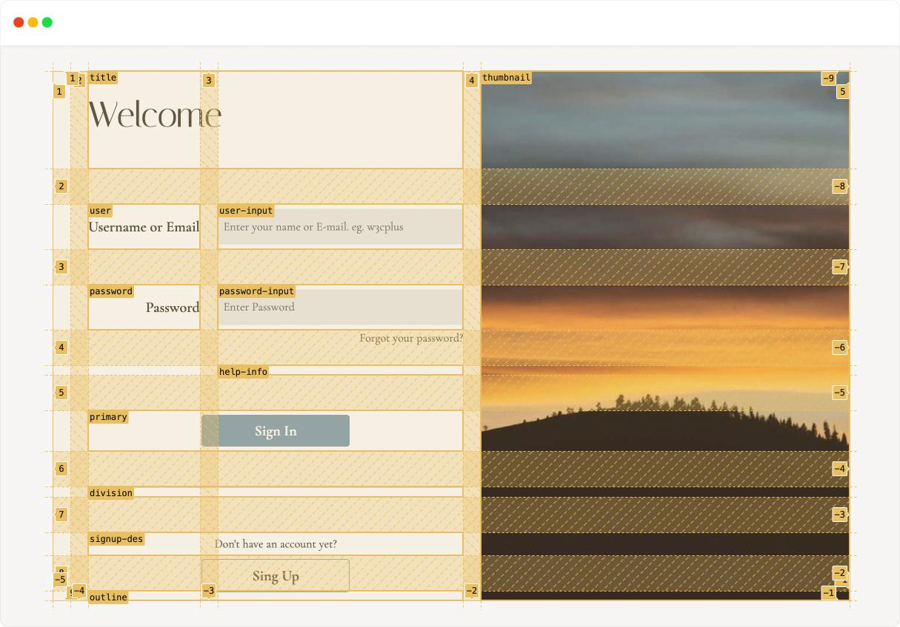

> Demo 地址： <https://codepen.io/airen/full/BaVqPap>

```CSS
.form--container h1 {
    grid-area: title;
}

label[for="user"] {
    grid-area: user;
}

input[name="user"] {
    grid-area: user-input;
}

label[for="password"] {
    grid-area: password;
}

input[name="password"] {
    grid-area: password-input;
}

.help--info {
    grid-area: help-info;
    margin-top: calc(10px - 3.5rem);
    justify-self: end;
}

.button--primary {
    grid-area: primary;
}

.sign-up p {
    grid-area: signup-des;
    place-self: center;
}

.button--outline {
    grid-area: outline;
    margin-top: calc(10px - 4rem);
}

figure {
    grid-area: thumbnail;
}

.form--container::after {
    grid-area: division;
}

.sign-in input {
    align-self: center;
}

.sign-in label {
    place-self: center end;
}

button {
    place-self: center;
}
```

使用 `subgrid` 和 `display: contents` 最终效果：

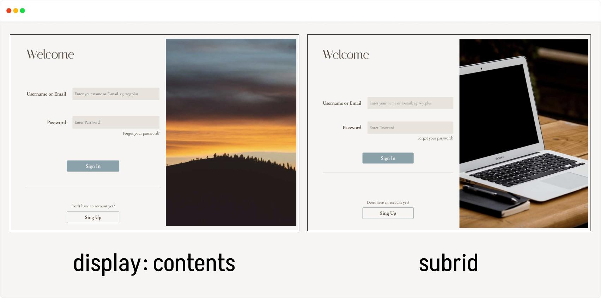

你可能已经发现了，虽然两者效果差不多，但使用 `display: contents` 时使用的代码量要多得多，你不得不对使用 `grid-area` （或 `grid-row` 和 `grid-column`）明确指定每个网格项目的位置。而且，随着网格项目数量变多，你需要做的事情也多，相应的代码量也将变得更多。

就我个人而言，虽然 `display: contents` 能模拟出 `subgrid` 的效果，但并不代表着 `display: contents` 就能和 `subgrid` 一样。如果不考虑代码的冗余，不考虑其响应式的能力，在 `subgrid` 还未得到更多浏览器支持的时候，可以考虑用其来模拟。但不建议任何情景之下都采用 `display: contents` 来模拟 `subgrid`。

## 小结

在这一节课中，主要和大家探讨了 `display: contents` 是什么，它对文档流会有什么变化，尤其是它的到来会给 CSS Flexbox 和 CSS Grid 布局带来什么样的变化。

最后简单的归纳一下：

- `display: contents` 将会移除元素的各种外框，只保留元素的内容和其后代元素，相当于元素标签的开始和结束标签被丢失，样式被丢弃（无任何 CSS 样式），但标签的属性和对应的事件不会受影响。
- HTML 中的部分元素，比如可替换元素，部分 SVG 中的元素，设置 `display: contents` 的表现形为和 `display: none` 一样。
- 在 CSS Flexbox 和 CSS Grid 布局中，在项目（Flex 项目或网格项目）上设置 `display: contents` 可以让其后代元素上升为项目，避免 Flexbox 与 Flexbox，网格与网格的相互嵌套。
- 在 CSS Grid 布局中，可以使用 `display: contents` 来模拟子网格 `subgrid` ，但不建议这样做，因为会让你的代码变得更难维护，构建出来的布局效果响应式能力也不强。
