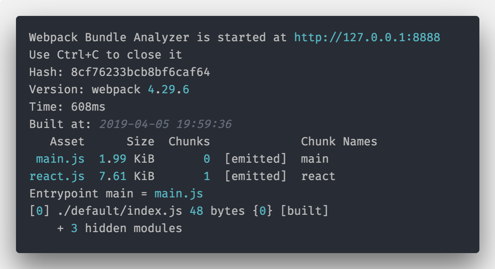
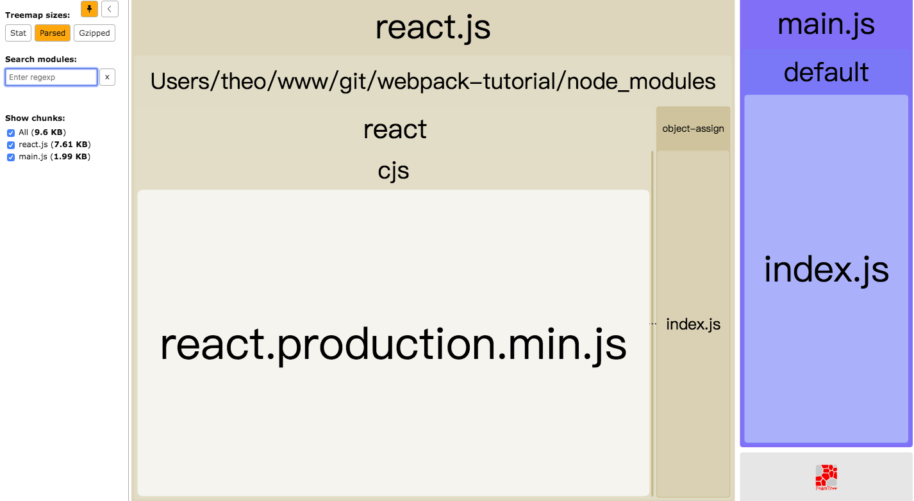
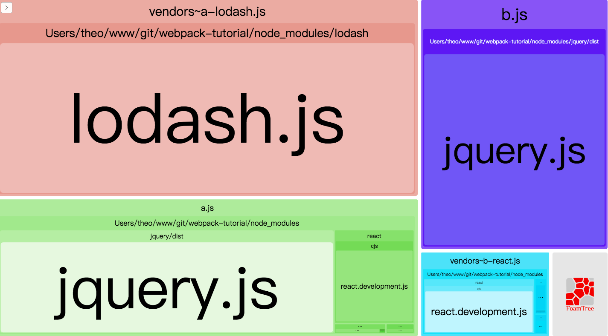
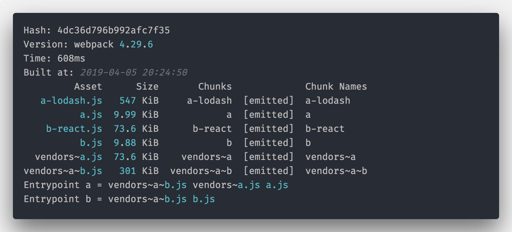
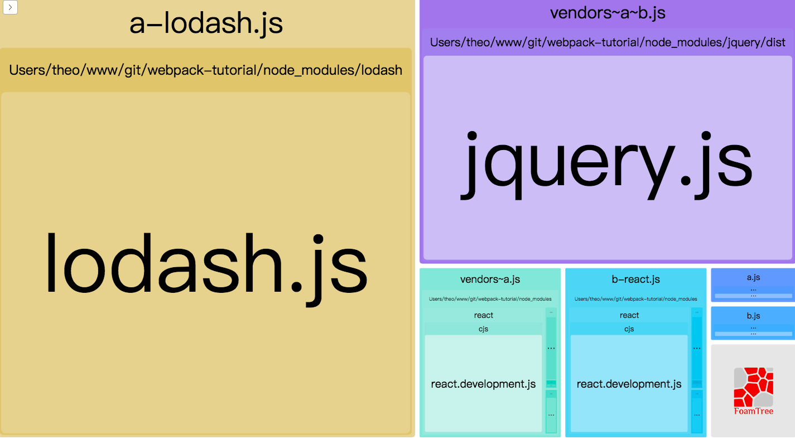
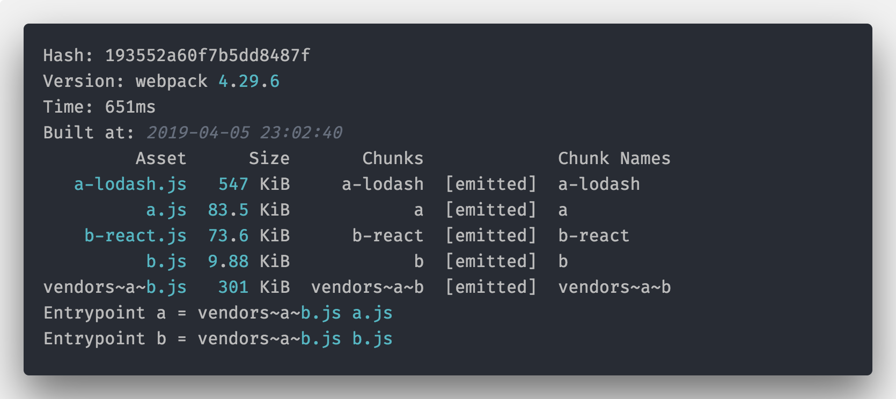
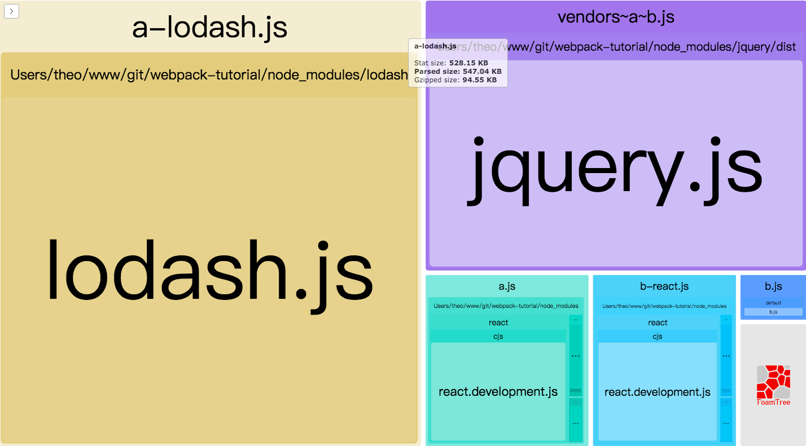
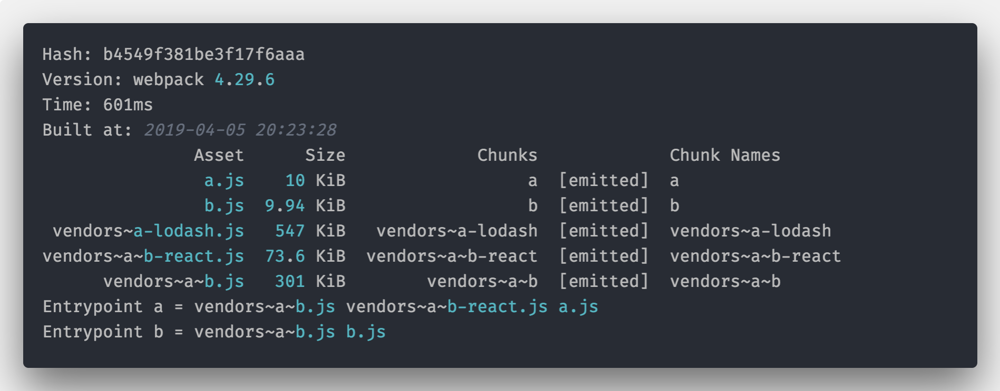
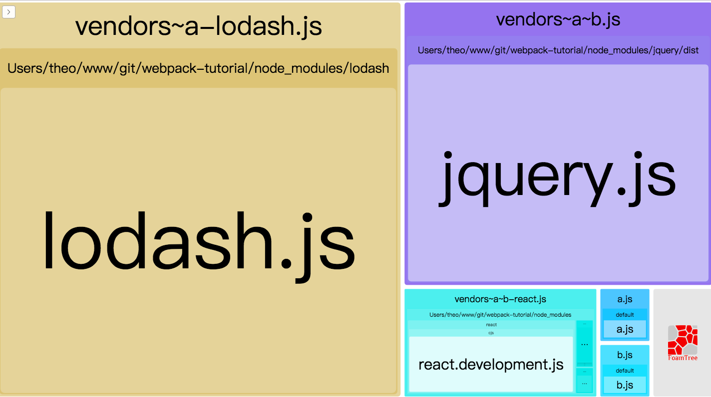
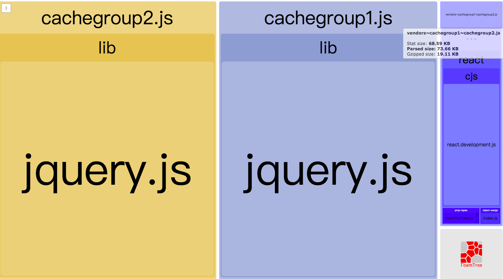

# 19-使用 Webpack 的 splitChunks 功能来拆分代码


> 读一本好书，就是和许多高尚的人谈话。 ——歌德

在 Webpack4 之前，我们处理公共模块的方式都是使用 `CommonsChunkPlugin`，然而该插件让开发配置繁琐，并且使公共代码的抽离不够彻底和细致，

因此新的`splitChunks`改进了这些能力，不过虽然`splitChunks`相对 CommonsChunkPlugin 进步不少，但是 splitChunks 的配置却比较复杂。

## Webpack 代码拆分方式

在 Webpack 中，总共提供了三种方式来实现代码拆分（Code Splitting）：

- entry 配置：通过多个 entry 文件来实现；
- 动态加载（按需加载）：通过写代码时主动使用`import()`或者`require.ensure`来动态加载；
- 抽取公共代码：使用`splitChunks`配置来抽取公共代码。

这里我们主要讲的是通过`splitChunks`抽取公共代码。

在讲解之前，再来复习下 Webpack 中三个重要的概念：`module`、`chunks`、`bundle`。

- **module**

  > 就是 JavaScript 的模块，简单来说就是你通过 `import`、`require` 语句引入的代码，也包括 css、图片等资源；

- **chunk**

  > chunk 是 webpack 根据功能拆分出来的，chunk 包含着 module，可能是一对多也可能是一对一，chunk 包含三种情况，就是上面介绍的三种实现代码拆分的情况。

- **bundle**

  > bundle 是 webpack 打包之后的各个文件，一般就是和 chunk 是一对一的关系，bundle 就是对 chunk 进行编译压缩打包等处理之后的产出。

记住这些，后面会用到，下面开始 splitChunks 配置。

## splitChunks 默认配置

由于 Webpack 做到了开箱即用，所以`splitChunks`是有[默认配置](https://github.com/webpack/webpack/blob/master/lib/WebpackOptionsDefaulter.js)的：

```js
module.exports = {
  // ...
  optimization: {
    splitChunks: {
      chunks: 'async', // 三选一： "initial" | "all" | "async" (默认)
      minSize: 30000, // 最小尺寸，30K，development 下是10k，越大那么单个文件越大，chunk 数就会变少（针对于提取公共 chunk 的时候，不管再大也不会把动态加载的模块合并到初始化模块中）当这个值很大的时候就不会做公共部分的抽取了
      maxSize: 0, // 文件的最大尺寸，0为不限制，优先级：maxInitialRequest/maxAsyncRequests < maxSize < minSize
      minChunks: 1, // 默认1，被提取的一个模块至少需要在几个 chunk 中被引用，这个值越大，抽取出来的文件就越小
      maxAsyncRequests: 5, // 在做一次按需加载的时候最多有多少个异步请求，为 1 的时候就不会抽取公共 chunk 了
      maxInitialRequests: 3, // 针对一个 entry 做初始化模块分隔的时候的最大文件数，优先级高于 cacheGroup，所以为 1 的时候就不会抽取 initial common 了
      automaticNameDelimiter: '~', // 打包文件名分隔符
      name: true, // 拆分出来文件的名字，默认为 true，表示自动生成文件名，如果设置为固定的字符串那么所有的 chunk 都会被合并成一个
      cacheGroups: {
        vendors: {
          test: /[\\/]node_modules[\\/]/, // 正则规则，如果符合就提取 chunk
          priority: -10, // 缓存组优先级，当一个模块可能属于多个 chunkGroup，这里是优先级
        },
        default: {
          minChunks: 2,
          priority: -20, // 优先级
          reuseExistingChunk: true, // 如果该chunk包含的modules都已经另一个被分割的chunk中存在，那么直接引用已存在的chunk，不会再重新产生一个
        },
      },
    },
  },
}
```

> Tips：上面的默认配置都添加了注释，一些很简单的配置就不再详细介绍，下面主要介绍一些比较难理解并且重要的配置项。

`splitChunks`默认配置对应的就是 chunk 生成的第二种情况：通过写代码时主动使用`import()`或者`require.ensure`来动态加载。

下面来看下使用`import()`或者`require.ensure`来写代码，在 Webpack 打包的时候有什么不同。

创建`index.js`，使用`import()`动态加载`react`模块，**同时为了方便跟踪产出物，在这里使用了 webpack 的魔法注释，保证输出的 bundle 名称，后面也使用这种方式**。内容如下：

```js
import(/* webpackChunkName: "react" */ 'react')
```

> Tips：如果忘记魔法注释内容，可以翻阅之前的文章。

添加`webpack.config.js`，内容如下：

```js
const BundleAnalyzerPlugin =
  require('webpack-bundle-analyzer').BundleAnalyzerPlugin
module.exports = {
  mode: 'production',
  entry: {
    main: './default/index.js',
  },
  plugins: [new BundleAnalyzerPlugin()],
}
```

在这里使用了[webpack-bundle-analyzer](https://www.npmjs.com/package/webpack-bundle-analyzer)插件来查看 webpack 打包情况。

完成上面配置之后，执行`webpack --config webpack.config.js`，首先看到对应的输出的 log 为：



`index.js`打包出来了两个文件`react.js`和`main.js`，两个文件包含的内容通过 webpack-bundle-analyzer 查看效果如下：



由此可以知道：

1. `index.js`打包出来了两个文件`react.js`和`main.js`；
2. `react.js`是被拆分出来的，内容实际是 react；
3. `react.js`被拆分出来是因为`splitChunks`默认配置`chunks='async'`。

## 理解 `splitChunks.chunks` 三个值

`splitChunks`中的`chunks`是一个很重要的配置项，表示从哪些 chunks 里面抽取代码，`chunks`的三个值有：`"initial"`、 `"all"`、 `"async"`， 默认就是是`async`。

它们的含义如下：

- all：把动态和非动态模块同时进行优化打包，所有模块都扔到 vendor.bundle.js 里面。
- initial：把非动态模块打包进 vendor，动态模块优化打包。
- async：把动态模块打包进 vendor，非动态模块保持原样（不优化）

为了理解`splitChunks.chunks`三个值的差异，下面通过实例来帮助我们理解。

首先创建两个文件`a.js`和`b.js`：

```js
// a.js
import react from 'react';
import $ from 'jquery';
import(/* webpackChunkName: "a-lodash" */ 'lodash');
const a = 'I am a.js';
export default a;

// b.js
import $ from 'jquery';
import(/* webpackChunkName: "b-react" */ 'react');
import(/* webpackChunkName: "b-lodash" */ 'lodash');

const b = 'I am b.js';
export default b;
```

> Tips：为了方便判断打包出来的 bundle 文件是谁生产的，所以统一使用了魔法注释（magic comments）。

这两个文件的特点是：

1. `react` 模块被两个文件都引入了，不同的是`a.js`是同步引入，`b.js`是动态引入；
2. `jquery`模块在两个文件中都被引入，并且**都是同步引入**；
3. `lodash`模块都被两个文件引入，并且**都是动态引入**。

下面是我们的`webpack.config.js`文件内容，我们主要修改是`chunks`的三个值：

```js
const BundleAnalyzerPlugin =
  require('webpack-bundle-analyzer').BundleAnalyzerPlugin
module.exports = {
  mode: 'development',
  entry: {
    a: './default/a.js',
    b: './default/b.js',
  },
  plugins: [new BundleAnalyzerPlugin()],
  optimization: {
    splitChunks: {
      cacheGroups: {
        vendors: {
          chunks: 'async', // 这里是我们修改的地方，async|initial|all
          test: /[\\/]node_modules[\\/]/,
        },
      },
    },
  },
}
```

### `chunks='async'`

当`chunks='async'`配置下，Webpack 打包 log 和 bundle 分析结果如下：




通过实践观察，在这种模式下：

1. 在`a.js`和`b.js` 都同步引入的 `jquery` 被打包进了各自的 bundle 中没有拆分出来共用，说明在这种配置下只会针对动态引入的的代码进行拆分
2. react 在 a.js 和 b.js 表现不同：

   - 在`a.js`因为是同步引入的，设置的`chunks='async'`，所以不被拆分出去

   - 在`b.js`是动态引入的，符合`chunks='async'`的设置，所以被单独拆到`vendors~b-react.js`

3. `lodash`因为在两个文件都是动态加载的，所以被拆到了`vendors~a-lodash.js`

> Tips：`b.js`中的`react`拆出来的文件名是`vendors~b-react.js`含有`vendors`，说明中了名字为`vendors`的`cacheGroups`规则

### `chunks='initial'`

在`chunks='initial'`配置下，Webpack 打包 log 和 bundle 分析结果如下





`initial` 即原始的最初的意思，原则就是**有共用的情况即发生拆分**。

首先，**动态引入的模块不受影响，它是无论如何都会被拆分出去的**。

而对于同步引入的代码，如果有多处都在使用，则拆分出来共用，至于共同引用次会被拆分，是通过`minChunks`单独配置的，针对这个原则，我们再来看下上面的代码拆分的结果

1. 因为`jquery`模块是`a.js`和`b.js`共用的代码，所以单独拆除来放到`vendors~a~b.js`中，`vendors~a~b.js`文件名来自我们配置的`cacheGroups`的 key，即`vendors`和分隔符（`automaticNameDelimiter`）以及实际被共用的 bundle 的名称，即：a 和 b
2. `react`在`b.js`因为用的是动态引入，所以被拆成了`b-react.js`（名字来自于设置的魔法注释），`a.js`的`react`则被拆到了`vendors~a.js`
3. `lodash`因为在两个文件都是动态加载的，所以被拆到了`a-lodash.js`（名字来自魔法注释）

> **进一步解释**：
>
> `react`在`b.js`拆出来为`b-react.js`名称，说明中了默认配置（默认配置是`chunks='async'`），名字来自魔法注释；
>
> `a.js`的`react`文件名是`vendors~a.js`，这是因为中了`vendors`规则，本身`a.js`的`react`是同步引入，在这里被拆出来是因为`react`在 development 模式用的是 dev 版本，体积超过`minSize`的默认设置`30K`，所以被拆出来了，观察对应的 webpack 打包 log：`Entrypoint a = vendors~a~b.js vendors~a.js a.js` 也说明这一点。
>
> 如果我们把对应的配置，加大`minSize`到 80K（超过 dev 版本 react 大小），则`vendors~a.js` 和 `a.js`会合并在一起了，具体看下图效果：

```js
// 忽略其他，只看cacheGroups
vendors: {
  minSize: 80000,
  chunks: 'initial',
  test: /[\\/]node_modules[\\/]/
}
```





### `chunks='all'`

在 `chunks='initial'` 配置下，虽然`a.js`和`b.js`都引入了`react`，但是因为引入方式不同，而没有拆分在一起，而是各自单独拆封成一个 chunk，要想把`react`放到一个文件中，就要使用`chunks='all'`了。

下面是`chunks='all'`的配置结果：





通过执行打包结果，跟我们的预期一致，`chunks='all'`的配置下能够最大程度的生成复用代码，复用代码在 http cache 环境下，多页应用由一个页面跳转到另外一个共用代码的页面，会节省 http 请求，所以一般来说`chunks='all'`是推荐的方式，但是`async`和`initial`也有其存在的必要，理解三者差异，根据项目实际代码拆分需求来配置即可。

> Tips：拆分出来的文件名称可以通过`output.chunkFilename`来指定规则，例如`chunkFilename='[name].js'`，然后在对应的配置中配置`name`的具体值，
>
> 比如 vendors 的 name 指定为`foo`：`vendors.name='foo'`

## 使用 cacheGroups

`cacheGroups`（缓存组）是 Webpack splitChunks 最核心的配置，`splitChunks`的配置项都是作用于`cacheGroup`上的，默认有两个`cacheGroup`：`vendors`和`default`（本文一开始默认配置部分已经贴出），

如果将`cacheGroup`的默认两个分组`vendor`和`default`设置为 false，则`splitChunks`就不会起作用，我们也可以重写这俩默认的配置。

`cacheGroups`除了拥有默认配置所有的配置项目（例如 minSize、minChunks、name 等）之外，还有三个独有的配置项：`test`、`priority`和`reuseExistingChunk`。

`splitChunks.cacheGroup`**必须同时满足**各个配置项的条件才能生效，`reuseExistingChunk`表示是否使用已有的 chunk，如果为 true 则表示如果当前的 chunk 包含的模块已经被抽取出去了，那么将不会重新生成新的。

下面重点说下`test`和`priority`

> Tips：除了 JavaScript，`splitChunks`也适用于使用[mini-css-extract-plugin](https://github.com/webpack-contrib/mini-css-extract-plugin)插件的 css 配置。

### priority

`priority`配置项的意义就是权重。

如果有一个模块满足了多个缓存组的条件就会去按照权重划分，谁的权重高就优先按照谁的规则处理。

在下面的配置中：

```js
optimization: {
  splitChunks: {
    cacheGroups: {
      vendors: {
        chunks: 'initial',
        test: /[\\/]node_modules[\\/]/,
        priority: -10
      },
      default: {
        test: /[\\/]node_modules[\\/]/,
        chunks: 'initial',
        priority: -20
      }
    }
  }
}
```

虽然给`vendors`和`default`除 `priority` 配置外，其他配置都相同，打包的结果如下：



共用的代码文件名为`vendors~cachegroup1~cachegroup2.js`说明中了`vendors`配置，虽然`default`和`vendors`两个都能满足需求，但是 `default` 的 `priority` 是 `-20` 明显小于 `vendors` 的`-10`，所以会优先按照 vendors 这个缓存组拆分。

### test

`cacheGroup.test`表示满足这个条件的才会被缓存组命中，取值可以是正则、字符串和函数。

正则和字符串很好理解，当`test`为函数时，比如返回`true/false`，并且接收两个参数：`module`和`chunks`

- `module`：每个模块打包的时候，都会执行`test`函数，并且传入模块 module 对象，module 对象包含了模块的基本信息，例如类型、路径、文件 hash 等；
- `chunks`：是当前模块被分到哪些`chunks`使用，module 跟 chunks 关系可能是一对一，也可能是多对一，所以一旦我们使用 chunks 做匹配，那么符合条件的 chunk 内包含的模块都会被匹配到。

```js
module.exports = {
  //...
  optimization: {
    splitChunks: {
      cacheGroups: {
        vendors: {
          test(module, chunks) {
            //...
            return module.type === 'javascript/auto'
          },
        },
      },
    },
  },
}
```

举个实际应用场景来说明，前面提到过`splitChunks`不仅作用于 JavaScript，还可以作用于 CSS，所以类似`test=/[\\/]node_modules[\\/]/`的写法，实际也会匹配出`node_modules`中的 CSS，如果我们用到的一个 npm 包引入了自己的 css 文件，那么也会中了拆分逻辑，这时候如果要排除这部分 CSS 或者单独给这部分 CSS 设置自己的`cacheGroup`规则，有两种方式：

1. 设置更高权重的`cacheGroup`；
2. 使用`test`函数针对类型为 js 和 css 分别设置各自的`cacheGroup`。

另外我们还可以使用`test`函数实现更细化的匹配，例如：忽略一部分文件等。

> 本小节 Webpack 相关面试题：
>
> 本章节一直在回答一个问题：Webpack 怎么优化。
>
> 本小节主要介绍 Webpack splitChunks 来拆分代码。
>
> 前端打包中 Module、Chunk、Bundle 的区别: [https://zhuanlan.zhihu.com/p/611518123](https://zhuanlan.zhihu.com/p/611518123)
