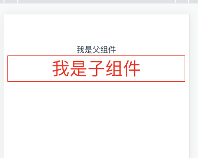
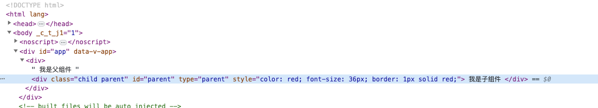
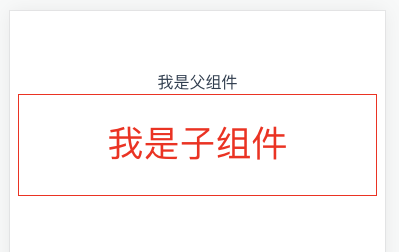
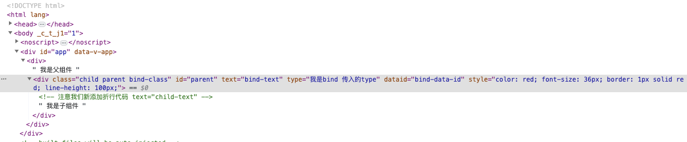
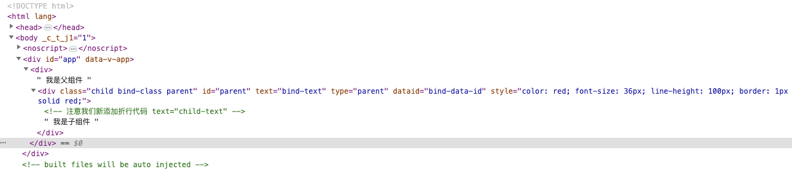

# Vue 组件间的属性透传 (03)--Vue3.x

## 前置知识

1. **一个非 prop 的 attribute 是指传向一个组件**，但是该组件并没有相应 prop 定义的 attribute。
2. **“透传 attribute”** 指的是传递给一个组件，却没有被该组件声明为[`props`](https://link.juejin.cn?target=https%3A%2F%2Fcn.vuejs.org%2Fguide%2Fcomponents%2Fprops.html)或 [`emits`](https://link.juejin.cn?target=https%3A%2F%2Fcn.vuejs.org%2Fguide%2Fcomponents%2Fevents.html%23defining-custom-events) 的 `attribute` 或者 `v-on` 事件监听器。最常见的例子就是 `class`、`style` 和 `id`。

## 官方文档

> 默认情况下，父组件传递的，但没有被子组件解析为 props 的 attributes 绑定会被“透传”。
>
> 这意味着当我们有一个单根节点的子组件时，这些绑定会被作为一个常规的 HTML attribute 应用在子组件的根节点元素上。
>
> [vue3.x 官方地址](https://cn.vuejs.org/api/options-misc.html#inheritattrs)

## 父子组件

```vue
// parent.vue
<template>
  <div>
    我是父组件
    <Child
      id="parent"
      class="parent"
      type="parent"
      name="传入name"
      style="font-size: 36px; border: 1px solid red"
    ></Child>
  </div>
</template>

<script setup>
import Child from './child.vue'
</script>
<script>
export default {
  name: 'parent-demo',
}
</script>
```

```vue
// child.vue
<template>
  <div style="color: red; font-size: 24px" class="child" id="child">
    我是子组件
  </div>
</template>

<script>
export default {
  name: 'child-index',
}
</script>
<script setup>
defineProps({
  name: {
    type: String,
    default: '默认name',
  },
})
</script>
```

从上例中我们可以看到，对于`child.vue`中接收了一个 `name` 的 `prop`，以及自身组件中分别有 `style`、`id`、`class` 等一系列属性

## 效果

我们把代码放在创建的 vue3 项目中，运行至浏览器后，可以看到如下效果



打开控制台后，效果如下：



由上图我们可以看出，对于**一个非 prop 的 attribute**，会按照 **父组件属性 > 子组件属性** 的优先级进行合并

## 如果使用 v-bind 呢 ？

> 官方文档：在 3.x 中，如果一个元素同时定义了 `v-bind="object"` 和一个相同的独立 attribute，那么绑定的声明顺序将决定它们如何被合并。换句话说，相对于假设开发者总是希望独立 attribute 覆盖 `object` 中定义的内容，现在开发者能够对自己所希望的合并行为做更好的控制。
>
> [Vue3.x 官方地址](https://v3-migration.vuejs.org/zh/breaking-changes/v-bind.html#_3-x-%E8%AF%AD%E6%B3%95)

修改父组件 `parent.vue` 内容如下

```vue
<template>
  <div>
    我是父组件
    <Child
      id="parent"
      class="parent"
      type="parent"
      name="传入name"
      style="font-size: 36px; border: 1px solid red"
      v-bind="apiProps"
    ></Child>
  </div>
</template>

<script setup>
import Child from './child.vue'
const apiProps = {
  name: '我是bind 传入的name',
  type: '我是bind 传入的type',
  class: 'bind-class',
  style: 'line-height: 100px;',
  dataId: 'bind-data-id',
  text: 'bind-text',
}
</script>
<script>
export default {
  name: 'parent-demo',
}
</script>
```

修改子组件`child.vue`如下

```vue
<template>
  <div
    style="color: red; font-size: 24px"
    class="child"
    id="child"
    text="child-text"
  >
    <!-- 注意我们新添加折行代码 text="child-text" -->
    我是子组件
  </div>
</template>

<script>
export default {
  name: 'child-index',
}
</script>
<script setup>
defineProps({
  name: {
    type: String,
    default: '默认name',
  },
})
</script>
```

如上，我用 `v-bind` 增加了一系列的属性，并且在属性顺序上 `v-bind` 放在了最后, Vue 处理渲染后会是怎么样的效果呢？



打开控制台，效果如下



从这里可以看到：

在父子组件属性上 **父组件调用时候传直接递给子组件的属性优先级** > **通过 v-bind 传递属性的优先级** > **子组件内容部默认的属性优先级**

问题？？？

上面`parent.vue`中使用的`v-bind`我们放在了最后一个，如果放在开始呢，也就是顺序调整呢？？？

注意：我们知道在 2.x 中，如果一个元素同时定义了 `v-bind="object"` 和一个相同的独立 attribute，那么这个独立 attribute 总是会覆盖 `object` 中的绑定。

## 调整 v-bind 的属性

修改`parent.vue` 中的代码，如下: (我们把`v-bind`)放在了最开始

```vue
<template>
  <div>
    我是父组件
    <Child
      v-bind="apiProps"
      id="parent"
      class="parent"
      type="parent"
      name="传入name"
      style="font-size: 36px; border: 1px solid red"
    ></Child>
  </div>
</template>

<script setup>
import Child from './child.vue'
const apiProps = {
  name: '我是bind 传入的name',
  type: '我是bind 传入的type',
  class: 'bind-class',
  style: 'line-height: 100px;',
  dataId: 'bind-data-id',
  text: 'bind-text',
}
</script>
<script>
export default {
  name: 'parent-demo',
}
</script>
```

这时候我们再看控制台最后的渲染代码



可以看出来，前后顺序不一致，渲染前后的结构也是不一样的

## 结论

1. 默认情况下，父组件传递的，但没有被子组件解析为 props 的 attributes 绑定会被“透传”。这意味着当我们有一个单根节点的子组件时，这些绑定会被作为一个常规的 HTML attribute 应用在子组件的根节点元素上。

2. 在 3.x 中，如果一个元素同时定义了 `v-bind="object"` 和一个相同的独立 attribute，那么**绑定的声明顺序**将决定它们如何被合并。

   ```html
   <!-- 模板 -->
   <div id="red" v-bind="{ id: 'blue' }"></div>
   <!-- 结果 -->
   <div id="blue"></div>
   
   <!-- 模板 -->
   <div v-bind="{ id: 'blue' }" id="red"></div>
   <!-- 结果 -->
   <div id="red"></div>
   ```

   

