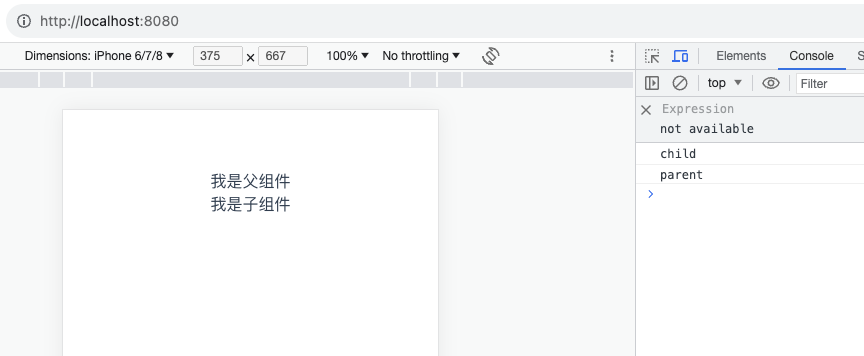
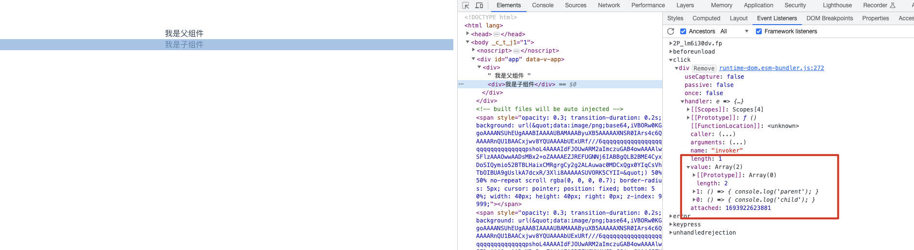

# Vue 组件间的事件透传 (04)--Vue3.x

## 官方文档

> `v-on` 的 `.native` 修饰符已被移除。同时，[新增的 `emits` 选项](https://v3-migration.vuejs.org/zh/breaking-changes/emits-option)允许子组件定义真正会被触发的事件。
>
> 因此，对于子组件中*未*被定义为组件触发的所有事件监听器，Vue 现在将把它们作为原生事件监听器添加到子组件的根元素中 (除非在子组件的选项中设置了 `inheritAttrs: false`)
>
> [官方文档](https://v3-migration.vuejs.org/zh/breaking-changes/v-on-native-modifier-removed.html#_3-x-%E8%AF%AD%E6%B3%95)

## 父子组件

```vue
// parent.vue
<template>
  <div>
    我是父组件
    <Child @click="handleClick"></Child>
  </div>
</template>

<script setup>
import Child from './child.vue'

const handleClick = () => {
  console.log('parent')
}
</script>

<script>
export default {
  name: 'parent-demo',
}
</script>
```

```vue
<template>
  <div @click="handleClick">我是子组件</div>
</template>

<script>
export default {
  name: 'child-index',
}
</script>
<script setup>
defineProps({
  name: {
    type: String,
    default: '默认name',
  },
})
const handleClick = () => {
  console.log('child')
}
</script>
```

从上面看到我们在 `chiild.vue` 中绑定了 `click` 事件，然后在 `parent.vue` 中也绑定了 `click` 事件，那么会是如何执行呢？？？？

> 注意：我们在 Vue3.x 中并不需要在父组件使用 .native 修饰符来给子组件绑定原生事件，而是可以直接使用 @click 等来绑定原生事件

## 效果

我们在浏览器中点击子组件时候，触发 log 如下



**先触发子组件事件，然后再触发父组件绑定的事件**

## 控制台中查看 Event 中 的事件顺序

结果如下：



可以看到，在事件 click 中的 value 值中，它的值是一个数组，分别对应我们绑定的两个事件回调。顺序执行，先执行 0 对应的子组件中绑定的事件回调，在执行 1 对应的父组件中绑定的事件回调。

## 结论

1. 如果我们想在父组件中，给引入的子组件绑定事件（注意：需要原生支持），直接绑定即可
2. 注意执行顺序：**先执行子组件中绑定的事件回调，再触发父组件中绑定的事件回调**
3. `Vue3.x` 中 `.native` 修饰符已经删除了

