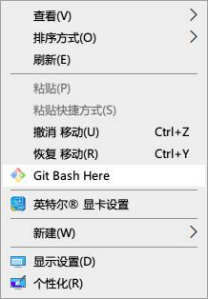
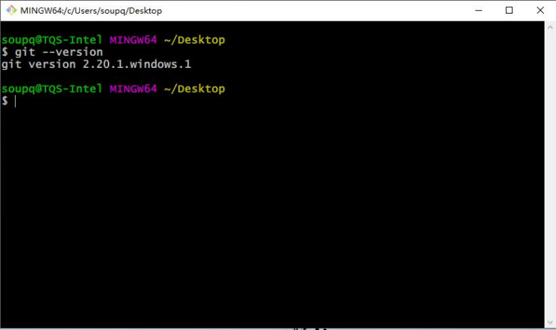
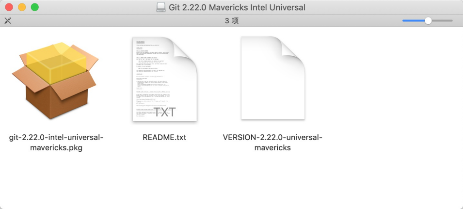
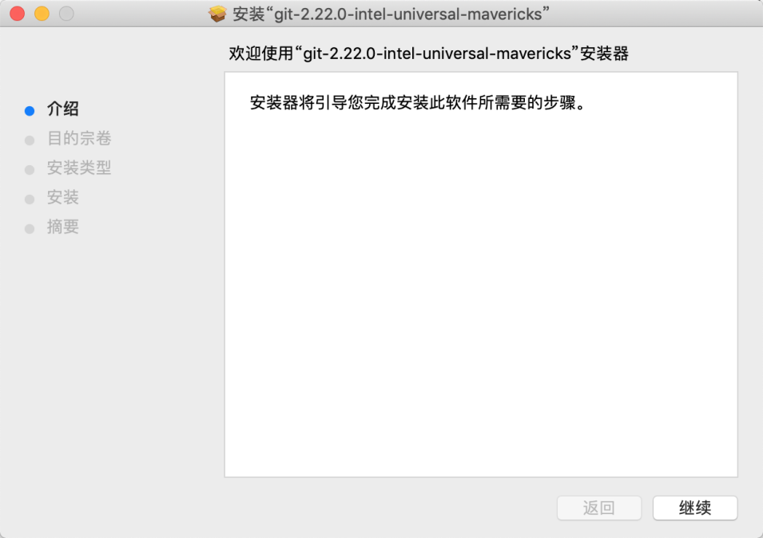
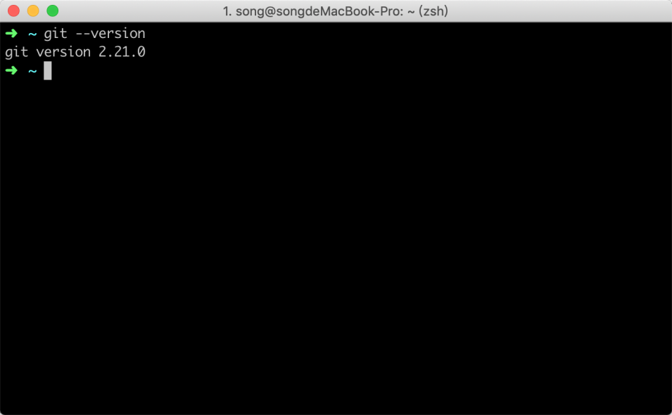
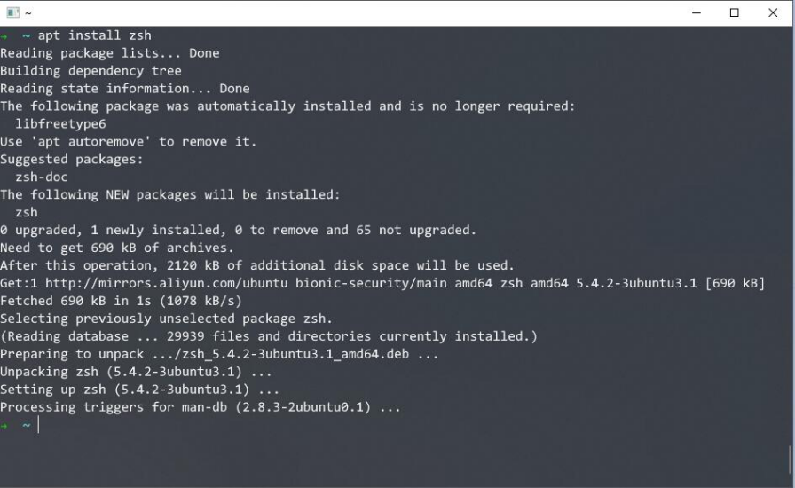

# 02-环境准备：在各系统中快速安装 git 环境


> 机会不会上门来找人，只有人去找机会。 ——狄更斯

在学习 `Git` 命令操作之前，我们先把 `Git` 的环境给搭建一下，这一节当中主要会教大家安装 `Git` 和一些命令智能提示的工具；`Git` 的安装相对来说非常简单， 并且不少 Linux 系统自带了 `Git` 工具；

如果你的系统当中已经安装了 `Git`，那么可以跳过相应的安装步骤，是否已经安装，可以通过下面安装的验证环节进行验证。大部分读者应该使用的是 Windows 系统，默认是没有安装 `Git` 工具的，可以通过下面的方法进行安装。

## 2.1 安装 Git

`Git` 可以通过图形化界面管理，也可以通过命令行管理，为了让读者能更好地理解 `Git` 的操作和使用效率，我们后续的内容都是以命令操作为主的讲解，在后面会单独拿出一小节教大家使用图形化管理。

### 2.1.1 Windows 安装

在 Windows 系统中安装 `Git` 非常简单，只需要下载 `Git` 的安装包，然后安装引导点击安装即可：

> Git 下载地址：https://git-scm.com/download/win

下载完安装包之后，双击 EXE 安装包，可以看到如下图窗口界面，一直点击 `Next` 安装即可：


在安装完成之后，会在你的右键菜单栏中增加一个 `Git` 的选项，你可以在电脑桌面点击鼠标`右键`，会看到多出两个菜单，如下图所示：



当你点击 `git bash Here` 菜单之后，可以看到一个终端窗口，在终端里面输入命令 `git —version`，如果可以看到 git 的版本信息，则说明安装成功，如下图所示：



### 2.1.2 Mac OS 安装

我平时自己使用 Mac 比较多，不记得 Mac 是否自带了 `Git`；如果你的 Mac 系统当中没有 `Git` 工具，那么就安装一下吧。Mac 安装的方法也非常简单，这里推荐大家使用最简单的方法安装，直接下载 pkg 的安装包安装即可：

> Mac 版本 Git 下载地址：https://git-scm.com/download/mac

下载下来之后可以看到一个 `dmg` 文件，双击打开 `dmg` 压缩文件，可以看到里面有一个 `pgk` 文件，如下图所示：



再次双击 pkg 文件，就可以进行安装，然后按照引导一直点击`继续`按钮就可以完成安装了，如下图所示：



安装完成之后，打开终端，在终端当中输入 `git —version`, 如果可以看到 Git 的版本号，说明已经成功安装，如下图所示：



### 2.1.3 Linux 安装

Linux 其实通常默认已经自带了 `Git`，但考虑到少部分精简过的系统没有自带 `Git`，这里也简单提及一下安装方法；Linux 通常有多个发行版本，安装方式略有不同，不过都非常的简单，只需要一条命令即可安装完成，这里以常见的 `Ubuntu` 和 `Cent os` 为例。

ubuntu 系统的安装命令如下:

```sh
apt install git
```

Centos 系统安装命令如下：

```
yum -y install git
```

安装完成之后，打开终端，在终端当中输入 `git —version`, 如果可以看到 Git 的版本号，说明已经成功安装：

```sh
➜  ~ git --version
git version 2.21.0
```

## 2.2 安装 zsh

安装 `zsh` 的目的是为了接下来安装 `oh-my-zsh`，因为 `oh-my-zsh` 是基于 `zsh` 的一个主题；所以在安装 `oh-my-zsh` 之前，必须要安装 zsh，至于 `oh-my-zsh` 的用处可以先跳到下面的 `oh-my-zsh` 小节中查看，选择是否安装，下面我带着大家安装一下 `zsh`。

> 在这 2.1 小节当中 `Git` 工具的安装已经完成了。本节下面的内容属于附加内容，会提及在 Linux 下和 Mac 的一些辅助工具的安装，在 Windows 默认的终端下无法安装，只限于 Linux 和 Mac 系统安装。

### 2.2.1 mac 安装 zsh

使用 mac 系统的读者相信大部分都按照了 `homebrew`，因此建议直接使用 brew 的方式来安装 zsh，命令如下所示：

```
brew install zsh
```

安装过程中，终端会出现如下信息：

```sh
==> Installing zsh
==> Downloading https://homebrew.bintray.com/bottles/zsh-5.7.1.mojave.bottle.tar
==> Downloading from https://akamai.bintray.com/79/793d87f67e64a5e01dfdea890af21
######################################################################## 100.0%
==> Pouring zsh-5.7.1.mojave.bottle.tar.gz
  /usr/local/Cellar/zsh/5.7.1: 1,515 files, 13.3MB
```

### 2.2.1 Linux 安装 zsh

Linux 中安装 zsh 同样非常简单，只需要一条命令即可完成安装，考虑到 Linux 多个版本，不同版本的安装方式不同，这里以 Ubuntu 和 centos 为例：

Ubuntu 安装 zsh 命令：

```
apt install zsh
```

centos 安装 zsh 命令：

```
yum install zsh
```

下面我以 Ubuntu 为例，执行安装命令之后可以看到返回如下信息：



## 2.3 oh-my-zsh

安装 oh-my-zsh 的目的是为了让大家可以更快速的学习 `Git` 的命令行操作，它能够给我们在输入一些 `Git` 命令时候提供很大的方便。

### 2.3.1 安装 oh-my-zsh

因为 oh-my-zsh 是基于 zsh，它的安装方式和系统本身关联关系，因此统一的安装命令如下：

```sh
sh -c "$(curl -fsSL https://raw.github.com/robbyrussell/oh-my-zsh/master/tools/install.sh)"
```

执行安装命令完成之后，可以看到终端如下信息：

```bash
         __                                     __
  ____  / /_     ____ ___  __  __   ____  _____/ /_
 / __ \/ __ \   / __ `__ \/ / / /  /_  / / ___/ __ \
/ /_/ / / / /  / / / / / / /_/ /    / /_(__  ) / / /
\____/_/ /_/  /_/ /_/ /_/\__, /    /___/____/_/ /_/
                        /____/                       ....is now installed!

Please look over the ~/.zshrc file to select plugins, themes, and options.
p.s. Follow us on https://twitter.com/ohmyzsh
p.p.s. Get stickers, shirts, and coffee mugs at https://shop.planetargon.com/collections/oh-my-zsh
➜  ~
```

### 2.3.2 测试验证

安装成功之后，会看到终端发现明显的变化，当你输入命令的一部分再按下 tab 键时，它会给你一些相应的提示或者自动补全，比如当你输入：

```sh
git st
```

再按下 tab 键，在终端会看到如下效果：

```
➜  ~ git st
stash      -- stash away changes to dirty working directory
status     -- show working-tree status
stripspace -- filter out empty lines
```

除了自动补全和命令提示外，还可以给你纠错，比如当你输入命令：

```
git statsu
```

它会告诉你 git 没有这个命令，并提示你相对应正确的命令，如下所示：

```
➜  ~ git statsu
git: 'statsu' is not a git command. See 'git --help'.

The most similar command is
	status
```

## 2.4 本章小结

在这一节当中主要讲解了 `Git` 和辅助工具 `oh-my-zsh` 的安装与验证方法：

1. `Git` 的安装非常简单，去官网下载对应系统的安装包按照引导安装即可；
2. 安装 `oh-my-zsh` 的目的是为了让在终端当中有智能提示；
3. `oh-my-zsh`是基于 `zsh` 的一个主题，安装之前必须先安装`zsh`。
