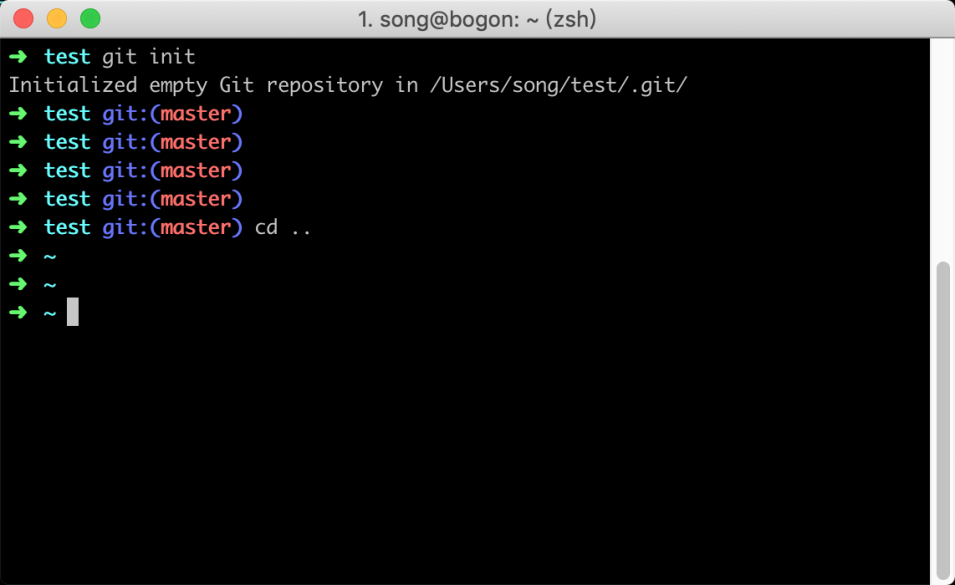

# 03-**初识Git : 本地创建一个 Git 仓库**


> 宝剑锋从磨砺出，梅花香自苦寒来。 ——佚名

在上一节内容中，我们已经将 Git 环境安装好，从这一节开始我们开始正式接触 Git 的操作命令，从最简单的开始，循序渐进。在这一节中，我们通过本地创建一个 Git 版本库来初步认识 Git 版本库，以及 Git 的一些必要的配置。

## 3.1 创建版本库

我们首先创建文件夹 `test`，这个文件夹用于版本的根目录。我们如果在 Windows 下可以单击鼠标右键，在菜单中选择新建文件夹，然后把文件夹名字改为 `test` 就可以了。如果在 Linux 或者 Mac 系统下，可以通过命令 `mkdir` 创建文件夹，参考命令如下：

```
mkdir test && cd test
```

接下来不管什么系统，都打开终端，并在终端中通过 `cd` 命令的方式进入文件夹，然后就可以使用 `git init` 命令初始化一个仓库了，参考执行命令如下：

```sh
git init
```

执行命令之后，Git 会进行一系列的初始化操作，当你看到类似 `Initialized empty Git repository in /Users/song/test/.git/` 提示，说明已经创建一个版本库成功，同时你会发现光标左侧比之前多出几个字符 `git:(master)`，这是因为我们在第二节的时候安装了 `oh-my-zsh` 主题所导致。

当 `oh-my-zsh` 发现当前目录下存在`.git` 文件夹，便会读取当前版本库的信息，并把当前版本库所在的分支名显示在光标左侧；而当你通过 cd 命令跳出版本库的目录时候，光标左侧的 `git:(master)` 提示也会随着消失，如下图所示



刚才说到初始化版本库会在当前目录中一个`.git` 的文件夹，我们可以重新进入版本库根目录，然后通过命令 `ls -al` 进行查看，如下命令所示：

```sh
➜  test git:(master) ls -al
total 0
drwxr-xr-x   3 song  staff   96  6 25 22:11 .
drwxr-xr-x   8 song  staff  256  6 25 22:11 ..
drwxr-xr-x  10 song  staff  320  6 25 22:49 .git
```

### 3.1.2 认识`.git`

在生成的 .git 目录中，里面包含了整个版本库的信息，我们可以通过命令 `cd .git && ls -al` 进入 .git 文件夹中查看具体有哪些文件：

```
➜  .git git:(master) ls -al
total 24
drwxr-xr-x  10 song  staff  320  6 25 22:11 .
drwxr-xr-x   3 song  staff   96  6 25 22:11 ..
-rw-r--r--   1 song  staff   23  6 25 22:11 HEAD
drwxr-xr-x   2 song  staff   64  6 25 22:11 branches
-rw-r--r--   1 song  staff  137  6 25 22:11 config
-rw-r--r--   1 song  staff   73  6 25 22:11 description
drwxr-xr-x  13 song  staff  416  6 25 22:11 hooks
drwxr-xr-x   3 song  staff   96  6 25 22:11 info
drwxr-xr-x   4 song  staff  128  6 25 22:11 objects
drwxr-xr-x   4 song  staff  128  6 25 22:11 refs
```

这些目录可能我们会比较陌生，在后面的章节当中我们会略有涉及，因此，在这节当中先简单了解一下：

- `HEAD` 文件指示目前被检出的分支
- `branches` 新版本已经废弃无须理会
- `description` 用来显示对仓库的描述信息
- `config` 文件包含项目特有的配置选项
- `info` 目录包含一个全局性排除文件
- `hooks` 目录包含客户端或服务端的钩子脚本
- `index` 文件保存暂存区信息
- `objects` 目录存储所有数据内容
- `refs` 目录存储分支的提交对象的指针

## 3.2 基础配置

在建立完项目的版本库之后，后续对代码的管理操作都会要求有一个身份，所以需要你在管理操作之前，配置一个昵称和邮箱，这个昵称和邮箱仅仅是在查看改动记录时候用的，和后面的鉴权没有关系。

### 3.2.1 查看配置信息

在设置昵称和邮箱之前，可以先检查一下有没有配置昵称和邮箱，查看昵称的命令如下：

```
git config user.name
```

查看邮箱的命令如下所示:

```
git config user.email
```

### 3.2.2 设置配置信息

如果执行上面的命令没有返回相应的昵称和邮箱，说明你还没有配置昵称和邮箱。那么就需要进行配置，配置昵称的命令参考如下：

```
git config --global user.name "你的昵称"
```

配置邮箱的命令参考如下：

```
git config --global user.email "你的邮箱"
```

### 3.2.3 修改配置信息

在配置中如果不小心配置错了，或者后面想修改配置的时候，是不能通过重复执行上面的设置昵称命令，来修改昵称的，邮箱修改同理。如果你多次设置昵称，它会在命令执行后提示你无法重复配置，当然也有可能不给你提示，然后导致一个 key 配置了多个 value 的问题。

修改的时候，可以通过特定的方式去修改，这里我介绍两种方法， 第一种是通过命令行，第二种是通过修改配置文件。

#### 命令行修改配置

通过命令行修改的方式比较简单，直接执行以下的命令即可，参考命令如下：

```
git config --global --replace-all user.name "your user name"
```

修改邮箱地址参考命令如下：

```
git config --global --replace-all user.email"your user email"
```

#### 修改配置文件

修改文件的方式，主要是修改位于主目录下`.gitconfig` 文件。在 Linux 和 Mac 中，可以通过 vim 命令进行直接编辑，比如 `vim ~/.gitconfig` ；Windows 系统同样位于用户主目录下，假设你当前的用户是 `administrator`，那么对应的配置文件的路径应该是 `C:\Users\administrator\.gitconfig`，可以直接使用记事本修改里边的 name 或者 email。

如果之前已经配置过昵称和邮箱的情况下，当使用 vim 或者记事本打开配置文件之后，可以看到如下配置：

```
[user]
        name = daxia
        email = 78778443@qq.com
```

在如果有重复的 name 或 email，可以将其删掉，只剩下一个就好。修改完，通过 git bash 输入 git config –list 可以查看是否修改成功了。

## 3.3 小结

这一节中主要讲到了如何创建一个本地版本库、版本库的大体结构 、基础配置方法等。

1. 在空文件夹中，可以通过命令 `git init` 创建一个本地版本库；
2. 每个版本库的根目录下，都存放着一个`.git` 的隐藏文件夹，里面包含版本库的全部信息；
3. 管理版本库必须有一个身份，需要设置昵称和邮箱。
