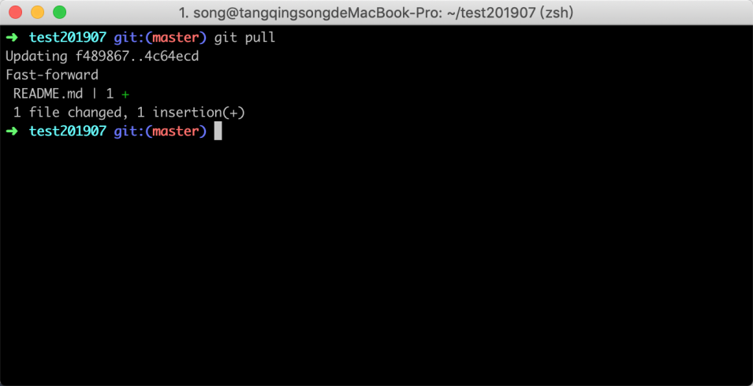
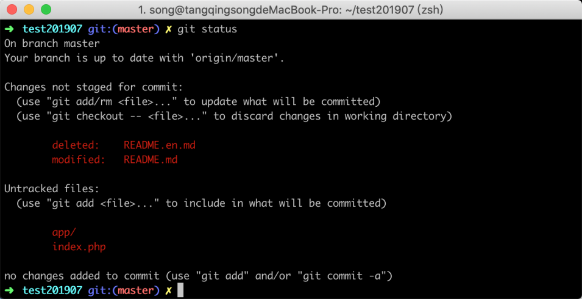
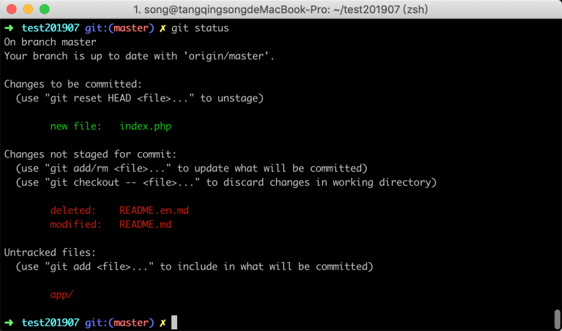
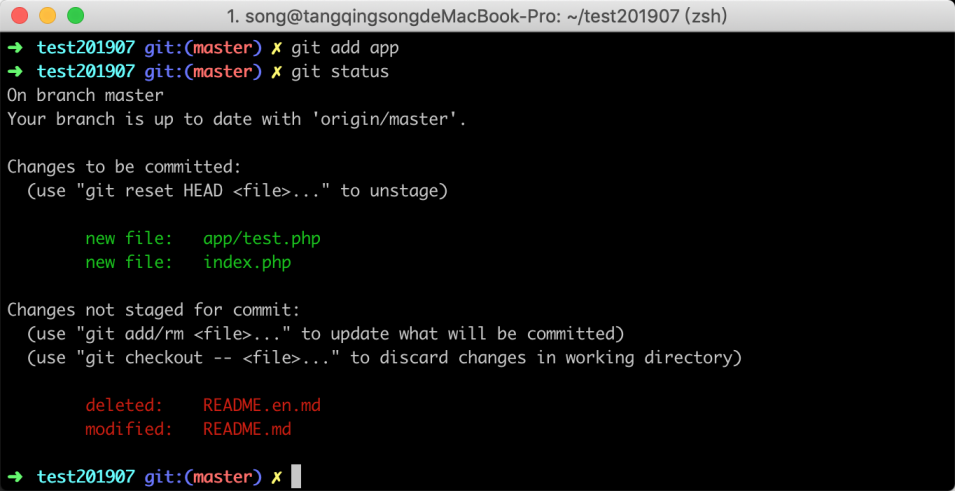
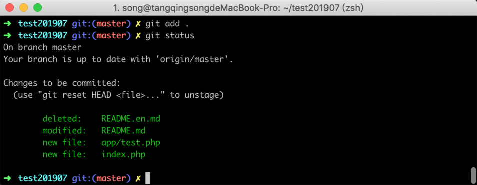
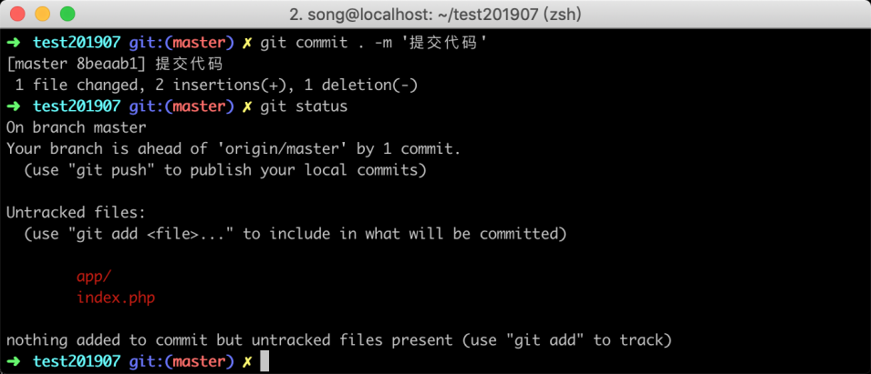
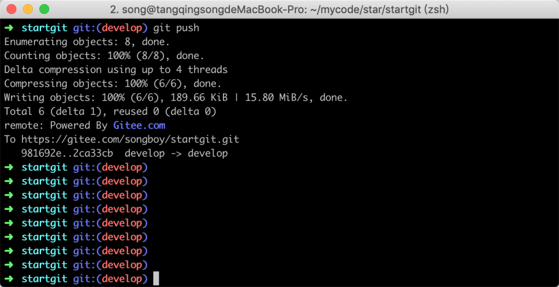

# 05-提交代码：如何把修改后的代码提交到远程仓库

> 古之立大事者，不唯有超世之才，亦必有坚韧不拔之志。 ——苏轼

在上一节中，我们学习了如何从远处拉取了一个仓库到本地，在这节中将学习如何将代码提交到版本库记录中，并将提交记录推送到远程仓库中。

将代码提交到远程仓库中，其实通常只需要两条命令即可，首先是提交到本地，然后再讲本地的记录推送到远端。但在实际工作中，为了防止本地仓库和远程仓库出现冲突，一般先让把远程代码同步到本地代码，让本地代码保持最新，然后再提交改动到本地，最后进行推送。

## 5.1 同步远程代码

一个远程仓库有可能有多人有权限推送，所以存在远程代码比你本地仓库更新，因此在提交代码之前需要先拉取服务器代码，让本地仓库保持最新的版本记录；这样做的目的是为了防止当你提交代码之后，推送到远端出现代码冲突问题，拉取远程代码参考命令如下所示：

```
git pull 
```

在终端执行完命令之后，如果有代码更新，返回的信息如下图所示：



在图中可以看到文件 `README.md` 文件增加了一行代码。

## 5.2 检查改动文件

当远端最新的代码拉下来之后，我们最好（非必须，建议每次提交前检查）通过 `git status` 命令检查一下有哪些文件被改动了，参考命令如下所示：

```
git status 
```



在终端执行完命令之后，可以看到我当前有三个文件有改动，有删除的、有添加的、也有修改内容的，图中返回的状态为英文，这里给大家翻译一下，状态有下面这几种：

1. **Untracked**: 未跟踪，一般为新增文件，此文件在文件夹中，但并没有加入到 git 库，不参与版本控制。通过 git add 状态变为 Staged.
2. **Modified**: 文件已修改，仅仅是修改，并没有进行其他的操作.
3. **deleted**： 文件已删除，本地删除，服务器上还没有删除.
4. **renamed**：文件名称被改变

如果发现无意中编辑了某一个文件，但实际上并不想改变它，这里可以使用 `git checkout 文件名`来撤销更改，参考命令如下：

```
git checkout README.md
```

撤销后，再次使用 `git status` 进行查看变动，如下图所示


在图中可以看到文件 `README.md` 已经不在变动文件列表中，说明我们已经将此文件的修改回滚成功。

## 5.3 添加文件到缓存

通过检查并将不需要改动的代码恢复后，就可以开始将需要提交的文件添加到暂存区中，添加文件到暂存区可以指定添加文件或目录，或者一次性添加全部改动到缓存。

现在先来看看提交指定文件或目录至缓存的格式，参考命令如下：

```
git add index.php
```

上面这条命令将会把 `index.php` 这个文件提交到暂存区中去，提交后使用 `git status` 可以看到它的变化，原本 index.php 红颜色的名字变成了绿色，如下图所示：



你也可以使用刚才的命令将 `app` 目录，提交到缓存中去，参考命令如下：

```
git add app
```

再次使用 `git status` 命令进行查看，结果如下图所示



会发现 app 下的 test.php 文件被添加到缓存区域中了，如果你想一次性添加所有文件，那么可以把命令这样写 `git add .`, 执行后结果如下所示：



## 5.4 提交代码

当你将所需要提交的代码都添加到缓存区域后，接下来就可以将代码提交到本地仓库中，参考命令如下所示 ：

```
git commit . -m “这是备注信息”
```

上方命令中的`.` 是代表选择所有的文件或目录，你也可以提交指定某一个文件，将`.` 换成相应的目录或文件名即可，当命令执行完毕之后，参考结果如下图所示：


此时你再次使用 `git status` 进行查看，会发现没有文件改动列表；因为你已经将改动的文件都提交到版本记录中了；而 `git status` 是基于为提交的代码最后一个版本比较的，当你提交后，两个区域的文件内容以之，所以就显示没有改动，如下图所示：



## 5.5 推送代码

当代码提交之后，在本地的工作就已经完成了，此时为了让其他人拉去你的代码，通常还需要将代码推送到远程地址去，这里我告诉大家最简单的方式，参考命令如下：

```bash
git push
```

命令执行后，效果如下图所示：


## 5.6 小结

在本节中主要讲解了怎么将改动的代码提交到版本控制器中，以及提交之后如何推送到远端服务器，知识点有以下：

1. 要将代码推送到服务器通常会经历五个步骤：更新、检查，提交 暂存，正式提交，推送
2. git 提交代码可以选择全部提交或者部分提交，全部提交可以用`.` 替代，部分提交则输入目录名或文件名
3. 提交代码之后还需要使用 `git push` 命令把代码推送到远程服务器

