# 13-reset命令：将仓库记录和恢复指定历史位置

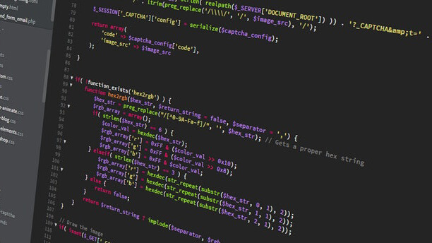

> 加紧学习，抓住中心，宁精勿杂，宁专勿多。—— 周恩来

有时候我们用 `git commit` 提交代码后发现这一次提交的的内容是错误的，需要将代码复原，这个时候常见有两种做法。

第一种是把代码错误内容修改正确，然后重新使用 commit 提交一次；第二种方法是使用 `git reset` 命令撤销上一次错误的 commit 记录。

## 13.1 覆盖代码

我们先来使用第一种比较原始的方法，会多次一次 commit 记录，我们先使用 ls 命令查看当前仓库的文件，如下图所示
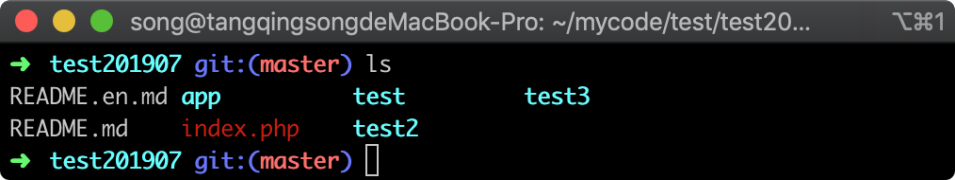

在图中可以看到有一个 `index.php` 文件，我们随意添加一些错误代码到文件当中去，并查看 git 的修改状态，参考命令如下所示：

```
echo 123123  >> index.php  && git status
```

命令执行后，Git 返回的提示信息如下图：

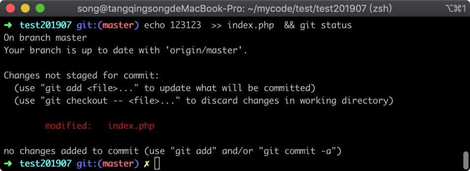

在图中可以看到 index.php 文件已经被修改，接着我们将修改通过 commit 提交到系统当中去，参考命令如下：

```
git commit . -m '新增代码 v2'
```

命令执行完毕后，返回信息如下图所示：

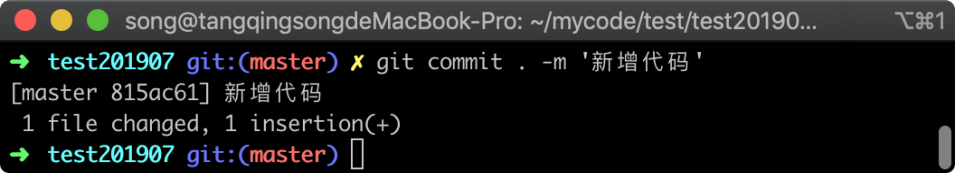

在图中可以看到有一个文件被更改，增加了一行代码，接着我们通过 `git log` 去查看版本记录，命令执行后返回结果如下图所示：

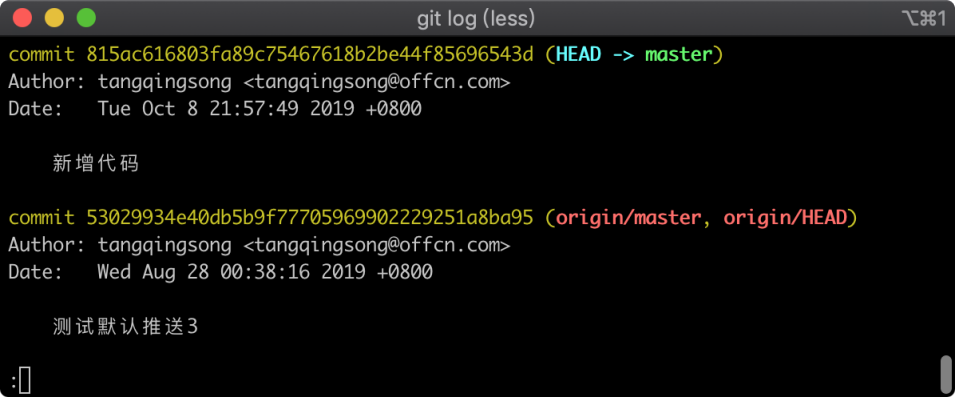

在图中，可以看到刚才的 commit 提交记录已经提交成功；就在这个时候我意识到，我刚才提交的代码有问题，需要撤销刚才的错误代码，于是我使用 `vim` 重新去修改文件，参考命令如下：

```
vim index.php 
```

使用 vim 编辑 `index.php` 后，可以看到刚才新增的代码：

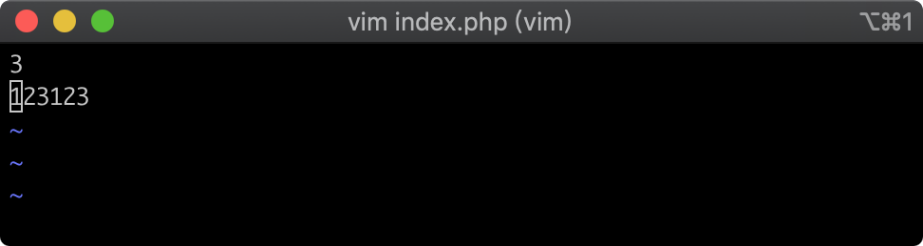

接着我将刚才新增的代码给删除，并重新使用 commit 提交代码，参考命令如下：

```
git commit . -m '新增代码 v2'
```

命令执行之后，返回信息如下图所示：

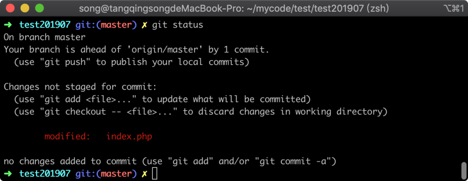

可以看到一个文件被修改，删除了一行代码的提示，至此我们的代码本身已经回滚完成，但是这整个过程是比较繁琐的，并且会多出一些没有意义的 commit 记录。

我们可以使用 `git log` 来查看记录，如下图所示：

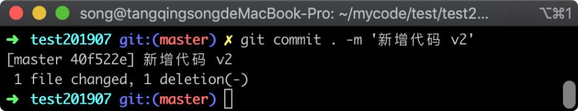

在图中我们看到刚才两条 commit 记录，但其实这两天记录是没有意义的，因为单纯让代码恢复到正确版本完全可以使用 reset 操作。

## 13.2 覆盖记录

接下来我们再使用 `reset` 命令同样来操作一次，看看有什么不同，我们同样去改一下文件，然后查看一下 git 的状态，参考命令如下：

```
echo 'reset'  >> index.php  && git status
```

命令执行之后，返回的信息如下图所示：

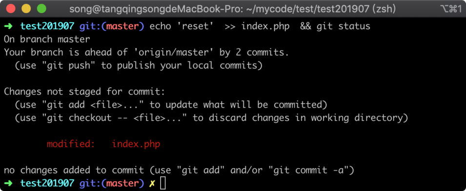

在图中可以可以看到文件以及被修改，接着我们使用 `git coomit` 命令提交代码，参考命令如下：

```
git commit . -m 'git reset测试'
```

命令执行完毕之后，返回信息如下图所示：

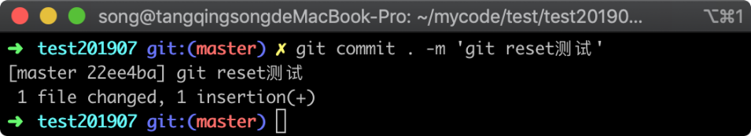

在图中可以看到一个文件被修改，新增了一行代码，至此我们要构造的环境已经成功。

现在我们需要将刚才的提交给撤销掉，可以用到 `git reset` 操作，但在操作之前，我们先找到刚才的 `commitid` 也就是哈希值，可以使用 git log 命令查看到，参考命令如下：

```
git log
```

命令执行之后，返回的版本记录如下图所示：

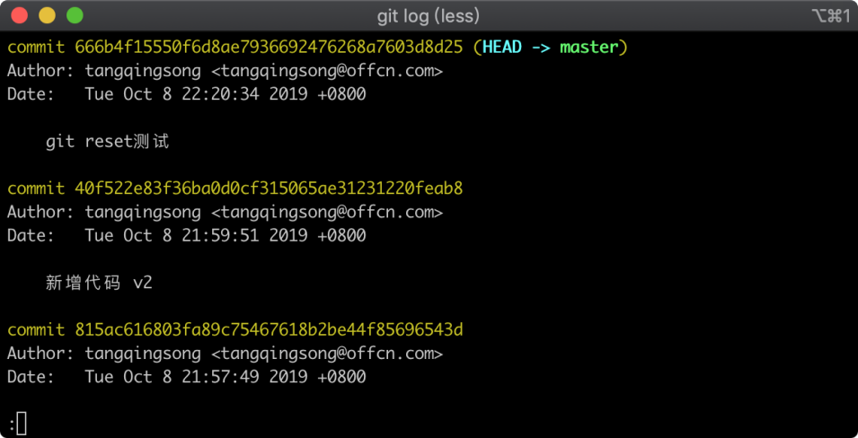

在图中可以看到刚才通过 `git commit` 命令提交的记录已经在图中显示，我们大致记住确认一下。

### 13.2.1 HEAD^ 撤销

接着我们学习一个新的命令，这个命令可以撤销我们最近一次提交，参考命令如下：

```
git reset HEAD^
```

命令执行完毕之后，返回的信息如下图所示：

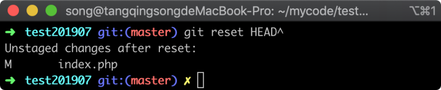

在图中可以看到提示 index.php 已经受到了 `git reset` 命令的影响，接着我们使用 `git status` 查看当前仓库状态，参考命令如下：

```
git status
```

命令执行之后，返回的信息如下图所示：


在图中可以看到 `index.php` 文件处于被修改且为工作区状态，接着我们通过 `git log` 来确认之前的提交记录还是否存在，参考命令：

```
git log
```

命令执行之后，返回的 commit 记录如下图所示：

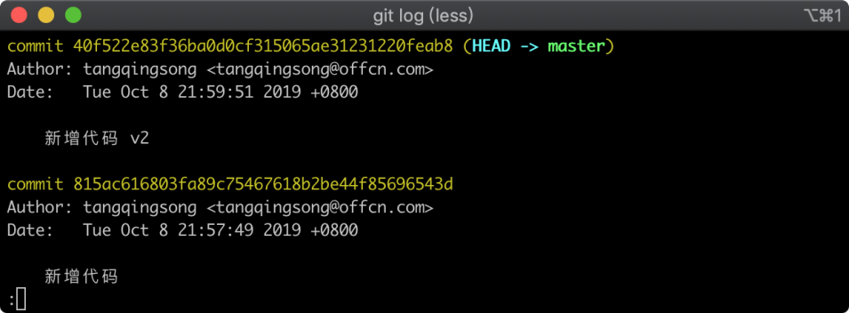

在图中可以看到提交的记录也被撤销了。

### 13.2.1 指定回滚位置

除了上面使用 `git reset HEAD^` 方式，还可以撤销到指定位置，在操作之前我们需要先通过查看 commit 记录的方式找到 commitid，我们将需要恢复到的版本 commit，将它复制下来，接着使用 `git reset` 命令将其回滚到此位置，参考命令如下所示：

```
git reset 815ac616803fa89c75467618b2be44f85696543d
```

命令执行完成之后，返回的信息如下图所示：

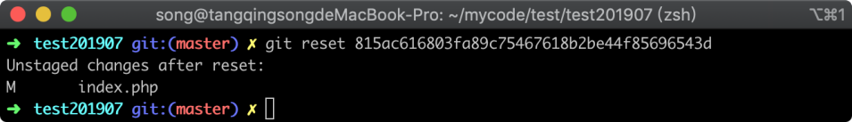

在图中同样可以看到 `index.php` 受到了影响，接着我们用 `git log` 去验证一下，参考命令如下

```
git log
```

执行命令之后，返回的 `commit` 记录如下图所示：

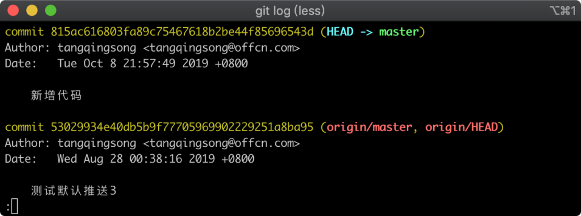

在图中我们看到之前的 `commit` 记录已经不见了，说明我们使用 `git reset` 是有效果的，到目前为止虽然 commit 记录已经撤销。

但是代码其实仍然是没有变化的，我们这里可以使用 `git checkout 文件名` 来撤销文件修改，撤销修改后再通过 `git status` 去确认当前状态，参考命令如下

```
git checkout index.php  && git status
```

命令执行完毕之后，返回的仓库状态信息如下图所示：

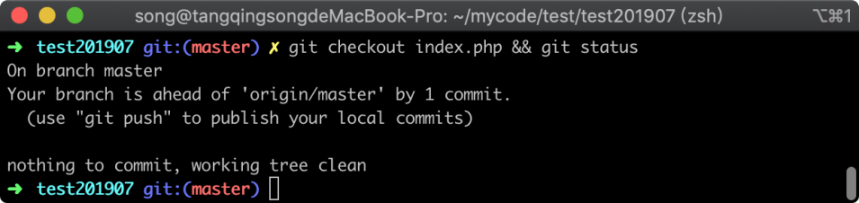

在图中我们看到此时仓库中也没有提示有文件被修改过，完美的实现了撤销错误的 commit 提交。

## 13.3 小结

在这一节当中主要讲了将仓库代码回滚的两种方式，着重学习了 `git reset` 命令，这个命令可以撤销 commit 记录；提到两种 reset 的使用方法：

1. `git reset HEAD^` 撤销最近一次的 commit 记录
2. `git reset commit` 将 `commit` 之后的记录全部撤销