# 21-merge合并操作：团队协作必备技能


> 耐心是一切聪明才智的基础。——柏拉图

合并代码是Git在团队协作中一个非常重要的功能，在这一节当中主要讲解合并代码的作用、如何实现代码合并、以及合并中的冲突解决方法等。

## 21.1 构建环境

我公司为例，有三个分支，develop、test、master三个分支；develop为开发分支，日常在这个分支下开发功能，test分支为功能测试分支，面向测试同事，master分支为生产环境的代码，面向用户；

在接到新功能之后，大家会在 develop 分支下共同开发，觉得没问题之后，会通过`git merge`将 develop 代码合并到 test 分支中，然后发布到测试服务器，当测试通过后，会再次将 test 分支的代码合并到 master 分支中去。

### 21.1.1 构建环境

为了演示代码合并的整个流程，我们构造一个合并代码的环境，用来演示代码合并，首先我们在 master 分支上新建分支两个分支 `test`、`develop`，参考命令如下：

```
git checkout -b test 
git checkout -b develop
```

命令执行完毕之后，Git 返回的文件状态信息如下图所示：

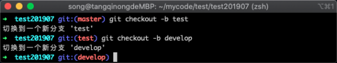

在上图中可以看到一件新建两个分支成功，并且切换到了`develop`分支中，此分支我们一般用于开发；下面我将在此分支中修改配置文件，执行命令如下：

```
mkdir config && echo '<?php echo 123;' > config/config.php
```

命令执行完毕之后，会创建一个文件夹和一个配置文件，并写入配置内容，终端如下图所示

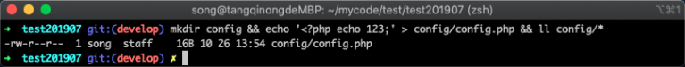

在上图中可以看到`config.php`文件已经创建完毕，我们将此文件提交到新版本中，提交代码参考命令如下：

```
git add . && git commit . -m '新增配置文件'
```

命令执行完毕之后，Git 返回信息如下图所示

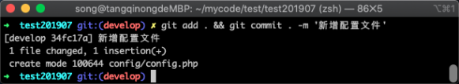

在上图中可以看到已经将配置文件成功提交到新版本当中，但这个提交只是在 develop 分支上，如果我们想让测试人员给我们测试还需要发布到`test`分支当中，这个时候我们就可以进行合并操作。

## 21.2 合并代码

为了让测试人员能够测试到我们开发的功能，我们需要将`develop`分支的新版本同步到`test`分支中，这个同步的过程有多种方式，但最常见的就是使用`git merge`命令，也就是合并代码操作；
在执行代码合并的时候，我们需要将分支切换到`test`分支上，执行命令如下：

```
git checkout  test 
```

命令执行完毕之后，终端的信息如下图所示：

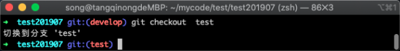

在上图中可以看到已经成功切换到`test`分支中，现在就可以使用`git merge`命令将`develop`分支合并到`test`分支中，执行的命令如下所示：

```
git merge develop
```

命令执行完毕之后，如果两个分支以往的历史没有差异部分，则会将`develop`提交的版本直接复制过来，如下图所示：

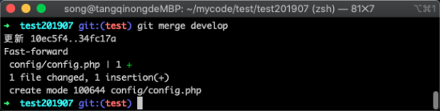

在上图中可以看到在`develop`分支中提交的`config.php`文件被合并过来，我们为了验证一下这个提示信息，可以去查看配置文件，执行命令如下：

```
ls config/*
```

命令执行完毕之后，会列出`config/`目录下的文件信息，如下图所示

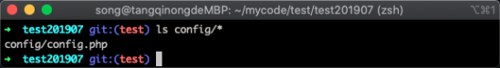

在上图中可以看到文件确实已经存在，说明文件已经成功合并过来。

## 21.3 代码冲突

现在我们要看一种新情况，`test`分支是给测试人员测试用的，而`develop`分支是给开发人员使用，因此代码所处的环境略有差异。

### 21.3.1 构建冲突环境

比如说数据库的连接地址和`develop`的开发环境是不一样的，因此我们可能会直接在`test`分支中去修改配置文件，修改配置文件命令如下：

```
echo 'idaxia' > config/config.php 
git commit . -m '修改配置文件'
```

在修改完配置文件之后，同样需要提交到`test`分支，如下图所示：

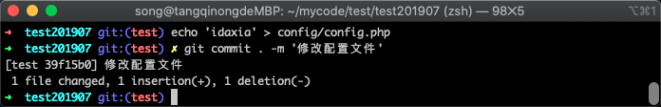

在上图中可以看到修改的信息已经提交到`test`分支当中，于是继续回到`develop`分支当中去开发新功能， 切回 develop 分支执行命令如下：

```
git checkout  develop 
```

命令执行完毕之后，Git 返回信息如下图所示：

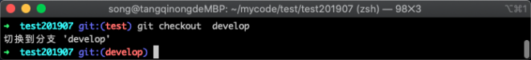

在上图中可以看到已经成功切换回`develop`分支中，在开发途中我发现我之前填写的信息不正确，想修改配置文件，执行了如下命令：

```
echo 'qingsong' > config/config.php  
git commit . -m '修改配置文件'
```

修改配置文件内容之后，再次进行了 commit 提交操作，如下图所示：

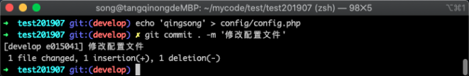

在上图中可以看到已经提交成功；

### 2.3.2 冲突现场

按照我们的合并流程，我们之后必定会切换到 test 分支，然后将`develop`的代码合并过去。但这个时候就产生了一个新的代码冲突问题，我们接着往下看，首先将当前分支切回`test`，执行命令如下：

```
git checkout test
```

命令执行完毕之后，如下图所示：

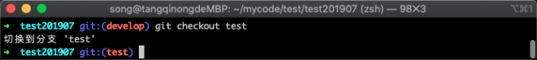

在上图中可以看到已经切换到了`test`分支中，然后我们继续使用`git merge`进行分支合并，参考命令如下所示：

```
git merge develop
```

命令执行完毕之后，Git 返回的合并信息如下图所示：

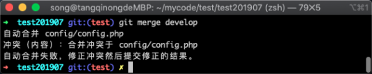

在上图中可以看到提示代码冲突，因为我们在两个分支中都提交了新的版本，而且还在同一个文件同一行当中，Git 无法判断我们需要使用哪一个版本，便会给出这样的提示。

### 21.3.3 冲突解决

遇到这种代码冲突时候，需要我们人工去解决合并冲突，可以使用 vim 命令删除冲突中的多余代码，参考命令如下：

```
vim config/config.php
```

使用 vim 打开冲突的文件之后，可以看到冲突的内容，如下图所示：

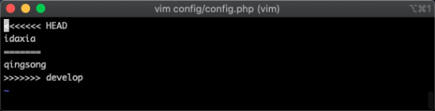

在上图中，可以看到冲突符号以`<<<<<<`开始，以`======`符号为分界符号，上面的是当前`test`的，下面的是`develop`分支的，最后以`>>>>>>`为结束符；
我们需要删除多余代码和冲突发，只保留我们需要在当前分支需要保留的内容即可，删除多余的内容后如下图所示：

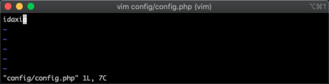

在上图中可以看到我只保留了 idaxia 这一部分内容，其他内容因为不需要，所以都删除了，接着我们需要使用`git add`将冲突的文件重新添加到工作区中，并提交一个新的版本，参考命令如下所示：

```
git add .  && git commit -a
```

解决冲突后这里提交版本的方式稍微有一些区别，会在`git commit` 后面增加一个`-a`参数，而且不需要`-m`参数；但是执行之后会单独多出一个步骤让你填写冲突解决的备注信息，如下图所示：

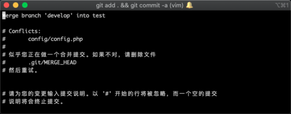

在上图中会默认生成一些备注信息，你也可以增加会删减部分信息，然后用`:wq`或者`:x`进行保存并退出，退出之后会新增加一个版本，可以使用`git log`命令查看版本记录，参考命令如下：

```
git log
```

命令执行之后，返回的信息如下图所示：

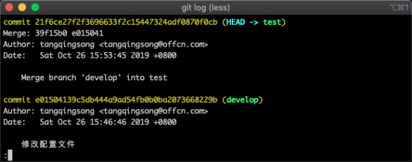

在上图中可以看到多出两个个版本信息，最下面一个是来自于`git merge`合并的消息，而最上面一个则来自于解决冲突后新提交的一个版本。

## 21.4 避免代码冲突

上面虽然解决了代码冲突问题，但是操作起来比较繁琐，而且还容易解决冲突的过程当中出错，所以并不是一个上策。

### 21.4.1 避免冲突原理

在 Git 中给我们提供了此类问题的解决办法，当一个文件需要在不同分支中独立时，可以针对此文件做一些额外设置，这样便不会出现冲突问题，我们现在切回 develop 分支，参考命令如下：

```
git checkout develop
```

命令执行完毕之后，返回的信息如下图所示：

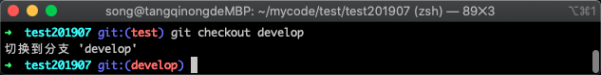

在上图中可以看到已经切换回 develop 分支中，接下来我需要针对配置文件`config.php`文件做一些配置，这里需要用到一个 Git 仓库当中的特殊文件`.gitattributes`和之前的忽略文件类似，它们都是 Git 中的一个特殊文件;我们在里面增加文件并设置参数，当 Git 在触发动作的时候会检查这个规则列表，比如我们接下来设置`merge=ours`的参数便是合并是排除它，参考命令如下所示：

```
echo '/config/config.php merge=ours' > .gitattributes && cat .gitattributes
```

命令执行完毕之后，会往`.gitattributes`文件里面写入`/config/config.php merge=ours`内容，如下图所示：

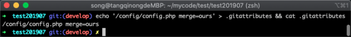

在上图中可以看到，通过 cat 命令已经将文件内容显示出来了，我们先将此文件提交一个版本，执行命令如下所示：

```
git add . && git commit . -m '忽略合并测试'
```

命令执行完毕之后，返回的信息如下图所示：

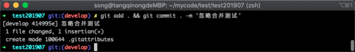

在上图中可以看到 ，已经将`.gitattributes`提交成功。

### 21.4.2 制造冲突环境

接下来我在`develop`修改配置文件`config.php`文件提交，然后去`test`分支中修改也提交，再次进行合并，验证是否还会冲突；现在我首先随意修改配置文件，执行命令如下所示：

```
echo 'tang' > config/config.php && cat config/config.php
```

命令执行完毕之后，会将配置文件的内容修改并查看，如下图所示：

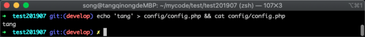

在上图中可以看到，文件内容已经修改成功，接下来我将`config.php`的修改也提交到新版本当中，执行的命令如下所示：

```
git add . && git commit . -m '忽略合并测试'
```

命令执行完毕之后，Git 提示的如下图所示：

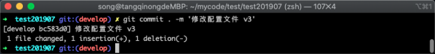

在上图中可以看到 ，已经成功将修改提交的新的版本当中；接着我切回到test分支，然后也去修改`config.php`的内容，切回`test`分支的命令如下所示：

```
git checkout  test 
```

命令执行完毕之后，返回的信息如下如下图所示：

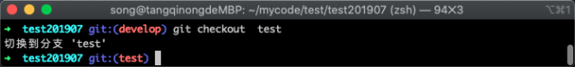

在上图中可以看到已经成功切换到了`test`分支当中，下面我同样随意修改配置文件的内容，执行命令如下所示：

```
echo '测试忽略效果' > config/config.php && cat config/config.php
```

命令执行完毕之后，会将新内容写到`config.php`文件中并查看文件的内容，如下图所示：

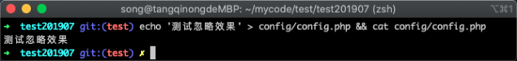

在上图中可以看到已经修改配置文件内容成功，然后同样提交到新版本中，参考命令如下所示：

```
git add . && git commit . -m '忽略合并测试 v4'
```

命令执行完毕之后，返回的提示信息如下图所示：

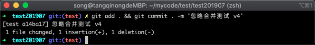

在上图中可以看到在 test 分支中的修改已经成功提交到新版本中。

### 21.4.3 验证屏蔽冲突效果

下面我们就开始合并代码，查看合并时是否还会冲突，合并代码的命令如下所示：

```
git merge develop
```

命令执行完毕之后，出现了 vim 的编辑页面如下图所示：

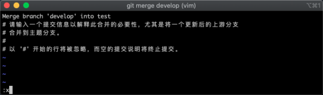

在上图中可以看到直接展示了填写备注信息的提示界面，而没有之前提示的冲突信息，我们使用`:x`进行保存并推出，接着看 Git 给出的提示信息，如下图所示：

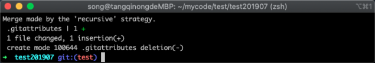

在上图中可以看到提示我们增加了一个文件`.gitattributes`文件，并没有变更`config.php`文件，说明两个分支成功保留了特定文件的独特性；为了验证我们的猜想，我们使用`cat`命令查看配置文件是否被修改，执行的命令如下所示：

```
cat config/config.php
```

命令执行完毕之后，展示的信息如下图所示：

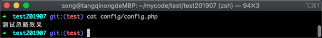

在上图中可以看到`config.php`里面的内容依然是我们刚才在`test`分支中提交的内容，说明猜想是成功的；

## 21.5 合并代码到正式环境

假设此时测试人员测试通过后，我们需要将代码发布到正式的生产环境，我们这个时候就切换到 master 分支中去，然后进行合并代码，此时 master 应该从 test 分支中进行合并，而不是从 develop 分支合并，因为 test 分支才是稳定的版本，切换到`master`分支执行命令如下：

```
git checkout master
```

命令执行完毕之后，Git 返回的信息如下图所示：

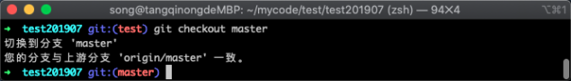

从上图中可以看到已经成功切换到 master 分支中，接下来我们把 test 分支合并到 master 分支中去，执行的命令如下所示：

```
git merge test
```

命令执行完毕之后，Git 返回的信息如下图所示：

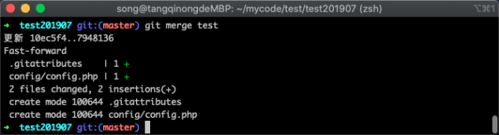

在上图中可以看到两个文件都被合并了过来，虽然我们在`.gitattributes`文件中设置忽略`config.php`文件的冲突，但是在不冲突的情况依然会进行合并的。

## 21.6 小结

主要讲解了团队协作的模式，合并代码的操作流程，合并代码冲突的解决方法，需要注意以下几点：

1. 代码合并时注意合并的次序，应该是`开发分支`=>`测试分支`=>`生产分支`；
2. 尽量分模块编写代码，减少多人同时编辑一个文件的几率，减少冲突概率；
3. 配置文件应该使用`.gitattributes`进行标注，避免代码冲突问题。
