# 28-代码冲突解决：多人提交代码发生冲突解决方法


> 梦想只要能持久，就能成为现实。我们不就是生活在梦想中的吗？——丁尼生

在团队协作开发中很难完全避免代码冲突问题，第一次遇到冲突时候往往不知道怎么解决，在这节内容里面我将团队协作中遇到的三种冲突解决思路和流程，分别是：拉取远程仓库时候的冲突、`rebase` 复制其他分支版本冲突、暂存区冲突等，合并代码冲突解决方法在第 20 节中已经提到，在这一节中将不再复述。

## 28.1 与远程冲突

我们平时在提交代码之前通常会拉取一下代码，所以拉取代码命令用的比较多，冲突也比较多常见，下面我把一个代码仓库复制一份出来，分别称之为 `a仓库`和 `b仓库`，然后分别模拟两个用户平时的提交流程，复现一下冲突场景，然后用来演示冲突解决方法，执行复制文件夹命令如下所示：

```shell
cd ../  && cp -r test201907 test201911  && ls -al
```

命令执行完毕之后，返回的信息如下图所示：

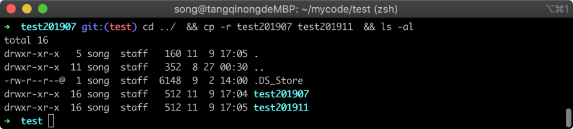

在上图中，可以看到已经将仓库复制了一份出来，接下来我进入 `a仓库`并在里面修改文件，执行命令如下所示：

```shell
cd test201907 && echo 11111111 > bb.txt && git status
```

命令执行完毕之后，Git 返回的工作区修改状态如下图所示：

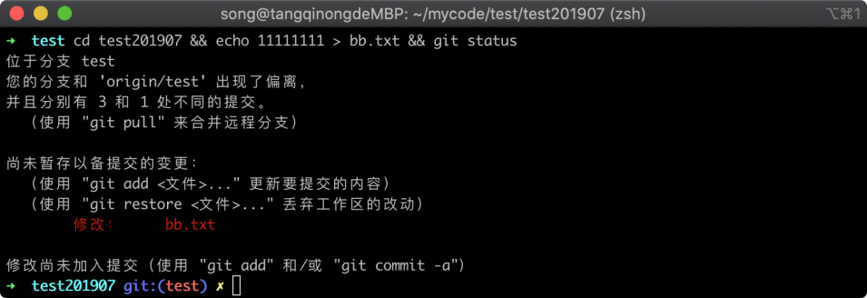

在上图中可以看到文件 `bb.txt` 已经被修改，我把工作区的修改提交到一个新版本并推送到远程仓库当中，提交并推送所执行的命令如下所示：

```shell
git commit . -m '冲突解决v1'  && git push
```

命令执行完毕之后，Git 远程仓库返回的提示信息，如下图所示：

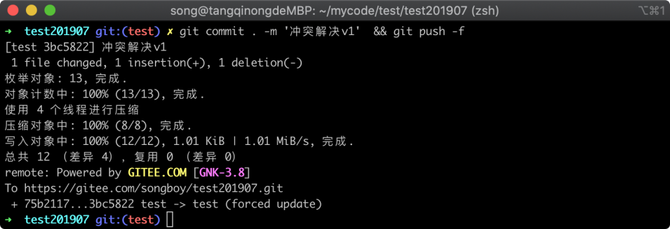

在上图中，可以看到已经改动推送到远程仓库当中，接着进入 `b仓库`中，继续修改代码然后提交到新版本中，执行命令如下所示：

```shell
cd ../test201911 && echo 22222 > bb.txt && git commit . -m '冲突解决V2'
```

命令执行完毕之后，Git 返回的信息如下图所示：

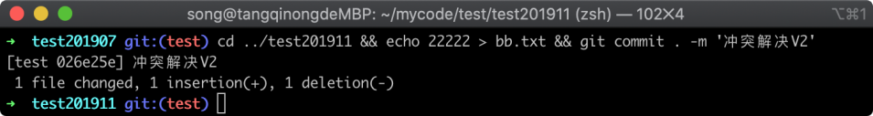

在上图中，可以看到已经将工作区的修改提交到新版本中，接着我们使用 `git pull` 命令拉取代码便会产生冲突，因为远程仓库也修改了 `bb.txt` 文件，而本地仓库也修改了此文件，Git 不知道以哪一个版本为准，执行命令如下所示：

```shell
git pull
```

命令执行完毕之后，Git 返回的信息如下图所示：

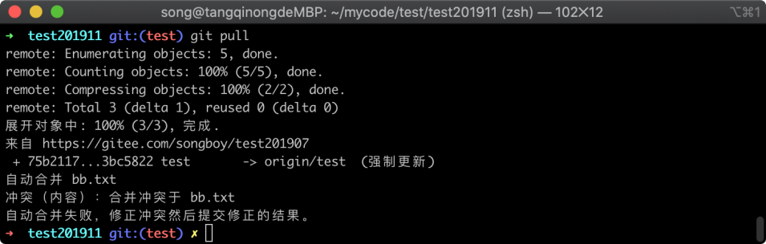

在上图中可以看到拉去远程代码成功了，但是提示自动合并冲突问题，这个时候需要我们手动去编辑文件，将需要的版本保留，不需要的代码删除，这里我使用 `vim` 命令编辑冲突文件，执行命令如下所示：

```
vim bb.txt
```

命令执行之后，便可以将不需要的代码删除，vim 编辑框如下图所示：

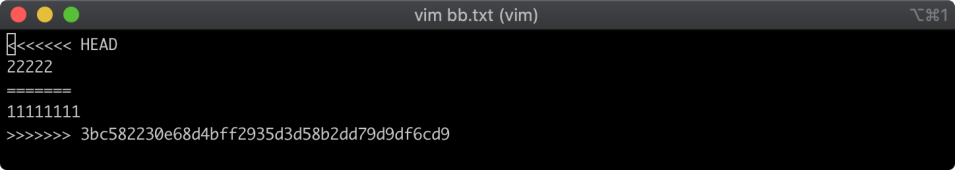

在上图中可以看到冲突的两个版本内容，远程的版本在下方，而本地的版本在上方，我们只保留 `22222`，然后保存并退出，接着执行 `git commit -a` 命令就可以完成解决冲突，执行命令如下所示：

```
git commit -a
```

命令执行完毕之后，Git 返回的信息如下图所示：

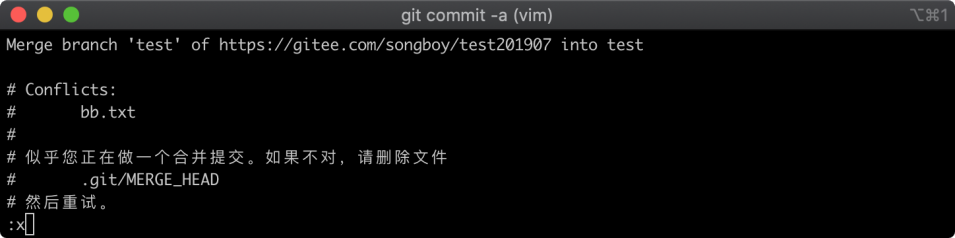

在上图中可以看到 Git 需要输入备注信息，这里可以填写代码冲突解决的一些备注信息，也可以使用默认信息，然后`:x` 保存并退出即可，此时就已经成功解决完冲突，我们可以通过 `git log` 命令查看版本记录列，执行命令如下所示：

```
git log
```

命令执行完毕之后，Git 返回的版本列表如下图所示：

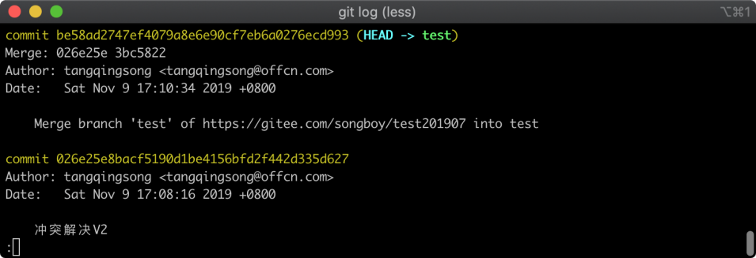

在上图中可以看到此时多出了一个 `Merge branch` 的版本记录，这个便是我们解决冲突后所生成的，到此我们已经解决完代码冲突问题。

## 28.2 rebase 冲突

当我们使用 `git rebase` 命令复制另外一个分支的版本记录到当前分支时候也有可能产生代码冲突问题，我们同样使用一个实例进行演示；

我们在两个分支中，同时去修改同一个文件并且同一行代码，这样 Git 就不能自动选择版本，从而制造一个冲突出来，我们再看看 `rebase` 代码冲突如何解决，首先切换到 `test` 分支中，执行命令如下所示：

```
git checkout test
```

命令执行完毕之后，Git 返回的信息如下图所示：

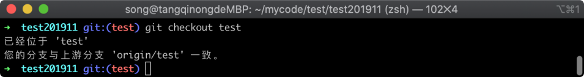

在上图中，可以看到已经成功切换到 `test` 分支当中，接着我们随意修改一个代码文件，这里以 `aa.txt` 文件为例，执行命令如下所示：

```
echo 33333333 > aa.txt  && git status
```

命令执行完毕之后，Git 仓库的文件状态如下图所示：

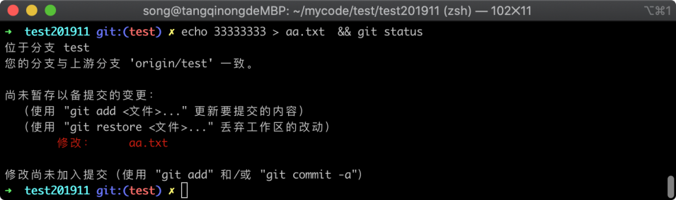

在上图中可以看到文件 `aa.txt` 已经被修改，我们将修改的内容提交到一个新版本中去，执行的命令如下所示：

```
git commit . -m '代码冲突解决 v3'
```

命令执行完毕之后，Git 返回的信息如下图所示：

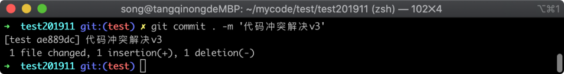

在上图中可以看到已经提交工作区的修改成功，接着我们切换到 `develop` 分支当中，执行命令如下所示：

```
git checkout develop
```

命令执行完毕之后，Git 返回的信息如下图所示：

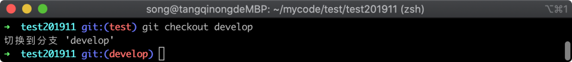

在上图中可以看到已经切换到 `develop` 分支成功，接着修改 `aa.txt` 文件并提交一个版本，执行修改文件命令如下所示：

```
echo 4444444 > aa.txt  && git status
```

命令执行完毕之后，Git 仓库的文件状态如下图所示：

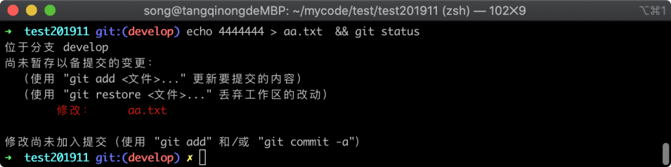

在上图中可以看到 `aa.txt` 文件已经别修改，同样我们将工作区的改动提交到新版本当中，执行命令如下所示：

```
git commit . -m '代码冲突解决 v4'
```

命令执行完毕之后，Git 返回的信息如下图所示：

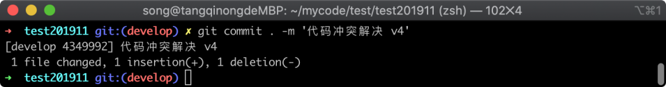

在上图中可以看到提交新版本已经成功，现在我们切换到 `test` 分支中去，然后使用 `git rebase` 命令将刚才在 `develop` 分支的提交复制到 `test` 中去，执行切回到 `test` 分支的命令如下所示：

```
git checkout test
```

命令执行完毕之后，Git 返回的信息如下图所示：

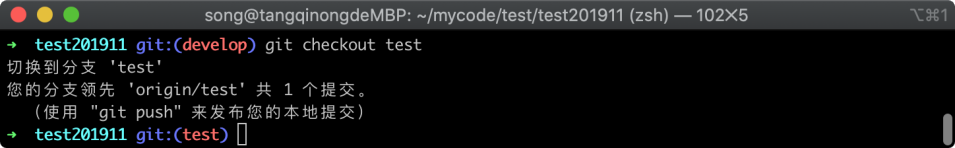

在上图中可以看到已经切换到 `test` 分支当中去，现在我们使用 `git rebase` 命令复制后，应该会出现代码冲突情况，执行命令如下所示：

```
git rebase develop
```

命令执行完毕之后，Git 返回的信息如下图所示：

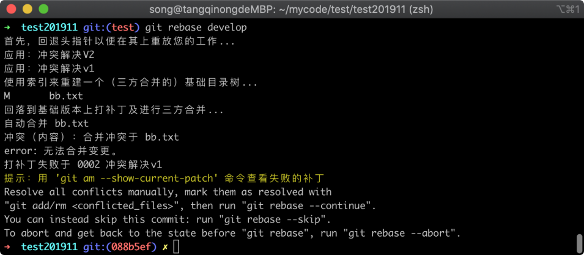

在上图中可以看到果然出现了代码冲突问题，我们接下来就来看看如何 `git rebase` 导致的代码冲突，同样我们首先使用 `vim` 命令，只保留正确的代码，将不正确的代码删除，执行命令如下所示：

```
vim aa.txt
```

命令执行完毕之后，vim 界面如下图所示：

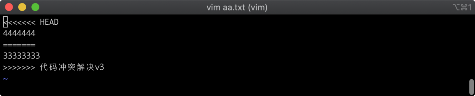

在上图中可以看到冲突的具体内容，我们将上面的 `44444444` 保留，其他不需要的内容全部删除，然后让 `git rebase` 的任务继续执行，这个时候我们需要使用下面的命令来触发：

```
git add . && git rebase --continue
```

命令执行完毕之后，Git 返回的信息如下图所示：

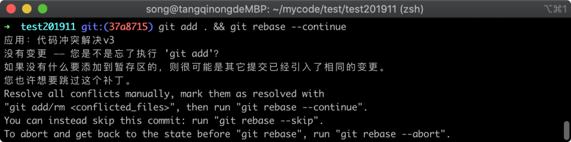

在上图中可以看到 Git 提示我们没有改动，说明我们的 `git rebase` 命令还未完成，还需要我们接着处理。不过一般绝大部分情况下只要我们通过 `vim` 清理完不需要的代码保存并退出之后就完事了，我们接着往下看如何处理这种情况。

> 这里出现没有改动，是因为 `git rebase` 命令先将自己的差异版本记录拿到一边去，然后将 `develop` 分支的改动复制进来，然后再将自己差异的版本记录插入到末尾，但是我们改动保留了内容 `4444444`，因此就会出现这个提示，具体可以参考第 24 节中的 `Git rebase` 命令。

当出现上述提示时，我们可以使用 `git rebase --skip` 命令进行忽略，执行命令如下所示：

```
git rebase --skip
```

命令执行完毕之后，Git 返回的信息如下图所示：

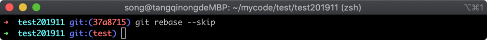

在上图中可以看到已经显示了 `test` 的分支名称，说明 `git rebase` 命令已经执行完成。

## 28.3 暂存区冲突

在将工作区的改动暂时存储起来的时候一样，也会出现代码冲突问题，我们以一个小例子为例，首先切换到 `develop` 分支中，执行命令如下所示：

```
git checkout develop
```

命令执行完毕之后，Git 返回的信息如下图所示：

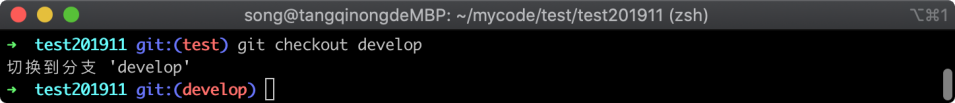

在上图中可以看到已经切换到了 `develop` 分支中，我们随意修改一个代码文件，执行命令如下所示：

```
echo 55555 > aa.txt && git status
```

命令执行完毕之后，Git 仓库的文件状态如下图所示：

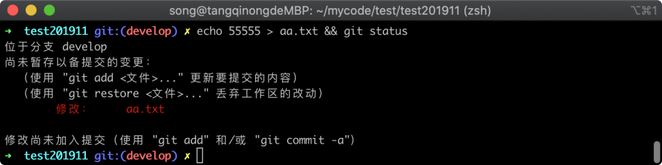

在上图中可以看到 `aa.txt` 文件被修改，此时我们使用 `git stash` 命令将修改临时存储起来，执行命令如下所示：

```
git stash
```

命令执行完毕之后，Git 返回的信息如下图所示：

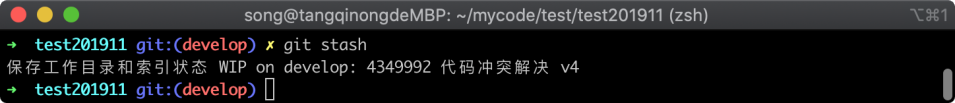

在上图中可以看到已经将修改暂存成功，接着我再一次去编辑 `aa.txt` 文件，然后将内容改为与之前不一样的内容，执行命令如下所示：

```
echo 66666 > aa.txt && git status
```

命令执行完毕之后，Git 仓库的文件状态如下图所示：

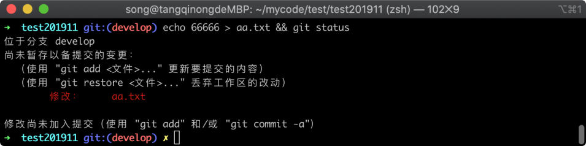

在上图中可以看到 `aa.txt` 文件处于修改状态了，现在我们使用 `git commit` 命令将这个修改提交到新版本中，执行命令如下所示：

```
git git commit . -m '代码冲突解决 v5'
```

命令执行完毕之后，Git 返回的信息如下图所示：


在上图中可以看到已经成功，将工作区的改动提交到新版本中了，在这个基础上我再来使用 `git stash apply` 命令从暂存区恢复修改，执行命令如下所示：

```
git stash apply
```

命令执行完毕之后，Git 返回的信息如下图所示：

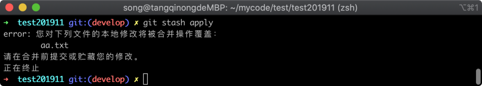

在上图中可以看到 Git 提示了代码冲突问题。

### 28.3.3 处理 stash 冲突

我们先使用 `git status` 查看文件状态，看看工作区当前处于什么状态，执行命令如下所示：

```
git status
```

命令执行完毕之后，Git 仓库的文件状态如下图所示：

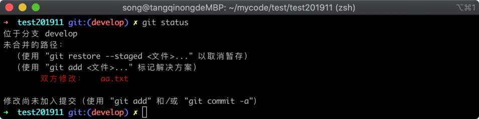

在上图中可以看到 `aa.txt` 文件为`双方修改`，说明这个文件存在冲突问题，我们同样使用 vim 命令将里面不需要的代码删掉，留下需要的部分即可，执行命令如下所示：

```
vim aa.txt
```

命令执行完毕之后，Git 冲突的代码如下图所示：

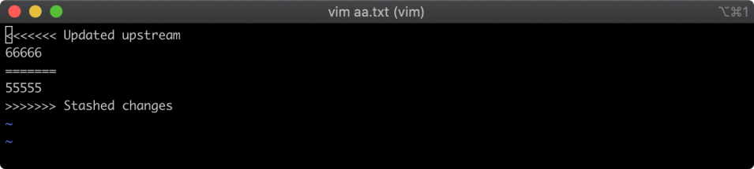

在上图中可以看到暂存区的改动与之前 `git commit` 提交的版本存在冲突，我们保留其中一份即可，然后使用 `git add` 命令将工作区的修改提交，再查看文件状态，执行命令如下所示：

```
git add . && git status
```

命令执行完毕之后，Git 仓库的文件状态如下图所示：

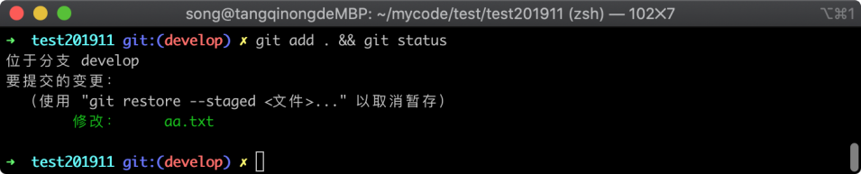

在上图中可以看到 `aa.txt` 文件已经不再处于`双方修改`的状态了，此时我们按照正常流程开发即可。

## 28.4 小结

在这一节中，主要讲解了如何代码冲突的原因，以及处理代码冲突的方法，从代码冲突的过程来看代码冲突。通常是因为一个文件在两个地方（分支或暂存区）被修改，然后又需要在一个地方进行合并，就会让 Git 无法确定使用那一个版本，从而产生代码冲突，让开发者自己来判断，解决代码冲突。

解决代码冲突通常需要去编辑冲突的文件，将需要的代码进行保留，不需要的代码给删除，清理完不需要的代码之后需要通知 Git 让它继续执行任务，不同场景的冲突，通知 Git 的方式并不一样，分为以下几种：

1. `git merge` 和 `git pull` 命令导致的冲突，处理完冲突后使用 `git commit -a`；
2. `git rebase` 命令导致的冲突，处理完冲突之后使用 `git rebase --continue` 或 `git rebase --skip`；
3. `git stash apply` 命令导致的冲突，处理完冲突之后使用 `git add .` 即可。
