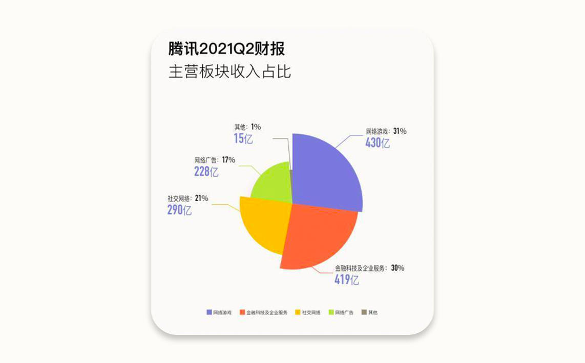
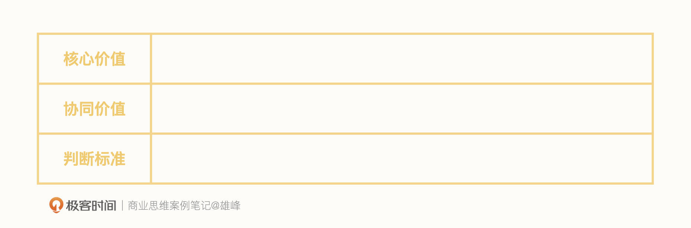
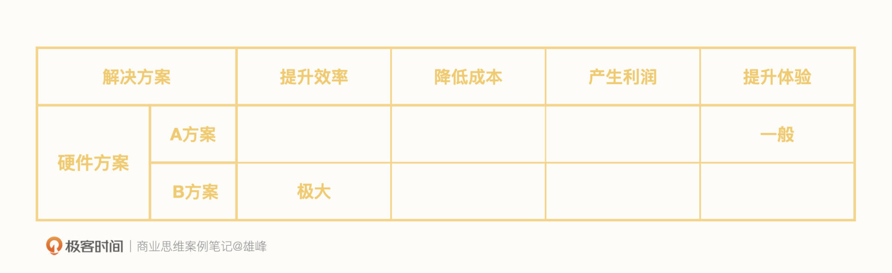
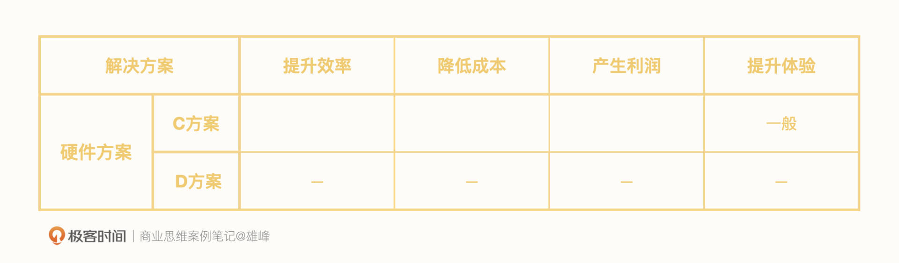
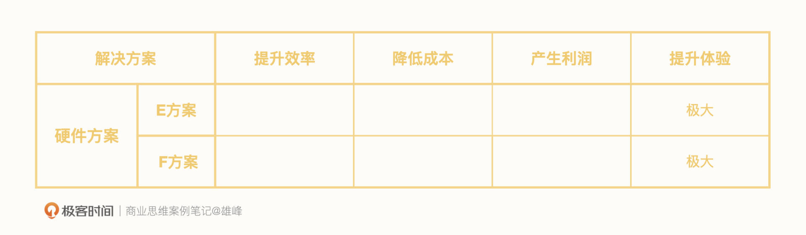
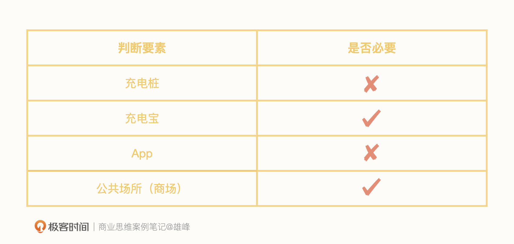
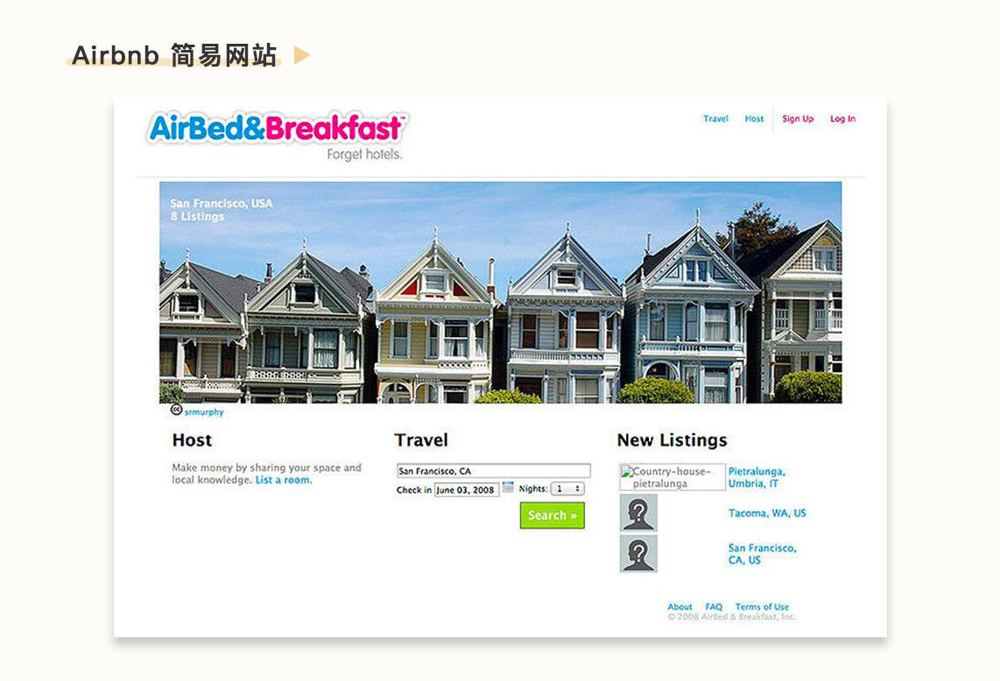

# 07-练习课：如何判断自己的业务是否靠谱？

<audio controls="" title="07-练习课：如何判断自己的业务是否靠谱？">
  <source
    id="mp3"
    src="/mp3/business-thinking/07-练习课：如何判断自己的业务是否靠谱？.mp3"
  />
</audio>

你好，我是雄峰。本节课是我们价值创造篇的第五课，这是一节练习课。今天我们要学习的是如何判断自己的业务是否靠谱。

作为这个模块最后一讲，也是最关键的一讲，我想强调一下它对你的三个关键价值：

1. **选择靠谱的业务。** 跳槽或者内部换新业务的时候，选择那个更靠谱的，可以长期拿钱且后续能发生行业溢价的业务，往往才是最关键的。选择靠谱的业务，能让自己事半功倍，趋吉避凶，起码裁员的时候不会是第一批。

2. **提升做事的正确性。** 即便选择了靠谱的业务或赛道，也并不代表你所处的公司或者团队一定能成功，还有一种失败是解决方案本来就是错的。怎么做，也是“靠谱”的一部分。

3. **多一些重来的机会。** 假设在实际的工作当中，你领到了一个很难完成的任务，短时间内你把能想到且行之有效的方案都尝试了，即使失败了，我相信你的老板也会理解你。

我们都希望这三个关键价值能够真正发挥作用。不过，靠谱的业务是怎么选择出来的？什么样的解决方案才是靠谱的呢？那些更多的机会，到底要怎么去验证它们呢？现在，我们就从第一个关键价值的解决方案开始说起。

## 方向：为什么要有这个业务？

判断业务是否靠谱的第一个点：为什么要有这个业务。

公司的业务大致可分为两类，一类是 **外部业务**，可分为 C 端和 B 端或者 G 端（政府）三类，一类是 **内部业务**，大致为中台业务（增长/数据/商业）、研究业务（AI Lab）或者支撑业务（运维/市场/财务/HR）等。前者目标为拓展市场和获取收益，后者是优化内部协同效率或者支撑业务发展。

追踪一个公司立项一个新业务的原因或者判断其靠谱程度，方案有多种，但通常都需要较多的业务信息参考，具备较强的分析能力，难以快速掌握。

所以，这里我推荐你两个更为简单且行之有效的方法。判断一个 **外部业务** 立项是否靠谱的办法是 **赛道法**，而 **判断内部业务** 立项是否靠谱的办法是 **换位法**。

### 外部业务：赛道法

前面我们说过，一个社会问题就是一个商业机会。但是，任何一个公司并不是看到商业机会都会去尝试，核心考量在于 **这个商业机会跟公司原有的赛道结构会产生什么关系**。

公司的赛道结构大致可以分为三类，不同赛道分配的资源权重也不一样，一种是主赛道及其衍生赛道业务，一种是次赛道业务，还有一种是尝试性赛道。

主赛道代表了公司不容有失的业务，属于公司的生命线。因此主赛道投入的资源是最多的，且往往不是一个团队在负责，而是多个团队在相互竞争。比如微信最开始是三个团队同时在做。

次赛道则代表了公司认可其业务价值，但还需要长期投入才可以成为公司新的现金流或者流量池的业务。移动互联网人口红利期过了之后，巨头将增长的空间都押注到了产业互联网，这也是云服务没有赚钱，但还在加大投入的原因。

尝试性赛道则代表了公司看到了市场机会，但是又看不太懂，或者，这不是公司擅长的业务方向。为了避免错失机会，往往会小成本投入或者投资跟进，如果一段时间内没有看到有放大的机会或者这个领域也没有风口，则会放弃。典型的代表就是国内互联网公司做硬件业务，基本上在两三年内都会裁撤。

用赛道法去判断跳槽的机会，简单理解就是我要去的这个业务或者部门与所在公司的主赛道及其延伸是否挂钩，核心在于只有 **主赛道业务才会有公司长期的投入和宽广的市场空间**，前者代表了项目相对稳定有较充足的时间去尝试，后者代表了行业溢价空间。

来看这样一个问题：假设你恰好此刻校招毕业，腾讯也恰好可以让你自由选择相关业务，分别为：

A. 小鹅拼拼社交电商；

B. 微信视频号；

C. 腾讯广告游戏行业；

D. 腾讯游戏发行。

你的优先级是什么样的呢？

相信跳槽的时候，你也会面临类似的选择。这种时候，首先我们要 **判断这家公司的主赛道是什么，主赛道代表了这家公司的用户从哪里来或者收入从哪里来。**

观察腾讯 2021 Q2 财报，从收入来看最大的一部分为游戏，其次是金融科技及企业服务以及社交增值服务。而这两部分的收入又非常依赖微信+ QQ 的移动端用户流量，因此可以判定腾讯的主赛道为社交+游戏。

下面我们来看从这个题目拆解出来的第二个问题：“我”可以选择的业务，在主赛道上吗？或者说，它们和主赛道强关联吗？

现在，希望你思考 30s，不要着急往下看答案，给这四个选项排个序。

> A. 小鹅拼拼社交电商；B. 微信视频号；C. 腾讯广告游戏行业；D. 腾讯游戏发行。

用赛道法去判断，首先会先把 A 排在最后，因为它既不在主社交产品上，又不在主收入结构上。而 BCD 显然都在主赛道，B 自然不用说，如果没有微信，腾讯的市值起码缩水一大半。

可能你疑惑的点在于 C 和 D 之间怎么选，有些同学可能优先会选择 D，我的选择是 C。核心在于 C 业务面向的游戏客户是全行业（也包括腾讯游戏），而 D 只负责腾讯游戏的发行，虽然腾讯游戏行业占比足够大，但是近几年游戏新的发行模式不断崛起，相反 C 业务可看到的 **视角更加全面，拥有更多的行业溢价。**

所以，我的答案是：B>C>D>A。

最后，我们简单总结一下赛道法。我们在选择一个新业务的时候，要优先看这个业务与该公司赛道结构的关系，一定要优先规避边缘赛道。进一步做决策的时候则尽可能要考虑主赛道与自己的能力项是否契合，如果同时有两个主赛道相关的业务让你选择，就可以进一步看工作的外溢性，也就是说，下次换工作的时候哪个岗位对你帮助更大，如果自己处于一个头部公司的核心赛道以及核心业务逻辑，且自己的能力项又很契合业务，那么下一次换公司的溢价空间则极大。

当然，我们并不是每时每刻都有选择的权利。你很有可能会被分配去一些对外部用户很有价值，但不在主赛道上的业务，这样的业务往往也可能会被内部放弃，比如腾讯早年的 QQ 影音（视频播放器）、比如 Google Reader（资讯订阅产品），如果在这种业务上，我建议你也可以“借假修真，借事修人”，一个不好做的业务也能够做出一定的亮点，这也可以极大地提升自己逆风局打仗的能力和心态。

### 内部业务：换位法

外部业务看市场空间，内部业务则看内部需求。一个业务可能没有外部价值，但是有着极高的内部价值。如何 **判断一个业务是否具备较高的内部价值**，或者如何 **让其发挥更高的内部价值** 呢？我的建议是用换位法辅助判断。

简单理解，就是变身为另外一个角色，换位思考。想一想，你所在业务的核心价值是什么？判断你做得好坏的标准是什么？最后，它对其他协同业务的价值又是什么？

以这样的方式，抽身换一个角度来审视业务，通过不同的视角得出的不同结论，对业务方向做一个复盘。

换位角色可以从两方面去延展。一个是纵轴，换位到你的上级，并不断往上直到最高层，从你的直接主管，到负责业务的总监，再到总经理乃至更高；一个是横轴，遍历你周边的协同方，切换到和你协同最密切的三个负责人。

基本的方法了解过后，我们就要进入实战了。

假如你在某公司负责 **数据统计** 这个内部支撑业务，我的问题是： **它对你和对业务 VP 的价值是什么呢？**

我们先从自己入手，熟悉这样的几个思考角度：我所负责的数据统计工作的 **核心价值** 是什么？周边协同团队对于我的需求又是什么？如何判断我做得好和坏？

我的回答是这样的：

- **核心价值：** 支撑业务有效运转，保障数据服务不出差错。
- **协同价值：** 降低协同团队接入数据和使用数据的门槛。
- **判断标准：** 周边团队的正向评价并对业务产生正向价值。

熟悉了分析思路之后，我们大胆一点。假设你现在切换到了你所在业务 VP 的角色，这些问题的答案是否会有变化呢？再大胆一点，假设你所在的公司正好是字节跳动，换位到张一鸣的角色，你会如何思考这个业务？

我尝试给予回答：

- **核心价值：** 统一数据口径，避免各团队数据口径不一致导致业务虚假，从全局监控业务的发展，给予业务最真实的数据反馈。
- **协同价值：** 给协同业务提供业务晴雨表监控以及数据分析解决依据。
- **判断标准：** 好的时候分析清楚为什么好，差的时候及时报警以及差在哪里，从最真实的数据反馈从而监督各方面数据进展。

我们会发现，抽身到其他角色来重新审视业务，价值判断就会发生变化。 **负责具体工作的同学容易把数据工作当成一个基础工具来执行，但是最大老板的核心痛点是如何避免各业务部门虚构数据从而导致业务失真**，这就是视角差异带来的业务目标差异。

字节最早就成立了数据中台，将数据相关的权限从业务收归到集团，基于数据一体化来构建公司的业务增长体系，而该部门的一把手也直接给张一鸣汇报，不用看任何业务部门的脸色，最大程度保障了数据的真实性以及对业务的快速反馈。

同理，如果切换到周边协同的业务团队，他们的判断标尺也会跟你不一样，张三对你的需求是 A，李四对你的需求是 B，王五对你的需求又是 C，可能跟你的想法都不一样，而不一样的想法则会带来新的思考。

这里面并不是每一个人的需求你都需要满足，而是要 **寻找你的上级和周边协同方，对于你所负责业务价值的共同判断是什么，这个叫“最大公约数”。**

如果所有人对于你这一块业务都有一个共同的需求，那么这个“最大公约数”一定要优先去满足，这样可以确保你还有内部需求，起码业务不会挂。需要警惕的是，如果你跟你的上级以及周边协同方对于业务的价值判断并不一致，没有这个“最大公约数”，那么肯定是你的业务判断出了问题。

你现在就可以拿起一张纸，尝试着对于现有的业务做一轮自我剖析，还是那三个问题。同时再向上换位到你层层往上的三个老板，再换位到与你协作最密切的三个业务合作方，尝试着给出自己所在业务与周边人的最大公约数价值。

## 价值：是否创造了极大的商业价值？

判断业务是否靠谱的第二个点：是否创造了极大的商业价值。

业务方向靠谱，不代表业务本身靠谱。所在公司或者团队的解决方案是错误的，或者对比友商并不够好，也会导致业务无法立住。如何判断解决方案靠谱，核心还是其是否产生了足够的商业价值。

所以接下来的这道题，就需要你用这一章学到的“极大的标准”去判断，业务的解决方案是否具备极大的商业价值。

关于“手机电量不够”这个问题，解决方案大致分为三类：硬件、软件、外设，你能通过下面的几个案例，找出来各解决方案的商业价值所在吗？

首先来看硬件解决方案的代表案例。

> A 方案：增加电池密度，提升电量。
>
> 行业代表是三星 note7 系统，产品品质非常好，只是在电池容量上过于激进，导致了电池爆炸事件，大幅度影响了三星的销量。此外，即使三星在电池方案上十分激进，配备了当时行业最大密度的电池（3500mAH），但是电量也就比其他家多出个 25%左右，并没有让电量有一个质的提升。
>
> B 方案：手机快充，提升充电速度。
>
> 行业代表是 OPPO 快充系列，著名广告词：充电 5 分钟，通话 2 小时。这也引领了行业快充的潮流。大多数快充技术是通过提升“大电流或高电压”来实现超级快充，把充电时间从 3-4 小时压缩到 1 小时以内，但这种技术带来的问题是电池寿命有所减少，用过具备快充手机的朋友会有感受，过了一两年电池变得很不耐用，但往往这个时间点也到了换机时间。

再来看软件解决方案的代表案例。

> C 方案：系统底层优化
>
> 行业代表是各大手机厂商基于 Android 原生修改的 OS（操作系统），比如 MIUI、比如 Color OS 等，OS 有一个核心目标就是优化系统内 App 的耗电行为（后台运行/自启等），从而降低电量的损耗，早年 MIUI 吸引用户的一个核心点就是省电，这种策略提升幅度有限，所以今天 OS 也不打这个功能点了。
>
> D 方案：软件层优化
>
> 行业代表就是金山电池管家等一系列 App，主打能力与 OS 一致，通过优化其他 App 的耗电行为来减少电量的消耗，但是其并没有 OS 的底层权限能力，导致优化能力有限，甚至进一步加剧了电量的损耗，导致后面只能够在充电交互上做一些提示，让用户“认为”省电。

最后，我们再来看外设解决方案的代表案例。

> E 方案，行业代表是小米充电宝，电量是手机的几倍，而且价格便宜。随身携带，可以很好地解决电量不足问题，唯一的问题就是太重且需要随时充满电量。
>
> F 方案，行业代表是各类共享充电宝，只要在商场里基本上可以随时解决电量问题。

相信你也已经有了答案。A、C、D 方案，它们从提升电量、节省电量入手，但从效果上看并没有一个质的提升，已经逐渐被厂商所抛弃。而 B、E、F 方案中，快充（B）方案极大地提升了用户体验，其中充电宝和共享充电宝两方案，也提升了充电体验，甚至 F 方案对用户体验的提升更大。

从这些方案可以看出，在“极大的”标准下，基本上都是对 **原有体验或者效率几倍以上的优化**，只有手机快充、充电宝以及共享充电宝达到了这个标准，因此具备极大的商业价值。

## 验证：怎么找到快速试错的办法？

如果是一个新的业务，无论方向和商业价值在纸张上推论得如何完美，都要到实践中接受市场的检验，通俗点说“是骡子是马，拉出来溜溜”，项目的快速试错则非常关键，迭代速度越高成功的几率越大。

互联网公司试错一个新项目的时候，常采用 MVP 模式（即最小化可实行产品，Minimum Viable Product），简单来说，就是在做一个新产品的时候，不要一下子做一个尽善尽美的产品，而是先花费最小的代价做一个可用的产品原型，去验证这个产品是否有价值、是否可行，再通过迭代来完善细节。

接下来我们以共享充电宝行业为例，再完成一个练习：如果你要做类似街电的产品，按照 MVP 的模式，你该怎么做？

我们可以想一想，共享充电宝的业务元素需要哪些？它们都是必要的吗？

MVP 的核心是 **简化一切非必要因素，最小化成本去验证方案的可行性**。上面的表格能够帮助我们简化非必要因素，而可行性判断的关键就在于“用户有没有需求”和“这个生意能不能赚钱”这两个问题的答案。

拆解了解题步骤之后，我们就可以开始“答题”了。

按照 MVP 的标准来看，你只需要有充电宝和场地即可。最简单的方式就是随身带上 100 个充电宝，找到本地最大的商场，在每一层咨询前台谈好放一天的费用，每层放 20 个充电宝，按照每小时 1 块钱进行收费，统计一天的租赁频次和时长，就可以判断出来用户是否有这个需求和大致的收益。

千万不要觉得这个是开玩笑，实际上很多出名的产品都是用这种 MVP 方式试错出来的。 **好的 MVP 方案具备三个特征：低成本、验证方案的核心价值以及快速提供反馈。**

一个很出名的案例就是 Airbnb，两位创始人发现有些人碰到酒店满房的情况需要住宿，而另外一群人家里有空的房间，于是他们想到将家里空的房位租给那些需要住房的人，一举两得。

为了验证这个功能有没有市场需求，他们用低成本快速地搭建了一个简易网站并上传了三张房间的照片。

后来他们发现有三位租客很快就预订且每位支付了 80 美金。很快验证了他们的想法，他们开始扩大规模迭代产品，最后取得巨大的成功。

## 小结

讲到这里，我们今天这节课也就接近尾声了，最后我来给你总结一下今天的关键内容。作为价值创造篇的练习课，我们通过四道题练习了判断自己的业务是否靠谱的三个步骤。

**业务方向：选择靠谱的业务**

第一道题，“跳槽换工作的选择”，也是我们都会面临的难题。赛道法可以帮助我们判断一个公司的赛道结构，选择适合自己业务能力的核心赛道，找到空间大且行业溢价高的业务。

第二道题，“数据统计的核心价值”。在做内部支撑业务的时候，用换位法切换到上级以及协同团队的视角，思考不同人对业务的价值判断有什么差异，找到所有人都认同的“最大公约数”，避免单一视角下判断失误。

**业务价值：找到靠谱的解决方案**

第三道题，“手机电量的解决方案”。极大地提升了效率，极大地降低了成本，极大地产生了利润，极大地提升了体验，这四个问题贯穿整个章节。通常情况下，我们都可以用极大的标准来判断解决方案是否对用户痛点产生了质的改变。因为靠谱的业务也许不一定满足“极大”的标准，类似通信运营商等，但是用极大的标准来判断一个业务，八成是靠谱的。

**业务验证：快速检验方案的靠谱程度**

第四道题，“共享充电宝的测试”。重点在于理解 MVP 模式的本质，用最低的成本和最快的速度验证方案是否可行，摒弃一切复杂流程和完美主义，只保留最关键的要素验证可行性即可。

这一套方案掌握之后，基本上可以让你对业务的判断，不会出现太大的偏差，从而降低自己决策的风险。

## 课后思考

最后，我也给你留了一个思考的问题。想一想，在现在这个时间段，毕业生应该是去大公司还是去小公司或者进行考公呢？

欢迎你在留言区和我交流互动。我们建立了一个 [读者交流群](http://jinshuju.net/f/DuxzBi)，欢迎你的加入！如果你觉得有所收获，也可以把这节课分享给你的朋友一起学习。我们下节课见。
