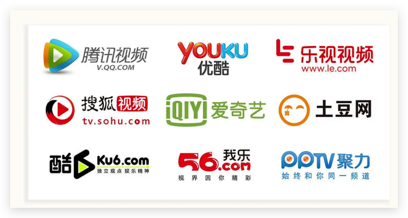
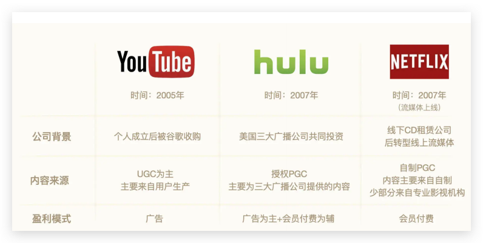
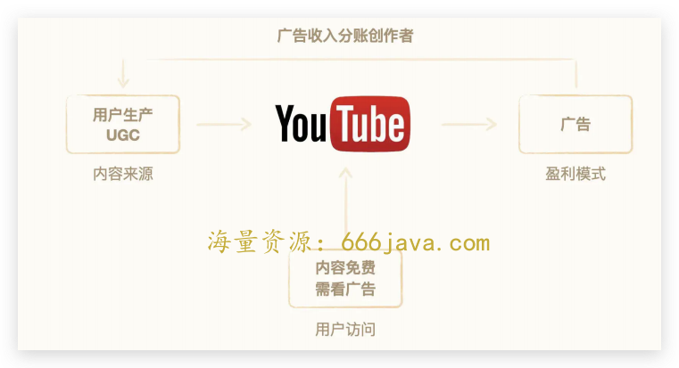
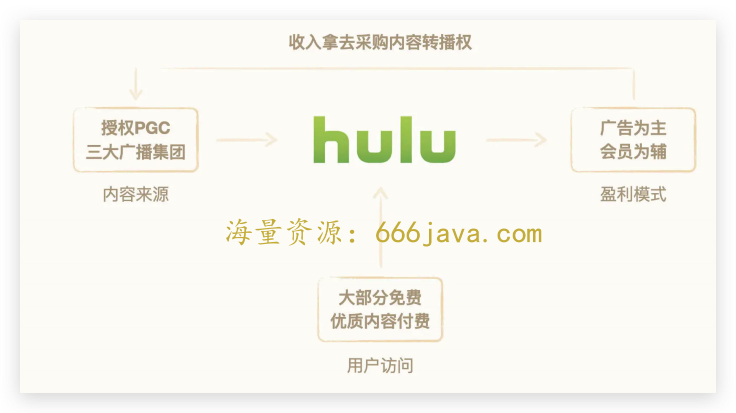
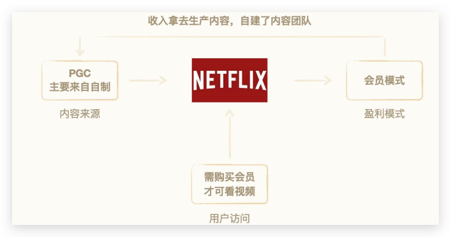
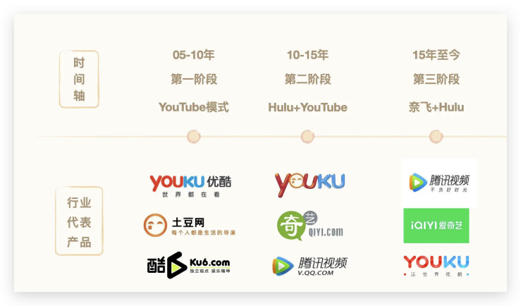

# 12-时间刻度（上）：为什么优酷土豆会从行业第一下滑到行业第三？

<audio controls="" title="12-时间刻度（上）：为什么优酷土豆会从行业第一下滑到行业第三？">
  <source
    id="mp3"
    src="/mp3/business-thinking/12-时间刻度（上）：为什么优酷土豆会从行业第一下滑到行业第三？.mp3"
  />
</audio>

你好，我是雄峰。本节课是我们商业洞察的第 5 节课。我们来聊一下优酷土豆，这个移动初期长视频领域的老大。

优酷土豆这个视频网站是阿里大文娱业务最重要的版图之一，但从 15 年被并购进阿里体系之后，迅速从行业第一衰退至行业第三，并和一、二名拉开了极大的差距。

后续 7 年，无论阿里巴巴调任了多少任干将（轮了 5 任总裁），砸了多少钱（几百亿），都没有追上领先者的优势，差距反而逐步拉大。

原因是什么？行业的分析角度有很多。这里，我给你提供一个新的视角： **商业模式的选择影响了业务的发展潜力**。

核心原因在于，13 年的时候，优酷土豆依旧选择了“以广告为主”的商业模式，只愿意在小成本的自制内容上进行投入（晓说、万万没想到等）来提升广告的变现空间，但在版权内容的投入上有限，导致内容无法吸引用户为会员业务付费，从而错失了后面长视频平台会员业务的大爆发。一念之差，导致了后面 7 年的持续追赶。

今天，我们就基于国内长视频行业的发展史，了解视频行业的商业模式有哪些，下节课，我们再去学习 **衡量广告业务潜力空间的判断指标：时间刻度。**

## 爱腾优的前世今生

长视频，一般指播放超过半小时的视频，大多是影视剧和电影这类内容。国内的长视频平台以爱奇艺、腾讯视频以及优酷土豆三家为主。但是在 2017 年以前，这个行业光说得上名字的公司就有 20 家左右，还有几百家说不上名字的，是一个竞争异常激烈且长期亏损的行业。

### **为什么会有长视频业务的产生**

国内的长视频业务是怎么产生的呢？驱动中国互联网前十年（1996-2006）的发展模式有两个：一个是媒体数字化，一个是 C2C 模式（Copy to China）。

**媒体线上化**，就是所有线下媒体信息实现数字化，在互联网上形成传播途径，构建服务能力。因此，诞生了门户网站（新闻报纸）、电子商务（线下商场）、在线旅游（线下旅行社）等互联网业务，造就了一个又一个的财富风口。但是电视媒体的线上化业务是什么，一直是大家思考的方向。

至于 **C2C 模式（Copy to China）**，你可以这么理解。互联网最早起源于美国，因此，把美国的成熟模式搬到中国来重新做一遍，就有很大的机会获得成功，在风险投资界，这个逻辑叫做 **时光机理论**。

国内的四大门户，新浪、网易、搜狐、腾讯，对标的就是美国雅虎，国内的百度对标的则是美国的谷歌。2005 年，视频网站的“鼻祖”YouTube 在美国上线，国内纷纷效仿。

### 国外视频平台三种主要模式

按照 C2C 的思路，我们先把目光聚集在国外视频平台的发展上。国外的视频平台按服务内容和商业模式来区分，大致可分为三类，分别是 YouTube 模式、Hulu 模式以及奈飞模式。

**YouTube 模式：UGC 生产内容+广告收入**。平台不生产内容，内容全部由用户生产，这种内容生产模式叫做 UGC（用户生产内容）。平台的盈利来自广告费，用户可以免费观看所有内容，但需要看一定的广告。为了更好地鼓励用户生产内容，平台会根据视频产生的广告收入分一部分给创作者。

**Hulu 模式：PGC 生产内容+广告为主&会员为辅**。平台不生产内容，内容全部由专业机构生产，这种内容生产模式叫 PGC（专业生产内容）。平台的盈利来自广告费+会员费，大部分内容都可以免费观看，但需要看一定时间的广告。部分高清视频以及独播内容则需要会员付费。平台为了获得正版授权的内容，都会花大价钱去采购内容，做内容的二次分销。

**奈飞模式：PGC 自制内容为主+会员收入**。奈飞过往和 Hulu 竞争买来的内容仅仅只有网络的二轮播放权益，能够触及的也只是那些没有赶上第一轮电视播放的用户。此外，伴随着视频平台竞争激烈，即使是二轮播放权，采购价格也水涨船高。

因此， **奈飞开始了自制 PGC（Professional Generated Content，自制视频）模式**，降低采购成本，同时提升独家内容对用户的吸引力。这种模式下，所有的盈利均来自会员费，没有免费内容，必须付费才可以看内容。

总结下来，你会发现，国外的长视频业务模式，核心都在围绕 **内容制作和商业模式** 两条线不断演进，服务内容从最开始的纯 UGC，到 PGC，再到自制 PGC 内容，盈利模式有纯广告，广告为主、会员为辅，以及以会员为主。

### 国内长视频平台的三个阶段

随着 C2C 模式的思路，我们再去探究国内长视频平台发展的三个阶段。长视频模式在中国的落地发展，大致也是模仿美国上述三家公司的过程。

- **05-10 年** **，** **YouTube 模式，代表公司为优酷和土豆**

Youtube 于 2005 年创立，短短 1 年左右的时间就被 Google 以 16.5 亿美元的价格给收购。在 YouTube 奇迹的刺激下，国内行业涌入了不少的跟进者。不过一段时间之后，发现这么干不赚钱。

一个原因是广告收入扛不住带宽成本，另一个，则是国内 UGC 生态也不够丰富，内容也相当稀缺——毕竟当时 DV 机对于国内大多数用户而言是一个稀缺设备。

YouTube 之所以能够持续发展，核心是有谷歌养着，它对于谷歌来说，是一个视频搜索的入口，亏多久后面也有公司的支持。

不过，国内当时并没有跑出一个 YouTube 龙头，大多是靠着融资在活着，而这个钱是有限的。等到 08 年金融危机之后，倒闭了一大批类似的公司，各家开始思考怎么赚钱养活自己，或者怎么扩大市场份额。

让投资人相信“我”是 **可以跑出来** 的国内 YouTube 龙头，成为了这个阶段每一个从业者都在思考的问题。

- **10-15 年** **，** **Hulu+YouTube，代表公司为优酷**

在这个阶段，2007 年成立的 Hulu 进入了国内从业者的眼中，因为它只有 YouTube 十分之一的用户规模，却实现了和 YouTube 接近的收入规模，而且还是赚钱的。

Hulu 的背后是美国三大广播集团，有着大量丰富的优质影视资源，广告售卖价格也要高于 YouTube。而且，由于内容质量高，所以可以大量卖品牌广告。

Hulu 在广告之外，还进一步开辟了会员付费模式。一时间，国内各大视频公司言必称希腊，说自己是 Hulu+YouTube 的综合体。

- **15 年至今** **，** **奈飞+Hulu，代表公司为爱奇艺和腾讯视频**

2013 年开始，国家惩治盗版的力度不断加大，最典型的案例就是 14 年快播创始人王欣被抓，之后，长视频平台走上了全面正版化道路。

这一阶段，也带动了版权费用的水涨船高。从 2013 年 30w 就可以获得《让子弹飞》的网络首播权，到 2015 年之后随便一部烂剧成本过亿。奈飞自制剧纸牌屋的成功，让国内的长视频平台看到了机会：稀缺的优质内容可以大规模拉动平台付费。

为了提升内容稀缺性，不少长视频平台开始介入到自制 PGC 内容，推动会员业务的增长。爱奇艺的《盗墓笔记》让国内同行看到了成功案例，短短几天内， **爱奇艺 VIP 会员从 500 万激增至 760 万**，也就是说，一部剧就让爱奇艺会员猛增 50%。

## 优酷的兴起与衰退

了解完国内长视频发展的背景之后，我们就要看看今天的主角优酷了。

优酷成立于 06 年，辉煌于 12 年，衰败在 15 年，可以说，它是国内最早对标 YouTube 的公司之一。但当时对标 YouTube 的公司有几百家，优酷网之所以可以在盗版横行的时代崛起，核心点有三个：

1. **用户体验好，视频播放流畅**：舍得在服务器上砸钱，同时服务器的优化做得也不错，以至于优酷一直标榜自己是技术公司；

2. **视频内容相对完整且清晰度高**：市面上大量盗版横行，用户在网上唾手可得，但是视频质量参差不齐，优酷则以较低的价格与影视集团合作，低成本拿到很多片源，免费提供给用户；

3. **大力发展 UGC（用户原创内容）**：通过用户原创内容与友商形成差异化，UGC 内容占比最高时，一度占据平台流量的 30%左右，也诞生了一大批平台网红，比如后舍男生、旭日阳刚以及叫兽等等。

此后，优酷网先于最大的竞争对手土豆网在美股上市，摘得了中国第一视频网站的美誉，也吸引了更多资本的支持，钱多了之后可以做的事情就更多，不管在内容上还是在扩展上。

土豆本来有机会先于优酷上市，但由于创始人王微婚姻问题，导致前妻在土豆网上市前期提出了诉讼，因此土豆错过了上市的最好时机，结果就是土豆后面市值只有优酷的四分之一。

不过，当时不管是土豆网还是优酷网，通过广告获得的收入都无法打平公司在带宽和内容上的投入成本，一直处于亏损状态。不同之处就在于优酷比土豆更有钱，因此，优酷在 12 年合并了土豆，市场占有率超过了 40%，然后就开始一路向下。

你可能会想，一路向下？是不是搞错了？

其实，中间的转折点就是优酷土豆在 13 年误判了行业形势： **认为市场占有率已经第一，要开始考虑盈利了，继而做了两个错误的决定**。

**一个是从过往做大市场规模变成做大盈利**。当某一个市场在高速发展阶段，某一家的市场占有率也是一个动态的过程，恪守原有的市场占有率只是刻舟求剑。这就导致增量用户被新涌入的对手用优质版权内容全部拿走。

**另一个则是商业模式上选择了 UGC 为主+广告为主的模式**。优质及稀缺内容永远是用户来视频平台第一要素。由于优酷下注 UGC，不愿意重金投入内容制作，最终错失了《盗墓笔记》《最好的我们》等爆款产品。前者成就了爱奇艺，后者成就了腾讯视频，也带动了两者会员付费业务的兴起。优酷土豆最终被反超，在 15 年被阿里收购。

## 小结

到目前为止，我们了解了长视频平台发展的历程和优酷土豆在大发展历程当中的选择。

驱动中国互联网前十年（1996-2006）的发展模式有两个，一个是媒体数字化，一个是 C2C 模式（Copy to China）。基于 C2C 模式的思路，我们首先了解了国外视频平台的发展历程，再去探究了国内长视频平台发展的三个阶段。

长视频发展的核心都在围绕 **内容制作和商业模式** 两条线不断演进，服务内容从最开始的纯 UGC，到 PGC，再到自制 PGC 内容，盈利模式有纯广告，广告为主、会员为辅，以及以会员为主。

在这两条线里，优酷选择的是 UGC 为主+广告为主的模式，那么为什么优酷这两个选择并不合适，造成了上述的结果呢？

下节课，我们就引入一个衡量广告收入天花板的指标，“时间刻度”，来深入分析优酷土豆选择广告为主模式的问题，看看广告模式和会员模式分别有哪些困境，再去了解所有长视频平台发展前路上的各种阻碍。

## 思考题

最后，我也给你留了一道思考题。想一想，为什么早期国内的 UGC 生态很难发展起来？

欢迎你在留言区和我交流互动。我们建立了一个 [读者交流群](http://jinshuju.net/f/DuxzBi)，欢迎你的加入！如果你觉得有所收获，也可以把这节课分享给你的朋友一起学习。我们下节课见。
