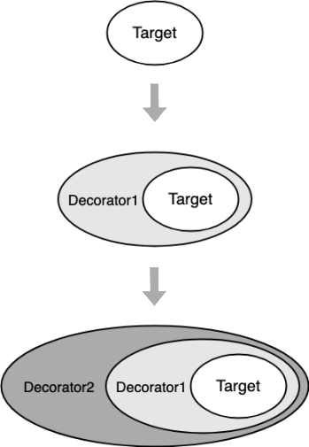

# 14-**装饰者模式：给新房子装修**


> 加紧学习，抓住中心，宁精勿杂，宁专勿多。 —— 周恩来

**装饰者模式** （Decorator Pattern）又称装饰器模式，在不改变原对象的基础上，通过对其添加属性或方法来进行包装拓展，使得原有对象可以动态具有更多功能。

本质是功能**动态组合**，即动态地给一个对象添加额外的职责，就增加功能角度来看，使用装饰者模式比用继承更为灵活。好处是有效地把对象的核心职责和装饰功能区分开，并且通过动态增删装饰去除目标对象中重复的装饰逻辑。

> **注意：** 本文可能用到一些编码技巧比如 [IIFE](https://developer.mozilla.org/zh-CN/docs/Glossary/立即执行函数表达式)（Immediately Invoked Function Expression, 立即调用函数表达式），ES6 的语法 [let/const](http://es6.ruanyifeng.com/#docs/let) 、[Class](http://es6.ruanyifeng.com/#docs/class) 等，如果还没接触过可以点击链接稍加学习 ~

## 1. 你曾见过的装饰者模式

相信大家都有过房屋装修的经历，当毛坯房建好的时候，已经可以居住了，虽然不太舒适。一般我们自己住当然不会住毛坯，因此我们还会通水电、墙壁刷漆、铺地板、家具安装、电器安装等等步骤，让房屋渐渐具有各种各样的特性，比如墙壁刷漆和铺地板之后房屋变得更加美观，有了家具居住变得更加舒适，但这些额外的装修并没有影响房屋是用来居住的这个基本功能，这就是装饰的作用。


再比如现在我们经常喝的奶茶，除了奶茶之外，还可以添加珍珠、波霸、椰果、仙草、香芋等等辅料，辅料的添加对奶茶的饮用并无影响，奶茶喝起来还是奶茶的味道，只不过辅料的添加让这杯奶茶的口感变得更多样化。

生活中类似的场景还有很多，比如去咖啡厅喝咖啡，点了杯摩卡之后我们还可以选择添加糖、冰块、牛奶等等调味品，给咖啡添加特别的口感和风味，但这些调味品的添加并没有影响咖啡的基本性质，不会因为添加了调味品，咖啡就变成奶茶。

在类似场景中，这些例子有以下特点：

1. 装饰不影响原有的功能，原有功能可以照常使用；
2. 装饰可以增加多个，共同给目标对象添加额外功能；

## 2. 实例的代码实现

我们可以使用 JavaScript 来将装修房子的例子实现一下：

```javascript
/* 毛坯房 - 目标对象 */
function OriginHouse() {}

OriginHouse.prototype.getDesc = function () {
  console.log('毛坯房')
}

/* 搬入家具 - 装饰者 */
function Furniture(house) {
  this.house = house
}

Furniture.prototype.getDesc = function () {
  this.house.getDesc()
  console.log('搬入家具')
}

/* 墙壁刷漆 - 装饰者 */
function Painting(house) {
  this.house = house
}

Painting.prototype.getDesc = function () {
  this.house.getDesc()
  console.log('墙壁刷漆')
}

var house = new OriginHouse()
house = new Furniture(house)
house = new Painting(house)

house.getDesc()
// 输出： 毛坯房  搬入家具  墙壁刷漆
```

使用 ES6 的 Class 语法：

```javascript
/* 毛坯房 - 目标对象 */
class OriginHouse {
  getDesc() {
    console.log('毛坯房')
  }
}

/* 搬入家具 - 装饰者 */
class Furniture {
  constructor(house) {
    this.house = house
  }

  getDesc() {
    this.house.getDesc()
    console.log('搬入家具')
  }
}

/* 墙壁刷漆 - 装饰者 */
class Painting {
  constructor(house) {
    this.house = house
  }

  getDesc() {
    this.house.getDesc()
    console.log('墙壁刷漆')
  }
}

let house = new OriginHouse()
house = new Furniture(house)
house = new Painting(house)

house.getDesc()
// 输出： 毛坯房  搬入家具  墙壁刷漆
```

是不是感觉很麻烦，装饰个功能这么复杂？我们 JSer 大可不必走这一套面向对象花里胡哨的，毕竟 JavaScript 的优点就是灵活：

```javascript
/* 毛坯房 - 目标对象 */
var originHouse = {
  getDesc() {
    console.log('毛坯房 ')
  },
}

/* 搬入家具 - 装饰者 */
function furniture() {
  console.log('搬入家具 ')
}

/* 墙壁刷漆 - 装饰者 */
function painting() {
  console.log('墙壁刷漆 ')
}

/* 添加装饰 - 搬入家具 */
originHouse.getDesc = (function () {
  var getDesc = originHouse.getDesc
  return function () {
    getDesc()
    furniture()
  }
})()

/* 添加装饰 - 墙壁刷漆 */
originHouse.getDesc = (function () {
  var getDesc = originHouse.getDesc
  return function () {
    getDesc()
    painting()
  }
})()

originHouse.getDesc()
// 输出： 毛坯房  搬入家具  墙壁刷漆
```

简洁明了，且更符合前端日常使用的场景。

## 3. 装饰者模式的原理

装饰者模式的原理如下图：



可以从上图看出，在表现形式上，装饰者模式和适配器模式比较类似，都属于包装模式。在装饰者模式中，一个对象被另一个对象包装起来，形成一条包装链，并增加了原先对象的功能。

值得注意的是：

> EcmaScript 标准中的 Decorator [提案](https://github.com/tc39/proposal-decorators)仍然在 stage-2 且极其不稳定。过去一年内已经经历了两次彻底大改，且和 TS 现有的实现已经完全脱节。
>
> — 尤雨溪 2019.6.12

因此本文并没有对 JavaScript 的装饰器 Decorator 进行相关介绍。

## 4. 实战中的装饰者模式

### 4.1 给浏览器事件添加新功能

之前介绍的添加装饰器函数的方式，经常被用来给原有浏览器或 DOM 绑定事件上绑定新的功能，比如在 `onload` 上增加新的事件，或在原来的事件绑定函数上增加新的功能，或者在原本的操作上增加用户行为埋点：

```javascript
window.onload = function () {
  console.log('原先的 onload 事件 ')
}

/* 发送埋点信息 */
function sendUserOperation() {
  console.log('埋点：用户当前行为路径为 ...')
}

/* 将新的功能添加到 onload 事件上 */
window.onload = (function () {
  var originOnload = window.onload
  return function () {
    originOnload && originOnload()
    sendUserOperation()
  }
})()

// 输出： 原先的 onload 事件
// 输出： 埋点：用户当前行为路径为 ...
```

可以看到通过添加装饰函数，为 `onload` 事件回调增加新的方法，且并不影响原本的功能，我们可以把上面的方法提取出来作为一个工具方法：

```javascript
window.onload = function () {
  console.log('原先的 onload 事件 ')
}

/* 发送埋点信息 */
function sendUserOperation() {
  console.log('埋点：用户当前行为路径为 ...')
}

/* 给原生事件添加新的装饰方法 */
function originDecorateFn(originObj, originKey, fn) {
  originObj[originKey] = (function () {
    var originFn = originObj[originKey]
    return function () {
      originFn && originFn()
      fn()
    }
  })()
}

// 添加装饰功能
originDecorateFn(window, 'onload', sendUserOperation)

// 输出： 原先的 onload 事件
// 输出： 埋点：用户当前行为路径为 ...
```

代码和预览参见： [Codepen -给浏览器事件添加新功能](https://codepen.io/SHERlocked93/pen/LwjBZw)

### 4.2 TypeScript 中的装饰器

现在的越来越多的前端项目或 Node 项目都在拥抱 JavaScript 的超集语言 TypeScript，如果你了解过 C# 中的特性 Attribute、Java 中的注解 Annotation、Python 中的装饰器 Decorator，那么你就不会对 TypeScript 中的装饰器感到陌生，下面我们简单介绍一下 TypeScript 中的装饰器。

TypeScript 中的装饰器可以被附加到类声明、方法、访问符、属性和参数上，装饰器的类型有参数装饰器、方法装饰器、访问器或参数装饰器、参数装饰器。

TypeScript 中的装饰器使用 `@expression` 这种形式，`expression` 求值后为一个函数，它在运行时被调用，被装饰的声明信息会被做为参数传入。

多个装饰器应用使用在同一个声明上时：

1. 由上至下依次对装饰器表达式求值；
2. 求值的结果会被当成函数，**由下至上**依次调用；

那么使用官网的一个例子：

```javascript
function f() {
  console.log('f(): evaluated')
  return function (
    target,
    propertyKey: string,
    descriptor: PropertyDescriptor,
  ) {
    console.log('f(): called')
  }
}

function g() {
  console.log('g(): evaluated')
  return function (
    target,
    propertyKey: string,
    descriptor: PropertyDescriptor,
  ) {
    console.log('g(): called')
  }
}

class C {
  @f()
  @g()
  method() {}
}

// f(): evaluated
// g(): evaluated
// g(): called
// f(): called
```

可以看到上面的代码中，高阶函数 `f` 与 `g` 返回了另一个函数（装饰器函数），所以 `f`、`g` 这里又被称为装饰器工厂，即帮助用户传递可供装饰器使用的参数的工厂。另外注意，演算的顺序是从下到上，执行的时候是从下到上的。

再比如下面一个场景

```javascript
class Greeter {
  greeting: string

  constructor(message: string) {
    this.greeting = message
  }

  greet() {
    return 'Hello, ' + this.greeting
  }
}

for (let key in new Greeter('Jim')) {
  console.log(key)
}
// 输出： greeting  greet
```

如果我们不希望 `greet` 被 `for-in` 循环遍历出来，可以通过装饰器的方式来方便地修改属性的属性描述符：

```javascript
function enumerable(value: boolean) {
  return function (
    target: any,
    propertyKey: string,
    descriptor: PropertyDescriptor,
  ) {
    descriptor.enumerable = value
  }
}

class Greeter {
  greeting: string

  constructor(message: string) {
    this.greeting = message
  }

  @enumerable(false)
  greet() {
    return 'Hello, ' + this.greeting
  }
}

for (let key in new Greeter('Jim')) {
  console.log(key)
}
// 输出： greeting
```

这样 `greet` 就变成不可枚举了，使用起来比较方便，对其他属性进行声明不可枚举的时候也只用在之前加一行 `@enumerable(false)` 即可，不用大费周章的 `Object.defineProperty(...)` 进行繁琐的声明了。

TypeScript 的装饰器还有很多有用的用法，感兴趣的同学可以阅读一下 TypeScript 的 Decorators [官网文档](https://www.typescriptlang.org/docs/handbook/decorators.html) 相关内容。

## 5. 装饰者模式的优缺点

装饰者模式的优点：

1. 我们经常使用继承的方式来实现功能的扩展，但这样会给系统中带来很多的子类和复杂的继承关系，装饰者模式允许用户在不引起子类数量暴增的前提下动态地修饰对象，添加功能，**装饰者和被装饰者之间松耦合**，可维护性好；
2. 被装饰者可以使用装饰者**动态地增加和撤销功能**，可以在运行时选择不同的装饰器，实现不同的功能，灵活性好；
3. 装饰者模式把一系列复杂的功能分散到每个装饰器当中，一般一个装饰器只实现一个功能，可以给一个对象增加多个同样的装饰器，也可以把一个装饰器用来装饰不同的对象，**有利于装饰器功能的复用**；
4. 可以通过选择不同的装饰者的组合，**创造不同行为和功能的结合体**，原有对象的代码无须改变，就可以使得原有对象的功能变得更强大和更多样化，符合开闭原则；

装饰者模式的缺点：

1. 使用装饰者模式时会产生很多细粒度的装饰者对象，这些装饰者对象由于接口和功能的多样化导致系统复杂度增加，功能越复杂，需要的细粒度对象越多；
2. 由于更大的灵活性，也就更容易出错，特别是对于多级装饰的场景，错误定位会更加繁琐；

## 6. 装饰者模式的适用场景

1. 如果不希望系统中增加很多子类，那么可以考虑使用装饰者模式；
2. 需要通过对现有的一组基本功能进行排列组合而产生非常多的功能时，采用继承关系很难实现，这时采用装饰者模式可以很好实现；
3. 当对象的功能要求可以动态地添加，也可以动态地撤销，可以考虑使用装饰者模式；

## 7. 其他相关模式

### 7.1 装饰者模式与适配器模式

装饰者模式和适配器模式都是属于包装模式，然而他们的意图有些不一样：

1. **装饰者模式：** 扩展功能，原有功能还可以直接使用，一般可以给目标对象多次叠加使用多个装饰者；
2. **适配器模式：** 功能不变，但是转换了原有接口的访问格式，一般只给目标对象使用一次；

### 7.2 装饰者模式与组合模式

这两个模式有相似之处，都涉及到对象的递归调用，从某个角度来说，可以把装饰者模式看做是只有一个组件的组合模式。

1. **装饰者模式：** 动态地给对象增加功能；
2. **组合模式：** 管理组合对象和叶子对象，为它们提供一致的操作接口给客户端，方便客户端的使用；

### 7.3 装饰者模式与策略模式

装饰者模式和策略模式都包含有许多细粒度的功能模块，但是他们的使用思路不同：

1. **装饰者模式：** 可以递归调用，使用多个功能模式，功能之间可以叠加组合使用；
2. **策略模式：** 只有一层选择，选择某一个功能；
