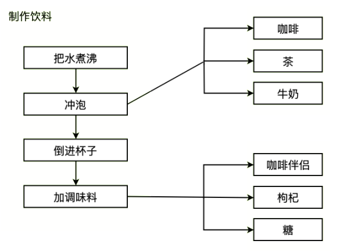
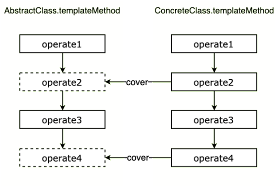

# 21-模板方法模式：咖啡厅制作咖啡


> 智慧，不是死的默念，而是生的沉思。 ——斯宾诺莎

**模板方法模式**（Template Method Pattern）父类中定义一组操作算法骨架，而将一些实现步骤延迟到子类中，使得子类可以不改变父类的算法结构的同时，重新定义算法中的某些实现步骤。模板方法模式的关键是**算法步骤的骨架和具体实现分离**。

> **注意：** 本文可能用到一些 ES6 的语法 [let/const](http://es6.ruanyifeng.com/#docs/let) ，[函数参数的默认值](http://es6.ruanyifeng.com/#docs/function) 等，如果还没接触过可以点击链接稍加学习 ~

## 1. 你曾见过的模板方法模式

这里举个经典的咖啡厅例子，咖啡厅制作饮料的过程有一些类似的步骤：

1. 先把水煮沸
2. 冲泡饮料（咖啡、茶、牛奶）
3. 倒进杯子中
4. 最后加一些调味料（咖啡伴侣、枸杞、糖）

无论冲饮的是咖啡、茶、牛奶，他们的制作过程都类似，可以被总结为这几个流程。也就是说这个流程是存在着类似的流程结构的，这就给我们留下了将操作流程抽象封装出来的余地。



再举个栗子，做菜的过程也可以被总结为固定的几个步骤：

1. 准备食材（肉、蔬菜、菌菇）
2. 食材放到锅里
3. 放调味料（糖、盐、油）
4. 炒菜
5. 倒到容器里（盘子、碗）

在类似的场景中，这些例子都有这些特点：

1. 有一个基本的操作流程，这个流程我们可以抽象出来，由具体实例的操作流程来实现，比如做咖啡的时候冲泡的就是咖啡，做茶的时候冲泡的就是茶；
2. 一些共用的流程，就可以使用通用的公共步骤，比如把水煮沸，比如将食材放到锅里，这样的共用流程就可以共用一个具体方法就可以了；

## 2. 实例的代码实现

如果你已经看过**抽象工厂模式**，那么你对 JavaScript 中面向对象的方式提取公共结构应该比较熟悉了，这里再复习一下。JavaScript 中可以使用下面的方式来模拟抽象类：

```javascript
/* 抽象类，ES6 class 方式 */
class AbstractClass1 {
  constructor() {
    if (new.target === AbstractClass1) {
      throw new Error('抽象类不能直接实例化!')
    }
  }

  /* 抽象方法 */
  operate() {
    throw new Error('抽象方法不能调用!')
  }
}

/* 抽象类，ES5 构造函数方式 */
var AbstractClass2 = function () {
  if (new.target === AbstractClass2) {
    throw new Error('抽象类不能直接实例化!')
  }
}
/* 抽象方法，使用原型方式添加 */
AbstractClass2.prototype.operate = function () {
  throw new Error('抽象方法不能调用!')
}
```

下面实现一下咖啡厅例子。

首先我们使用**原型继承**的方式：

```javascript
/* 饮料类，父类，也是抽象类 */
var Beverage = function () {
  if (new.target === Beverage) {
    throw new Error('抽象类不能直接实例化!')
  }
}

/* 烧开水，共用方法 */
Beverage.prototype.boilWater = function () {
  console.log('水已经煮沸')
}

/* 冲泡饮料，抽象方法 */
Beverage.prototype.brewDrink = function () {
  throw new Error('抽象方法不能调用!')
}

/* 倒杯子里，共用方法 */
Beverage.prototype.pourCup = function () {
  console.log('倒进杯子里')
}

/* 加调味品，抽象方法 */
Beverage.prototype.addCondiment = function () {
  throw new Error('抽象方法不能调用!')
}

/* 制作流程，模板方法 */
Beverage.prototype.init = function () {
  this.boilWater()
  this.brewDrink()
  this.pourCup()
  this.addCondiment()
}

/* 咖啡类，子类 */
var Coffee = function () {}
Coffee.prototype = new Beverage()

/* 冲泡饮料，实现抽象方法 */
Coffee.prototype.brewDrink = function () {
  console.log('冲泡咖啡')
}

/* 加调味品，实现抽象方法 */
Coffee.prototype.addCondiment = function () {
  console.log('加点咖啡伴侣')
}

var coffee = new Coffee()
coffee.init()

// 输出：水已经煮沸
// 输出：冲泡咖啡
// 输出：倒进杯子里
// 输出：加点咖啡伴侣
```

我们用 ES6 的 class 方式来改写一下：

```javascript
/* 饮料类，父类 */
class Beverage {
  constructor() {
    if (new.target === Beverage) {
      throw new Error('抽象类不能直接实例化!')
    }
  }

  /* 烧开水，共用方法 */
  boilWater() {
    console.log('水已经煮沸')
  }

  /* 冲泡饮料，抽象方法 */
  brewDrink() {
    throw new Error('抽象方法不能调用!')
  }

  /* 倒杯子里，共用方法 */
  pourCup() {
    console.log('倒进杯子里')
  }

  /* 加调味品，抽象方法 */
  addCondiment() {
    throw new Error('抽象方法不能调用!')
  }

  /* 制作流程，模板方法 */
  init() {
    this.boilWater()
    this.brewDrink()
    this.pourCup()
    this.addCondiment()
  }
}

/* 咖啡类，子类 */
class Coffee extends Beverage {
  constructor() {
    super()
  }

  /* 冲泡饮料，实现抽象方法 */
  brewDrink() {
    console.log('冲泡咖啡')
  }

  /* 加调味品，实现抽象方法 */
  addCondiment() {
    console.log('加点咖啡伴侣')
  }
}

const coffee = new Coffee()
coffee.init()

// 输出：水已经煮沸
// 输出：冲泡咖啡
// 输出：倒进杯子里
// 输出：加点咖啡伴侣
```

如果需要创建一个新的饮料，那么增加一个新的实例类，并实现父类中的抽象方法。如果不实现就去调用 `init` 方法即报错：

```javascript
// 接上一段代码
/* 茶类，子类 */
class Tea extends Beverage {
  constructor() {
    super()
  }

  /* 冲泡饮料，实现抽象方法 */
  brewDrink() {
    console.log('冲泡茶')
  }

  /* 注意这里，没有实现加调味品抽象方法 */
}

const tea = new Tea()
tea.init()

// 输出：水已经煮沸
// 输出：冲泡茶
// 输出：倒进杯子里
// Error: 抽象方法不能调用!
```

那么这样就把冲泡饮料的流程框架抽象到了 `init` 方法中，在实例类中实现对应抽象方法，调用实例的 `init` 方法时就会调用覆盖后的实例方法，实现可变流程的扩展。

在灵活的 JavaScript 中，其实我们还可以使用**默认参数**来间接实现：

```javascript
/* 虚拟方法 */
const abstractFunc = function () {
  throw new Error('抽象方法不能调用!')
}

/* 饮料方法，方法体就是模板方法，即上面的 init() */
function BeverageFunc({
  boilWater = function () {
    // 烧开水，共用方法
    console.log('水已经煮沸')
  },
  brewDrink = abstractFunc, // 冲泡饮料，抽象方法
  pourCup = function () {
    // 倒杯子里，共用方法
    console.log('倒进杯子里')
  },
  addCondiment = abstractFunc, // 加调味品，抽象方法
}) {
  boilWater()
  brewDrink()
  pourCup()
  addCondiment()
}

/* 制作咖啡 */
BeverageFunc({
  /* 冲泡饮料，实现抽象方法 */
  brewDrink: function () {
    console.log('水已经煮沸')
  },

  /* 加调味品，实现抽象方法 */
  addCondiment: function () {
    console.log('加点咖啡伴侣')
  },
})

// 输出：水已经煮沸
// 输出：冲泡咖啡
// 输出：倒进杯子里
// 输出：加点咖啡伴侣
```

但是这样实现语义化并不太好，我们可以把默认参数用在构造函数中，这样可以使用 `new` 关键字来创建实例，语义化良好，也符合直觉：

```javascript
/* 虚拟方法 */
const abstractFunc = function () {
  throw new Error('抽象方法不能调用!')
}

/* 饮料方法 */
class Beverage {
  constructor({
    brewDrink = abstractFunc, // 冲泡饮料，抽象方法
    addCondiment = abstractFunc, // 加调味品，抽象方法
  }) {
    this.brewDrink = brewDrink
    this.addCondiment = addCondiment
  }

  /* 烧开水，共用方法 */
  boilWater() {
    console.log('水已经煮沸')
  }

  /* 倒杯子里，共用方法 */
  pourCup() {
    console.log('倒进杯子里')
  }

  /* 模板方法 */
  init() {
    this.boilWater()
    this.brewDrink()
    this.pourCup()
    this.addCondiment()
  }
}

/* 咖啡 */
const coffee = new Beverage({
  /* 冲泡饮料，覆盖抽象方法 */
  brewDrink: function () {
    console.log('水已经煮沸')
  },

  /* 加调味品，覆盖抽象方法 */
  addCondiment: function () {
    console.log('加点咖啡伴侣')
  },
})

coffee.init() // 执行模板方法

// 输出：水已经煮沸
// 输出：冲泡咖啡
// 输出：倒进杯子里
// 输出：加点咖啡伴侣
```

这样通过构造函数默认参数来实现类似于继承的功能。

## 3. 模板方法模式的通用实现

根据上面的例子，我们可以提炼一下模板方法模式。饮料类可以被认为是父类（AbstractClass），父类中实现了模板方法（templateMethod），模板方法中抽象了操作的流程，共用的操作流程是普通方法，而非共用的可变方法是抽象方法，需要被子类（ConcreteClass）实现，或者说覆盖，子类在实例化后执行模板方法，就可以按照模板方法定义好的算法一步步执行。主要有下面几个概念：

1. **AbstractClass** ：抽象父类，把一些共用的方法提取出来，把可变的方法作为抽象类，最重要的是把算法骨架抽象出来为模板方法；
2. **templateMethod** ：模板方法，固定了希望执行的算法骨架；
3. **ConcreteClass** ：子类，实现抽象父类中定义的抽象方法，调用继承的模板方法时，将执行模板方法中定义的算法流程；

结构大概如下：



下面用通用的方法实现，这里直接用 class 语法：

```javascript
/* 抽象父类 */
class AbstractClass {
  constructor() {
    if (new.target === AbstractClass) {
      throw new Error('抽象类不能直接实例化!')
    }
  }

  /* 共用方法 */
  operate1() {
    console.log('operate1')
  }

  /* 抽象方法 */
  operate2() {
    throw new Error('抽象方法不能调用!')
  }

  /* 模板方法 */
  templateMethod() {
    this.operate1()
    this.operate2()
  }
}

/* 实例子类，继承抽象父类 */
class ConcreteClass extends AbstractClass {
  constructor() {
    super()
  }

  /* 覆盖抽象方法 operate2 */
  operate2() {
    console.log('operate2')
  }
}

const instance = new ConcreteClass()
instance.templateMethod()

// 输出：operate1
// 输出：operate2
```

使用上面介绍的默认参数的方法：

```javascript
/* 虚拟方法 */
const abstractFunc = function () {
  throw new Error('抽象方法不能调用!')
}

/* 饮料方法 */
class AbstractClass {
  constructor({
    operate2 = abstractFunc, // 抽象方法
  }) {
    this.operate2 = operate2
  }

  /* 共用方法 */
  operate1() {
    console.log('operate1')
  }

  /* 模板方法 */
  init() {
    this.operate1()
    this.operate2()
  }
}

/* 实例 */
const instance = new AbstractClass({
  /* 覆盖抽象方法 */
  operate2: function () {
    console.log('operate2')
  },
})

instance.init()

// 输出：operate1
// 输出：operate2
```

我们也可以不用构造函数的默认参数，使用高阶函数也是可以的，毕竟 JavaScript 如此灵活。

## 4. 模板方法模式的优缺点

模板方法模式的优点：

1. **封装了不变部分，扩展可变部分，** 把算法中不变的部分封装到父类中直接实现，而可变的部分由子类继承后再具体实现；
2. **提取了公共代码部分，易于维护，** 因为公共的方法被提取到了父类，那么如果我们需要修改算法中不变的步骤时，不需要到每一个子类中去修改，只要改一下对应父类即可；
3. **行为被父类的模板方法固定，** 子类实例只负责执行模板方法，具备可扩展性，符合开闭原则；

模板方法模式的缺点：**增加了系统复杂度**，主要是增加了的抽象类和类间联系，需要做好文档工作；

## 5. 模板方法模式的使用场景

1. 如果知道一个算法所需的关键步骤，而且**很明确这些步骤的执行顺序，但是具体的实现是未知的、灵活的**，那么这时候就可以使用模板方法模式来**将算法步骤的框架抽象出来**；
2. 重要而复杂的算法，可以**把核心算法逻辑设计为模板方法**，周边相关细节功能由各个子类实现；
3. 模板方法模式可以被用来将**子类组件将自己的方法挂钩到高层组件中**，也就是钩子，子类组件中的方法交出控制权，高层组件在模板方法中决定何时回调子类组件中的方法，类似的用法场景还有发布-订阅模式、回调函数；

## 6. 其他相关模式

### 6.1 模板方法模式与工厂模式

模板方法模式的实现可以使用工厂模式来获取所需的对象。

另外，模板方法模式和抽象工厂模式比较类似，都是使用抽象类来提取公共部分，不一样的是：

1. **抽象工厂模式** 提取的是实例的功能结构；
2. **模板方法模式** 提取的是算法的骨架结构；

### 6.2 模板方法模式与策略模式

参见策略模式介绍。
