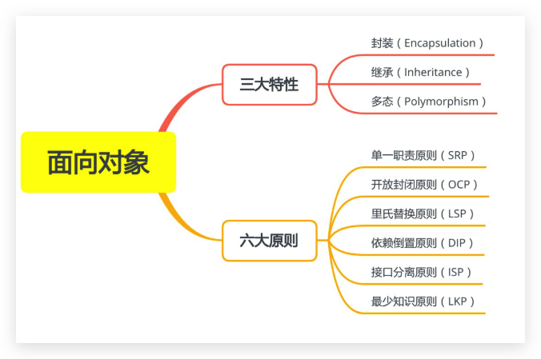
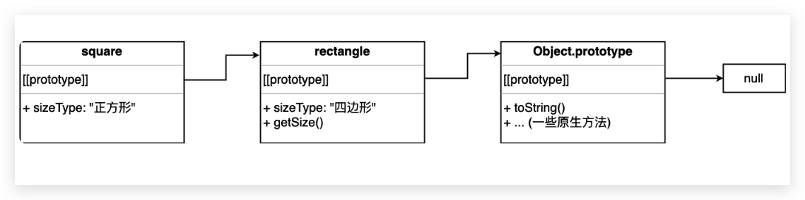
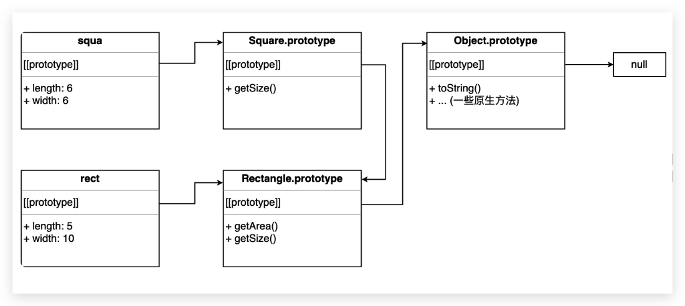

# 05-继承与原型链


> 天才就是百分之二的灵感，百分之九十八的汗水。——爱迪生

JavaScript 是一种灵活的语言，兼容并包含面向对象风格、函数式风格等编程风格。我们知道面向对象风格有三大特性和六大原则，三大特性是封装、继承、多态，六大原则是单一职责原则（SRP）、开放封闭原则（OCP）、里氏替换原则（LSP）、依赖倒置原则（DIP）、接口分离原则（ISP）、最少知识原则（LKP）。



JavaScript 并不是强面向对象语言，因此它的灵活性决定了并不是所有面向对象的特征都适合 JavaScript 开发，本教程将会着重介绍三大特性中的**继承**，和六大原则里的**单一职责原则**、**开放封闭原则**、**最少知识原则**。

本文将着重介绍一下继承相关内容，设计原则将会在后文予以介绍。

> **注意：** 本文属于基础篇，如果你已经对本文相关知识点已经很了解了，那么可以跳过本文。如果你不够了解，或者了解的还不完整，那么可以通过本文来复习一下 ~
>
> PS： 如果你觉得下面各种继承方式看的头晕，那么就直接看组合继承和 ES6 方式实现继承这两种方法即可～

## 1. 原型对象链

JavaScript 内建的继承方法被称为原型对象链，又称为原型对象继承。对于一个对象，因为它继承了它的原型对象的属性，所以它可以访问到这些属性。同理，原型对象也是一个对象，它也有自己的原型对象，因此也可以继承它的原型对象的属性。

这就是原型继承链：**对象继承其原型对象，而原型对象继承它的原型对象，以此类推。**

## 2. 对象继承

使用对象字面量形式创建对象时，会隐式指定 `Object.prototype` 为新对象的 `[[Prototype]]`。使用 `Object.create()` 方式创建对象时，可以显式指定新对象的 `[[Prototype]]`。该方法接受两个参数：第一个参数为新对象的 `[[Prototype]]`，第二个参数描述了新对象的属性，格式如在 `Object.defineProperties()` 中使用的一样。

```js
// 对象字面量形式，原型被隐式地设置为 Object.prototype
var rectangle = { sizeType: '四边形' }

// Object.create() 创建，显示指定为 Object.prototype， 等价于 ↑
var rectangle = Object.create(Object.prototype, {
  sizeType: {
    configurable: true,
    enumerable: true,
    value: '四边形',
    writable: true,
  },
})
```

我们可以用这个方法来实现对象继承：

```js
var rectangle = {
  sizeType: '四边形',
  getSize: function () {
    console.log(this.sizeType)
  },
}

var square = Object.create(rectangle, {
  sizeType: { value: '正方形' },
})

rectangle.getSize() // "四边形"
square.getSize() // "正方形"

console.log(rectangle.hasOwnProperty('getSize')) // true
console.log(rectangle.isPrototypeOf(square)) // true
console.log(square.hasOwnProperty('getSize')) // false
console.log('getSize' in square) // true

console.log(square.__proto__ === rectangle) // true
console.log(square.__proto__.__proto__ === Object.prototype) // true
```



对象 `square` 继承自对象 `rectangle`，也就继承了 `rectangle` 的 `sizeType` 属性和 `getSize()` 方法，又通过重写 `sizeType` 属性定义了一个自有属性，隐藏并替代了原型对象中的同名属性。所以 `rectangle.getSize()` 输出 「四边形」 而 `square.getSize()` 输出 「正方形」。

在访问一个对象的时候，JavaScript 引擎会执行一个搜索过程，如果在对象实例上发现该属性，该属性值就会被使用，如果没有发现则搜索其原型对象 `[[Prototype]]`，如果仍然没有发现，则继续搜索该原型对象的原型对象 `[[Prototype]]`，直到继承链顶端，顶端通常是一个 `Object.prototype`，其 `[[prototype]]` 为 `null`。这就是**原型链**的查找过程。

可以通过 `Object.create()` 创建 `[[Prototype]]` 为 null 的对象：`var obj = Object.create(null)`。对象 `obj` 是一个没有原型链的对象，这意味着 `toString()` 和 `valueOf` 等存在于 Object 原型上的方法同样不存在于该对象上，通常我们将这样创建出来的对象为**纯净对象**。

## 3. 原型链继承

JavaScript 中的对象继承是构造函数继承的基础，几乎所有的函数都有 `prototype` 属性（通过`Function.prototype.bind` 方法构造出来的函数是个例外），它可以被替换和修改。

```javascript
const boundFunction = function () {}.bind(null);
// 绑定函数不具有 prototype 属性，但是可能是可构造的。
// 当它被构造的时候，目标函数将会被构造，如果目标函数是可构造的，将会返回一个普通的实例。
```

函数声明创建函数时，函数的 `prototype` 属性被自动设置为一个继承自 `Object.prototype` 的对象，该对象有个自有属性 `constructor`，其值就是函数本身。

```js
// 构造函数
function YourConstructor() {}

// JavaScript 引擎在背后做的：
YourConstructor.prototype = Object.create(Object.prototype, {
  constructor: {
    configurable: true,
    enumerable: true,
    value: YourConstructor,
    writable: true,
  },
})

console.log(YourConstructor.prototype.__proto__ === Object.prototype) // true
```

JavaScript 引擎帮你把构造函数的 `prototype` 属性设置为一个继承自 `Object.prototype` 的对象，这意味着我们创建出来的构造函数都继承自 `Object.prototype`。由于 `prototype` 可以被赋值和改写，所以通过改写它来改变原型链：

```js
/* 四边形 */
function Rectangle(length, width) {
  this.length = length // 长
  this.width = width // 宽
}

/* 获取面积 */
Rectangle.prototype.getArea = function () {
  return this.length * this.width
}

/* 获取尺寸信息 */
Rectangle.prototype.getSize = function () {
  console.log(
    `Rectangle: ${this.length}x${this.width}，面积: ${this.getArea()}`,
  )
}

/* 正方形 */
function Square(size) {
  this.length = size
  this.width = size
}

Square.prototype = new Rectangle()
Square.prototype.constructor = Square // 原本为 Rectangle，重置回 Square 构造函数

Square.prototype.getSize = function () {
  console.log(`Square: ${this.length}x${this.width}，面积: ${this.getArea()}`)
}

var rect = new Rectangle(5, 10)
var squa = new Square(6)

rect.getSize() // Rectangle: 5x10，面积: 50
squa.getSize() // Square: 6x6，面积: 36
```



为什么使用 `Square.prototype = new Rectangle()` 而不用 `Square.prototype = Rectangle.prototype` 呢。这是因为后者使得两个构造函数的 `prototype` 指向了同一个对象，当修改其中一个函数的 `prototype` 时，另一个函数也会受影响。

所以 `Square` 构造函数的 `prototype` 属性被改写为了 `Rectagle` 的一个实例。

但是仍然有问题。当一个属性只存在于构造函数的 `prototype` 上，而构造函数本身没有时，该属性会在构造函数的所有实例间共享，其中一个实例修改了该属性，其他所有实例都会受影响：

```javascript
/* 四边形 */
function Rectangle(sizes) {
  this.sizes = sizes
}

/* 正方形 */
function Square() {}

Square.prototype = new Rectangle([1, 2])

var squa1 = new Square() // sizes: [1, 2]

squa1.sizes.push(3) // 在 squa1 中修改了 sizes

console.log(squa1.sizes) // sizes: [1, 2, 3]

var squa2 = new Square()

console.log(squa2.sizes) // sizes: [1, 2, 3] 应该是 [1, 2]，得到的是修改后的 sizes
```

## 4. 构造函数窃取

构造函数窃取又称构造函数借用、经典继承。这种技术的基本思想相当简单，即在子类型构造函数的内部调用父类构造函数。

```js
function getArea() {
  return this.length * this.width
}

/* 四边形 */
function Rectangle(length, width) {
  this.length = length
  this.width = width
}

/* 获取面积 */
Rectangle.prototype.getArea = getArea

/* 获取尺寸信息 */
Rectangle.prototype.getSize = function () {
  console.log(
    `Rectangle: ${this.length}x${this.width}，面积: ${this.getArea()}`,
  )
}

/* 正方形 */
function Square(size) {
  Rectangle.call(this, size, size)

  this.getArea = getArea

  this.getSize = function () {
    console.log(`Square: ${this.length}x${this.width}，面积: ${this.getArea()}`)
  }
}

var rect = new Rectangle(5, 10)
var squa = new Square(6)

rect.getSize() // Rectangle: 5x10，面积: 50
squa.getSize() // Square: 6x6，面积: 36
```

这样的实现避免了引用类型的属性被所有实例共享的问题，在父类实例创建时还可以自定义地传参，缺点是方法都是在构造函数中定义，每次创建实例都会重新赋值一遍方法，即使方法的引用是一致的。

这种方式通过构造函数窃取来设置属性，模仿了那些基于类的语言的类继承，所以这通常被称为**伪类继承**或**经典继承**。

## 5. 组合继承

组合继承又称伪经典继承，指的是将原型链和借用构造函数的技术组合发挥二者之长的一种继承模式。其背后的思路是使用原型链实现对原型属性和方法的继承，而通过借用构造函数来实现对实例属性的继承。这样，既通过在原型上定义方法实现了函数复用，又能够保证每个实例都有它自己的属性。

```javascript
/* 四边形 */
function Rectangle(length, width) {
  this.length = length
  this.width = width
  this.color = 'red'
}

/* 获取面积 */
Rectangle.prototype.getArea = function () {
  return this.length * this.width
}

/* 获取尺寸信息 */
Rectangle.prototype.getSize = function () {
  console.log(
    `Rectangle: ${this.length}x${this.width}，面积: ${this.getArea()}`,
  )
}

/* 正方形 */
function Square(size) {
  Rectangle.call(this, size, size) // 第一次调用 Rectangle 函数
  this.color = 'blue'
}

Square.prototype = new Rectangle() // 第二次调用 Rectangle 函数
Square.prototype.constructor = Square

Square.prototype.getSize = function () {
  console.log(`Square: ${this.length}x${this.width}，面积: ${this.getArea()}`)
}

var rect = new Rectangle(5, 10)
var squa = new Square(6)

rect.getSize() // Rectangle: 5x10，面积: 50
squa.getSize() // Square: 6x6，面积: 36
```

组合继承是 JavaScript 中最常用的继承模式，但是父类构造函数被调用了两次。

## 6. 寄生组合式继承

```javascript
/* 实现继承逻辑 */
function inheritPrototype(sub, sup) {
  var prototype = Object.create(sup.prototype)
  prototype.constructor = sub
  sub.prototype = prototype
}

/* 四边形 */
function Rectangle(length, width) {
  this.length = length
  this.width = width
  this.color = 'red'
}

/* 获取面积 */
Rectangle.prototype.getArea = function () {
  return this.length * this.width
}

/* 获取尺寸信息 */
Rectangle.prototype.getSize = function () {
  console.log(
    `Rectangle: ${this.length}x${this.width}，面积: ${this.getArea()}`,
  )
}

/* 正方形 */
function Square(size) {
  Rectangle.call(this, size, size) // 第一次调用 Rectangle 函数
  this.color = 'blue'
}

// 实现继承
inheritPrototype(Square, Rectangle)

Square.prototype.getSize = function () {
  console.log(`Square: ${this.length}x${this.width}，面积: ${this.getArea()}`)
}

var rect = new Rectangle(5, 10)
var squa = new Square(6)

rect.getSize() // Rectangle: 5x10，面积: 50
squa.getSize() // Square: 6x6，面积: 36
```

这种方式的高效率体现它只调用了一次父类构造函数，并且因此避免了在 `Rectangle.prototype` 上面创建不必要的、多余的属性。与此同时，原型链还能保持不变。因此，还能够正常使用 `instanceof` 和 `isPrototypeOf`。开发人员普遍认为寄生组合式继承是引用类型最理想的继承范式。

不过这种实现有些麻烦，推介使用**组合继承**和下面的 ES6 方式实现继承。

## 7. ES6 的 extends 方式实现继承

ES6 中引入了 `class` 关键字，class 之间可以通过 `extends` 关键字实现继承，这比 ES5 的通过修改原型链实现继承，要清晰、方便和语义化的多。

```javascript
/* 四边形 */
class Rectangle {
  constructor(length, width) {
    this.length = length
    this.width = width
    this.color = 'red'
  }

  /* 获取面积 */
  getArea() {
    return this.length * this.width
  }

  /* 获取尺寸信息 */
  getSize() {
    console.log(
      `Rectangle: ${this.length}x${this.width}，面积: ${this.getArea()}`,
    )
  }
}

/* 正方形 */
class Square extends Rectangle {
  constructor(size) {
    super(size, size)
    this.color = 'blue'
  }

  getSize() {
    console.log(`Square: ${this.length}x${this.width}，面积: ${this.getArea()}`)
  }
}

var rect = new Rectangle(5, 10)
var squa = new Square(6)

rect.getSize() // Rectangle: 5x10，面积: 50
squa.getSize() // Square: 6x6，面积: 36
```

然而并不是所有浏览器都支持 class/extends 关键词，不过我们可以引入 Babel 来进行转译。class 语法实际上也是之前语法的语法糖，用户可以把上面的代码放到 [Babel](https://babeljs.io/repl) 的在线编译中看看，编译出来是什么样子。
