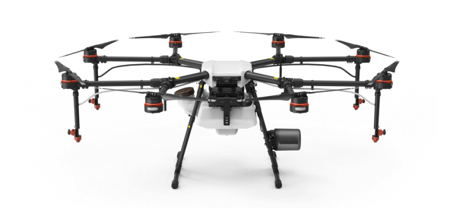
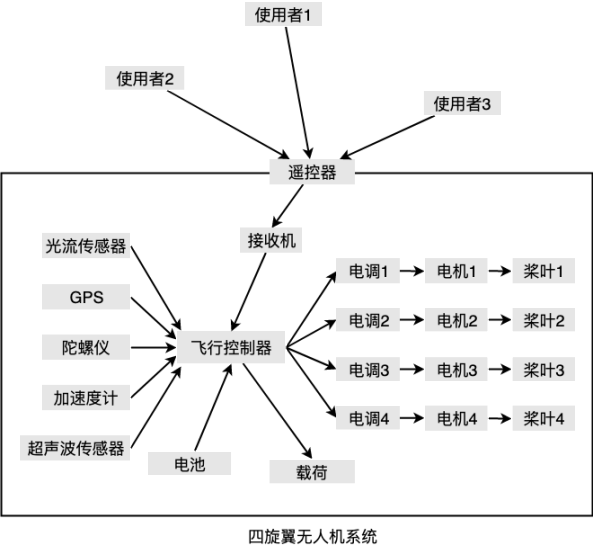

# 15-**外观模式：遥控无人机**


> 既然我已经踏上这条道路，那么，任何东西都不应妨碍我沿着这条路走下去。 ——康德

**外观模式** （Facade Pattern）又叫门面模式，定义一个将子系统的一组接口集成在一起的高层接口，以提供一个一致的外观。外观模式让外界减少与子系统内多个模块的直接交互，从而减少耦合，让外界可以更轻松地使用子系统。本质是**封装交互，简化调用**。

外观模式在源码中使用很多，具体可以参考后文中源码阅读部分。

## 1. 你曾见过的外观模式

最近这些年无人机很流行，特别是大疆的旋翼无人机。旋翼无人机的种类也很多，四旋翼、六旋翼、八旋翼、十六旋翼甚至是共轴双桨旋翼机，他们因为结构不同而各自有一套原理类似，但实现细节不同的旋翼控制方式。

如果用户需要把每种旋翼的控制原理弄清楚，那么门槛就太高了，所以无人机厂商会把具体旋翼控制的细节封装起来，用户所要接触的只是手上的遥控器，无论什么类型的无人机，遥控器的控制方式都一样，前后左右上下和左转右转。

对于使用者来说，遥控器就相当于是无人机系统的外观，使用者只要操纵遥控器就可以达到控制无人机的目的，而具体无人机内部的飞行控制器、电调（电子调速器）、电机、数字电传、陀螺仪、加速度计等等子模块之间复杂的调用关系将被封装起来，对于使用者而言不需要了解，因此也降低了使用难度。



类似的例子也有不少，比如常见的空调、冰箱、洗衣机、洗碗机，内部结构都并不简单，对于我们使用者而言，理解他们内部的运行机制的门槛比较高，但是理解遥控器/控制面板上面寥寥几个按钮就相对容易的多，这就是外观模式的意义。

在类似场景中，这些例子有以下特点：

1. 一个统一的外观为复杂的子系统提供一个简单的高层功能接口；
2. 原本访问者直接调用子系统内部模块导致的复杂引用关系，现在可以通过只访问这个统一的外观来避免；

## 2. 实例的代码实现

无人机系统的模块图大概如下：



可以看到无人机系统还是比较复杂的，系统内模块众多，如果用户需要对每个模块的作用都了解的话，那就太麻烦了，有了遥控器之后，使用者只要操作摇杆，发出前进、后退等等的命令，无人机系统接受到信号之后会经过算法把计算后的指令发送到电调，控制对应电机以不同转速带动桨叶，给无人机提供所需的扭矩和升力，从而实现目标运动。

关于无人机的例子，因为子模块众多，写成代码有点太啰嗦，这里只给出一个简化版本的代码：

```javascript
var uav = {
  /* 电子调速器 */
  diantiao1: {
    up() {
      console.log('电调1发送指令：电机1增大转速')
      uav.dianji1.up()
    },
    down() {
      console.log('电调1发送指令：电机1减小转速')
      uav.dianji1.up()
    },
  },
  diantiao2: {
    up() {
      console.log('电调2发送指令：电机2增大转速')
      uav.dianji2.up()
    },
    down() {
      console.log('电调2发送指令：电机2减小转速')
      uav.dianji2.down()
    },
  },
  diantiao3: {
    up() {
      console.log('电调3发送指令：电机3增大转速')
      uav.dianji3.up()
    },
    down() {
      console.log('电调3发送指令：电机3减小转速')
      uav.dianji3.down()
    },
  },
  diantiao4: {
    up() {
      console.log('电调4发送指令：电机4增大转速')
      uav.dianji4.up()
    },
    down() {
      console.log('电调4发送指令：电机4减小转速')
      uav.dianji4.down()
    },
  },

  /* 电机 */
  dianji1: {
    up() {
      console.log('电机1增大转速')
    },
    down() {
      console.log('电机1减小转速')
    },
  },
  dianji2: {
    up() {
      console.log('电机2增大转速')
    },
    down() {
      console.log('电机2减小转速')
    },
  },
  dianji3: {
    up() {
      console.log('电机3增大转速')
    },
    down() {
      console.log('电机3减小转速')
    },
  },
  dianji4: {
    up() {
      console.log('电机4增大转速')
    },
    down() {
      console.log('电机4减小转速')
    },
  },

  /* 遥控器 */
  controller: {
    /* 上升 */
    up() {
      uav.diantiao1.up()
      uav.diantiao2.up()
      uav.diantiao3.up()
      uav.diantiao4.up()
    },

    /* 前进 */
    forward() {
      uav.diantiao1.down()
      uav.diantiao2.down()
      uav.diantiao3.up()
      uav.diantiao4.up()
    },

    /* 下降 */
    down() {
      uav.diantiao1.down()
      uav.diantiao2.down()
      uav.diantiao3.down()
      uav.diantiao4.down()
    },

    /* 左转 */
    left() {
      uav.diantiao1.up()
      uav.diantiao2.down()
      uav.diantiao3.up()
      uav.diantiao4.down()
    },
  },
}

/* 操纵无人机 */
uav.controller.down() // 发送下降指令
uav.controller.left() // 发送左转指令
```

无人机系统是比较复杂，但是可以看到无人机的操纵却比较简单，正是因为有遥控器这个外观的存在。

## 3. 外观模式的原理

正如之前无人机的例子，虽然无人机实际操控比较复杂，但是通过对 `controller` 这个遥控器的使用，让使用者对无人机这个系统的控制变得简单，只需调用遥控器这个外观提供的方法即可，而这个方法里封装的一系列复杂操作，则不是我们要关注的重点。

从中就可以理解外观模式的意义了，遥控器作为无人机系统的功能出口，降低了使用者对复杂的无人机系统使用的难度，甚至让广场上的小朋友都能玩起来了。 😅

概略图如下：


注意：外观模式一般是作为子系统的功能出口出现，使用的时候可以在其中增加新的功能，但是不推介这样做，因为外观应该是对已有功能的包装，不应在其中掺杂新的功能。

## 4. 实战中的外观模式

### 4.1 函数参数重载

有一种情况，比如某个函数有多个参数，其中一个参数可以传递也可以不传递，你当然可以直接弄两个接口，但是使用函数参数重载的方式，可以让使用者获得更大的自由度，让两个使用上基本类似的方法获得统一的外观。

```javascript
function domBindEvent(nodes, type, selector, fn) {
  if (fn === undefined) {
    fn = selector
    selector = null
  }
  // ... 剩下相关逻辑
}

domBindEvent(nodes, 'click', '#div1', fn)
domBindEvent(nodes, 'click', fn)
```

这种方式在一些工具库或者框架提供的多功能方法上经常得到使用，特别是在通用 API 的**某些参数可传可不传的时候**。

参数重载之后的函数在使用上会获得更大的自由度，而不必重新创建一个新的 API，这在 Vue、React、jQuery、Lodash 等库中使用非常频繁。

### 4.2 抹平浏览器兼容性问题

外观模式经常被用于 JavaScript 的库中，封装一些接口用于兼容多浏览器，让我们可以间接调用我们封装的外观，从而屏蔽了浏览器差异，便于使用。

比如经常用的兼容不同浏览器的事件绑定方法：

```javascript
function addEvent(element, type, fn) {
  if (element.addEventListener) {
    // 支持 DOM2 级事件处理方法的浏览器
    element.addEventListener(type, fn, false)
  } else if (element.attachEvent) {
    // 不支持 DOM2 级但支持 attachEvent
    element.attachEvent('on' + type, fn)
  } else {
    element['on' + type] = fn // 都不支持的浏览器
  }
}

var myInput = document.getElementById('myinput')

addEvent(myInput, 'click', function () {
  console.log('绑定 click 事件')
})
```

下面一个小节我们可以看看 jQuery 的源码是如何进行事件绑定的。

除了事件绑定之外，在抹平浏览器兼容性的其他问题上我们也经常使用外观模式：

```javascript
// 移除 DOM 上的事件
function removeEvent(element, type, fn) {
  if (element.removeEventListener) {
    element.removeEventListener(type, fn, false)
  } else if (element.detachEvent) {
    element.detachEvent('on' + type, fn)
  } else {
    element['on' + type] = null
  }
}

// 获取样式
function getStyle(obj, styleName) {
  if (window.getComputedStyle) {
    var styles = getComputedStyle(obj, null)[styleName]
  } else {
    var styles = obj.currentStyle[styleName]
  }
  return styles
}

// 阻止默认事件
var preventDefault = function (event) {
  if (event.preventDefault) {
    event.preventDefault()
  } else {
    // IE 下
    event.returnValue = false
  }
}

// 阻止事件冒泡
var cancelBubble = function (event) {
  if (event.stopPropagation) {
    event.stopPropagation()
  } else {
    // IE 下
    event.cancelBubble = true
  }
}
```

通过将处理不同浏览器兼容性问题的过程封装成一个外观，我们在使用的时候可以直接使用外观方法即可，在遇到兼容性问题的时候，这个外观方法自然帮我们解决，方便又不容易出错。

## 5. 源码中的外观模式

### 5.1 Vue 源码中的函数参数重载

Vue 提供的一个创建元素的方法 [createElement](https://cn.vuejs.org/v2/guide/render-function.html) 就使用了函数参数重载，使得使用者在使用这个参数的时候很灵活：

```javascript
export function createElement(
  context,
  tag,
  data,
  children,
  normalizationType,
  alwaysNormalize,
) {
  if (Array.isArray(data) || isPrimitive(data)) {
    // 参数的重载
    normalizationType = children
    children = data
    data = undefined
  }

  // ...
}
```

`createElement` 方法里面对第三个参数 `data` 进行了判断，如果第三个参数的类型是 `array`、`string`、`number`、`boolean` 中的一种，那么说明是 `createElement(tag [, data], children, ...)` 这样的使用方式，用户传的第二个参数不是 `data`，而是 `children`。

`data` 这个参数是包含模板相关属性的数据对象，如果用户没有什么要设置，那这个参数自然不传，不使用函数参数重载的情况下，需要用户手动传递 `null` 或者 `undefined` 之类，参数重载之后，用户对 `data` 这个参数可传可不传，使用自由度比较大，也很方便。

`createElement` 方法的源码参见 Github 链接 [vue/src/core/vdom/create-element.js](https://github.com/vuejs/vue/blob/v2.6.10/src/core/vdom/create-element.js#L28-L45)

### 5.2 Lodash 源码中的函数参数重载

Lodash 的 range 方法的 API 为 `_.range([start=0], end, [step=1])`，这就很明显使用了参数重载，这个方法调用了一个内部函数 `createRange`：

```javascript
function createRange(fromRight) {
  return (start, end, step) => {
    // ...

    if (end === undefined) {
      end = start
      start = 0
    }

    // ...
  }
}
```

意思就是，如果没有传第二个参数，那么就把传入的第一个参数作为 `end`，并把 `start` 置为默认值。

`createRange` 方法的源码参见 Github 链接 [lodash/.internal/createRange.js](https://github.com/lodash/lodash/blob/4.17.14-es/_createRange.js#L19)

### 5.3 jQuery 源码中的函数参数重载

函数参数重载在源码中使用比较多，jQuery 中也有大量使用，比如 `on`、`off`、`bind`、`one`、`load`、`ajaxPrefilter` 等方法，这里以 `off` 方法为例，该方法在选择元素上移除一个或多个事件的事件处理函数。源码如下：

```javascript
off: function (types, selector, fn) {
    // ...

    if (selector === false || typeof selector === 'function') {
        // ( types [, fn] ) 的使用方式
        fn = selector
        selector = undefined
    }

    // ...
}
```

可以看到如果传入第二个参数为 `false` 或者是函数的时候，就是 `off(types [, fn])` 的使用方式。

`off` 方法的源码参见 Github 链接 [jquery/src/event.js](https://github.com/jquery/jquery/blob/3.4.1/src/event.js#L872-L877)

再比如 `load` 方法的源码：

```javascript
jQuery.fn.load = function (url, params, callback) {
  // ...

  if (isFunction(params)) {
    callback = params
    params = undefined
  }

  // ...
}
```

可以看到 jQuery 对第二个参数进行了判断，如果是函数，就是 `load(url [, callback])` 的使用方式。

`load` 方法的源码参见 Github 链接 [jquery/src/ajax/load.js](https://github.com/jquery/jquery/blob/3.4.1/src/ajax/load.js#L28-L35)

### 5.4 jQuery 源码中的外观模式

当我们使用 jQuery 的 `$(document).ready(...)` 来给浏览器加载事件添加回调时，jQuery 会使用源码中的 `bindReady` 方法：

```javascript
bindReady: function() {
    // ...

    // Mozilla, Opera and webkit 支持
    if (document.addEventListener) {
        document.addEventListener('DOMContentLoaded', DOMContentLoaded, false)

        // A fallback to window.onload, that will always work
        window.addEventListener('load', jQuery.ready, false)

        // 如果使用了 IE 的事件绑定形式
    } else if (document.attachEvent) {
        document.attachEvent('onreadystatechange', DOMContentLoaded)

        // A fallback to window.onload, that will always work
        window.attachEvent('onload', jQuery.ready)
    }

    // ...
}
```

通过这个方法，jQuery 帮我们将不同浏览器下的不同绑定形式隐藏起来，从而简化了使用。

`bindReady` 方法的源码参见 Github 链接 [jquery/src/core.js](https://github.com/jquery/jquery/blob/1.6.2/src/core.js#L424-L467)

除了屏蔽浏览器兼容性问题之外，jQuery 还有其他的一些其他外观模式的应用：

比如修改 css 的时候可以 `$('p').css('color', 'red')` ，也可以 `$('p').css('width', 100)`，对不同样式的操作被封装到同一个外观方法中，极大地方便了使用，对不同样式的特殊处理（比如设置 `width` 的时候不用加 `px`）也一同被封装了起来。

源码参见 Github 链接 [jquery/src/css.js](https://github.com/jquery/jquery/blob/3.4.1/src/css.js#L230)

再比如 jQuery 的 ajax 的 API `$.ajax(url [, settings])`，当我们在设置以 JSONP 的形式发送请求的时候，只要传入 `dataType: 'jsonp'` 设置，jQuery 会进行一些额外操作帮我们启动 JSONP 流程，并不需要使用者手动添加代码，这些都被封装在 `$.ajax()` 这个外观方法中了。

源码参见 Github 链接 [jquery/src/ajax/jsonp.js](https://github.com/jquery/jquery/blob/3.4.1/src/ajax/jsonp.js)

### 5.5 Axios 源码中的外观模式

Axios 可以使用在不同环境中，那么在不同环境中发送 HTTP 请求的时候会使用不同环境中的特有模块，Axios 这里是使用外观模式来解决这个问题的：

```javascript
function getDefaultAdapter() {
  // ...

  if (
    typeof process !== 'undefined' &&
    Object.prototype.toString.call(process) === '[object process]'
  ) {
    // Nodejs 中使用 HTTP adapter
    adapter = require('./adapters/http')
  } else if (typeof XMLHttpRequest !== 'undefined') {
    // 浏览器使用 XHR adapter
    adapter = require('./adapters/xhr')
  }

  // ...
}
```

这个方法进行了一个判断，如果在 Nodejs 的环境中则使用 Nodejs 的 `HTTP` 模块来发送请求，在浏览器环境中则使用 `XMLHTTPRequest` 这个浏览器 API。

`getDefaultAdapter` 方法源码参见 Github 链接 [axios/lib/defaults.js](https://github.com/axios/axios/blob/v0.19.0/lib/defaults.js#L16-L27)

## 6. 外观模式的优缺点

外观模式的优点：

1. 访问者不需要再了解子系统内部模块的功能，而只需和外观交互即可，使得访问者对子系统的**使用变得简单**，符合最少知识原则，增强了可移植性和可读性；
2. 减少了与子系统模块的直接引用，实现了**访问者与子系统中模块之间的松耦合**，增加了可维护性和可扩展性；
3. 通过合理使用外观模式，可以帮助我们**更好地划分系统访问层次**，比如把需要暴露给外部的功能集中到外观中，这样既方便访问者使用，也很好地隐藏了内部的细节，提升了安全性；

外观模式的缺点：

1. 不符合开闭原则，对修改关闭，对扩展开放，如果外观模块出错，那么只能通过修改的方式来解决问题，因为外观模块是子系统的唯一出口；
2. 不需要或不合理的使用外观会让人迷惑，过犹不及；

## 7. 外观模式的适用场景

1. 维护设计粗糙和难以理解的遗留系统，或者系统非常复杂的时候，可以为这些系统设置外观模块，给外界提供清晰的接口，以后新系统只需与外观交互即可；
2. 你写了若干小模块，可以完成某个大功能，但日后常用的是大功能，可以使用外观来提供大功能，因为外界也不需要了解小模块的功能；
3. 团队协作时，可以给各自负责的模块建立合适的外观，以简化使用，节约沟通时间；
4. 如果构建多层系统，可以使用外观模式来将系统分层，让外观模块成为每层的入口，简化层间调用，松散层间耦合；

## 8. 其他相关模式

### 8.1 外观模式与中介者模式

1. **外观模式：** 封装子使用者对子系统内模块的直接交互，方便使用者对子系统的调用；
2. **中介者模式：** 封装子系统间各模块之间的直接交互，松散模块间的耦合；

### 8.2 外观模式与单例模式

有时候一个系统只需要一个外观，比如之前举的 Axios 的 HTTP 模块例子。这时我们可以将外观模式和单例模式可以一起使用，把外观实现为单例。
