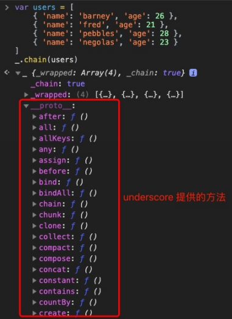

# 28-**链模式**


> 不要问你的国家能够为你做些什么，而要问你可以为国家做些什么。 —— 林肯

通常情况下，通过对构造函数使用 `new` 会返回一个绑定到 `this` 上的新实例，所以我们可以在 `new` 出来的对象上直接用 `.` 访问其属性和方法。如果在普通函数中也返回当前实例，那么我们就可以使用 `.` 在单行代码中一次性连续调用多个方法，就好像它们被链接在一起一样，这就是链式调用，又称**链模式**。

之前建造者模式、组合模式等文章已经用到了链模式，日常使用的 jQuery、Promise 等也使用了链模式，我们对使用形式已经很熟悉了，下面一起来看看链模式的原理。

> **注意：** 本文可能用到一些 ES6 的语法 [Class](http://es6.ruanyifeng.com/#docs/class)、[let/const](http://es6.ruanyifeng.com/#docs/let)、[箭头函数](http://es6.ruanyifeng.com/#docs/function)、[rest 参数](http://es6.ruanyifeng.com/#docs/function) 等，如果还没接触过可以点击链接稍加学习 ~
>
> ⚠️ 后面的源码为了方便看，都经过大幅度的简写，如果想看未改动的版本，请点击对应链接到 Github 仓库中查看。

## 1. 什么是链模式

### 1.1 链模式的实现

在 jQuery 时代，下面这样的用法我们很熟悉了：

```javascript
// 使用链模式
$('div')
  .show()
  .addClass('active')
  .height('100px')
  .css('color', 'red')
  .on('click', function (e) {
    // ...
  })
```

这就是很典型的链模式，对 jQuery 选择器选择的元素从上到下依次进行一系列操作，如果不使用链模式，则代码如下：

```javascript
// 不使用链模式
var divEls = $('div')
divEls.show()
divEls.addClass('active')
divEls.height('100px')
divEls.css('color', 'red')
divEls.on('click', function (e) {
  // ...
})
```

可以看到不使用链模式，代码量多了，代码结构也复杂了不少。链模式是 jQuery 的一个重要特性，也是 jQuery 深受大家喜爱，并且经久不衰的原因之一。

链模式和一般的函数调用的区别在于：链模式一般会在调用完方法之后返回一个对象，有时则直接返回 `this` ，因此又可以继续调用这个对象上的其他方法，这样可以对同一个对象连续执行多个方法。

比如这里我们可以自己实现一个链模式：

```javascript
/* 四边形 */
var rectangle = {
  length: null, // 长
  width: null, // 宽
  color: null, // 颜色

  getSize: function () {
    console.log(
      `length: ${this.length}, width: ${this.width}, color: ${this.color}`,
    )
  },

  /* 设置长度 */
  setLength: function (length) {
    this.length = length
    return this
  },

  /* 设置宽度 */
  setWidth: function (width) {
    this.width = width
    return this
  },

  /* 设置颜色 */
  setColor: function (color) {
    this.color = color
    return this
  },
}

var rect = rectangle
  .setLength('100px')
  .setWidth('80px')
  .setColor('blue')
  .getSize()

// 输出：length: 100px, width: 80px, color: blue
```

由于所有对象都会继承其原型对象的属性和方法，所以我们可以让原型方法都返回该原型的实例对象，这样就可以对那些方法进行链式调用了：

```javascript
/* 四边形 */
function Rectangle() {
  this.length = null // 长
  this.width = null // 宽
  this.color = null // 颜色
}

/* 设置长度 */
Rectangle.prototype.setLength = function (length) {
  this.length = length
  return this
}

/* 设置宽度 */
Rectangle.prototype.setWidth = function (width) {
  this.width = width
  return this
}

/* 设置颜色 */
Rectangle.prototype.setColor = function (color) {
  this.color = color
  return this
}

var rect = new Rectangle().setLength('100px').setWidth('80px').setColor('blue')

console.log(rect)

// 输出：{length: "100px", width: "80px", color: "blue"}
```

使用 Class 语法改造一下：

```javascript
/* 四边形 */
class Rectangle {
  constructor() {
    this.length = null // 长
    this.width = null // 宽
    this.color = null // 颜色
  }

  /* 设置长度 */
  setLength(length) {
    this.length = length
    return this
  }

  /* 设置宽度 */
  setWidth(width) {
    this.width = width
    return this
  }

  /* 设置颜色 */
  setColor(color) {
    this.color = color
    return this
  }
}

const rect = new Rectangle()
  .setLength('100px')
  .setWidth('80px')
  .setColor('blue')

console.log(rect)

// 输出：{length: "100px", width: "80px", color: "blue"}
```

### 1.2 链模式不一定必须返回 this

不一定在方法中 `return this`，也可以返回其他对象，这样后面的方法可以对这个新对象进行其他操作。比如在 Promise 的实现中，每次 `then` 方法返回的就不是 `this`，而是一个新的 Promise，只不过其外观一样，所以我们可以不断 `then` 下去。后面的每一个 `then` 都不是从最初的 Promise 实例点出来的，而是从前一个 `then` 返回的新的 Promise 实例点出来的。

```javascript
const prom1 = new Promise((resolve, reject) => {
  setTimeout(() => {
    console.log('Promise 1 resolved')
    resolve()
  }, 500)
})

const prom2 = prom1.then(() => {
  console.log('Then method')
})

console.log(prom1 === prom2)

// 输出： false
```

jQuery 中有一个有意思的方法 [end() ](https://github.com/jquery/jquery/blob/1.6.4/src/core.js#L291-L293)，是将匹配的元素还原为之前一次的状态，此时返回的也不是 `this`，然后可以在返回的之前一次匹配的状态后继续进行链模式：

```javascript
// html: <p><span>Hello</span>,how are you?</p>

$('p') // 选择所有 p 标签
  .find('span') // 选择了 p 标签下的 span 标签
  .css('color', 'red')
  .end() // 返回之前匹配的 p 标签
  .css('color', 'blue')
```

效果参见 [CodePen - jQuery 中的 end 方法](https://codepen.io/SHERlocked93/pen/PMPQXz)

事实上，某些原生的方法就可以使用链模式，以数组操作为例，比如我们想查看一个数组中奇数的平方和：

```javascript
;[1, 2, 3, 4, 5, 6]
  .filter((num) => num % 2)
  .map((num) => num * num)
  .reduce((pre, curr) => pre + curr, 0)

// 输出 35
```

那么这里为什么可以使用链模式呢，是因为 `filter`、`map`、`reduce` 这些数组方法返回的仍然是数组，因此可以继续在后面调用数组的方法。

注意，并不是所有数组方法都返回数组，比如 `push` 的时候返回的是新数组的 `length` 属性。

## 2. 实战使用链模式

有时候 JavaScript 原生提供的方法不太好用，比如我们希望创建下面这样一个 DOM 树结构：

```javascript
<ul id='data-list'>
  <li class='data-item'>li-item 1</li>
  <li class='data-item'>li-item 2</li>
  <li class='data-item'>li-item 3</li>
</ul>
```

如果使用原生方法，由于 `setAttribute` 等方法并没有返回原对象，而 `appendChild` 方法返回的却是，我们需要：

```javascript
const ul = document.createElement('ul')
ul.setAttribute('id', 'data-list')

const li1 = document.createElement('li')
const li2 = document.createElement('li')
const li3 = document.createElement('li')

li1.setAttribute('id', 'data-item')
li2.setAttribute('id', 'data-item')
li3.setAttribute('id', 'data-item')

const text1 = document.createTextNode('li-item 1')
const text2 = document.createTextNode('li-item 2')
const text3 = document.createTextNode('li-item 3')

li1.appendChild(text1)
li2.appendChild(text2)
li3.appendChild(text3)

ul.appendChild(li1)
ul.appendChild(li2)
ul.appendChild(li3)
```

太不直观了，步骤零散且可维护性差。

这时我们可以改造一下，可以使用类似于组合模式一文第 4 小节<实战中的组合模式>中那样直接传递一个所需的对应 DOM 树的对象树，再根据这个对象树来逐层生成 DOM。这里我们可以彻底使用链模式来改造一下原生方法：

```javascript
const createElement = function (tag) {
  return tag === 'text'
    ? document.createTextNode(tag)
    : document.createElement(tag)
}

HTMLElement.prototype._setAttribute = function (key, value) {
  this.setAttribute(key, value)
  return this
}

HTMLElement.prototype._appendChild = function (child) {
  this.appendChild(child)
  return this
}

createElement('ul')
  ._setAttribute('id', 'data-list')
  ._appendChild(
    createElement('li')
      ._setAttribute('class', 'data-item')
      ._appendChild('text', 'li-item 1'),
  )
  ._appendChild(
    createElement('li')
      ._setAttribute('class', 'data-item')
      ._appendChild('text', 'li-item 2'),
  )
  ._appendChild(
    createElement('li')
      ._setAttribute('class', 'data-item')
      ._appendChild('text', 'li-item 3'),
  )
```

这样就比较彻底地使用了链模式来生成 DOM 结构树了，你可能感觉有点奇怪，但是如果你使用过 vue-cli3，那么你可能对这个配置方式很熟悉。

## 3. 源码中的链模式

### 3.1 jQuery 中的链模式

#### 1. jQuery 构造函数

jQuery 方法看似复杂，可以简写如下：

```javascript
var jQuery = function(selector, context) {
  // jQuery 方法返回的是 jQuery.fn.init 所 new 出来的对象
  return new jQuery.fn.init(selector, context, rootjQuery)
}

jQuery.fn = jQuery.prototype = {
  constructor: jQuery,
  // jQuery 对象的构造函数
  init: function(selector, context, rootjQuery) {
    // ... 一顿匹配操作，返回一个拼装好的伪数组的自身实例
    // 是 jQuery.fn.init 的实例，也就是我们常用的 jQuery 对象
    return this
  },
  selector: '',
  eq: function() { ... },
  end: function() { ... },
  map: function() { ... },
  last: function() { ... },
  first: function() { ... },
  // ... 其他方法
}

// jQuery.fn.init 的实例都拥有 jQuery.fn 相应的方法
jQuery.fn.init.prototype = jQuery.fn
```

此处源码位于 [src/core.js](https://github.com/jquery/jquery/blob/1.6.4/src/core.js#L6)

`return new jQuery.fn.init(...)` 这句看似复杂，其实也就是下面的这个 `init` 方法，这个方法最后返回的是我们常用的 `jQuery` 对象，下面还有一句 `jQuery.fn.init.prototype = jQuery.fn`，因此最上面的 jQuery 方法返回的 `new` 出来的 `jQuery.fn.init` 实例将继承 `jQuery.fn` 上的方法：

```javascript
const p = $('<p/>')
$.fn === p.__proto__ // true
```

因此返回出来的实例也将继承 `eq`、`end`、`map`、`last` 等 `jQuery.fn` 上的方法。

#### 2. jQuery 实例方法

下面我们一起看看，`show`、`hide`、`toggle` 这些方法是如何实现链模式的呢 ：

```javascript
jQuery.fn.extend({
  show: function() {
    var elem

    for (i = 0; i < this.length; i++) {
      // ...
      elem = this[i]

      if (elem.style.display === 'none') {
        elem.style.display = 'block'
      }
    }

    return this
  },
  hide: function() { ... },
  toggle: function() { ... }
})
```

此处源码位于 [src/effects.js](https://github.com/jquery/jquery/blob/1.6.4/src/effects.js#L19-L63)，代码示例见 [CodePen - jQuery 中的 show](https://codepen.io/SHERlocked93/pen/PMZQzr)

这里首先使用了一个方法 `jQuery.fn.extend()`，简单看一下这个方法做啥的：

```javascript
jQuery.extend = jQuery.fn.extend = function (options) {
  // ... 一系列啰啰嗦嗦的判断

  for (name in options) {
    this[name] = options[name] // 此处 this === jQuery.fn
  }
}
```

此处源码位于 [src/core.js](https://github.com/jquery/jquery/blob/1.6.4/src/core.js#L305-L367)

这个方法就是把传参的对象的值赋值给 `jQuery.fn`，因为这时候这个方法是通过上下文对象 `jQuery.fn.extend()` 方式来调用，属于隐式绑定。（对 `this` 绑定规则的同学参看本专栏第 2 篇文章）

以 `show` 方法为例，此时这个方法被赋到 `jQuery.fn` 对象上，而通过上文我们知道，`jQuery.fn.init.prototype = jQuery.fn`，而 `jQuery.fn.init` 这个方法是作为构造函数被 jQuery 函数 new 出来并返回，因此 `show` 方法此时可以被 `jQuery.fn.init` 实例访问到，也就可以被 `$('selector')` 访问到，因此此时我们已经可以： `$('p').show()` 了。

那么我们再回头来看看 `show` 方法的实现，`show` 方法将匹配的元素的 `display` 置为 `block` 之后返回了 `this`。注意了，此时的 `this` 也是隐式绑定，而且是通过 `$('p')` 点出来的，因此返回的值就是 `$('p')` 的引用。

经过以上步骤，我们知道 `show` 方法返回的仍然是 `$('p')` 的引用，我们可以继续在之后点出来其他 `jQuery.fn` 对象上的方法，`css`、`hide`、`toggle`、`addClass`、`on` 等等方法同理，至此，jQuery 的链模式就形成了。

### 3.2 Underscore 中的链模式

如果你用过 [Underscore](https://underscorejs.org/)，那么你可能知道 Underscore 提供的一个链模式实现 [\_.chain](https://underscorejs.org/#chain)。通过这个方法，可以方便地使用 Underscore 提供的一些方法链模式地对数据进行处理。另外，Lodash 的 chain 实现和 Underscore 的基本一样，可以自行去 Lodash 的 GitHub [仓库](https://github.com/lodash/lodash/blob/4.17.15-es/chain.js)阅读。

比如这里我们需要对一个用户对象数组进行一系列操作，首先按年龄排序，去掉年龄为奇数的人，再将这些用户的名字列成数组：

```javascript
var users = [
  { name: 'barney', age: 26 },
  { name: 'fred', age: 21 },
  { name: 'pebbles', age: 28 },
  { name: 'negolas', age: 23 },
]

_.chain(users)
  .sortBy('age')
  .reject((user) => user.age % 2)
  .map((user) => user.name)
  .value()

// 输出： ["barney", "pebbles"]
```

经过 `_.chain` 方法处理后，就可以使用 Underscore 提供的其他方法对这个数据进行操作，下面一起来看看源码是如何实现链模式。

首先是 `_.chain` 方法：

```javascript
_.chain = function (obj) {
  var instance = _(obj) // 获得一个经 underscore 包裹后的实例
  instance._chain = true // 标记是否使用链式操作
  return instance
}
```

此处源码位于 [underscore.js#L1615-L1619](https://github.com/jashkenas/underscore/blob/master/underscore.js#L1615-L1619)

这里通过 `_(obj)` 的方式把数据进行了包装，并返回了一个对象，结构如下：

```javascript
{
    _chain: true,
    _wrapped: [...],
    __proto__:  ...
}
```

返回的对象的隐式原型可以访问到 Undersocre 提供的很多方法，如下图：



这个 `chain` 方法的作用就是创建一个包裹了 `obj` 的 Underscore 实例对象，并标记该实例是使用链模式，最后返回这个包装好的链式化实例（叫链式化是因为可以继续调用 `underscore` 上的方法)。

我们一起看看 `sort` 方法是如何实现的：

```javascript
var chainResult = function (instance, obj) {
  return instance._chain ? _(obj).chain() : obj // 这里 _chain 为 true
}

_.each(
  ['pop', 'push', 'reverse', 'shift', 'sort', 'splice', 'unshift'],
  function (name) {
    var method = Array.prototype[name]
    _.prototype[name] = function () {
      var obj = this._wrapped
      method.apply(obj, arguments) // 执行方法

      return chainResult(this, obj)
    }
  },
)
```

此处源码位于 [underscore.js#L1649-L1657](https://github.com/jashkenas/underscore/blob/master/underscore.js#L1649-L1657)

`sort` 方法执行之后，把结果重新放在 `_wrapped` 里，并执行 `chainResult` 方法，这个方法里由于 `_chain` 之前已经置为 `true`，因此会继续对结果调用 `chain()` 方法，包装成链式化实例并返回。

最后的这个 `_.value` 方法比较简单，就是返回链式化实例的 `_wrapped` 值：

```javascript
_.prototype.value = function () {
  return this._wrapped
}
```

此处源码位于 [underscore.js#L1668-L1670](https://github.com/jashkenas/underscore/blob/master/underscore.js#L1668-L1670)

总结一下，只要一开始调用了 `chain` 方法， `_chain` 这个标志位就会被置为 `true`，在类似的方法中，返回的值都用 `chainResult` 包裹一遍，并判断这个 `_chain` 这个标志位，为 `true` 则返回链式化实例，供给下一次方法调用，由此形成了链式化调用。
