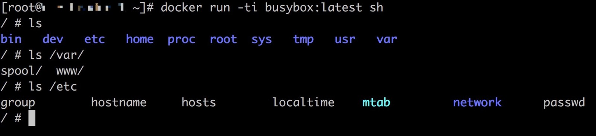
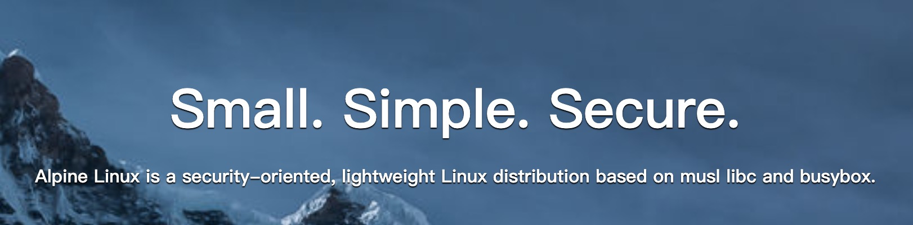
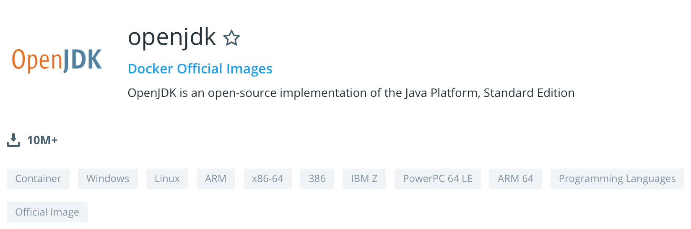
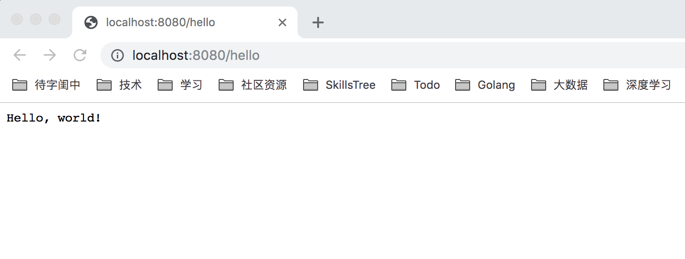

# 05-立足之本 Docker 镜像介绍


> 一个不注意小事情的人，永远不会成功大事业。——戴尔·卡耐基

Docker 技术正是凭借镜像这一个微小的创新一骑绝尘，所以说镜像是 Docker 技术的基石也不为过。本篇文章我们就来了解一下 Docker 镜像。

## 1. 镜像是什么

为了保证文章的完备性，在开始之前还是要简单介绍一下 Docker 镜像是什么。

要理解 Docker 镜像，我们不妨先看另外一组概念：程序和进程。在《深入理解计算机系统》中对程序和进程的关系描述有一句话非常好：**进程是程序的一个运行实例**。程序是打包好的静态文件，而进程相当于把这些静态文件加载到计算机内存中运行起来。相应的，**容器也可以说是镜像的一个运行实例**。

不过这两组概念之间还有一个重大的区别就是：**程序运行还依赖于一些操作系统的文件，但是镜像相当于把操作系统的文件也一起打包进了静态文件中**。我们看一个简单的镜像，busybox，镜像界的 hello world。

```bash
docker pull busybox:latest
```

启动容器：

```bash
docker run -ti busybox:latest sh
```



通过 ls 可以看到镜像中确实包含了很多操作系统的文件，而且细心的同学会发现 **busybox 镜像中包含的操作系统的文件只是一个精简版的**，并不是全量的。值得注意的是，镜像中也只是包含了操作系统的必要的文件，在容器启动之后，**容器进程还是去和宿主机的操作系统进行交互的**。

## 2. 基础镜像

虽然说镜像解决了容器所谓的一致性：无论在本地、云端，用户只需要解压打包好的容器镜像，那么这个容器的运行环境就被重现出来了。这里又出现了另外一个问题：**如果我们每一个应用都自己打包我们的容器依赖的镜像，过程还是很繁琐的，那么这个过程能不能做到复用呢？**

当然是可以的。首先官方镜像仓库中心提供了很多操作系统镜像，比如 ubuntu，centos 等。这样我们的应用就可以基于这些操作系统基础镜像来构建了。

其次，对于同一个公司内部，多个 Java 应用的开发人员对于环境的依赖都是一致的，比如 JDK，tomcat 等等。我们可以每个人都基于 centos 基础镜像来构建我们的应用镜像，但是还有一种更好的方式是**我们构建出一个 Java 应用基础镜像，然后大家复用这个基础镜像**。

既然已经说到了基础镜像，这里顺便举几个例子。

#### alpine

尽管我在上面提到很多操作系统基础镜像，比如 Ubuntu 或者 CentOS，但是这些镜像实在是太大了，在实际使用的使用时候会导致镜像的传输效率不高。这里介绍一个精简版本的 Linux 系统镜像 : alpine。

下图是 alpine Linxu [官方网站](https://alpinelinux.org/)的截图。从图中我们可以看到 alpine Linux 的核心特点就是三个：**small，simple，secure**。也就是 alpine Linux 主打的特点：**以安全为理念的轻量级的 Linux 发行版**。很多情况下我们都可以使用 alpine Linux 来替代 Ubuntu 或者 CentOS，而且这样会使得我们最终的镜像的体积小很多。


#### busybox

很多 Docker 教程都使用 busybox 镜像来举例子，而且很多应用镜像都使用 busybox 镜像来作为基础镜像，那么 busybox 是什么呢？

简单来说 **busybox 是一个集成了一百多个最常用的 Linux 命令和工具的软件工具箱**，它在单一的可执行文件中提供了精简的 Unix 工具集。busybox 既包含了一些简单使用的工具，如 cat 和 echo，也包含了一些更大，更复杂的工具，如 grep，find，mount 以及 telnet 等。可以说 **busybox 是 Linux 系统的瑞士军刀**。另外 busyBox 可运行于多款 Posix 环境的操作系统中。

#### openjdk

Java 语言作为目前使用最广泛的编程语言，这里有必要介绍一下 Docker 的 Java 基础镜像：docker 官方提供的 openjdk。



我们要使用 openjdk 镜像和使用其他基础镜像没有区别。

```dockerfile
FROM openjdk:7
COPY . /usr/src/myapp
WORKDIR /usr/src/myapp
RUN javac Main.java
CMD ["java", "Main"]
```

## 3. 镜像构建

镜像构建是基于 Dockerfile 来构建的，具体来说我们只需要按照容器标准编写好 Dockerfile 文件，然后通过构建命令就可以构建出来我们需要的镜像了。下面是一个具体的例子。

我们先通过 Go 语言编写一个 web 应用。

```go
package main

import (
	"io"
	"log"
	"net/http"
)

func main() {
	// Hello world, the web server

	helloHandler := func(w http.ResponseWriter, req *http.Request) {
		io.WriteString(w, "Hello, world!\n")
	}

	http.HandleFunc("/hello", helloHandler)
	log.Fatal(http.ListenAndServe(":8080", nil))
}
```

为了避免部分同学没有 Go 语言基础，这里简单解释一下这个程序的作用。这个是一个 web server，会在 8080 端口进行监听，对于路由 /hello 进行响应，返回 “Hello, world!”。我们可以在本地启动这个程序。

```bash
go run hello.go
```

然后浏览器打开 `localhost:8080/hello` 或者直接 curl 访问。

```bash
 ->  ~ $ curl localhost:8080/hello
Hello, world!
```

下面我们就基于 centos 镜像来构建我们的应用镜像并启动。

#### 应用程序 build

由于我的机器环境是 Mac OS，我本地编译的话需要使用交叉编译。如果读者对交叉编译不了解也没有关系，可以简单理解在某个平台编译另外一个平台的可执行应用程序。

```bash
-> $ GOOS=linux GOARCH=amd64 go build hello.go
```

编译成功之后就会生成一个叫 hello 的可执行文件。

#### Dockerfile 编写

我们将上面 build 出来的可执行文件放到镜像中，下面我们开始编写 Dockerfile 文件，如下：

```dockerfile
FROM	busybox:glibc
COPY	hello  /bin/hello

EXPOSE 	8080
ENTRYPOINT	["/bin/hello"]
```

简单解释一下上面的文件内容：

- FROM： 表示我们镜像基于 busybox 镜像构建，这里的 busybox 是基础镜像中被广泛使用的一个镜像
- COPY：拷贝文件，其中 hello 就是我们上面 go build 生成的可执行文件
- EXPOSE：暴露端口
- ENTRYPOINT：用来指定我们的镜像的默认启动脚本

整体看上去还是比较简单的，就算看不懂也没有关系，后面我们还会有专门的章节来介绍。

#### 镜像 build

编写完 Dockerfile 文件，我们就可以基于 Dockerfile 文件来构建我们的镜像了。将上面的文件命名为 Dockerfile，然后执行如下的 docker build 命令。

```bash
docker build -t hello:v1 .
```

执行完之后如果没有出错就会生成一个镜像 hello:v1，可以通过 docker images 命令查看。

#### 启动镜像

启动镜像我们通过如下的 docker run 命令来启动：

```bash
$ docker run -p 8080:8080 hello:v1
```

其中参数 -p 是用来将容器的端口和宿主机的端口做映射。运行完之后我们打开浏览器，或者直接通过 curl 命令请求 localhost:8080/hello 都会得到返回的 Hello World!



至此，我们通过一个简单例子介绍了一个完整链路的镜像构建的例子，当然我们这里的例子比较简单，由于我们使用的是 Go 语言示例，直接是二进制文件，对环境没有依赖，所以镜像的构建非常简单。但是在日常环境中我们可以会遇到非常复杂的环境的构建，比如 Java 应用程序可能需要我们自己去安装 JDK 或者 tomcat 环境等。

## 4. 总结

这篇文章，我们通过实际的例子给大家介绍了 Docker 的镜像的概念和使用。希望大家也可以动手操作一下，方便加深理解。限于篇幅，这里并没有展开 Docker 镜像的技术细节，更多技术细节，敬请期待。

## 5. 参考

1. [openjdk image](https://github.com/docker-library/docs/blob/master/openjdk/README.md#supported-tags-and-respective-dockerfile-links)
