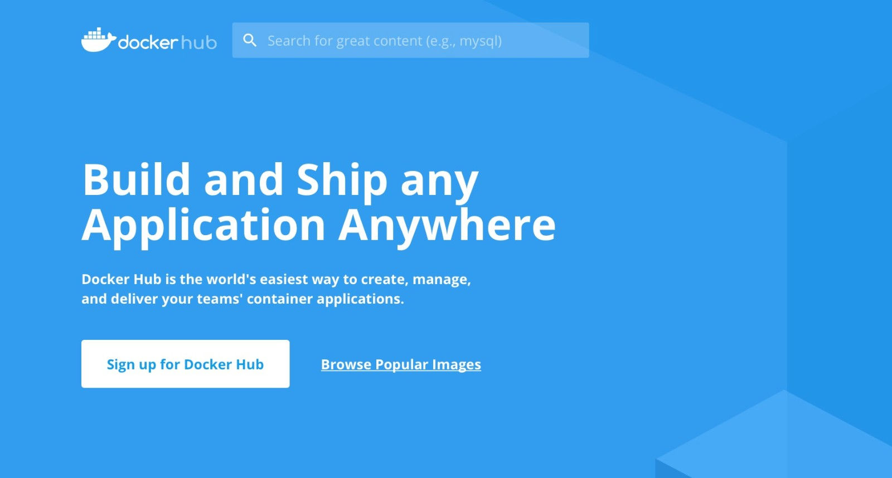
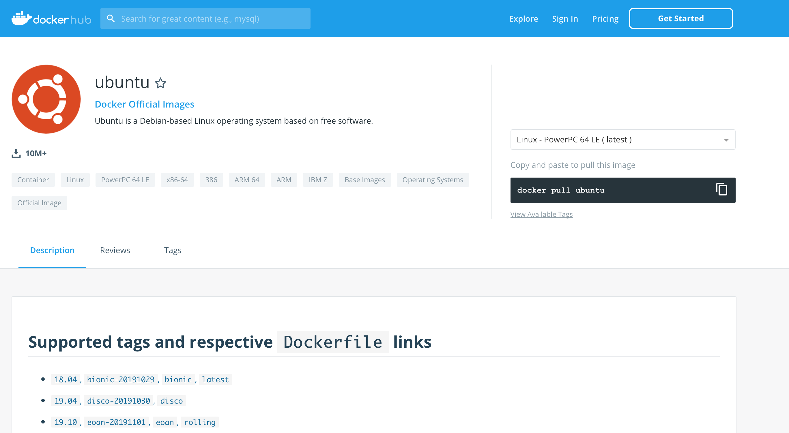
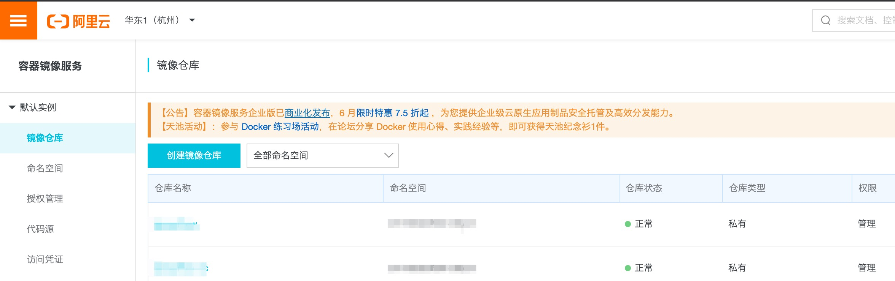
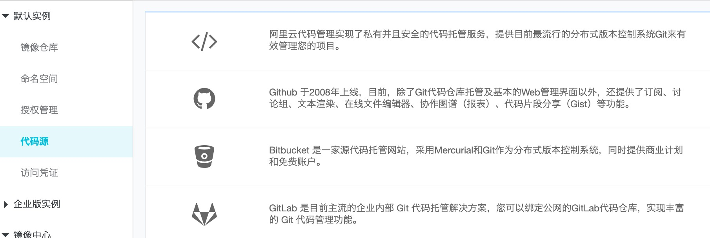
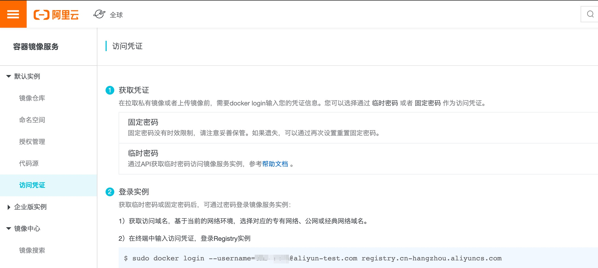
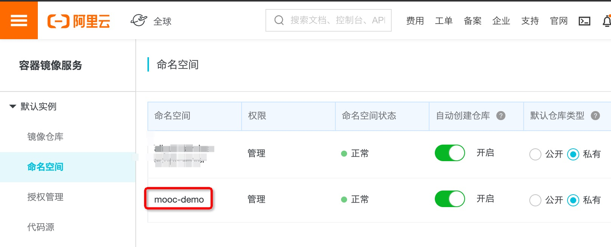
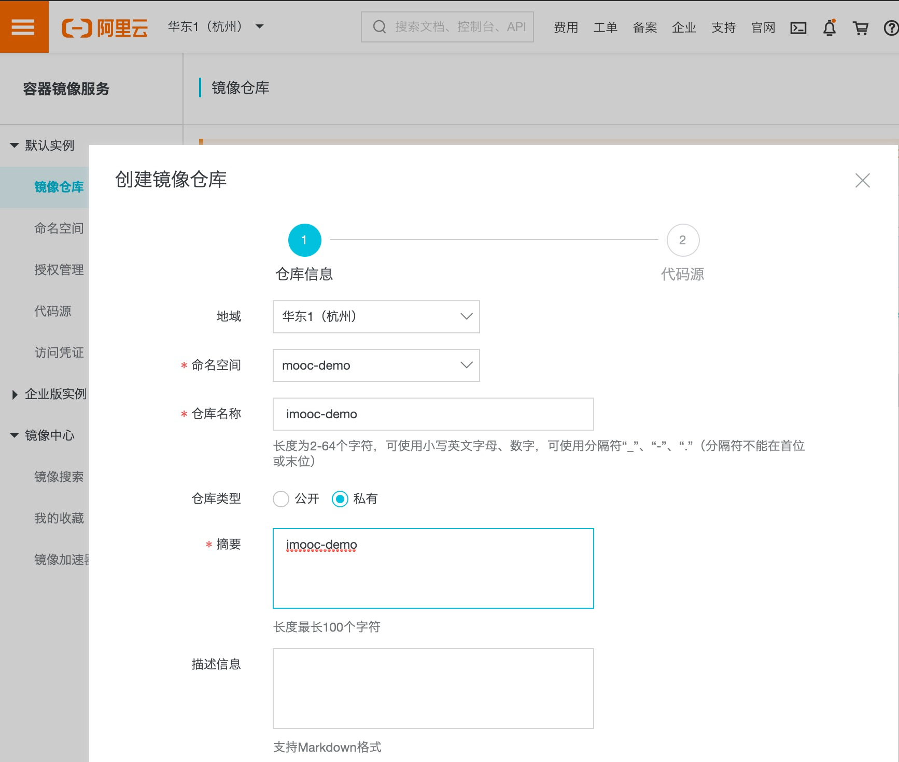
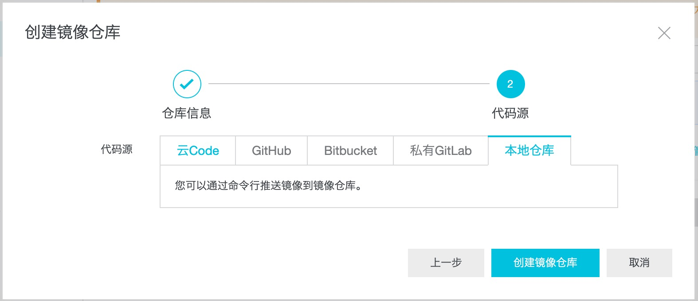
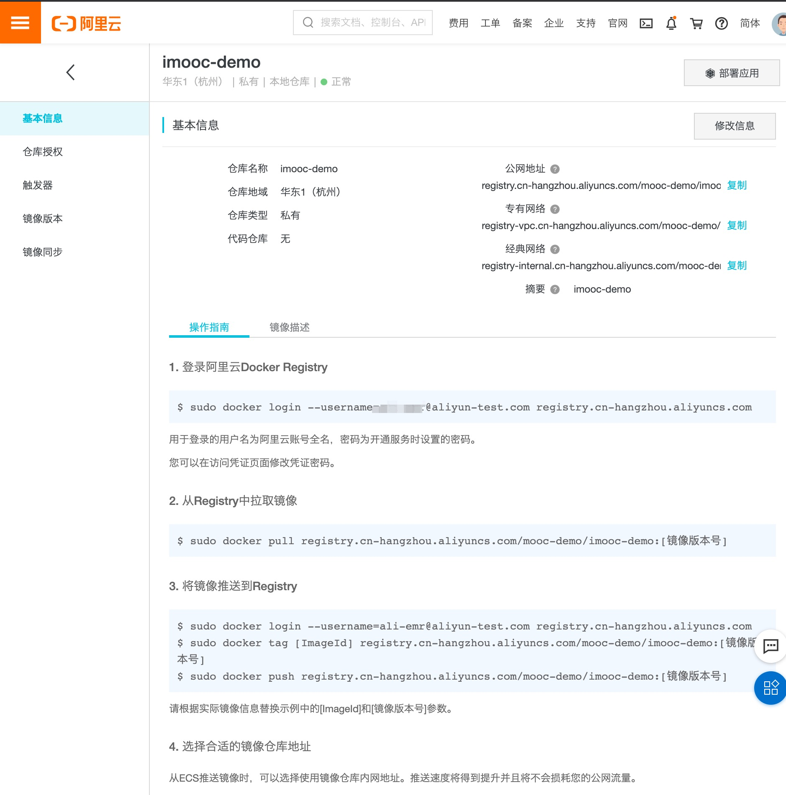
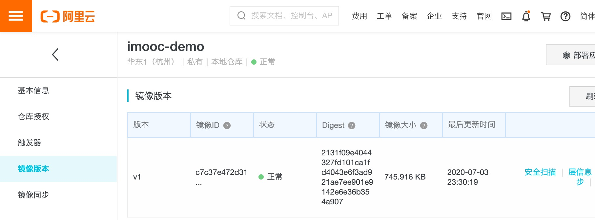

# 07-统一镜像管理镜像仓库介绍


> 构成我们学习最大障碍的是已知的东西，而不是未知的东西。 —— 贝尔纳

前面简单提到过 Docker 镜像仓库，这里我们再来详细介绍一下 Docker 的镜像仓库中心，也就是 Docker Registry。本文涉及到的 Registry 主要有三个，由于云厂商的 Registry 大同小异，所以下文中我们将主要介绍官方的 Docker Hub 和使用最多的阿里云的 Docker Registry。

- 官方 Docker Registry，Docker Hub；
- 阿里云 Docker Registry；
- 腾讯云 Docker Registry。

## 1. Docker Hub

[Docker Hub](https://hub.docker.com) 是 Docker 官方提供的 Registry，官网页面如下：



如果我们想要下载 ubuntu 镜像，那么在搜索框输入 ubuntu 进行搜索就得到下面的结果。



其中右侧的黑框中的 `docker pull ubuntu` 就是镜像的拉取方式。

Docker Hub 使用起来非常的简单，但是我们一般也只是使用 Docker Hub 来搜索并下载镜像，并不会用来上传存储我们的自定义镜像，这其中的一个主要原因就是网络原因。所以关于 Docker Hub 的镜像上传我们这里就不介绍了。推荐使用云厂商的镜像仓库中心，比如阿里云。

## 2. 阿里云 Docker Registry

[阿里云的 Docker Registry](https://cn.aliyun.com/product/acr) 可以在容器镜像服务 ACR 中找到。容器镜像服务（简称 ACR，下面都简称为 ACR）提供云原生资产的安全托管和全生命周期管理，支持多场景下镜像的高效分发，与容器服务 ACK 无缝集成，打造云原生应用一站式解决方案。

**ACR** 简化了 Registry 的搭建运维工作，支持多地域的镜像托管，并联合容器服务等云产品，打造云上使用 Docker 的一体化体验。下面是官方网站上面介绍的 ACR 的优势。

### ACR 优势

**多架构镜像托管支持**

- 支持 Linux、Windows、ARM 等多架构容器镜像。

**灵活的地域选择**

- 用户可以根据自己的业务需求，选择不同的地域创建和删除镜像仓库。
- 每个镜像仓库都提供了公网、内网、VPC 网络下对应的网络地址。

**镜像安全扫描**

- 支持便捷的镜像安全扫描功能，展示详细的镜像层信息。
- 提供镜像漏洞报告，展示漏洞编号、漏洞等级、修复版本等多维度漏洞信息。

**稳定构建服务**

- 支持阿里云 Code、GitHub、Bitbucket、自建 GitLab 的源代码构建源。
- 支持自动构建，实现源代码变更后自动构建成新 Docker 镜像。
- 支持海外构建，实现源代码在海外构建成新 Docker 镜像。

**云产品间无缝集成**

- 整合阿里云 Code 及 CodePipeline，实现源代码到应用编译测试后，自动构建成新镜像。
- 整合容器服务，实现新镜像构建完成后便捷部署至容器服务集群。

由上面的介绍我们可以看出如果我们最终的容器要运行在阿里云上面，那么阿里云的 Docker Registry 绝对是我们的最佳选择。下面我们就来看一下如何使用。

### 基本介绍

我们直接访问[容器镜像服务控制台 ](https://cr.console.aliyun.com/)，会看到如下的一个页面：



我们首先看到右侧的一个 tab：

- **镜像仓库**：比如阿里云上面一个完整的镜像 url 形如 [registry.cn-hangzhou.aliyuncs.com/imooc/imooc-demo:v1，最后面的](http://registry.cn-hangzhou.aliyuncs.com/imooc/imooc-demo:v1，最后面的) imooc-demo 就是镜像仓库。
- **命名空间**：上面的镜像 url 中的 imooc 就是镜像空间。
- **授权管理**：是阿里云账号体系相关的，我们可以暂时不用管。
- **代码源**：构建镜像的代码源，支持阿里云代码管理、Github、Bitbucket、GitLab。除了第一个是阿里云私有的，其他三个都相当于开源的。



- **访问凭证**：我们知道对于私有的 Docker Registry 有一个 docker login 命令需要输入用户名密码，而这个访问凭证就是用来设置 docker login 的密码相关的。可以设置固定密码和临时密码。固定密码相对来说更加方便，但是没有临时密码安全。大家可以根据实际情况使用。



### 基本设置

所以要真正使用这个 Docker Registry，我们需要**先创建命名空间和镜像仓库**。我们先创建一个命名空间叫 mooc-demo。



再创建一个镜像仓库叫 imooc-demo。



下一步选择本地仓库。



创建完成之后我们可以看到镜像仓库的详细信息如下。我们可以看到镜像有多个地址：

- 公网地址：很容易理解，就是暴露在公网中。
- 专有网络：VPC 网络，VPC 可以简单理解一个特定的私有网络。
- 经典网络：经典网络是在 VPC 网络出来之前的内网，现在已经很少用了。

内网的好处是不需要上传下载镜像不需要走公网流量，毕竟网络流量收费还挺贵的。



### 镜像上传下载

作为一个 Registry，它的最基本功能肯定是镜像的上传和下载，下面演示一下如何操作。

##### login

首先我们需要在本地先 login。

```bash
$ docker login --username=xxx registry.cn-hangzhou.aliyuncs.com
Password:
Login Succeeded
```

##### tag

要把本地的镜像上传到 Registry，需要将本地镜像重命名成远端镜像的形式，也就是上面截图中的第 3 步的操作。我们将本地的 busybox 镜像上传。

```bash
$ docker tag busybox registry.cn-hangzhou.aliyuncs.com/mooc-demo/imooc-demo:v1
```

##### push

```bash
$ docker push registry.cn-hangzhou.aliyuncs.com/mooc-demo/imooc-demo:v1
The push refers to repository [registry.cn-hangzhou.aliyuncs.com/mooc-demo/imooc-demo]
50761fe126b6: Pushed
v1: digest: sha256:2131f09e4044327fd101ca1fd4043e6f3ad921ae7ee901e9142e6e36b354a907 size: 527
```

这就表示上传上去了，我们从页面上面访问看一下。点击左侧的镜像版本可以看到最近的 v1 版本就是我们刚才上传的。



## 3. 总结

Docker 镜像仓库中心是我们使用 Docker 中不可或缺的一环。我们需要根据自身的情况选择合适的镜像中心。

比如我们涉及到容器的所有服务都在阿里云上面，那么镜像仓库中心肯定也使用阿里云的。

如果我们的容器应用在云上都属于 VPC 网络，那么我的镜像仓库中心也应该使用 VPC 网络。