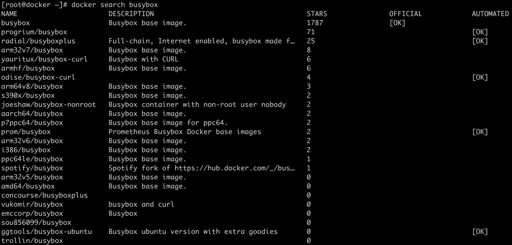
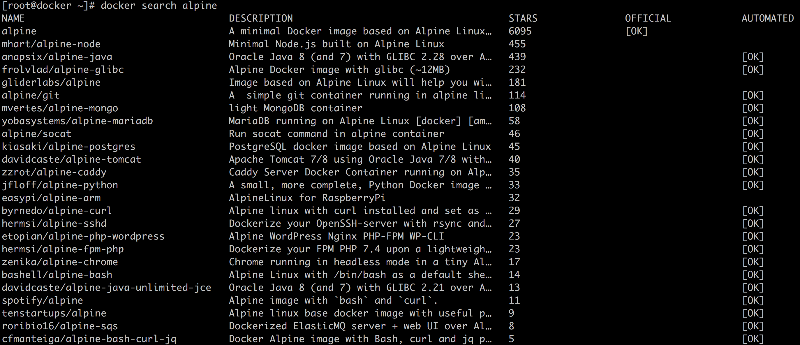

# 08-站在巨人的肩膀上热门 Docker 镜像介绍（一）


>  时间像海绵里的水，只要你愿意挤，总还是有的。——鲁迅

前面我们介绍过可以通过一个基础镜像，比如 CentOS 镜像，来构建我们自己的应用的镜像。但是很多情况下，**操作系统镜像都会比较大**，比如官方的 Docker Hub 的 CentOS 镜像就有几百兆。使用这些镜像作基础镜像毫无疑问会导致我们最终的应用镜像会非常大。

但是更多时候，**我们并不需要一个完整的操作系统镜像**。换句话说，更多情况下**我们只需要操作系统中部分文件**，比如 /usr/bin 目录下的很多二进制文件我们可能都使用不到。针对这种情况，有没有**裁剪版或者说精简版的操作系统镜像**可以提供给我们使用呢？下面我们就来看看两个精简版的操作系统镜像：busybox 和 alpine。

## 1. BusyBox

BusyBox 是一个精简的工具集合，集成了很多 Unix 应用工具，下面是 BusyBox 的官方定义。

```
BusyBox combines tiny versions of many common UNIX utilities into a single small executable. It provides replacements for most of the utilities you usually find in GNU fileutils, shellutils, etc. The utilities in BusyBox generally have fewer options than their full-featured GNU cousins; however, the options that are included provide the expected functionality and behave very much like their GNU counterparts. BusyBox provides a fairly complete environment for any small or embedded system.

BusyBox has been written with size-optimization and limited resources in mind. It is also extremely modular so you can easily include or exclude commands (or features) at compile time. This makes it easy to customize your embedded systems. To create a working system, just add some device nodes in /dev, a few configuration files in /etc, and a Linux kernel.
```

简单翻译一下：

> **BusyBox 将许多常用的 UNIX 应用工具精简版集成到一个小的可执行文件中**。使用 BusyBox 中的应用通常情况下可用替换我们在 Linux 系统中使用的 GNU 应用工具，比如文件应用工具（比如 cp, rm），shell 应用工具（比如 xargs）。BusyBox 中的工具比 GNU 完整版要少一些命令选项，通常是一些不太常用。BusyBox 提供的命令选项是和 GNU 完整命令一致的。同时 BusyBox 提供了一个相对完整和轻巧的操作系统环境。
>
> BusyBox 的设计实现考虑对自身大小的优化和资源的物尽其用。同时 BusyBox 也是模块化的，这也就意味者你可以通过编译选择去掉一些特性。这也意味可以更好的支持定制化系统。

相应地，在镜像领域中有一个镜像就叫 busybox，可以理解为是上面 busybox 对应的 docker 镜像，也被称为容器界的 helloworld。busybox 有很多版本，我们可以通过 docker search busybox 来搜索。



其中带有 OFFICIAL 标志的是官方镜像，我们通过 docker pull 命令下载

```bash
[root@docker ~]# docker pull busybox
Using default tag: latest
latest: Pulling from library/busybox
Digest: sha256:6915be4043561d64e0ab0f8f098dc2ac48e077fe23f488ac24b665166898115a
Status: Image is up to date for busybox:latest
```

然后我们通过 docker images 命令查看，可以看到镜像非常的小，只有 1.22MB。

```bash
[root@docker ~]# docker images | grep busybox
busybox             latest              6d5fcfe5ff17        5 weeks ago         1.22MB
```

下面我们通过 docker run 命令启动 busybox 镜像。

```bash
[root@docker ~]# docker run -ti busybox sh
/ #
```

出现了 `/ #` 提示符则说明现在我们位于 busybox 镜像启动的容器内部。我们可以通过 ls 命令查看包含了哪些文件。

```bash
/ # ls /
bin   dev   etc   home  proc  root  sys   tmp   usr   var
```

细心的同学会发现这个相比完整的操作系统，少了很多目录，下面是一个完整的 centos 系统的根目录文件，相比 busybox 多了很多文件目录，也就是说 busybox 相当于是一个裁剪版的操作系统。

```bash
[root@docker ~]# ls /
bin  boot  dev  etc  home  lib  lib64  lost+found  media  mnt  opt  proc  root  run  sbin  srv  sys  tmp  usr  var
```

我们再看一下 busybox 内部包含了操作系统命令，在 /bin 目录下。常用的操作系统命令都包含了，比如 df、du、awk、sed，所以 busybox 又被称为瑞士军刀。

```bash
/ # ls /bin | wc -l
399
```

不光如此我们还可以把 BusyBox 作为我们的基础镜像来构建我们的应用镜像，只需要像下面那样在首行通过 FROM 引用即可。

```dockerfile
FROM busybox
....
```

## 2. Alphine

Alpine 操作系统是一个面向安全的轻型 Linux 发行版。它不同于通常 Linux 发行版，Alpine 采用了 musl libc 和 busybox 以减小系统的体积和运行时资源消耗，但**功能上比 busybox 又完善的多**，因此得到开源社区越来越多的青睐。在保持瘦身的同时，**Alpine 还提供了自己的包管理工具 apk**，可以通过 https://pkgs.alpinelinux.org/packages 网站上查询包信息，也可以直接通过 apk 命令直接查询和安装各种软件。

Alpine 由非商业组织维护的，支持广泛场景的 Linux发行版，它**特别为资深/重度Linux用户而优化**，关注安全，性能和资源效能。**Alpine 镜像可以适用于更多常用场景，并且是一个优秀的可以适用于生产的基础系统/环境**。

Alpine Docker 镜像也继承了 Alpine Linux 发行版的这些优势。相比于其他 Docker 镜像，它的容量非常小，仅仅只有 5 MB 左右（对比 Ubuntu 系列镜像接近 200 MB），且拥有非常友好的包管理机制。官方镜像来自 docker-alpine 项目。

目前 Docker 官方已开始推荐使用 Alpine 替代之前的 Ubuntu 做为基础镜像环境。这样会带来多个好处。包括**镜像下载速度加快、镜像安全性提高、主机之间的切换更方便、占用更少磁盘空间等**。

同样的我们可以通过 docker search 来搜索 alpine 镜像。



启动第一个带有 alpine 标志的为官方镜像，我们下面通过 docker pull 进行下载.

```bash
[root@docker ~]# docker pull alpine
Using default tag: latest
latest: Pulling from library/alpine
Digest: sha256:ab00606a42621fb68f2ed6ad3c88be54397f981a7b70a79db3d1172b11c4367d
Status: Image is up to date for alpine:latest
[root@docker ~]# docker images | grep alpine
alpine              latest              e7d92cdc71fe        2 weeks ago         5.59MB
```

我们可以看到镜像大小只有 5.59MB，可以说是非常的小。下面我们通过 docker run 启动。

```bash
[root@docker ~]# docker run -ti alpine sh
/ # ls
bin    dev    etc    home   lib    media  mnt    opt    proc   root   run    sbin   srv    sys    tmp    usr    var
/ #
```

## 3. 总结

很多时候我们构建应用镜像的使用都没有必要使用 ubuntu 或者 centos 镜像作为基础镜像，因为完整的操作系统镜像体积非常的大。当我们在分布式环境下涉及到镜像分发的话，如果镜像太大会严重影响分发的速度。

本文介绍了两个小巧的基础镜像：busybox 和 alpine，系统可以给大家日常开发提供一些帮助和参考。