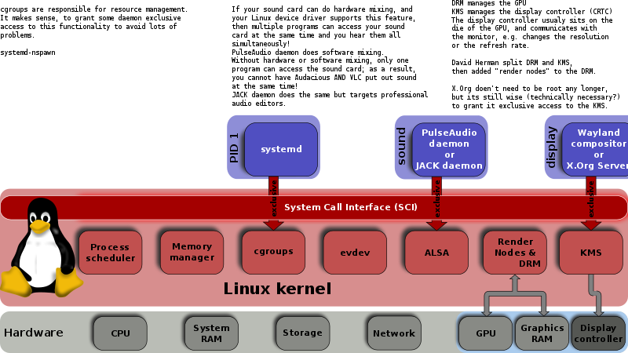
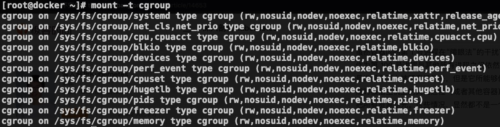
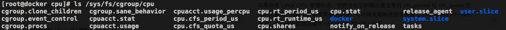
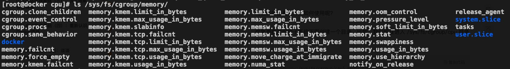
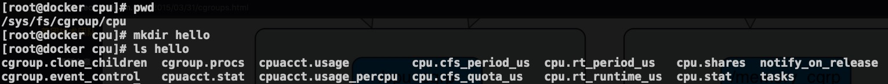
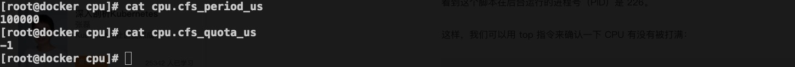
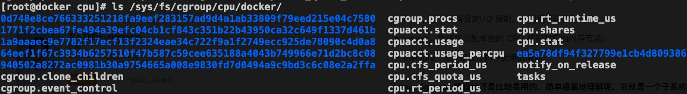
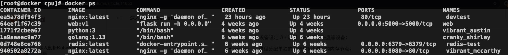
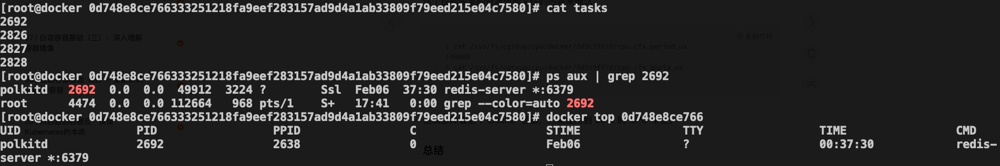

# 13-Docker 资源限制的幕后主使：cgroup


> 虚心使人进步，骄傲使人落后。——毛泽东

上一篇文章介绍了 Docker 中的隔离技术：NameSpace，这篇文章我们看一下 Docker 中的资源限制技术：CGroups。Linux Cgroups 的全称是 Linux Control Group，简单来说，**CGroups 的作用就是限制一个进程组能够使用的资源上限，CPU，内存等**。

## 1. CGroups 的历史

CGroups 最初由 Google 的工程师 Paul Menage 和 Rohit Seth 发起，当时项目名叫 `Process Container` 。后来为了避免 Linux 系统中各种各样的 `container` 含义引入歧义，改名为 `control groups` 。

CGroups 的正式面世在 2008 年初，伴随 Linux 的内核版本 2.6.24 的 release 发布，这个是版本 version 1。后来越来越多的特性开始被加入到 CGroups 中，但是由于设计并不是很好，后面 CGroups 中代码越来越多，越难维护，甚至出现某些情况下冲突的问题。



为了解决上面 CGroups version 1 的问题，在 Linux Kernel 3.10 版本开始了 version 2 的开发工作，相当于重写了 version 1 的 CGroups。Version 2 版本的 CGroups 在 Linux 4.5 发布中正式面世。

尽管 CGroups v2 旨在替换 CGroups v1，但是考虑到兼容性，目前这两个版本是并存的，而且目前来看官方也没有移除 CGroups v1 的计划。

目前 CGroups v2 只是实现了 v1 中的 controller 的一个子集。我们可以在同一个系统中同时挂载 CGroups 的 v1 和 v2 版本。

举个例子：我们可以使用 v2 中实现的 controller，同时使用 v2 中没有实现而在 v1 中实现的 controller。需要注意的是我们不能同时使用在 v1 和 v2 中都实现的 controller。

## 2. 核心概念

CGroups 中有几个重要概念：

- **cgroup**：通过 CGroups 系统进行限制的一组进程。CGroups 中的资源限制都是以进程组为单位实现的，一个进程可以加入到某个进程组，从而受到相同的资源限制。
- **task**：在 CGroups 中，task 可以理解为一个进程。
- **hierarchy**：可以理解成层级关系，CGroups 的组织关系就是层级的形式，每个节点都是一个 cgroup。cgroup 可以有多个子节点，子节点默认继承父节点的属性。
- **subsystem**：更准确的表述应该是 ***resource controllers***，也就是资源控制器，比如 cpu 子系统负责控制 cpu 时间的分配。子系统必须应用（attach）到一个 hierarchy 上才能起作用。

其中最核心的是 ***subsystem***，CGroups 目前支持的 ***subsystem*** 包括：

- **cpu**：限制进程的 cpu 使用率；
- **cpuacct**：统计 CGroups 中的进程的 cpu 使用情况；
- **cpuset**：为 CGroups 中的进程分配单独的 cpu 节点或者内存节点；
- **memory**：限制进程的内存使用；
- **devices**：可以控制进程能够访问哪些设备；
- **blkio**：限制进程的块设备 IO；
- **freezer**：挂起或者恢复 CGroups 中的进程；
- **net_cls**：标记进程的网络数据包，然后可以使用防火墙或者 tc 模块（traffic controller）控制该数据包。这个控制器只适用从该 cgroup 离开的网络包，不适用到达该 cgroup 的网络包；
- **ns**：将不同 CGroups 下面的进程应用不同的 namespace；
- **perf_event**：监控 CGroups 中的进程的 perf 事件（注：perf 是 Linux 系统中的性能调优工具）；
- **pids**：限制一个 cgroup 以及它的子节点中可以创建的进程数目；
- **rdma**：限制 cgroup 中可以使用的 RDMA 资源。

通过上面列举出来的 ***subsystem***，我们可以简单的了解到，通过 Linux CGroups 我们可以控制的资源包括：CPU、内存、网络、IO、文件设备等。

## 2. 使用演示

CGroups 在使用之前需要挂载一下，正常我们使用的系统都应该挂载了，我们可以通过下面的命令查看一下：



我们可以看到 CGroups 是以文件系统的形式组织起来的，为了文件系统目录 `/sys/fs/cgroup/` 目录下，其中每个子目录对应一个 ***subsystem*** ，或者说资源控制器。我们看一下 cpu 和 memory 子目录中的数据。





除了一些和 cpu 和 memory 特有的文件，这两个 ***subsystem*** 有一些共同的文件，比如 tasks 就表示这个 ***subsystem*** 控制的进程 id 列表。下面我们以 ***cpu subsystem*** 为例来演示一下。



从上面的截图我们可以发现，创建完 hello 文件夹之后，系统为我们自动创建了一些 cgroup 相关的文件，比如 ***cpu.cfs_period_us*** 和 ***cpu.cfs_quota_us*** 表示进程在长度为 ***cfs_period*** 的一段时间内只能被分配到总量为 ***cfs_quota*** 的 CPU 时间。***cpu.cfs_period_us*** 默认值为 100000，也就是 100000 us；



这个时候我们启动 for 循环的脚本把 cpu 打满。

```bash
[root@docker cpu]# while : ; do : ; done &
[1] 2020
```

然后我们通过命令 `top -p 2020` 查看这个进程的资源使用情况，CPU 确实是被打满了。

```bash
top - 17:21:06 up 70 days, 16:59,  1 user,  load average: 1.92, 1.13, 1.02
Tasks:   1 total,   1 running,   0 sleeping,   0 stopped,   0 zombie
%Cpu(s): 43.7 us,  5.0 sy,  0.0 ni, 51.4 id,  0.0 wa,  0.0 hi,  0.0 si,  0.0 st
KiB Mem : 15992076 total,   574432 free,  3809156 used, 11608488 buff/cache
KiB Swap:        0 total,        0 free,        0 used. 11763044 avail Mem

  PID USER      PR  NI    VIRT    RES    SHR S  %CPU %MEM     TIME+ COMMAND
 2020 root      20   0  115524    656    168 R 100.0  0.0   0:46.30 bash
```

下面我们将该进程加入到我们之前建的 hello 那个 cpu cgroup 里面。我们首先将 hello cpu cgroup 的 ***cpu.cfs_quota_us*** 改完 50000，相当于 ***cpu.cfs_period_us*** 的一半，这样理论上就可以将 cpu 的使用率限制到 50% 了。我们试试。其中第二行将进程 id 写入到 cgroup 的 tasks 文件中。

```bash
[root@docker hello]# echo 50000 > cpu.cfs_quota_us
[root@docker hello]# echo 2020 > tasks
```

下面我再使用 `top -p 2020` 查看进程 2020 的资源使用情况如下，我们可以看到 CPU 使用率在 49.8%，基本等于一半，符合预期。

```bash
top - 17:26:46 up 70 days, 17:05,  1 user,  load average: 1.40, 1.89, 1.44
Tasks:   1 total,   1 running,   0 sleeping,   0 stopped,   0 zombie
%Cpu(s): 12.9 us,  0.3 sy,  0.0 ni, 86.7 id,  0.1 wa,  0.0 hi,  0.0 si,  0.0 st
KiB Mem : 15992076 total,   592312 free,  3805440 used, 11594324 buff/cache
KiB Swap:        0 total,        0 free,        0 used. 11766784 avail Mem

  PID USER      PR  NI    VIRT    RES    SHR S  %CPU %MEM     TIME+ COMMAND
 2020 root      20   0  115524    656    168 R  49.8  0.0   5:42.52 bash
```

## 3. Docker 使用 CGroup

我们可以在 `docker run` 命令启动容器的时候指定 cgroup，我们可以通过 help 命令来查看 docker 支持的参数。 比如支持的 cpu 限制如下。

```bash
[root@docker ~]# docker run --help | grep cpu
      --cpu-period int                 Limit CPU CFS (Completely Fair Scheduler) period
      --cpu-quota int                  Limit CPU CFS (Completely Fair Scheduler) quota
      --cpu-rt-period int              Limit CPU real-time period in microseconds
      --cpu-rt-runtime int             Limit CPU real-time runtime in microseconds
  -c, --cpu-shares int                 CPU shares (relative weight)
      --cpus decimal                   Number of CPUs
      --cpuset-cpus string             CPUs in which to allow execution (0-3, 0,1)
      --cpuset-mems string             MEMs in which to allow execution (0-3, 0,1)
```

支持 memory 限制如下。

```bash
[root@docker ~]# docker run --help | grep memory
      --kernel-memory bytes            Kernel memory limit
  -m, --memory bytes                   Memory limit
      --memory-reservation bytes       Memory soft limit
      --memory-swap bytes              Swap limit equal to memory plus swap: '-1' to enable unlimited swap
      --memory-swappiness int          Tune container memory swappiness (0 to 100) (default -1)
```

前面细心的同学应该已经发现在每个 ***subsystem*** 下面都有一个 docker 目录，没错，docker 目录下面就是我们机器上面运行的 docker 进程。



其中的那一串字符对应就是 container id，我们可以通过 `docker ps` 查看。



我们进入到其中一个子目录。


还记得我们前面说的 tasks 文件是该 cgroup 包含的进程吧，我们查看一下。



显然 tasks 中的进程 ID 就是 docker 进程对应到宿主机上面的进程 ID。

## 4. 总结

在这篇文章中，我们先简单了解了一下 CGroups 的历史和特性，然后通过实践为大家演示了如何通过 cgroup 限制进程的 cpu 使用率。并演示了 cgroup 在 docker 中的体现。

限于篇幅，本篇文章只举例如何通过 cgroup 限制 cpu 使用率，希望大家可以自己动手实践其他的 cgroup 的 subsystem。