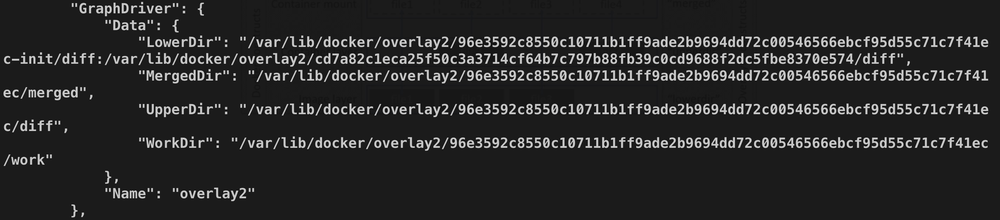

# 14-Docker 镜像你真的理解了吗？


> 世上无难事,只要肯登攀。——毛泽东

在前面我们介绍了 Docker 镜像的概念和基本操作，这篇文章我们来深入剖析一下 docker 镜像分层技术。

## 1. 分层结构

为什么说是镜像分层技术，因为Docker 镜像是以层来组织的，我们可以通过命令 `docker image inspect <image>` 或者 `docker inspect <image>` 来查看镜像包含哪些层。下面是一个示例。

```bash
[root@docker ~]# docker image inspect busybox:latest
...
"RootFS": {
 "Type": "layers",
 "Layers": [
    "sha256:195be5f8be1df6709dafbba7ce48f2eee785ab7775b88e0c115d8205407265c5"
  ]
},
```

如上图所示，其中 `RootFS` 就是镜像 `busybox:latest` 的镜像层，只有一层，那么这层数据是存储在宿主机哪里的呢？好问题。动手实践的同学会在上面的输出中看到一个叫做 **GraphDriver** 的字段内容如下。

```bash
"GraphDriver": {
  "Data": {
    "LowerDir": "/var/lib/docker/overlay2/cd7a.../diff",
    "MergedDir": "/var/lib/docker/overlay2/da4c.../merged",
    "UpperDir": "/var/lib/docker/overlay2/da4c../diff",
    "WorkDir": "/var/lib/docker/overlay2/da4c.../work"
  },
  "Name": "overlay2"
},
```

**GraphDriver** 负责**镜像本地的管理和存储以及运行中的容器生成镜像等工作**，可以将 **GraphDriver** 理解成镜像管理引擎，我们这里的例子对应的引擎名字是 ***overlay2***（overlay 的优化版本）。除了 ***overlay*** 之外，Docker 的 **GraphDriver** 还支持 ***btrfs***、***aufs***、***devicemapper***、***vfs*** 等。

我们可以看到其中的 Data 包含了多个部分，这个对应 **OverlayFS** 的镜像组织形式，在下面我们再进行详细介绍。虽然我们上面的例子中的 busybox 镜像只有一层，但是**正常情况下很多镜像都是由多层组成的**。

这个时候很多同学应该会有这么一个疑问，镜像中的层都是只读的，那么我们运行着的容器的运行时数据是存储在哪里的呢？

**镜像和容器在存储上的主要差别就在于容器多了一个读写层**。镜像由多个只读层组成，通过镜像启动的容器在镜像之上加了一个读写层。下图是官方的一个配图。我们知道可以通过 `docker commit` 命令基于运行时的容器生成新的镜像，那么 **commit 做的其中一个工作就是将读写层数据写入到新的镜像中**。下图是一个示例图：


所有写入或者修改运行时容器的数据都会存储在读写层，当容器停止运行的时候，读写层的数据也会被同时删除掉。因为镜像层的数据是只读的，所有如果我们运行同一个镜像的多个容器副本，那么多个容器则可以共享同一份镜像存储层，下图是一个示例。


## 2. UnionFS

Docker 的存储驱动的实现是基于 Union File System，简称 UnionFS，中文可以叫做联合文件系统。UnionFS 设计将其他文件系统联合到一个联合挂载点的文件系统服务。

所谓联合挂载技术，是指**在同一个挂载点同时挂载多个文件系统，将挂载点的源目录与被挂载内容进行整合，使得最终可见的文件系统将会包含整合之后的各层的文件和目录**。

举个例子：比如我们运行一个 ubuntu 的容器。由于初始挂载时读写层为空，所以从用户的角度来看：**该容器的文件系统与底层的 rootfs 没有区别**；然而从内核角度来看，**则是显式区分的两个层**。

当需要修改镜像中的文件时，只对处于最上方的读写层进行改动，不会覆盖只读层文件系统的内容，只读层的原始文件内容依然存在，但是**在容器内部会被读写层中的新版本文件内容隐藏**。当 `docker commit` 时，读写层的内容则会被保存。

### 写时复制（Copy On Write）

这里顺便介绍一下写实复制技术。

我们知道 **Linux 系统内核启动时首先挂载的 rootfs 是只读的**，在系统正式工作之后，再将其切换为读写模式。Docker 容器启动时文件挂载类似 Linux 内核启动的方式，将 rootfs 设置为只读模式。不同之处在于：**在挂载完成之后，利用上面提到的联合挂载技术在已有的只读 rootfs 上再挂载一个读写层**。

读写层位于 Docker 容器文件系统的最上层，其下可能联合挂载多个只读层，只有在 Docker 容器运行过程中文件系统发生变化时，才会把变化的文件内容写到可读写层，并隐藏只读层的老版本文件，这就叫做 **写实复制**，简称 **CoW**。

## 3. AUFS

**AUFS** 是 UnionFS 的一种实现，全称为 Advanced Multi-Layered Unification Filesystem，是早期 Docker 版本默认的存储驱动，最新的 Docker 版本默认使用 OverlayFS。

**AUFS** 将镜像层（只读）组织成多个目录，在 **AUFS** 的术语中成为 ***branch***。运行时容器文件会作为一层容器层（container lay，读写）覆盖在镜像层之上。最后通过联合挂载技术进行呈现。下图是 **AUFS** 的文章组织架构的示意图。由于 **AUFS** 可以算是一种过时的技术，所以这里我们就不在赘述了。


## 4. OverlayFS

**OverlayFS** 是类似 **AUFS** 的联合文件系统的一种实现，相比 **AUFS** 性能更好，实现更加简单。Docker 针对 **OverlayFS** 提供了两种存储驱动：***overlay*** 和 ***overlay2*** ，我们在前面的演示部分就是 ***overlay2***。这两种驱动相比之下，***overlay2*** 在 inode 使用率上更加高效，所以一般也是推荐 ***overlay2***，Linux 内核版本要求是 4.0 或者更高版本。

**OverlayFS** 将镜像层（只读）称为 ***lowerdir***，将容器层（读写）称为 ***upperdir***，最后联合挂载呈现出来的为 ***mergedir***。文件层次结构可以用下图表示。 从图中我们也可以看出相比 **AUFS**，文件层更少，这也是 **OverlayFS** 相比 **AUFS** 性能更好的一个原因。


举个例子，下图是我们运行中的 busybox 容器的 `docker inspect` 的结果。



我们在容器中做的改动，都会在 ***upperdir*** 和 ***mergeddir*** 中体现。比如我们在容器中的 `/tmp` 目录下新建一个文件，那么在 ***upperdir*** 和 ***mergeddir*** 中就能够看到该文件。

## 5. 总结

本文先通过 `docker inspect` 示例入手分析了 Docker 的镜像分层技术，然后又补充了部分理论知识，包括 **UnionFS** 、**AUFS** 和 **OverlayFS**。当然除了 **AUFS** 和 **OverlayFS**，还有一些其他的存储驱动，比如 **Btrfs**、**DeviceMapper**、**ZFS**、**VFS**，感兴趣的同学可以自行了解。