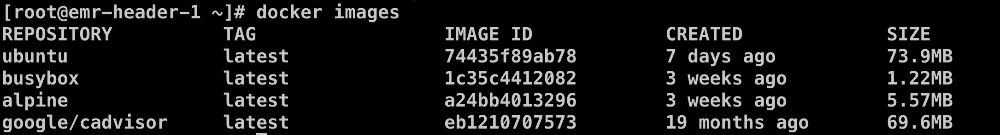
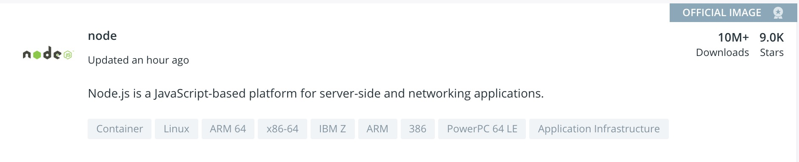
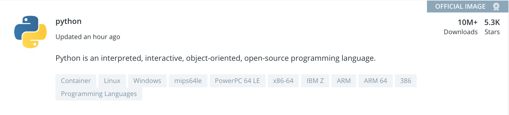
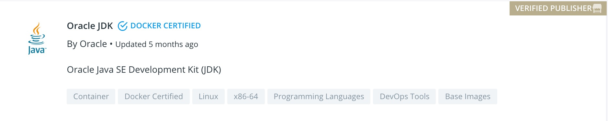

# 23-Docker 最佳实践如何构建最小的镜像


> 与有肝胆人共事，从无字句处读书。——周恩来

镜像作为 Docker 技术中关键的一环，我们日常开发中的一个关键工作就是将我们的应用构建成镜像，然后使用容器集群管理框架，比如 Kubernetes，将镜像部署集群中的多台容器中。

这个过程中就涉及到镜像的分发问题，如果镜像比较大的话，会导致我们的应用启动时间比较长。虽然有一些镜像分发技术来解决镜像发布的效率问题，但是我们还是希望将镜像构建的越来越小。这篇文章我们就来看一下这个具体的问题：如何构建最小的镜像？

## 1. 基础镜像

构建镜像，或者说编写 Dockerfile 的第一步就是 `FROM <base-image>` ，这个 base-image 如何选择直接关系到我们最终的镜像大小。

#### 操作系统镜像

一个完整的操作系统一般都比较大。在使用操作系统镜像之前，首先要问自己一个问题是不是真的需要使用一个完整的操作系统镜像。操作系统镜像包含完整的操作系统文件，包括一些 lib 和 bin 文件，如果要使用完整的操作系统里面的 bin 工具可能需要其他一个完整的操作系统镜像，其他情况一些一般都不需要。

作为完整的操作系统镜像的替代，我们可以使用定制化的操作系统镜像，比如 alpine。在我的 Linux 机器上，完整的 ubuntu 和 alpine 镜像相差达到将近 12 倍。



#### 语言开发环境镜像

有些应用需要特定的开发环境来运行，比如 Java 应用需要 JVM 环境，Python 应用需要 Python 环境（作为对比，C 或者 C++ 应用编译成二进制之后则可以直接运行在操作系统中）。

很多刚开始接触 Docker 的新手遇到这个场景，直接 FROM 一个操作系统镜像，然后在镜像中运行类似 `yum install` 的命令直接安装 Python 的开发环境，且不说这种在 Dockerfile 中直接安装软件的方式的好坏，使用操作系统镜像一定引入了很多我们不需要的文件，这无疑增加了最终的镜像大小。

实际上，基本每种开发环境都有自己的独立镜像。比如，

##### Node



##### Python



##### JDK



那么我们在使用的时候就可以按需使用这些镜像，而不是基于操作系统自己来构建了。

#### scratch 镜像

写过 Go 语言程序的同学都知道 Go 应用采用的是静态编译的方式，所有的依赖都会被打包到二进制文件中。这时候我们要构建 Go 语言应用的镜像就会异常地简单，只需要将二进制文件拷贝到基础镜像中即可。那么这个时候我们的基础镜像选什么呢？当然可以选一个操作系统镜像或者定制化的操作系统镜像，但是这样会显得稍微有点浪费。

这个时候我们可以考虑使用 scratch 镜像，scratch 镜像是 Docker 保留镜像，只能用来构建其他镜像。

下面我们用实例演示一下用 scratch 镜像构建我们的应用。我们先用 Go 语言编写一个简单的 http server，代码如下。功能很简单，启动一个 http server 监听 8091 端口。

```go
package main

import (
    "fmt"
    "net/http"
)

func hello(w http.ResponseWriter, req *http.Request) {
    fmt.Fprintf(w, "hello\n")
}

func main() {
    http.HandleFunc("/hello", hello)
    http.ListenAndServe(":8091", nil)
}
```

然后通过 `go build` 命令编译出二进制文件，指定 CGO_ENABLED=0 表示是静态编译。

```bash
[root@xxx code]# CGO_ENABLED=0 go build -o http-server
[root@xxx code]# ls -lh
total 7.2M
-rw-r--r-- 1 root root   64 Jun 25 00:24 Dockerfile
-rwxr-xr-x 1 root root 7.1M Jun 25 00:45 http-server
-rw-r--r-- 1 root root  230 Jun 25 00:44 http-server.go
```

编写 Dockerfile 如下，是不是非常的简单。

```dockerfile
FROM scratch
ADD http-server /
EXPOSE 8091
CMD ["/http-server"]
```

然后我们通过 docker build 构建镜像，构建出来的镜像只有 7.47MB，对比上面的二进制文件 7.2M，scratch 镜像只有几百 k 。

```bash
[root@xxx code]# docker build -t http-server:v1 .
Sending build context to Docker daemon  7.473MB
Step 1/4 : FROM scratch
 --->
Step 2/4 : ADD http-server /
 ---> 002016c837b3
Step 3/4 : EXPOSE 8091
 ---> Running in db4b0ac373cd
Removing intermediate container db4b0ac373cd
 ---> 2f2e6000e845
Step 4/4 : CMD ["/http-server"]
 ---> Running in cdce752a3f60
Removing intermediate container cdce752a3f60
 ---> 8445f4264352
Successfully built 8445f4264352
Successfully tagged http-server:v1
[root@xxx code]# docker images
REPOSITORY          TAG                 IMAGE ID            CREATED             SIZE
http-server         v1                  8445f4264352        12 seconds ago      7.41MB
```

下面我们验证一下应用是不是可以正常工作。通过下面的 `docker run` 命令启动。其中的 `-p` 用于将容器的端口 8091 和宿主机的端口 8091 进行映射。

```bash
[root@xxx code]# docker run -d -p 8091:8091 http-server:v1
827aee4de71950d3878c58c4b13b69c844514acd60e48de916a8938906c50727
```

下面我们访问一下 http server 看看是不是 work。

```bash
[root@xxx ~]# curl localhost:8091/hello
hello
```

## 2. 多阶段构建

多阶段构建是 Docker 官方提出来的概念，原文是 multi-stage build，也是一种用来构建最小镜像的方案。多阶段构建是 Docker 17.05 或者更高版本之后提出来的特性，不仅可以用来减小最小生成的镜像的体积，还可以保持 Dockerfile 文件的可读性和可维护性。

我们在上面的一个演示 scratch 镜像的时候，Dockerfile 中直接将 Go 应用的二进制文件 COPY 到镜像中，但是在实际的开发中，为了保证多个开发成员的开发环境一致，一般会建议用一个同一个开发或者打包环境。在 Docker 之前，这个打包环境可能是一台机器，但是有了 Docker 之后，我们就可以用 Docker 来替代了。比如 Go 语言的编译打包，我们可以统一使用一个基础镜像来构建我们的镜像就可以了。下面是一个示例，其中 app.go 是开发者开发的程序。

```dockerfile
FROM golang:1.13.3
WORKDIR /go/src/github.com/alexellis/href-counter/
RUN go get -d -v golang.org/x/net/html  
COPY app.go .
RUN CGO_ENABLED=0 GOOS=linux go build -a -installsuffix cgo -o app .
```

通过上面的 Dockerfile 我们就可以编译出来可执行文件。有了可执行文件，我们部署可以有两种方式：

**1. 直接在原 Dockerfile 中修改使用**

```dockerfile
FROM golang:1.13.3
WORKDIR /go/src/github.com/alexellis/href-counter/
RUN go get -d -v golang.org/x/net/html  
COPY app.go .
RUN CGO_ENABLED=0 GOOS=linux go build -a -installsuffix cgo -o app .

CMD ["./app"]
```

**2. 将可执行文件 COPY 出来使用**

第一种方式应该是大部分人使用的方式，这种方式比较简单，但是对于最终的部署镜像来说，引入了太多不必要的文件，比如 Go 编译环境。

第二种方式可能是一种更好的方式，我们部署的时候可以直接使用 scratch 镜像，这样最终的镜像会小很多。但是 COPY 的方案可能需要斟酌，比如通过 volume 的方式，将容器目录映射到宿主机目录，然后进行手动拷贝。但是这些手工操作可能会引入其他问题。这里就引入了多阶段构建的概念。

简单来说，多阶段构建允许我们在一个 Dockerfile 中使用多个 `FROM` 指令，每个 `FROM` 可以使用不同的 base 镜像，每个 `FROM` 会对应一个阶段（stage），所谓多阶段就是多个 `FROM` 的意思。下面是一个示例。

```dockerfile
FROM golang:1.13.3
WORKDIR /go/src/github.com/alexellis/href-counter/
RUN go get -d -v golang.org/x/net/html  
COPY app.go .
RUN CGO_ENABLED=0 GOOS=linux go build -a -installsuffix cgo -o app .

FROM alpine:latest  
RUN apk --no-cache add ca-certificates
WORKDIR /root/
COPY --from=0 /go/src/github.com/alexellis/href-counter/app .
CMD ["./app"]  
```

注意上面的 Dockerfile 中的第 10 行中的 `COPY --from=0` 就是从阶段 0 拷贝文件。

多阶段构建的 Dockerfile 使用起来和其他 Dockerfile 没有区别，这样我们只要维护一个 Dockerfile 就可以。下面介绍一些多阶段构建的其他使用方式。

#### stage 命名

我们上面的例子中是通过 `--from=0` 来指定 stage 的，我们也可以为每个 stage 指定一个更具有可读性的名字，示例如下。

```dockerfile
FROM golang:1.13.3 builder
WORKDIR /go/src/github.com/alexellis/href-counter/
RUN go get -d -v golang.org/x/net/html  
COPY app.go .
RUN CGO_ENABLED=0 GOOS=linux go build -a -installsuffix cgo -o app .

FROM alpine:latest deployment
RUN apk --no-cache add ca-certificates
WORKDIR /root/
COPY --from=builder /go/src/github.com/alexellis/href-counter/app .
CMD ["./app"]  
```

#### 执行到指定的 stage

我们的 Dockerfile 中定一个了一个完整的流程，有的时候没有必要执行完整个流程，那么我们可以通过下面的方式让 docker build 执行到指定的 stage 就不再进行下去。下面的例子是执行到 builder stage。

```bash
$ docker build --target builder -t alexellis2/href-counter:latest .
```

## 3. 定制自己的 base 镜像

如果我们的很多镜像都有一些共同的部分，比如一些基础环境和二进制工具，那么可以考虑将这些共同的部分抽出来创建一个自己的 base 镜像，然后其他镜像基于这个 base 镜像来构建。

这么做的一个好处是，Docker 只需要加载一次这些共同的文件层就会自动缓存。这样其他基于这个 base 的镜像也会更快。

## 4. 总结

本文介绍如何最小化构建我们的镜像的一些策略，主要介绍了三种方式：选取合适的 base 镜像；多阶段构建；定制 base 镜像。然后重点介绍了前两种方式，这两种方式也是减小构建出来的镜像体积的最有效的方式。