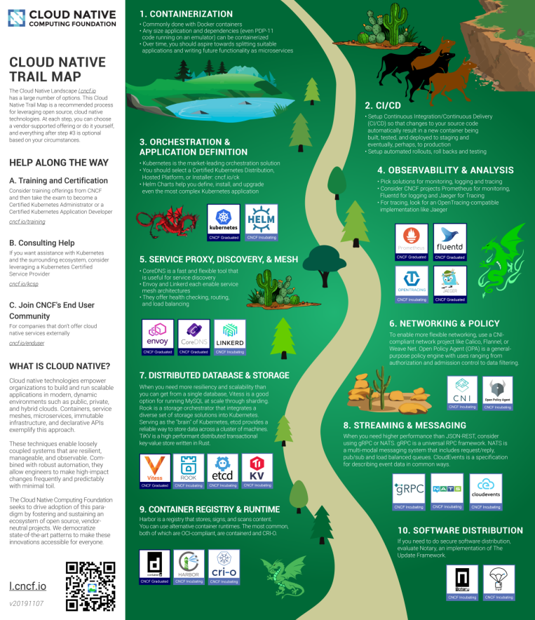

# 29-云原生技术简介

> 古之立大事者，不唯有超世之才，亦必有坚韧不拔之志。——苏轼

## 1. 云原生的定义

要说云原生，得先说一下 CNCF，CNCF 的全称是 Cloud Native Computing Foundation，中文一般叫做云原生计算基金会，致力于云原生（Cloud Native) 技术的普吉。那么到底什么是云原生技术呢？官方针对云原生给出了这样的定义：

> Cloud native technologies empower organizations to build and run scalable applications in modern, dynamic environments such as public, private, and hybrid clouds. Containers, service meshes, microservices, immutable infrastructure, and declarative APIs exemplify this approach.
>
> These techniques enable loosely coupled systems that are resilient, manageable, and observable. Combined with robust automation, they allow engineers to make high-impact changes frequently and predictably with minimal toil.
>
> The Cloud Native Computing Foundation seeks to drive adoption of this paradigm by fostering and sustaining an ecosystem of open source, vendor-neutral projects. We democratize state-of-the-art patterns to make these innovations accessible for everyone.

中文版本

> 云原生技术有利于各组织在公有云、私有云和混合云等新型动态环境中，构建和运行可弹性扩展的应用。云原生的代表技术包括容器、服务网格、微服务、不可变基础设施和声明式API。
>
> 这些技术能够构建容错性好、易于管理和便于观察的松耦合系统。结合可靠的自动化手段，云原生技术使工程师能够轻松地对系统作出频繁和可预测的重大变更。
>
> 云原生计算基金会（CNCF）致力于培育和维护一个厂商中立的开源生态系统，来推广云原生技术。我们通过将最前沿的模式民主化，让这些创新为大众所用。

实际上，云原生是一条最佳路径或者最佳实践。更详细的说，**云原生为用户指定了一条低心智负担的、敏捷的、能够以可扩展、可复制的方式最大化地利用云的能力、发挥云的价值的最佳路径。**

因此，云原生其实是一套指导进行软件架构设计的思想。按照这样的思想而设计出来的软件：首先，天然就“生在云上，长在云上”；其次，能够最大化地发挥云的能力，使得我们开发的软件和“云”能够天然地集成在一起，发挥出“云”的最大价值。

所以，云原生的最大价值和愿景，就是认为未来的软件，会从诞生起就生长在云上，并且遵循一种新的软件开发、发布和运维模式，从而使得软件能够最大化地发挥云的能力。说到了这里，大家可以思考一下为什么容器技术具有革命性？

其实，容器技术和集装箱技术的革命性非常类似，即：容器技术使得应用具有了一种“自包含”的定义方式。所以，这样的应用才能以敏捷的、以可扩展可复制的方式发布在云上，发挥出云的能力。这也就是容器技术对云发挥出的革命性影响所在，所以说，容器技术正是云原生技术的核心底盘。

## 2. 云原生技术发展简史

2019 年可以说是云原生技术的元年，但是云原生技术的发展却可以追溯到很多年以前：

- 2004 年— 2007 年，Google 已在内部大规模地使用像 Cgroups 这样的容器技术，当时项目名还叫做 Process Container。
- 2008 年，Google 将 Cgroups 合并进入了 Linux 内核主干，内核版本 2.6.24。
- 2013 年，Docker 项目正式发布。并且凭借着镜像技术成功击败 PaaS 领域的霸主 Cloud Foundry。
- 2014 年，Docker 公司推出容器集群管理项目 Swarm，将容器话技术推向新的高潮。
- 2014 年，Kubernetes 项目也正式发布。这样的原因也非常容易理解，因为有了容器和 Docker 之后，就需要有一种方式去帮助大家方便、快速、优雅地管理这些容器，这就是 Kubernetes 项目的初衷。在 Google 和 Redhat 发布了 Kubernetes 之后，这个项目的发展速度非常之快。凭借这 Google 内部先进的理念和开放的开发者社区，Kubernetes 很快就赢得了开发者的青睐，取代了 Swarm 的地位。
- 2015 年，为了制衡 Docker 公司。由Google、Redhat 以及微软等大型云计算厂商以及一些开源公司共同牵头成立了 CNCF 云原生基金会。CNCF 成立之初，就有 22 个创始会员，而且 Kubernetes 也成为了 CNCF 托管的第一个开源项目。在这之后，CNCF 的发展速度非常迅猛。
- 2017 年，Docker 公司由于自己的决策失误放弃开源社区，转型商业化。Docker 的容器运行正式捐赠给 CNCF 社区，并改名 Moby。至此，CNCF 终于完成大一统。
- 2017 年，CNCF 达到 170 个成员和 14 个基金项目；
- 2018 年，CNCF 成立三周年有了 195 个成员，19 个基金会项目和 11 个孵化项目，如此之快的发展速度在整个云计算领域都是非常罕见的。
- …

2019 年的场景我想大家都知道了，国内的各大云厂商纷纷拥抱 Kubernetes，这其中以阿里巴巴为代表。阿里巴巴将自己内部维护的容器调度系统 sigma 和 Kubernetes 进行整合，在云上和集团内部开始全面拥抱 Kubernetes。

## 3. 云原生技术生态

我们从上面可以看到云原生的代表技术包括容器、服务网格、微服务、不可变基础设施和声明式API。实际上云原生技术生态已经非常的庞大，下面是 CNCF 绘制的一张云原生全景图，已经包括 200 多个项目和产品。

下面这张图是官方给出的 Cloud Native 的 Trail Map，主要涵盖了云原生技术在十个个领域的简介和典型项目举例。

- Containerization，容器化，比如镜像的制作
- CI/CD，持续集成和部署
- Orchestration & Application Definition，应用的编排与管理
- Observability & Analysis，监控和可以观测行，比如如何进行监控、日志收集、Tracing 等。
- Service Proxy, Discovery & Mesh，服务发现和服务网格
- Networking & Plolicy，网络
- Distributed Database & Storage，分布式数据存储
- Streaming & Messaging，消息系统
- Container Registry & Runtime，容器镜像仓库和容器运行时
- Software Distribution，软件发布

