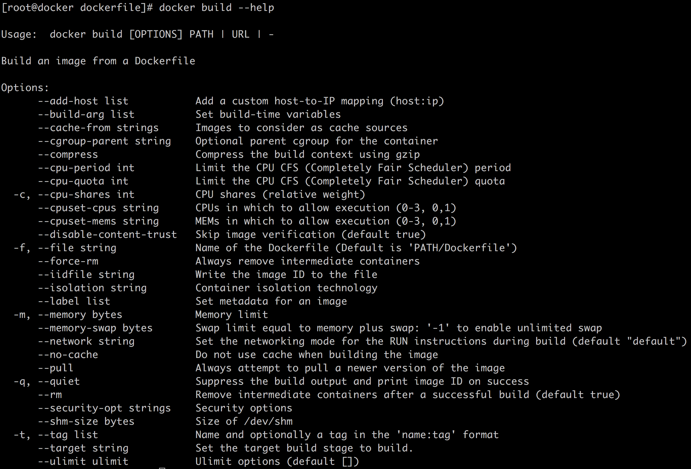

# 16-镜像构建指南Dockerfile


> 合理安排时间，就等于节约时间。——培根

我们在前面的文章中也介绍过构建镜像的话需要编写一个 Dockerfile 文件，我们可以类比 C++ 项目中的 makefile，不过要比 makefile 简单很多。这一章节我们就来看看 Dockerfile 应该如何去写。

## 1. Dockerfile 的使用

在正式介绍 Dockerfile 的语法之前，我们先来看一下如何使用 Dockerfile。Dockerfile 要联合 `docker build` 命令进行使用，我们可以通过 -f 参数指定 Dockerfile 的路径（这个路径不光是本地路径，甚至可以是一个可以访问的 URL），如果没有指定则在 PATH 目录（PATH 目录为 `docker build` 的最后一个参数，当然我们一般使用 PATH 都是当前目录，可以用 “.” 来表示）下寻找名字叫 “Dockerfile” 的文件，也就是下面两种方式。

```bash
docker build -f /path/to/dockerfile .
```

或者

```bash
docker build .
```

但是这样 build 出来的镜像是没有名字和 tag 的，下面是一个简单 Dockerfile。

```dockerfile
FROM busybox:latest

COPY 1 /tmp
```

我们通过上面这种方式 `docker build .` 的方式 build 完之后，通过 `docker images` 查看 build 出来的镜像会发现 REPOSITORY 和 TAG 都是 `<none>`。

```bash
[root@docker dockerfile]# docker images
REPOSITORY          TAG                 IMAGE ID            CREATED             SIZE
<none>              <none>              d9420474dd92        7 minutes ago       1.22MB
```

对于上面说到的这种情况，我们可以通过 `-t` 参数指定生成的镜像的名字和 tag。比如 `-t hello:v1`，我们执行一下。

```bash
[root@docker dockerfile]# docker build -t hello:v1 .
Sending build context to Docker daemon   2.56kB
Step 1/2 : FROM busybox:latest
 ---> 6d5fcfe5ff17
Step 2/2 : COPY 1 /tmp
 ---> Using cache
 ---> d9420474dd92
Successfully built d9420474dd92
Successfully tagged hello:v1
[root@docker dockerfile]# docker images
REPOSITORY          TAG                 IMAGE ID            CREATED             SIZE
hello               v1                  d9420474dd92        9 minutes ago       1.22MB
```

当然如果你想了解 `docker build` 可以支持的所有参数，可以通过 `docker build --help` 查看，这里就不赘述了。



## 2. Dockerfile 的语法

下面我们来进入正题，也就是 Dockerfile 支持的语法有哪些。如果你的机器上安装了 Docker，可以通过 `man dockerfile` 来查看，如果没有安装也没有关系，这篇文章会详细解释。Dockerfile 的文件格式一般都是以一个关键字开头，比如上面例子中的 `FROM` 和 `COPY`，其中 `FROM` 表示引用的基础镜像，`COPY` 表示拷贝一个文件到镜像中。Dockerfile 支持的常用关键字主要有如下几种：

- FROM : 指定引用的基础镜像；
- MAINTAINER : 指定该 Dockerfile 的维护者信息，这个在公司内部的时候比较有用，我们可以将公司内部的邮箱或者工号写上；
- LABEL : 用来指定镜像的一些元信息；
- RUN : 运行该关键字之后紧跟着的命令，比如 `RUN cp 1 /tmp`；
- COPY : 文件或者文件夹拷贝；
- ADD : 该命令也是文件拷贝，后面我们会详细比较它和 COPY 的区别；
- EXPOSE：设置容器的监听端口；
- WORKDIR: 指定工作目录；
- ENV: 指定环境变量；
- VOLUME：指定磁盘挂载点；
- USER: 指定命令的执行用户；
- CMD: 指定该镜像的默认启动命令，CMD 只需要指定一个即可，形如 `CMD ["executable", "param1", "param2"]` 。如果指定了多个 CMD，只有最后一个会生效；
- ENTRYPOINT：容器的默认启动入口。比如我们使用 `docker run` 启动容器时，容器的默认启动入口就是镜像中通过该指令指定的命令或者脚本，我们可以在外面使用参数将其覆盖掉；
- ARG：在 build 的时候指定参数；
- 注释：注释以 `#` 开始。

### FROM

`FROM` 很简单，需要注意的是 `FROM` 必须是 Dockerfile 的第一条有效命令，所谓有效是指非注释命令。`FROM` 后面跟随的 docker 镜像可以有多种格式，比如：

```bash
FROM image
FROM image:tag
FROM image@digest
```

**如果没有指定 tag 或者 digest，则表示把该镜像的 latest 版本作为基础镜像**。当然在生产环境下，**latest 版本永远不应该作为基础镜像**，因为如果将 latest 版本作为基础镜像就意味着镜像会一直变化。

### MAINTAINER

类似如下格式。

```bash
MAINTAINER <name> (xxx@imooc.com)
```

但是现在官方文档上面已经将 `MAINTAINER` 标注为 ***deprecated*** 了，一般是通过 `LABEL` 来指定维护者信息，比较维护者也可以算是镜像的原信息。

### LABEL

正如上面说说，`LABEL` 用来添加镜像的 metadata，格式也比较简单，如下，也就是说这里的 metadata 都是 key value 对。

```bash
LABEL <key>=<value> <key>=<value> <key>=<value> ...
```

当然你也可以将 metadata 中的 key-value 拆成每行一个，都以 LABEL 开头。一旦 Dockerfile 中增加了 `LABEL` 信息，build 出来的镜像则可以通过 `docker inspect` 命令进行查看。下面就是我们通过 `docker inspect` 查看到的 nginx 镜像的 label 信息。

```bash
[root@docker dockerfile]# docker inspect nginx
...
"Labels": {
 "maintainer": "NGINX Docker Maintainers <docker-maint@nginx.com>"
},
...
```

### RUN

`RUN` 命令表示运行后面紧跟的命令，有如下两种形式。

```bash
RUN <command>
RUN ["executable", "param1", "params"]
```

这个命令应该是 Dockerfile 中最常用的命令了，比如我们要在镜像中通过 yum 安装 redis，那么我们可以通过如下方式编写我们的 Dockerfile。

```dockerfile
RUN yum install redis
```

或者

```dockerfile
RUN ["yum", "install", "redis"]
```

`RUN` 还有一点需要注意的是 Dockerfile 中的每一个 RUN 命令都会生成一个新的镜像层，这个我们再讨论。

### COPY

`COPY` 用来拷贝文件或者文件夹。

```dockerfile
COPY hom* /mydir/
```

### ADD

类似 `COPY`，可以认为是增强版的 `COPY`。区别主要体现在两个地方：

- 当 `ADD` 后面跟压缩文件时，拷贝的时候会将压缩文件进行解压。
- `ADD` 可以用来下载网上的文件

```dockerfile
ADD html.tar.gz /var/www/html
ADD https://xxx.com/html.tar.gz /var/www/html
```

### EXPOSE

表明 Docker 应用内部监听的端口，可以指定端口的协议是 TCP 还是 UDP，没有指定认为是 TCP。

```bash
EXPOSE <port> [<port>/<protocal>...]
```

比如我们要暴露 80 端口。

```dockerfile
EXPOSE 80
```

容器内部监听了端口，那么我们启动容器的时候一般都会通过 `-p` 参数将该端口暴露出去。

```bash
docker run -p 80:80 ...
```

### WORKDIR

指定工作目录。一旦指定，则后面的命令（比如 `RUN`）的工作目录都是 `WORKDIR` 指定的目录，也就是说命令 `pwd` 的输出就是 `WORKDIR`

### ENV

用来指定环境变量，格式如下：

```dockerfile
ENV <key> <value>
ENV <key>=<value> ...
```

其意义类似我们在 Linux 中使用的 export 导入环境变量。

### VOLUME

`VOLUME` 会为镜像生成一个新的挂载点。但是我们也可以不使用 `VOLUME`，而是在 `docker run` 的时候通过 `-v` 参数指定。

```dockerfile
VOLUME ["/data"]
VOLUME /data
```

### USER

`USER` 对应的需求是：有的时候，不同命令需要通过不同的用户或者用户组来执行，那么我们在 dockerfile 中就可以通过 `USER` 来设置接下来的命令 （比如 `RUN`）的执行用户。

```dockerfile
USER <user>[:<group>] or
USER <UID>[:<GID>]
```

### CMD

`CMD` 用来为镜像指定一个默认的启动命令，所谓默认是说我们可以通过 `docker run` 命令行参数通过其他的命令来覆盖 `CMD`。`CMD` 支持的格式如下：

```dockerfile
CMD ["executable","param1","param2"] 
CMD command param1 param2 
CMD ["param1","param2"] 
```

其中第三种方式，会将 param1 和 param2 作为参数传递给 ENTRYPOINT。我们可以通过如下的方式通过 `docker run` 指定 docker 的启动命令为 `/bin/bash` 覆盖 `CMD`。

```bash
docker run <params> <image> /bin/bash
```

### ENTRYPOINT

`ENTRYPOINT` 类似 `CMD`，也是指定镜像的默认启动命令，但是不能像上面那样 `docker run` 的方式来覆盖。那么问题来了，如果我想通过其他的启动程序来验证我的镜像，我怎么做呢？举个例子，`ENTRYPOINT` 指定的是应用程序启动，但是我们启动的过程中一直启动不了，所以我想通过 `/bin/bash` 想把 docker 启动起来，然后再检测依赖环境，那么怎么做呢？

答案是通过 --entrypoint 参数来覆盖。

```bash
docker run --entrypoint /bin/bash ...
```

### ARG

`ARG` 用来在 `docker build` 的时候传参，比如如下的 dockerfile 我们就可以在 build 的时候指定 user。

```dockerfile
ARG user
USER $user
...
```

构建的时候指定参数

```bash
docker build --build-arg user=root -t myDocker:v1 .
```

## 3. 总结

本文介绍了 dockerfile 的语法和常用命令，基本通过这些常用命令足够我们去构建我们的日常开发中需要的大部分镜像了。但是还是希望大家可以多实践，毕竟实践才能出真知。
