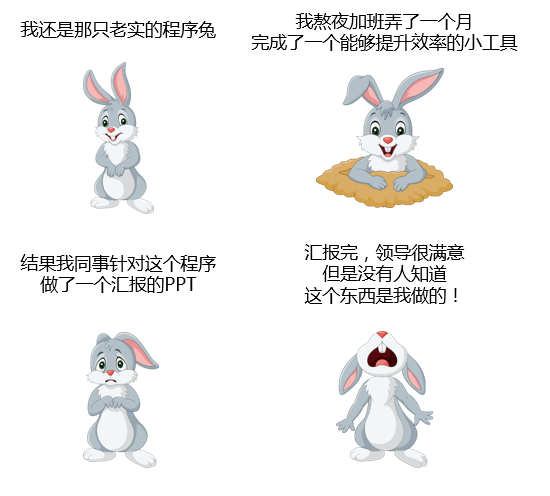

# 08-从“我干活，你抢功”聊起之“抢功精同事”篇

> 机遇只偏爱那些有准备的头脑。——巴斯德

书接上文，上一回我们讲到真正的 “**抢功**” 实际上只发生在同事之间。就像前边说的，平级的同事之间我们不会太涉及共同的利益、共同的目标以及互利互惠的关系。就像小灰这次遇到的情况一样：

这就是在很多公司里都存在，越是大公司情况越多，手段更隐蔽的一种令人非常厌恶的人 —— **抢功精**。

抢功精们总是观察细致，见缝插针，趁你不注意就把你的功劳盗取，然后转眼谄媚地跑到老板面前邀功。抢功精们精于算计，手段高超，抢功劳抢得滴水不漏。

既然不是你的领导，就没有互惠的必要，所以难免让人心生厌恶，毕竟没人愿意自己辛苦的成果被别人抢走。奈何这些 “抢功精” 本领太大，总是在你不经意间就逃出了你的视线，出现在了老板的面前，展示着原本属于你的东西。甚至有时候让我们感觉，这遇到的绝对不是一个程序员同事，大约应该是某个 “江湖大盗” 易容过来的。

摆在你面前的有这么几个选项：

1. 默默忍受
2. 向老板澄清
3. 以牙还牙以眼还眼
4. 联合他人，共同进退
5. 辞职走人

**如果是你，你会怎么做呢？**

**第一、控制自己的情绪**

我们在职场上，不可避免地会遇到小人，像 “抢功精” 这样的小人虽然令人厌恶，但至少不是直接伤害你的那种。大家也可以理解，任何人知道自己的功劳被人抢走了，情绪一定会不够稳定，如果性格再稍微火爆一点，很容易就当场爆发出来。

但是请尽量克制一下自己，控制自己的情绪，冷静下来。即便你很有道理、你很正确，即便你能够确保其他同事和领导能够了解真相，也千万不要在大庭广众之下大发雷霆。因为这不但不容易为自己伸冤，还容易被打上 “脾气差”、“难相处”、“没情商” 的标签。

**第二、判断形势**

既然不要迅速反击，那么接下来就冷静下来好好判断一下现在的局面。这有点类似于我们打篮球、下围棋，再通俗一点就是打麻将。不要因为自己已经输了一局或者落后了一点就着急上头，职场上很重要的一件事情就是**判断**。

判断什么呢？判断现在这件成果被抢功的影响范围。如果影响范围只在少数几个同事圈中，那么就大可以轻松礼貌地当着 “抢功精” 的面澄清真相，相信他并不会反驳什么。

但是如果抢功精已经在老板面前展示过，并且老板和同事都认为是他的功劳的时候，“澄清” 这件事就并没有那么简单了，因为先入为主的思维，除非你在这个成果中留下了他人无法知晓的底牌，否则很难轻易反击。

**第三、制造舆论，掌控人言**

既然所有人都把这份功劳归于了抢功精，那么解释都是徒劳。但不代表就无休止地忍让了。默默忍受，只会让抢功精盯上你，谁让你不说话好欺负呢！选择负气离开，那更是毫无意义，因为你还会在另一家公司遇到其他抢功精。

那么适合的反击形式就是过一段时间，找一个恰当的时机，把这些事情和同事说一说，这里注意啊，“说” 是个中性词，不要把 “说一说” 变成祥林嫂的唠叨，也不要过多抱怨批评，而是以说笑甚至是提醒的方式讲述这个事情。

在这个方面红楼梦里的王熙凤算是个中高手，比如：

> 薛姨妈听后便道：“昨日晚上，我原想着今日要和我们姨太太借一日园子，摆两桌粗酒，请老太太赏雪的，又见老太太安息的早。我闻得女儿说，老太太心下不大爽，因此今日也没敢惊动。早知如此，我正该请。”
>
> 凤姐儿笑道：“姨妈仔细忘了，如今先秤五十两银子来，交给我收着，一下雪，我就预备下酒，姨妈也不用操心，也不得忘了。”

这样的玩笑话看似是在逗乐，实际上是当着大家的面揭露了薛姨妈小气又虚伪的嘴脸。

通过一些说笑的方式，借用一些细节，甚至如果你确认 “抢功精” 对于实际的成果并不了解的话，你完全可以找到恰当的时机在某一次合适的场合在老板和同事面前探讨：

_XXX，我们之前实现过这个类似功能啊，你还记得么？_

无论是老板还是 “抢功精” 接话都可以顺理成章的把话语权接过来，暗示当初的成功是你主要完成的，让别人看清事情的来龙去脉。要知道别人的口风可是件杀伤力很大的武器，要不了多久大家就知道是啥情况了。

**第四、抱团取暖**

“抢功精” 一般不会只坑你自己，他们的战斗力一般都是辐射所有看起来好欺负的人。所以，你可以观察下，也可以多找团队里的一些关系不错值得信任的老人聊聊。

这未必能改善你和 “抢功精” 的对立关系，但是一方面，可以为融入老人的圈子找到了一个共同的话题；同时，也能更好的达到掌控舆论的目的。

当然，不要指望别人可以路见不平拔刀相助，他们最多会抱有同情，更好一点会给你一些劝慰和帮助。

但是就像 “上班第一天” 时候聊过的，一个团体、一些有经验的老人的帮助就是你在团队中最宝贵的资源。

**第五、吃一堑长一智**

被抢功精坑过一次就够了，凡事都要留一手，防患于未来。

学会保护好自己的东西，一旦想要展示，就一定要在团队大多数人都在的公开场合。即使私下里需要和其他人一起商量，也不要把所有的点都说出来，万事留一线。最后，保留一些核心的可以证明有且只有你才知道的核心 “证据”。

到时候，抢功精自然会望而生畏，即便还有人抢功劳也有反击的证据。

不管最后的结果怎么样，能给抢功精一些教训最好，但是也别把心思都放在上面，最主要的还是做好一件事：认真工作并学会表达。

好好工作，做出好的成功，这是我们很多人的本心，我们也相信路遥知马力，日久见人心。但是在当前这个时代，“能做” 很好，“只做不说”，不懂为自己 “邀功”，事实上这就是我们的不足之处。

这就好像我喜欢一个女孩子，但是呢我始终默默关心、嘘寒问暖，相信有一天女孩一定能看到我的真心，一定会被我感动，主动投入我的怀抱。_PS: 老婆，我真的就是举个例子……_

这样的故事只会出现在言情剧里，“爱要大声说出口” 才是这个年代年轻人应有的表达方式。所以，不要期望我勤恳工作，终有一天被老板发现：_啊，原来是你一直在支持我！我要给你升职、加薪、让你做总经理、迎娶白富美。_

不可能的好吧！所以，学会表达自己，让大家知道你做了什么，让别人知道你的重要性，让老板看到你的开口。

接下来只要你完成了工作，又能处理好与同事的关系，就一定能够得到同事和领导的认可。到时候，别人就是想抢你的功劳，也没有什么机会了。
