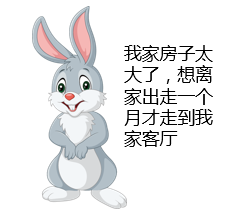
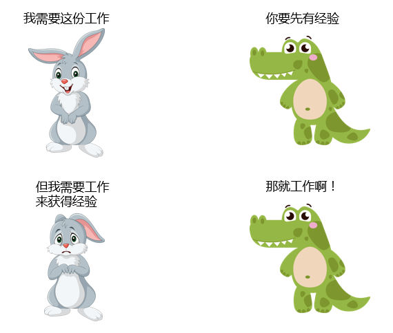
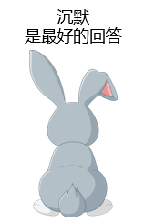
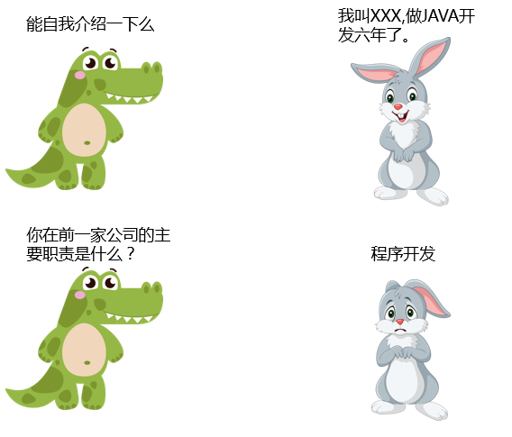
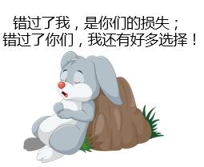
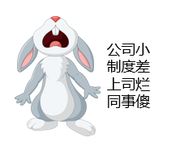

# 03-做高情商的“面试者”

> 衡量一个人的真正品格，是看他在知道没人看见的时候干些什么。——孟德斯鸠

在这一个篇章中，我想跟你聊聊面试。话说我自己在软件行业摸爬滚打了十余年，招聘面试也是我自己的日常工作之一。想来被我面过的人也估计不下千人（还请不要拿我的头像照片当飞镖靶子），而作为被面试者参加的面试也有几十场，可以算是有比较丰富经验面试经验的“老人”了。

面试到底是什么？说直白一点，**面试就是把自己变成商品，不遗余力地推销给面试官，从而打动他的过程**。

很多同学都觉得面试过程最重要的是自己的技术水平和能力测试。这是当然，技术能力一定是最重要的。但是不可忽略的是，面试官也一定会更加注意考察你的“情商”。

所以今天我们聊几个小场景来说说面试者应该拥有怎样的情商。

**简历过于夸张**

我是面试官的同时，也是个讲师对吧，如果你看过我的课程也会知道：我也有给大家讲如何去美化自己的简历。但是注意哈，美化不是让大家夸张，我在面试过程中碰到过很多同学，为了赢得面试机会和面试官的好感，**不顾实际情况，写一些根本没有的经历，或过分夸大相应的经验和成绩**。

我们不讲大道理，什么“造假太虚伪‘，或者说”诚实是美德“这样比较空的话。只想说：真的不要把面试官当傻子。

_记忆很深刻的一次，有一次我面试一个测试架构的岗位。小伙儿人很帅，年龄不大，但是简历中来自一个中型互联网公司，最厉害的部分就是在一年中带队搭建了包括性能测试平台、WEB 自动化平台、TestOPS 流程、“ALL IN ONE” DOCKER 等巨型项目。单看简历着实是人才中的人才。_

_但是面试过程中，发现无论是对自动化的理解、对 DevOps 的认识、甚至是对性能测试还需要监控调优这些都不甚了解，实在是让人匪夷所思。_

这是吹“爆”了的个例，之所以讲出这个故事，只是因为这个小伙儿的夸张让我印象十分深刻。除了这种项目上的造假，还有工作经历、学历上的造假。实际上你要知道，绝大多数的面试官都是技术 OK、沟通能力不错，你仔细想一下，这样的人一定是有比较良好的人脉关系，所以除非你来自某个实在难以挖掘的公司，不然你真实的工作情况和背景大多数还是很容易被挖出来的。

就算偶然被你蒙进去到了工作岗位，面对远超自己能力范围的工作又当如何？

当然，实际一点地说，之所以这么多人会篡改简历，给自己的简历添加莫须有的工作经历、工作职责、工作职称，很多时候也是无奈之举。因为现在的公司开始越来越多地去强调学历、经验，而让很多本身有能力的人被这些基础门槛挡在门外，或者给的条件是最差的。

  

真实的情况确实是很多简历造假的或者在面试过程中善于说谎的，获得了一份工作甚至是很好的 offer，因为我想做一个真实的专栏故事，所以我一点都不避讳这一点。我们谁都不可能 100% 真实地面对面试官，毕竟这是对你的一次考试，我们都希望展现自己最好的一面。

所以在这一小节我想表达是：简历不是不可以美化，但是教育经历、工作经历尽量不要篡改，而项目经历，可以适当美化，但还请一定符合自己的能力，不要无休止的夸张。毕竟牛飞上了天，就很难拉下来了。

不得不说，适当的美化简历，确实可以让我们快速；得到面试的机会。我并不排斥美化，不过，请记住几点：

1. 不要把面试官、HR 当傻子
2. 技术上能力上请自觉找齐，做自己能力范围里的事儿

就像照片一样，可以 P 图，但是记得别把地板都给 P 歪了，更不要做换头术，毕竟你又不是要做个“网红”。

**过度自信、骄傲**

 

重复前边的“**知识点**”：面试其实是推销自己的过程。有些人自视甚高，在面试中表现出一份天之娇子、唯我独尊的架势，不愿意从基础工作做起，觉得自己是要做大事的，要去“改变世界”的。

任何一件商品的推销，都不会用“**只有亿万富豪才配拥有我**”这样的 slogan。面试官可以认为你很强，技术很厉害，但是记住：任何标签都不是自己打的。经常遇到一些目空一切的面试者，暂且不说你是否具体匹配你骄傲的能力，只是想一想，面试你的人大多以后会是你的同事、你的上司，**换位思考**一下，如果你是面试官，即将面试的同事是一个给人第一印象贴满骄傲、跋扈标签的人，你是否会选择跟他做同事呢？结果显而易见。

就算你的能力确实很优秀，也请你放下你的骄傲。这里说放下，是希望你态度上不要那样高高在上，也并没有要你放下自尊、卑躬屈膝。无论你有多强，你的履历多光辉，你的历史多辉煌，每一次面试都是个从零开始的过程。

记得：**面试对你而言，是一场推销。**面试官有更多的选择，不会非你不可，哪怕你是最优秀的。

**“挤牙膏式”面试**

上一段我们聊到面试是一场推销，哪怕你是一个再不喜欢说话的人，既然要推销自己，就一定不能“沉默是金”。我不止一次，这毫不夸张，真的不止一次遇到类似下边的对话：

尽管大家的时间确实都非常宝贵，但是我真的不介意你在面试的时候多说几句。只做不说是好的，可是面试时候，这样不能把你的技术、能力、经验、优势向面试官说明，而面试官呢，更加不知道你是因为紧张，还是没准备好，又或者你的性格如此。至少，面试官会觉得，你的沟通能力和心理素质不强。

**“我很抢手”**

 

我不代表别人，但是这是我和我不少面试官朋友们很不喜欢的一种类型。他们会或故意或装作不经意间透露给你：

或者告诉你已经在哪里进了三面了，等等。总之就是表达我很抢手这样的节奏。不乏确实很优秀的面试者，但是有一些人并不是真的有其他 offer，而是在耍小聪明，编造故事，企图让面试官觉得他确实很优秀。

一般情况下，我的处理方式是：**看破不说破，但是心里对你 say no**。

可能有猎头、有一些面经或者是培训讲师告诉你这么做，但是很容易被经验丰富的面试官识破，得不偿失。

最极端的情况，曾经有一个同学我已经准备通过了，由于表达了自己“抢手”的意愿，我只能做个“**好人**”：避免你出现选择困难，所以我就直接拒绝你吧。

**负面情绪爆棚**

对于"为什么离职"这个问题，我在面试过程中遇到过不少人会把这个原因归纳为别人。比如公司太小，制度太乱，产品不行，领导傻逼，同事太烂，加班太多等等等等。

永远不要在面试时抱怨前东家。抱怨会让面试官对你产生负面印象。

导致离职的理由其实可能会有很多，决定离职的原因也很复杂，根本不可能是一两句话能够解释清楚的。怎么回答呢？首先要强调你在工作上是尽责的，你的离开也不是自己所希望的。具体的原因大体就归纳为：发展前景、工作深度、更好的学习，最差了也要用公司距离这样的烂理由。这样的理由往往能得到面试官的理解和认可，而不会贴上任何负面标签。

就算你确实在前面的工作中遇到了很多的不公、碰到了百年一遇的“SB”领导，但是面试不是让你讲故事的地方，你也很难在几分钟内讲清楚到底发生了什么。所以，还是正能量一点吧。等你入职了，咱们可以出去喝酒探讨，“我有酒你有故事”，不好么？

**“面试带跟班”**

我觉得可能有很多刚毕业的同学会有这种情况，拉着自己的男朋友/女朋友来面试（因为我们的小灰同学没有女朋友，所以他也很伤心，不同意再出场了）。不管怎样，陪伴面试还是不太合适的，如果真的如胶似漆，那么在公司附近随便转转，不要在公司大堂等候。

说了几种带有特征性的“情商低”的面试表现，我们也来顺便总结一下除去技术以外的面试准备，毕竟面试前期准备越充分，面试成功率越高。

- 对公司的了解：包括公司的主营业务、在市场上的地位、企业评价；
- 对面试职位的认知：你要面试的岗位职责是什么，需要什么样的能力，如果有熟识的朋友，可以更深入了解下工作的大体内容；
- 对自己的评估：好好想想你胜任这份岗位的优势在哪里；
- 个人状态：充足的睡眠、合适的服装、提前或至少准时到达；
- 记得带一份个人的打印版简历，以备不时之需。

再有就是面试过程的准备，比如你该如何进行一个能够吸引面试官的自我介绍，如果遇到不会或者不方便回答的问题该如何应对等等。

前边说面试是一次推销，其实也是一次学习的过程。很多时候我们最在意的是面试的结果，而一旦不尽如人意就抱怨下：唉，他们太没眼光了。实际上呢，小心准备、大胆发挥之后的就是谨慎总结了。每次面试，不管成功或者失败，都要总结分析自己的得失，让自己下次表现能够比今天好一点点。

聊完了面试者自身，下一趴我们换个角度，从面试官角度聊起。那么你有什么样的面试故事么？欢迎一起分享。

