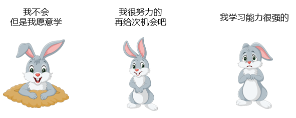

# 15-**“我不会，但我愿意学”**

> 天才免不了有障碍，因为障碍会创造天才。——罗曼·罗兰

几天前面试的时候，有面到了一个女孩。整体上面试效果不甚理想，当我习惯性的最后问一下：你还有什么想要问的么？

女孩很诚恳地表示：**虽然我经验不足，能力不强，但是我愿意学！**

……

类似这样的话，我自己听过很多种版本：

在我年轻时候刚开始听到这种话，还是会觉得：啊，可能这个人很上进，很努力啊。可是仔细想想，这句话的潜台词是什么？**它表示 “我这次搞砸了”、“我现在就是不会了”、“你愿意教我我就学”。**

有的小伙伴会说了：风落，这不对啊，你前边不是还一直在说要学习，要提升自己么？怎么这会又出尔反尔了？

我想说的是，**在职场上，保持学习的态度和方向一定是好事，但你要明白不断说自己学习的姿态对不对。**

这大约就是思维方式上的差距了。我们习惯于把这样的思维模式称之为 “**学生思维**”。当你还是一个学生的时候，如果你不努力，那么老师会过来催着你好好学习，这样的学习永远是被动的。

“**虽然我现在不会，但是我愿意学啊，所以你就应该来教我。**” 这就是最典型的表现，你不能说他态度不好，也不能说他不爱学习，事实上他往往还会表达出强烈的学习欲望。

但是，他们身上最大的问题在于，总是**等着被教**，总处于一种被动的状态当中，而非积极主动的去寻求问题的解决方案。

拜托大家醒醒，**职场不是你的校园，老板更不是你的班主任**，他们不会在拽着你向前进。但是一旦你掉了队，老板会很快把你抛弃。

再把话说重一点，这样的 “学生思维”，其实是一种 “**弱者思维**”。

所以在 “强者思维” 里，我们鼓励大家不断学习，是说你应该主动追求挑战并提升自己， 在你**主动克服**一个又一个难关的同时，达到学习提升的结果。

篇头故事里的小姑娘我没有通过，并非因为我没有恻隐之心，而是因为我觉得在求职的过程中，你需要展现的是你的能力、你的沟通技巧、你的技术实力，而不是你不会什么却告诉我愿意学。即便是你有很强的学习能力，也需要你在面试中通过表现让我感受到，而不是从你的嘴里说出来。

**语言上的巨人，可能是行动上的矮子。**

前段时间跟一个 HR 朋友约饭，也聊到了这样一个话题。

> 同样是一个毕业不久的小姑娘，同样在面试情况不佳之后跟 HR 求情：我家境不太好，读书也是靠助学金，来面试这个岗位，虽然没什么经验，但是相信我，绝对会认真学习，好好努力的。
>
> 我朋友被她的故事和诚意所打动，虽然没有相关经验，但是还是录用了她。
>
> 可是入职之后的情况和她说的完全不一样，每天都卡着点上班，甚至偶尔还会迟到，什么都不会也不主动去问有经验的前辈，关键是经常打盹、玩手机……
>
> 某一次她的上级给她布置任务，让她完成一个简单模块的开发，她磨蹭到 deadline 最后一天提交上来，但是完全不能用。
>
> 她的领导也很生气，问她：你这么多天都做了什么啊？
>
> 她很委屈地表达：**我又没干过，你也不教我，我怎么可能会做呢**？
>
> 之前那个满口愿意学习，我会努力的小姑娘，就变成了这样一个消极怠慢一点都不努力的人。

所以，如果让我给大家一个建议的话，那就是：**愿意学的，不如已经开始学的**。

如果你即将面试或者将要去做一件你不太熟悉的工作时候，你应该怎么做呢？

1. 请教前辈。

   你可以找有经验的朋友、同学甚至是论坛上的陌生人求助，你可以得到一些指引和经验，也可以告诉你需要做什么准备，学习什么。

2. 考虑下你之前的经历和即将开始的工作之间有什么联系，是否可以借鉴。

3. 开始你的学习。

   无论是你要准备面试或者开始工作，首先都是做好功课，开始学习。没有人要求你一下子变成领域专家，至少你要让别人看到你在行动。

4. 学会提问。

   实际上我之前有写过关于提问的文章，如果精炼一点来说，那么就是乐于向其他同事、上司求教，但是来问问题前一定要有自己的思考。如果我是被问问题的人，我更愿意听到你问的是 “如果我这么做，是对的么？” 或者 “我是这么做的，结果出错了，我查了一些资料，按照资料改了下，虽然不报错，但是执行结果仍然有问题”，而不是你来问我：“这个到底怎么做？”

对于很多实习生、毕业生或者刚入职场的同学来说，没有经验或者能力尚且有所不足是普遍存在的事实，但是这不能成为你的保护伞。

**别让弱者思维毁了自己的前途**。长期陷入弱者思维，会让我们变成一只鸵鸟，永远在逃避和抱怨。

斯蒂芬・金说：“地狱从来不是立即让你掉下去的，而是一点点吞没你”。

弱者思维也同样如此，一旦你习惯了它，它就会一点点吞噬你，直至你真的被生活打败，一蹶不振。

做一个强者，不惧挫折、富有智慧、善于学习又勇于改错。困难面前不要 “等一等”，而应该：

**I CAME,I SAW,I CONQUERED。**