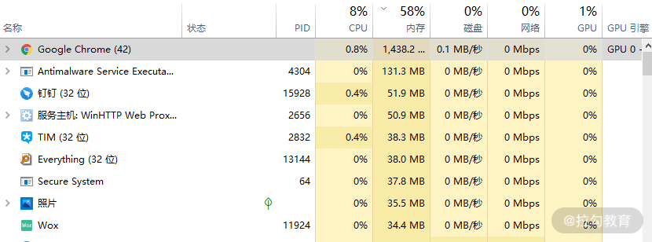
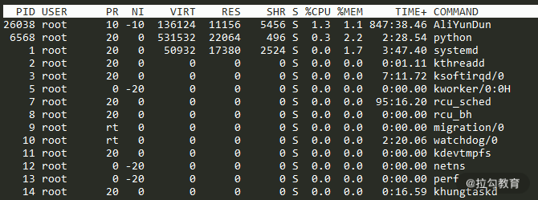
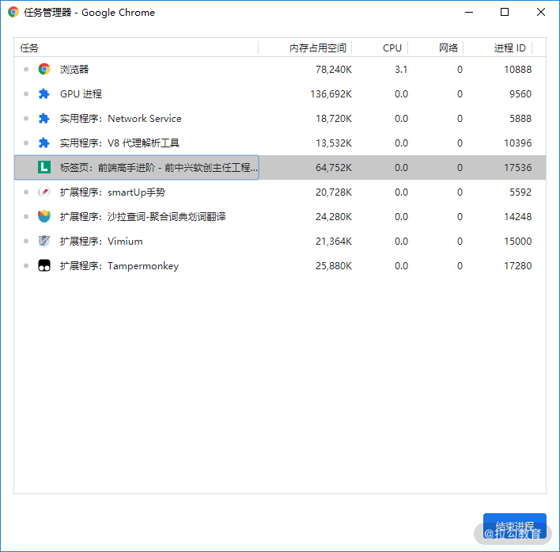
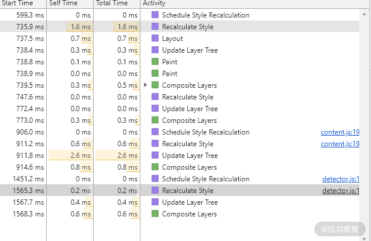
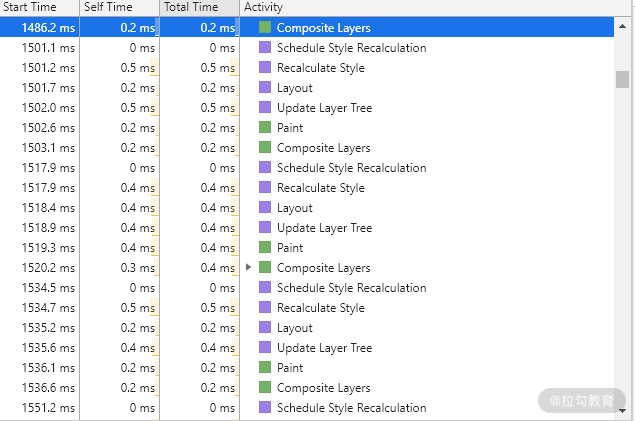
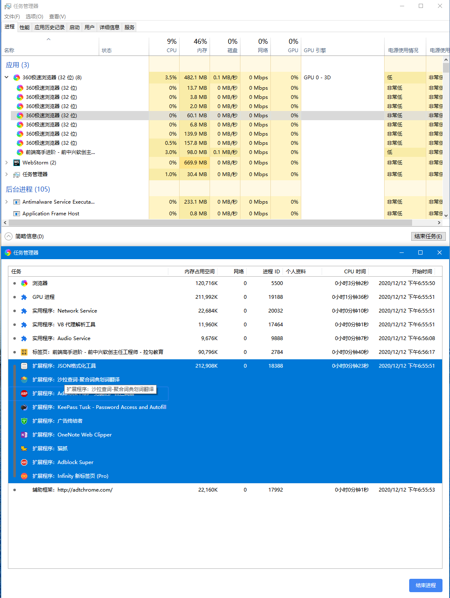

# 13-区分浏览器中的进程与线程

浏览器作为前端代码运行的环境，也作为前端工程师的底层知识，熟悉它的结构及工作方式，无论是对于开发高性能 Web 应用，还是对于建立完善的前端知识框架，都起着至关重要的作用。这一课时我们就通过学习浏览器中的进程和线程来掌握它的整体架构。

## 进程（Process）与线程（Thread）

我们先来好好梳理一下关于进程和线程的相关概念。

**进程**是操作系统进行**资源分配**和调度的基本单位，**线程**是操作系统**进行运算**的最小单位。

一个程序至少有一个进程，一个进程至少有一个线程。线程需要由进程来启动和管理。


　　 Windows 下的进程信息


　　 Linux 下的进程信息

通常程序需要执行多个任务，比如浏览器需要一边渲染页面一边请求后端数据同时还要响应用户事件，而单线程的进程在同一时间内只能执行一个任务，无法满足多个任务并行执行的需求。要解决这个问题，可以通过 3 种方式来实现：

- 多进程
- 多线程（同一进程）
- 多进程和多线程

由于第 3 种方式是前两种方式的结合，所以这里只比较多进程和多线程的特点。

前面提到进程是操作系统资源分配的基本单位，这里隐含的意思就是，不同进程之间的资源是独享的，不可以相互访问。这种特性带来的最大好处就是建立了进程之间的隔离性，避免了多个进程同时操作同一份数据而产生问题。

而多线程没有分配独立的资源，线程之间数据都是共享的，也就意味着创建线程的成本更小，因为不需要分配额外的存储空间。但线程的数据共享也带来了很多问题：首先是稳定性，进程中任意线程崩溃都会导致整个进程的崩溃，也就是说会“牵连”到进程中的其他线程。安全隐患就更容易理解了，如果有恶意线程启动，可以随意访问进程中的任意资源。

总而言之，**多线程更轻量，多进程更安全更稳定**。

有了关于进程和线程的了解，下面以使用率最高的 Chrome 浏览器为例来进行分析，看看浏览器中用到了哪些进程和线程。

## 浏览器架构

通过浏览器的任务管理器（快捷键 Shift + ESC）可以看到，当浏览器打开一个标签页时，启动了下面几个进程。


　　浏览器进程启动图

### 浏览器进程

浏览器的主进程负责界⾯显⽰（地址栏、导航栏、书签等）、处理用户事件、管理⼦进程等。

### GPU 进程

处理来自其他进程的 GPU 任务，比如来自渲染进程或扩展程序进程的 CSS3 动画效果，来自浏览器进程的界面绘制等。

在第 06 课时中提到过浏览器渲染页面的过程，在最后一个步骤“绘制”中我们提到了图层的合成，而这个图层的合成操作其实就是交给 GPU 进程来完成的。

它还有一个重要的特性，那就是可以利用 GPU 硬件来加速渲染，包括 Canvas 绘制、CSS3 转换（Transitions）、CSS3 变换（Transforms）、WebGL 等。

具体原理就是如果 DOM 元素使用了这些属性，GPU 进程就会在合成层的时候对它进行单独处理，提升到一个独立的层进行绘制，这样就能避免重新布局和重新绘制。

下面一段代码利用了 keyframes 来实现一个绕正方形运动的动画效果。

```html
<div class="gpu"></div>
<style>
  .gpu {
    background-color: darkgreen;
    width: 50px;
    height: 50px;
    transform: translate(0, 0);
    animation: slide 3.7s ease-in-out infinite;
  }
  @keyframes slide {
    25% {
      transform: translate(250px, 0);
    }
    50% {
      transform: translate(250px, 250px);
    }
    75% {
      transform: translate(0, 250px);
    }
  }
</style>
```

通过浏览器性能分析工具来记录整个页面绘制过程，可以看到页面绘制完成后，浏览器没有再进行布局或绘制相关的操作。因此此时元素的绘制工作已经脱离了渲染引擎，交由 GPU 进程来维护。


　　使用 GPU 加速进行渲染图

为了进行对比，我们再将代码稍稍修改，通过固定定位来修改元素位置。

```html
<div class="cpu"></div>
<style>
  .cpu {
    background-color: darkgreen;
    width: 50px;
    height: 50px;
    left: 0;
    top: 0;
    position: fixed;
    animation: move 3.7s ease-in-out infinite;
  }
  @keyframes move {
    25% {
      left: 250px;
      top: 0;
    }
    50% {
      left: 250px;
      top: 250px;
    }
    75% {
      left: 0;
      top: 250px;
    }
  }
</style>
```

发现页面在循环进行布局和绘制操作。


　　不使用 GPU 加速进行渲染图

**Network Service 进程**

负责⻚⾯的⽹络资源加载，比如在地址栏输入一个网页地址，网络进程会将请求后得到的资源交给渲染进程处理。本来只是浏览器主进程的一个模块，现在为了将浏览器进程进行“服务化”，被抽取出来，成了一个单独的进程。

### V8 代理解析工具进程

Chrome 支持使用 JavaScript 来写连接代理服务器脚本，称为 `pac 代理脚本`。

由于 pac 代理脚本是用 JavaScript 编写的，要能够解析 pac 代理脚本就必须要用到 JavaScript 脚本引擎，直接在浏览器主进程中引入 JavaScript 引擎并不符合进程“服务化”的设计理念，所以就把这个解析功能独立成一个进程。

### 渲染进程

浏览器会为每个标签页单独启动一个渲染进程，所以它和上述进程不同，并不是唯一的。

渲染进程的任务是将 `HTML`、`CSS` 和 `JavaScript` 转化为⽤户可以与之交互的网页，每个渲染进程都会启动单独的渲染引擎线程和 `JavaScript` 引擎线程。

关于渲染引擎的工作细节我们在第 06 课时中已经详细讨论过了，JavaScript 引擎线程也在第 12 课时中详细讨论过，这里就不重复讨论了。

除此之外还包括`事件触发线程`，`负责接收事件`，并将回调函数放入 JavaScript 引擎线程的`事件队列`中，以及负责处理定时任务的`定时器线程`。

这种设计保障了程序与系统的安全性，可以通过操作系统提供的权限机制来为每个渲染进程建立一个沙箱运行环境，从而防止恶意破坏用户系统或影响其他标签页的行为。

同时也保障了渲染进程的稳定性，因为如果某个标签页失去响应，用户可以关掉这个标签页，此时其他标签页依然运行着，可以正常使用。

如果所有标签页都运行在同一进程上，那么当某个失去响应，所有标签页都会失去响应。

### 扩展程序进程

主要是负责插件的运⾏，和渲染进程一样，也不是唯一的，浏览器会为每个插件都启动一个进程。这样的设计也是从安全性和稳定性考虑。

### 进程的服务化

Chrome 官方团队在 2016 年 提出了[面向服务的设计模型](https://docs.google.com/document/d/15I7sQyQo6zsqXVNAlVd520tdGaS8FCicZHrN0yRu-oU/edit#heading=h.cyhu8vkfrzar)，在系统资源允许的情况下，将浏览器主进程的各种模块拆分成独⽴的服务，每个服务在独立的进程中运行。

通过高内聚、低耦合的结构让 Chrome 变得更稳定更安全。

同时这种设计也具有一定的伸缩性，当运行在资源有限的设备上时，会将这些服务聚合到浏览器主进程中，从而减少内存占用。

## 总结

这一课时我们分析了 Chrome 浏览器的架构，至少可以得到以下 3 个启示：

- 多进程在稳定性和安全性上有优势，但是资源占用较多；
- 对于复杂的应用我们可以采取服务化的设计方式，将功能模块单独拆分成进程来提供服务；
- 合理利用 GPU 进程可以加速渲染。

最后布置一道思考题：说一说你还了解过哪些多进程与多线程设计的应用，它们的结构又是什么样的呢？

---

## 精选评论

#### \*强：

> 我们打开 windows 自带任务管理器也可以看到相关的进程，除去浏览器进程、GPU 进程、network service 进程、 v8 解析代理工具进程等，再有就是拓展程序进程了，但如图所示，windows 任务管理器列出了 8 个浏览器相关的进程，但是在浏览器自带任务管理器中可以看到，其实并不只 8 个，但是将拓展程序进程统计为 1 个的话，数量上就能对上了。那么浏览器中每个拓展程序是个单独的进程吗，还是一个进程中的多个线程呢

#### 讲师回复：

> 课程中已经提到过，各个插件都是单独的进程，可以从浏览器的任务管理器中看到它们有不同的进程 ID，也可以使用命令行程序进程查看，比如 Mac 下 ps -ef|grep 扩展程序进程号

#### \*鹏：

> Chromium 提供了四种进程模式，他们影响了浏览器分配页面给渲染进程的行为，比如采用某个模式况会给 tab 分配新进程，而采用另外一个模式则不会，下面是四种模式的介绍，Chrome 默认采用第一个模式。Process-per-site-instance (default)同一个 site-instance 使用一个进程 Process-per-site 同一个 site 使用一个进程 Process-per-tab 每个 tab 使用一个进程 Single process 所有 tab 共用一个进程

#### \*杰：

> chrome 中遇到过一个问题，访问一个网站打开多个标签页，但是只要其中一个标签页失去响应，其他同站的标签页也失去响应，这是否意味着同一个网站只用了一个渲染进程？

#### 讲师回复：

> 很可能是的，可以通过浏览器的任务管理器进行查看。
> Chrome 浏览器中，通过 a 标签或者 window.open() 函数来打开同一个根主机名下的网站（ 比如在 https://kaiwu.lagou.com 中打开 https://lagou.com)，不会创建渲染进程而是用的多线程
