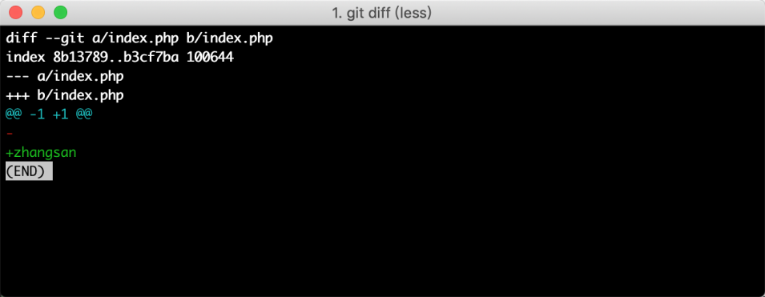
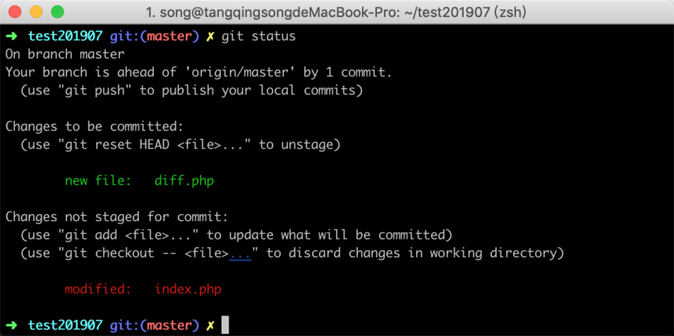
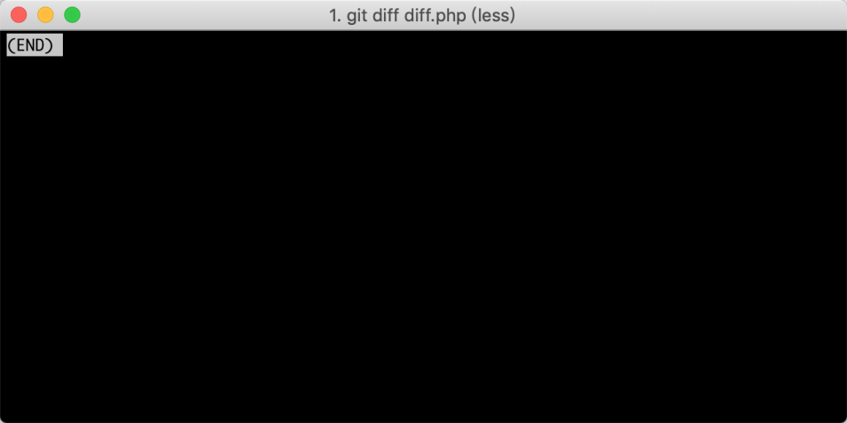
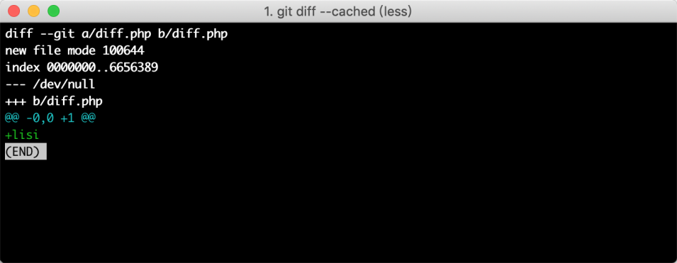
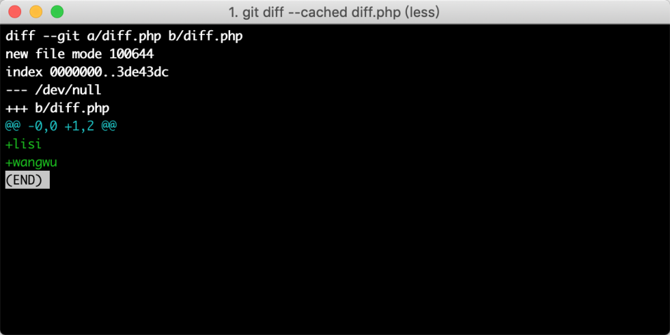
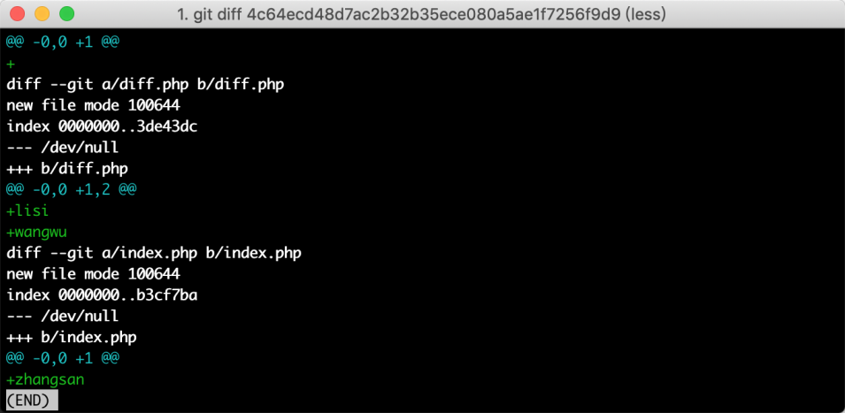
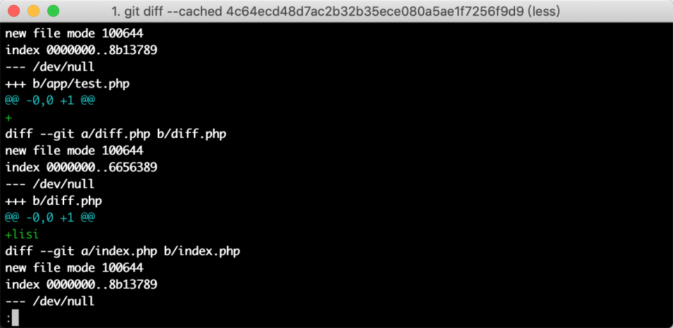
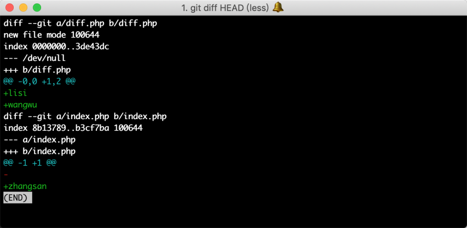

# 06-查看代码修改：使用 diff 查看修改了哪些代码？


> 成功＝艰苦的劳动＋正确的方法＋少谈空话。  ——爱因斯坦

在上面一节中，我们学习了通过 `git status` 命令查看文件修改列表，但很多时候并不能满足需求，比如说，我想看某一个文件具体修改了什么内容。

## 6.1 名词定义

在学习 Git 的 `diff` 命令之前，我们先来统一 一下两个名词的理解，分别是工作区和暂存区。

### 6.1.1 工作区

工作区，指的是当前正在编辑的文件，还没有修改的内容通过 `git add` 命令暂存起来；比如我现在修改了 `index.php` 文件的一行代码，没有执行 `git add index.php` 命令，那么 index.php 便处于工作区状态。

### 6.1.2 暂存区

暂存区，指的是文件的修改已经通过 `git add` 命令临时存储到版本记录里了，但还没有正式通过 `git commit` 提交的阶段；比如我现在新增一个 `test.php` 文件，使用了 `git add test.php` 命令，那么此时， test.php 文件的改动就已经进入到了暂存区。

## 6.2 比较工作区变动

现在我编辑了 `index.php` 文件，并且在里面加入了内容，如果我想通过 git 命令查看增加了哪些内容，参考命令如下

```
git diff 
```

执行命令之后，绿色部分代表增加的内容，红色部分代表删除的内容，执行结果如下图所示：

在图中可以看到在 index.php 中增加了 `zhangsan`。

## 6.3 比较暂存区变动

有些时候，我们可能已经通过 `git add` 命令，将某些文件从工作区添加到暂存区，但又想回过头，来看此文件刚才改动哪些内容的场景；比如下图中是我刚才新建了一个 `diff.php` 文件，并且已经添加到暂存区，如下图执行了 `git status` 命令结果所示：

但我突然发现，我已经忘记这个文件里到底有哪些内容被改变了，于是我使用了 `git status` 命令查看变动的内容，执行结果如下图所示：

在 Git 的返回信息中却无法看到修改详情，原因是因为 diff.php 文件被提交到暂存区之后，工作区并没有再次改动，此时工作区与暂存区一致，当然就不能看出改动情况了。

这个时候，如果想要看 `diff.php` 文件里面修改了什么内容，就不是再把工作区和暂存区进行对比了，而是需要把暂存区与版本库最近一次 commit 的内容进行比较，参考命令如下：

```
git diff --cached  diff.php
```

命令执行结果如下图所示

在图中可以看出，diff.php 中新增了一行代码，内容为 `lisi` 。

## 6.4 与指定记录比较

有些时候，我们可能需要代码和历史的某一个版本进行比较，这个时候你可以先通过 `git log` 命令，找到历史提交记录的一个 hash 值，如下图所示：


### 6.4.1 工作区比较

将要比较的 hash 值复制下来，然后执行如下所示命令：

```
git diff hash值
```



在上图中，可以看到工作区和指定记录存在的差异。

### 6.4.1 暂存区比较

有些时候，我们想把暂存区的改动和指定记录进行对比，那么在命令中加入 `--cached` 即可，参考命令如下：

```
git diff --cached hash值
```

执行结果如下图所示：



从图中可以看到 diff.php 文件，在指定的版本还未存在，在当前的暂存区中被添加了进来，新增的内容有一行，内容是 `lisi`。

## 6.5 与最新版本库比较

很多时候，我们只需要将未正式提交的代码（包含工作区与暂存区）与最新的 commit 记录进行比较，虽然也可以通过指定 commit 的 hash 值进行，但是却很不方便，需要先获取到 hash 值，这里介绍一个简单的方法，可以通过 `git diff HEAD` 命令方式快速对比，参考命令如下：

```
git diff HEAD
```

执行命令返回结果如下：



在执行的命令中，`HEAD` 指的是当前所在的分支名，如果你想比较其他分支也可以将 HEAD 改成其他分支名。

## 6.6 比较两个历史记录

有时候，可能会需要查看某一次提交记录修改了什么内容，这个时候就需要将两个历史记录进行比较；首先通过 `git log` 命令获取到需要查看的记录 hash 值，然后再找到这个记录的上一个版本的 hash 值，拼接的参考命令如下所示：

```
git diff hash值1  hash值2
```

命令执行之后，显示的效果如下：


## 6.7 小结

在这节内容中，主要介绍了工作区和暂存区的概念，以及如何使用 diff 命令进行比较差异，主要知识点有以下：

1. 工作区，是指目前改动的内容还未使用 `git add` 临时存储
2. 暂存区，是指改动的内容已经临时存储，还未正式通过 `git commit` 提交
3. 比较修改的命令为 `git diff`，不同情况增加不同参数
4. 查看暂存区的额外参数为 `--cached`
5. 比较历史差异输入一个 hash 值，则是把当前的改动和历史差异对比，两个 hash 值则是把前一个版本和后面一个版本进行对比

